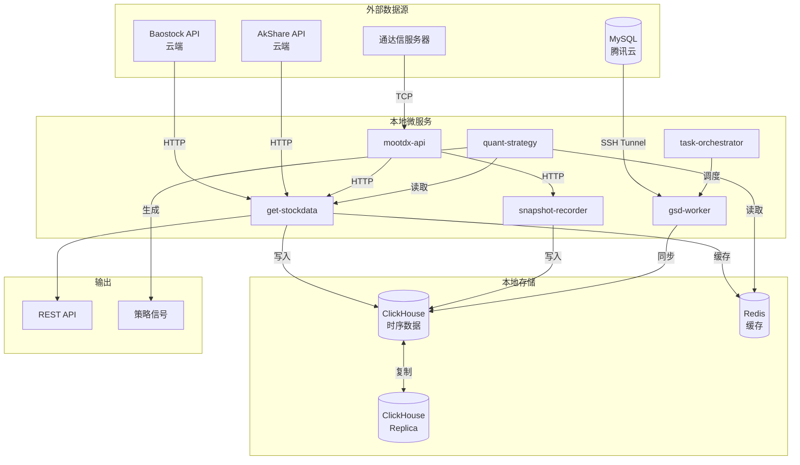
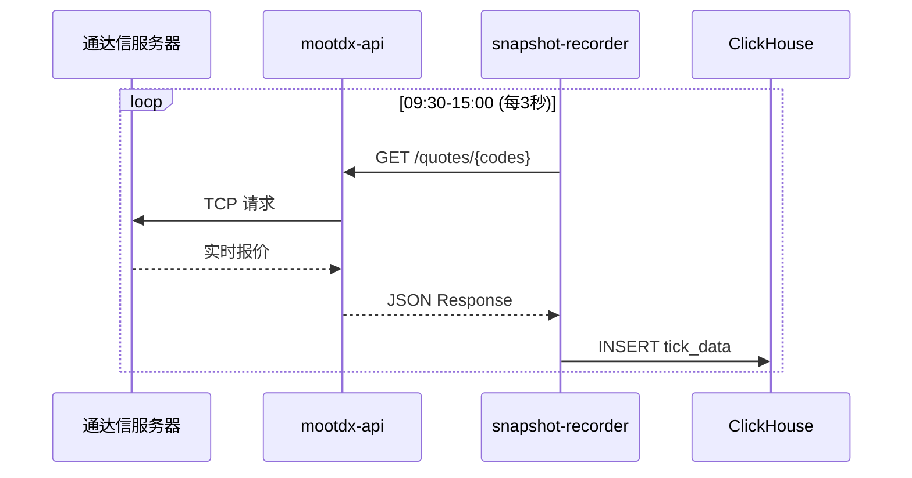
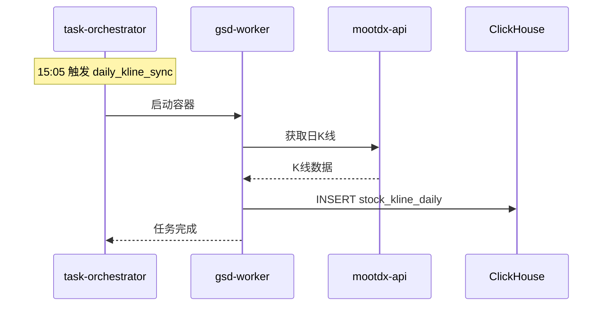
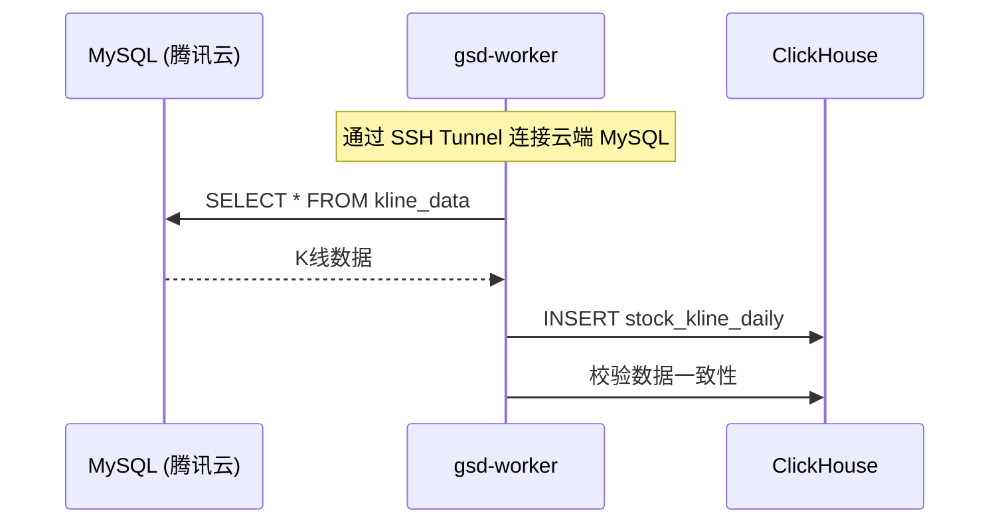
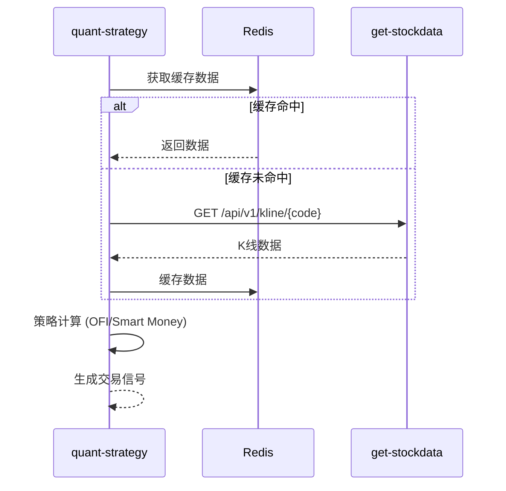
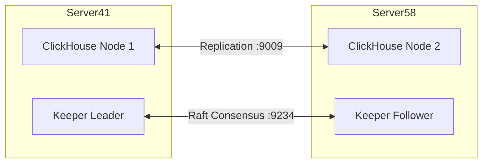

# 🌊 Data Flow

> **目的**: 可视化数据从采集到消费的完整路径，帮助 AI 理解系统数据流向。

---

## 整体数据架构

---

## 数据流 1: 实时行情采集

**关键表**: `stock_data.tick_data`

---

## 数据流 2: K 线日终同步

**关键表**: `stock_data.stock_kline_daily`

---

## 数据流 3: 云端 K 线同步

**数据一致性校验**:
1. Verify-After-Write: 写入后立即校验
2. Weekly Deep Audit: 周日全量聚合校验

---

## 数据流 4: 策略信号生成

---

## ClickHouse 复制

**引擎**: `ReplicatedReplacingMergeTree`

---

## 关键数据表

| 表名 | 存储 | 用途 | 数据量级 |
|------|------|------|----------|
| `stock_kline_daily` | ClickHouse | 日K线 | ~17M 行 |
| `tick_data` | ClickHouse | 分笔数据 | 持续增长 |
| `sync_progress` | MySQL (云) | 同步进度 | ~ |
| `sync_execution_logs` | MySQL (云) | 同步日志 | ~ |
