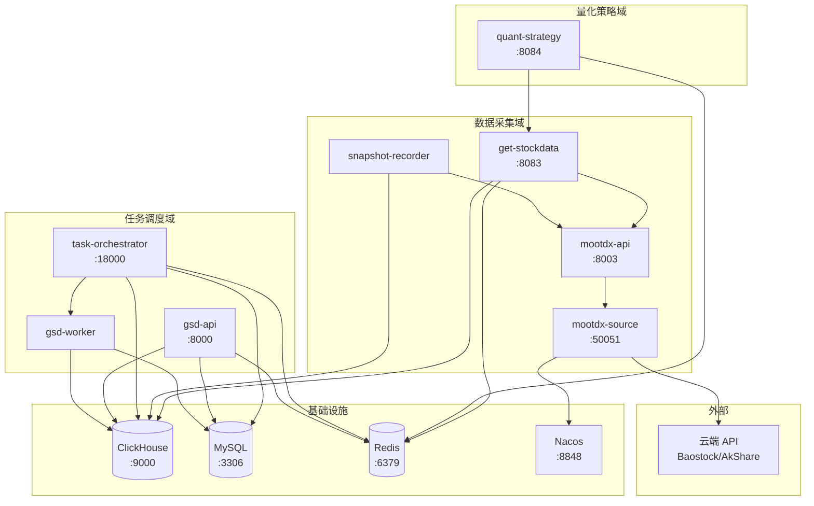

# 📦 Service Registry

> **目的**: 服务一览表，帮助 AI 快速定位服务、理解依赖关系。

---

## 活跃服务

### 数据采集域

| 服务 | 路径 | 端口 | 职责 | 依赖 |
|------|------|------|------|------|
| **get-stockdata** | `services/get-stockdata` | 8083 | K线/Tick/财务数据采集 | ClickHouse, Redis, mootdx-api |
| **mootdx-api** | `services/mootdx-api` | 8003 | 通达信行情接口封装 | mootdx-source |
| **mootdx-source** | `services/mootdx-source` | 50051 (gRPC) | 数据源路由适配 | Nacos, 云端 API |
| **snapshot-recorder** | `services/get-stockdata` | - (Daemon) | 实时快照记录 | ClickHouse, mootdx-api |
| **gsd-worker** | `services/gsd-worker` | - (临时容器) | 任务执行器 | MySQL, ClickHouse |

### 量化策略域

| 服务 | 路径 | 端口 | 职责 | 依赖 |
|------|------|------|------|------|
| **quant-strategy** | `services/quant-strategy` | 8084 | 策略引擎 (OFI/Smart Money) | Redis, get-stockdata |

### 任务调度域

| 服务 | 路径 | 端口 | 职责 | 依赖 |
|------|------|------|------|------|
| **task-orchestrator** | `services/task-orchestrator` | 18000 | 任务编排调度 | Docker, MySQL, ClickHouse, Redis |
| **gsd-api** | `services/gsd-api` | 8000 | 数据查询 API | MySQL, ClickHouse, Redis |

### 基础设施

| 组件 | 端口 | 职责 |
|------|------|------|
| **ClickHouse** | 9000 (Native) / 8123 (HTTP) | 时序数据存储 |
| **MySQL** | 3306 (本地) / 36301 (云端隧道) | 元数据存储 |
| **Redis** | 6379 | 缓存 |
| **Nacos** | 8848 | 服务发现 |
| **RabbitMQ** | 5672 / 15672 | 消息队列 |
| **Prometheus** | 9091 | 监控 |

---

## 废弃服务

| 服务 | 状态 | 替代方案 | 备注 |
|------|------|----------|------|
| `task-scheduler` | ❌ Deprecated | `task-orchestrator` | 已合并 |
| `data-collector` | ❌ Deprecated | `get-stockdata` | 已重构 |

---

## 定时任务

来源: `services/task-orchestrator/config/tasks.yml`

| 任务 ID | 名称 | 调度时间 | 状态 |
|---------|------|----------|------|
| `daily_kline_sync` | K线每日同步 | 15:05 交易日 | ✅ 启用 |
| `daily_strategy_scan` | 每日策略扫描 | 18:30 交易日 | ✅ 启用 |
| `daily_db_backup` | 数据库备份 | 03:00 每日 | ✅ 启用 |
| `daily_cache_warmup` | 缓存预热 | 09:00 交易日 | ✅ 启用 |
| `weekly_log_cleanup` | 日志清理 | 02:00 周日 | ✅ 启用 |
| `weekly_clickhouse_log_cleanup` | ClickHouse日志清理 | 03:00 周日 | ✅ 启用 |
| `weekly_deep_audit` | 每周深度审计 | 02:00 周日 | ✅ 启用 |
| `weekly_financial_sync` | 财务数据更新 | 06:00 周六 | ⏸️ 待实现 |
| `monthly_valuation_sync` | 估值数据更新 | 06:00 每月1号 | ⏸️ 待实现 |
| `weekly_backtest` | 周末策略回测 | 08:00 周日 | ⏸️ 待实现 |

---

## 服务依赖图



---

## Docker Compose 文件

| 文件 | 用途 |
|------|------|
| `docker-compose.infrastructure.yml` | 基础设施 (ClickHouse, Redis, Nacos, RabbitMQ) |
| `docker-compose.microservices.yml` | 微服务 (mootdx-api, mootdx-source, snapshot-recorder) |
| `docker-compose.gsd.yml` | GSD 服务 (gsd-api, task-orchestrator) |
| `docker-compose.yml` | 主入口 |

---

## 服务启动顺序

```
1. 基础设施 (ClickHouse, MySQL, Redis, Nacos)
   ↓
2. 数据源 (mootdx-api → mootdx-source)
   ↓
3. 数据服务 (get-stockdata, gsd-api)
   ↓
4. 调度器 (task-orchestrator)
   ↓
5. 策略服务 (quant-strategy)
```
