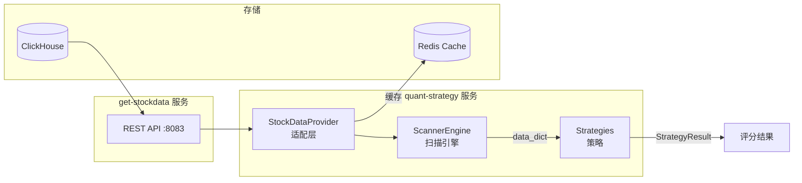
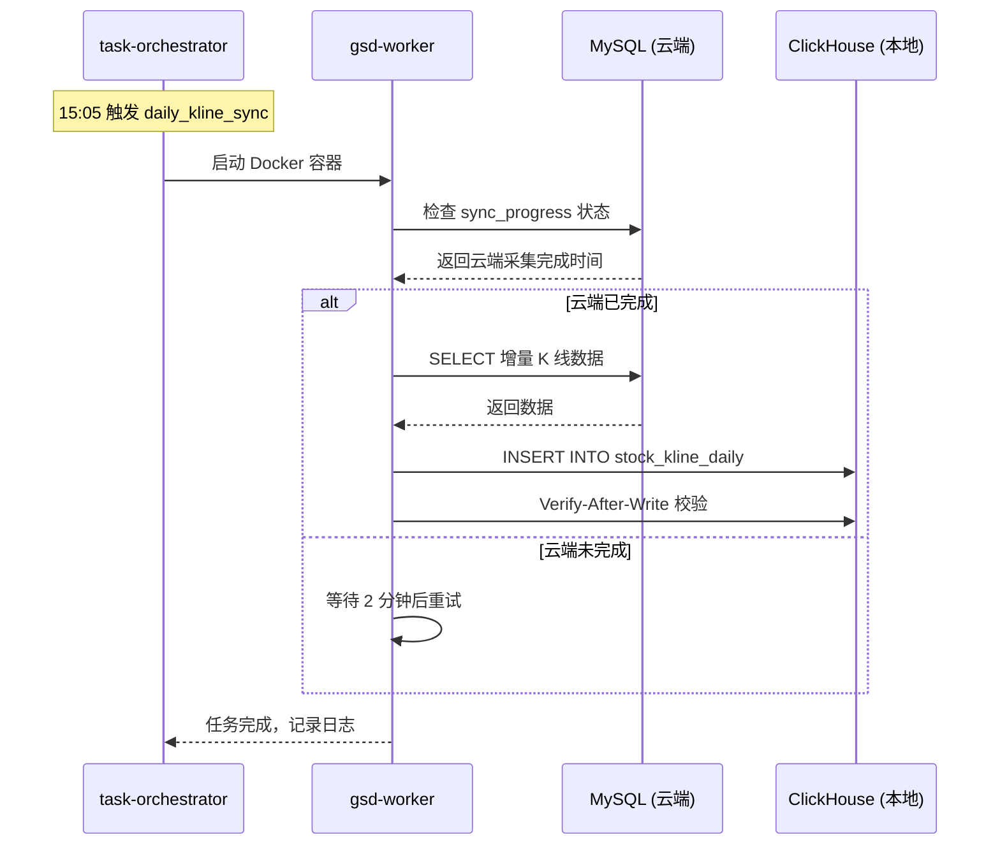

# 📈 Strategy Data Requirements

> **目的**: 从选股策略角度分析数据需求，明确数据采集优先级和完整性要求。
> 
> **数据来源**: 基于 `quant-strategy` 服务实际代码分析

---

## 数据流架构



---

## StockDataProvider 实际 API

来源: `src/adapters/stock_data_provider.py`

| 方法 | 数据类型 | API 端点 | 缓存 |
|------|----------|----------|------|
| `get_realtime_quotes(codes)` | 实时报价 | `/api/v1/quotes/realtime` | Redis (短) |
| `get_history_bar(code)` | 历史 K 线 | `/api/v1/quotes/history/{code}` | - |
| `get_tick_data(code)` | 分笔数据 | `/api/v1/quotes/tick/{code}` | - |
| `get_financial_indicators(code)` | 财务指标 | `/api/v1/finance/indicators/{code}` | - |
| `get_valuation(code)` | 估值数据 | `/api/v1/market/valuation/{code}` | - |
| `get_valuation_history(code)` | 历史估值 | `/api/v1/market/valuation/{code}/history` | - |
| `get_capital_flow(code)` | 资金流向 | `/api/v1/market/capital_flow/{code}` | - |
| `get_stock_info(code)` | 股票信息 | `/api/v1/stocks/{code}/info` | Redis (长) |
| `get_industry_stats(industry)` | 行业统计 | `/api/v1/market/industry/{code}/stats` | - |

---

## 策略实际使用的数据字段

### 1. FinancialIndicators (财务指标)

来源: `src/domain/models/financial_models.py`

```python
class FinancialIndicators:
    stock_code: str           # 股票代码
    report_date: str          # 报告日期
    revenue: float            # 营业收入
    net_profit: float         # 净利润
    roe: float                # 净资产收益率
    net_assets: float         # 净资产
    total_assets: float       # 总资产
    goodwill: float           # 商誉
    monetary_funds: float     # 货币资金
    interest_bearing_debt: float  # 有息负债
    operating_cash_flow: float    # 经营现金流
    
    # 计算属性
    @property
    def goodwill_ratio(self) -> float:  # 商誉/净资产
    @property
    def cash_ratio(self) -> float:      # 货币资金/总资产
    @property
    def debt_ratio(self) -> float:      # 有息负债/总资产
    @property
    def cash_to_profit_ratio(self) -> float:  # 经营现金流/净利润
```

### 2. 估值数据 (Valuation)

```python
valuation = {
    "pe_ttm": float,        # 滚动市盈率
    "pb_ratio": float,      # 市净率
    "ps_ratio": float,      # 市销率
    "market_cap": float,    # 总市值
}
```

### 3. 实时报价 (Quote)

```python
quote = {
    "code": str,            # 股票代码
    "name": str,            # 股票名称
    "price": float,         # 最新价
    "volume": int,          # 成交量
    "change_pct": float,    # 涨跌幅
    "timestamp": str,       # 时间戳
}
```

---

## 基本面风控规则数据需求

来源: `src/strategies/rules_fundamental.py`

| 规则 | 数据字段 | 阈值 | 逻辑 |
|------|----------|------|------|
| **GoodwillRiskRule** | `goodwill_ratio` | 30% | 商誉占净资产 > 30% → 拒绝 |
| **PledgeRiskRule** | `major_shareholder_pledge_ratio` | 50% | 大股东质押 > 50% → 拒绝 |
| **CashflowQualityRule** | `cash_to_profit_ratio`, `net_profit` | 0.5 | 盈利公司收现比 < 0.5 → 拒绝 |
| **FinancialFraudRule** | `cash_ratio`, `debt_ratio` | 20%, 20% | 存贷双高 → 拒绝 |

---

## 价值策略数据需求

来源: `src/strategies/value_strategy.py`

```python
# 策略使用的字段
data = {
    "valuation": {
        "pe_ttm": float,   # PE < 20 → 得分
        "pb_ratio": float, # PB < 3 → 得分
    },
    "financials": {
        "roe": float,      # ROE > 10% → 得分
    }
}

# 评分权重
# PE: 40%, PB: 30%, ROE: 30%
# 及格线: 60分
```

---

## 数据采集优先级 (基于实际需求)

### P0 - 策略运行必须

| 数据 | get-stockdata API | 使用场景 |
|------|-------------------|----------|
| ✅ 日 K 线 | `/api/v1/quotes/history/{code}` | 技术分析、均线计算 |
| ✅ 估值数据 | `/api/v1/market/valuation/{code}` | 价值策略评分 |
| ✅ 财务指标 | `/api/v1/finance/indicators/{code}` | 基本面风控 |
| ✅ 股票池 | `/api/v1/stocks/list` | 扫描范围 |

### P1 - 增强功能

| 数据 | get-stockdata API | 使用场景 |
|------|-------------------|----------|
| 🔄 实时报价 | `/api/v1/quotes/realtime` | 实时监控 |
| 🔄 历史估值 | `/api/v1/market/valuation/{code}/history` | PE/PB Band |
| 🔄 行业统计 | `/api/v1/market/industry/{code}/stats` | 相对估值 |

### P2 - 未来规划

| 数据 | 状态 | 使用场景 |
|------|------|----------|
| 📋 大股东质押率 | **缺失** | PledgeRiskRule |
| 📋 分笔 Tick | 已有 API | OFI 策略 |
| � 资金流向 | 已有 API | Smart Money |

---

## 数据缺口分析

### 当前缺失的关键数据

| 字段 | 风控规则 | 状态 | 建议 |
|------|----------|------|------|
| `major_shareholder_pledge_ratio` | PledgeRiskRule | ❌ 缺失 | 需从 Baostock 获取 |

### API 验证状态

| API | 验证状态 | 备注 |
|-----|----------|------|
| `/api/v1/finance/indicators/{code}` | ✅ 已验证 | 返回财务指标 |
| `/api/v1/market/valuation/{code}` | ✅ 已验证 | 返回 PE/PB |
| `/api/v1/quotes/history/{code}` | ✅ 已验证 | 返回 K 线 |
| `/api/v1/quotes/realtime` | ✅ 已验证 | 批量报价 |

---

## 数据本地化架构

### 设计目标

| 目标 | 说明 |
|------|------|
| **低延迟查询** | 策略引擎直接查询本地 ClickHouse，避免网络延迟 |
| **数据自治** | 即使云端不可用，本地仍可运行历史回测 |
| **增量同步** | 每日增量同步，减少数据传输量 |

### 数据存储位置

```
┌─────────────────────────────────────────────────────────────────┐
│                        腾讯云 (采集端)                          │
│  ┌─────────────────┐    ┌─────────────────────────────────────┐│
│  │ Baostock API    │───▶│ MySQL (腾讯云 43.145.51.23:26300)   ││
│  │ AkShare API     │    │ - stock_daily_k (原始 K 线)         ││
│  └─────────────────┘    │ - sync_progress (同步进度)          ││
│                         │ - adjustment_factors (复权因子)     ││
│                         └─────────────────────────────────────┘│
└─────────────────────────────────────────────────────────────────┘
                              │
                              │ SSH Tunnel (GOST)
                              │ 本地 36301 → 云端 26300
                              ▼
┌─────────────────────────────────────────────────────────────────┐
│                        本地服务器 (策略端)                       │
│  ┌─────────────────────────────────────────────────────────────┐│
│  │ ClickHouse (本地 127.0.0.1:9000)                            ││
│  │ - stock_data.stock_kline_daily (日 K 线)                    ││
│  │ - stock_data.tick_data (分笔数据)                           ││
│  │ - stock_data.stock_hourly_snapshot (快照)                   ││
│  └─────────────────────────────────────────────────────────────┘│
│                                                                 │
│  ┌───────────────┐    ┌───────────────┐    ┌────────────────┐  │
│  │ get-stockdata │───▶│ quant-strategy│───▶│ 策略信号       │  │
│  │ :8083         │    │ :8084         │    │                │  │
│  └───────────────┘    └───────────────┘    └────────────────┘  │
└─────────────────────────────────────────────────────────────────┘
```

### 同步任务配置

来源: `services/task-orchestrator/config/tasks.yml`

| 任务 ID | 数据类型 | 触发时间 | 数据源 | 目标 | 状态 |
|---------|----------|----------|--------|------|------|
| `daily_kline_sync` | 日 K 线 | 15:05 交易日 | MySQL (云) | ClickHouse | ✅ 启用 |
| `weekly_financial_sync` | 财务指标 | 06:00 周六 | Baostock | ClickHouse | ⏸️ 待实现 |
| `monthly_valuation_sync` | 估值数据 | 06:00 每月1号 | Baostock | ClickHouse | ⏸️ 待实现 |

### 同步流程



### 数据一致性保障

| 机制 | 触发时机 | 检查内容 |
|------|----------|----------|
| **Verify-After-Write** | 每次同步后 | 比对云端/本地记录数 |
| **Weekly Deep Audit** | 周日 02:00 | 全量聚合指纹校验 |
| **自愈机制** | 发现不一致时 | 删除本地数据 → 重新同步 |

### 关键配置参数

来源: `services/gsd-worker/src/config/settings.py`

```python
kline_sync_history_buffer_min = 5    # 历史缓冲分钟
kline_sync_poll_interval_min = 2     # 轮询间隔
kline_sync_timeout_time = "21:00"    # 超时时间
kline_sync_min_records = 4800        # 最小记录数 (HS300)
kline_sync_batch_size = 10000        # 批量插入大小
```

---

## 相关文档

| 文档 | 内容 |
|------|------|
| [SERVICE_REGISTRY.md](./SERVICE_REGISTRY.md) | 服务端口 (get-stockdata: 8083) |
| [DATA_FLOW.md](./DATA_FLOW.md) | 数据采集流程 |
| [database-schema.md](../architecture/database-schema.md) | ClickHouse 表结构 |
