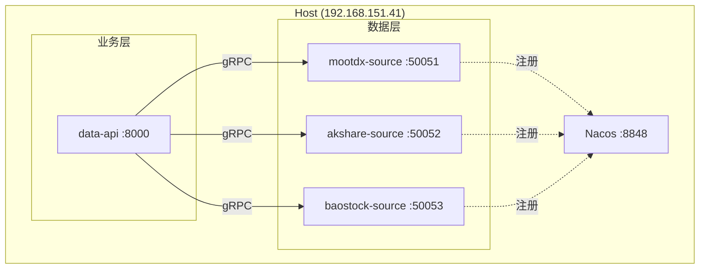

# ADR-001: 数据源微服务架构

## 状态
**已接受** (2025-12-16)

## 背景
目前 `get-stockdata` 服务作为一个单体应用运行，数据采集、处理和对外服务都在同一个进程中。我们面临以下挑战：

1.  **复杂的网络环境**：不同的数据源需要不同的网络配置（例如：MooTDX 需要直接 TCP 连接，而 AkShare 需要 HTTP 代理）。
2.  **异构连接管理**：在一个服务中维护混合类型的连接变得越来越复杂。
3.  **可扩展性**：未来的需求可能需要对特定的数据采集器进行独立扩展。
4.  **部署限制**：VPN 不是跨网络通信的可行选项；所有服务目前必须运行在主服务器 (192.168.151.41) 上。

## 决策
我们将把数据采集层与业务逻辑层分离，拆分为独立的微服务，并使用 Docker 部署在同一台主机上。

### 1. 部署架构
**单机微服务 (192.168.151.41)**



-   **网络模式**：所有容器使用 `network_mode: host`。
    -   `akshare-source`：实质为 **Proxy Client**，调用部署在腾讯云的远程 API (`http://124.221.80.250:8111`)。需通过环境变量配置内网 HTTP 代理 (`http://192.168.151.18:3128`) 以访问外网 IP。
    -   `baostock-source`：通过环境变量指定 Squid 代理 (`http://192.168.151.18:3128`)。
    -   `mootdx-source`：直接 TCP 连接（如有需要可由底层 iptables 处理，但主要依赖直连）。
-   **服务发现**：Nacos 本地部署在 `127.0.0.1:8848`。
-   **通信协议**：`data-api` 与数据源之间使用 gRPC 进行内部通信。

### 2. 服务职责

| 服务 | 职责 | 端口 | 代理配置 |
|------|------|------|----------|
| **data-api** | 业务逻辑、缓存、REST API (估值、排行、行情) | 8000 | 自定义 |
| **mootdx-source** | TDX 协议数据 (行情、分笔、历史) | 50051 | 无 (TCP 直连) |
| **akshare-source** | **Remote API Client** (调用腾讯云服务获取数据) | 50052 | **显式指定** `http://192.168.151.18:3128` (用于访问云端 API) |
| **baostock-source** | 历史数据、行业信息 | 50053 | **显式指定** `http://192.168.151.18:3128` |

### 3. 接口设计 (gRPC)
为所有数据源定义统一的接口，以支持透明的故障转移和聚合。

```protobuf
service DataSourceService {
  rpc FetchData(DataRequest) returns (DataResponse);
  rpc GetCapabilities(Empty) returns (Capabilities);
}
```

## 后果

### 正面影响（优势）
-   **网络隔离**：每个数据源服务可以拥有自己的代理环境变量，而不会相互影响。
-   **故障隔离**：一个数据采集器的崩溃（例如 AkShare 内存泄漏）不会导致 API 或其他采集器宕机。
-   **可扩展性**：如果有需要，可以部署特定采集器的多个实例（尽管目前是在同一台主机上）。
-   **可维护性**：业务逻辑与原始数据采集之间的边界更加清晰。

### 负面影响（劣势）
-   **运维复杂度**：需要管理多个 Docker 容器，而不是一个。
-   **延迟**：本地 gRPC 调用会有极小的开销（与网络 I/O 相比可忽略不计）。
-   **资源使用**：由于运行多个 Python 运行时，内存占用会略有增加。

## 迁移路径
1.  定义 gRPC Proto 接口。
2.  将 `mootdx` 提供者抽取到 `mootdx-source` 服务中。
3.  重构 `get-stockdata` 为 `data-api` 并调用 `mootdx-source`。
4.  依次抽取 `akshare` 和 `baostock` 提供者。
