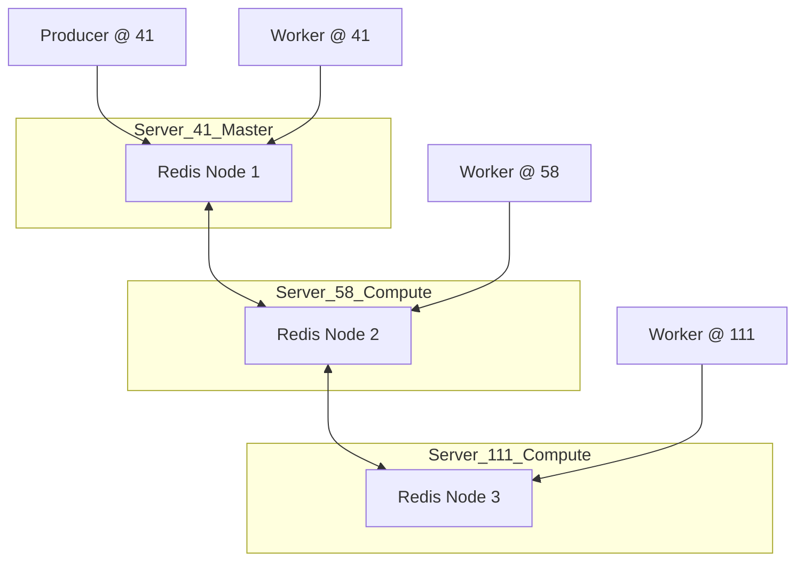

# 架构 2.0: 基于 Redis Cluster 的动态任务分发

**版本**: 2.0 (Alpha)  
**目标**: 解决 1.0 架构的一致性问题，实现高可靠、自适应的任务采集。

---

## 1. 核心改进点

| 特性 | 1.0 (Hash 分片) | 2.0 (Redis 队列) |
|------|----------------|-----------------|
| **分配方式** | 静态计算 (`hash % N`) | 动态抢占 (`RPOPLPUSH`) |
| **一致性** | 强依赖各节点本地股票列表 | 强一致（Master 统一分发） |
| **容错性** | 节点挂了任务就丢了 | 节点挂了任务可被重新放回队列 |
| **扩展性** | 需要重新计算所有逻辑 | 节点随加随走，负载自动平衡 |
| **复杂度** | 低（纯代码） | 中（需维护 Redis Cluster） |

---

## 2. 逻辑分工

### 2.1 Producer (任务派发器 - 通常在 Server 41 运行)
1. 获取一份权威股票列表（Master 快照）。
2. 清空 Redis 中的 `task_queue`。
3. 将股票代码推入 `task_queue`。
4. 记录任务起始状态。

### 2.2 Consumer (计算节点 - 41, 58, 111 均可)
1. 监听 Redis 队列。
2. 使用 `BRPOPLPUSH` 获取任务并放入“处理中”备份表（防止崩溃丢失）。
3. 执行本地 `gsd-worker` 采集。
4. 采集成功后，从备份表中移除任务。

---

## 3. 基础设施部署图 (3-Node Redis Cluster)

---

## 4. 关键配置策略

### 4.1 个性化部署
*   **Server 41**: 既是 Redis 主节点之一，也是任务派发发起者。
*   **Server 58/111**: 纯计算节点 + Redis 数据节点。
*   **Docker 差异**: 每台机器的物理路径、监听 IP 不同。

### 4.2 任务原子性
*   由于采集任务时间较长（单只股票分笔数据下载需数秒），使用 `RPOPLPUSH` 模式保证任务在 worker 意外退出时可以被找回。

---

## 5. 预期隐患与对策

1.  **隐患**: Redis 集群脑裂。  
    **对策**: 采用 3 主 3 从（若资源允许）或设置合理的 `min-replicas-to-write`。
2.  **隐患**: Master 写入失败。  
    **对策**: Producer 包含重试逻辑，且在写入前校验 Redis 集群状态。

---

*文档生成时间: 2026-01-08 18:55*
