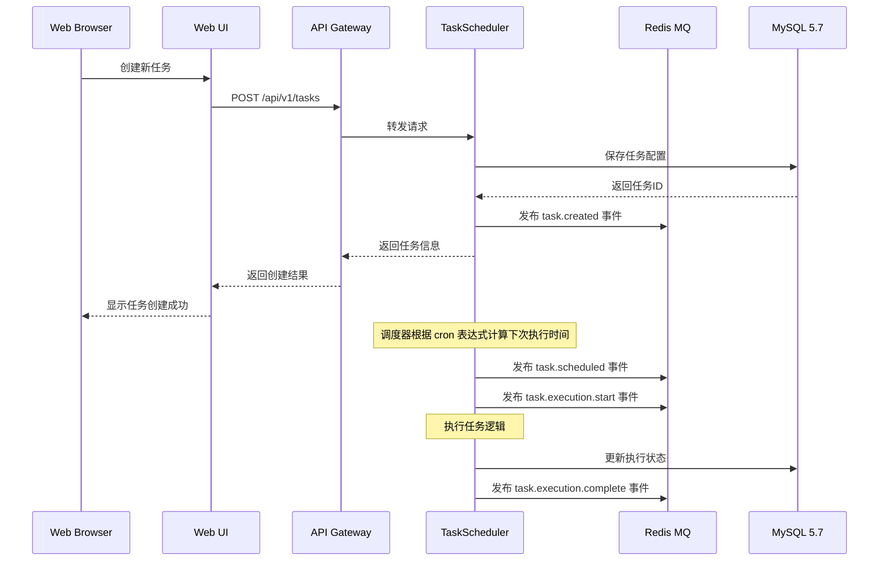
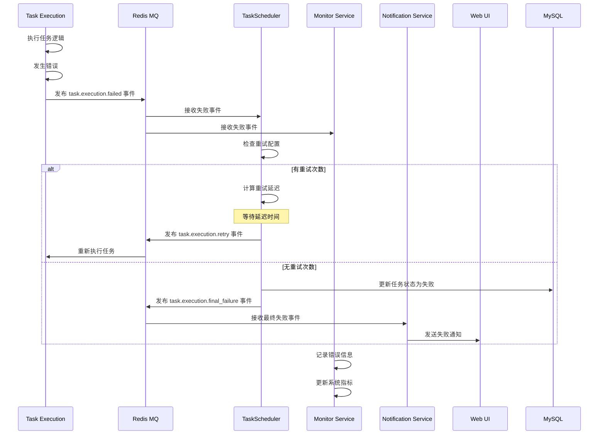

# Core Workflows

## Task Creation and Scheduling Workflow

```mermaid
sequenceDiagram
    participant User as Web Browser
    participant UI as Web UI
    participant Gateway as API Gateway
    participant Scheduler as TaskScheduler
    participant Redis as Redis MQ
    participant MySQL as MySQL 5.7

    User->>UI: 创建新任务
    UI->>Gateway: POST /api/v1/tasks
    Gateway->>Scheduler: 转发请求
    Scheduler->>MySQL: 保存任务配置
    MySQL-->>Scheduler: 返回任务ID
    Scheduler->>Redis: 发布 task.created 事件
    Scheduler-->>Gateway: 返回任务信息
    Gateway-->>UI: 返回创建结果
    UI-->>User: 显示任务创建成功

    Note over Scheduler: 调度器根据 cron 表达式计算下次执行时间
    Scheduler->>Redis: 发布 task.scheduled 事件
    Scheduler->>Redis: 发布 task.execution.start 事件

    Note over Scheduler: 执行任务逻辑
    Scheduler->>MySQL: 更新执行状态
    Scheduler->>Redis: 发布 task.execution.complete 事件
```

## Error Handling and Recovery Workflow

```mermaid
sequenceDiagram
    participant Task as Task Execution
    participant Redis as Redis MQ
    participant Scheduler as TaskScheduler
    participant Monitor as Monitor Service
    participant Notification as Notification Service
    participant User as Web UI

    Task->>Task: 执行任务逻辑
    Task->>Task: 发生错误
    Task->>Redis: 发布 task.execution.failed 事件
    Redis->>Scheduler: 接收失败事件
    Redis->>Monitor: 接收失败事件

    Scheduler->>Scheduler: 检查重试配置
    alt 有重试次数
        Scheduler->>Scheduler: 计算重试延迟
        Note over Scheduler: 等待延迟时间
        Scheduler->>Redis: 发布 task.execution.retry 事件
        Redis->>Task: 重新执行任务
    else 无重试次数
        Scheduler->>MySQL: 更新任务状态为失败
        Scheduler->>Redis: 发布 task.execution.final_failure 事件
        Redis->>Notification: 接收最终失败事件
        Notification->>User: 发送失败通知
    end

    Monitor->>Monitor: 记录错误信息
    Monitor->>Monitor: 更新系统指标
```
