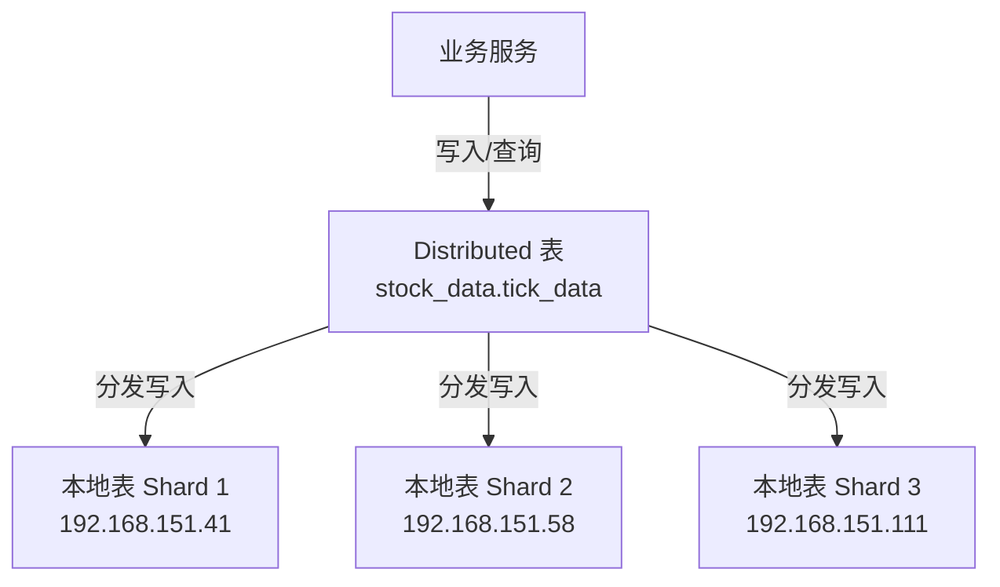

# ClickHouse 分布式集群架构文档

## 1. 集群拓扑结构

本系统采用 3 节点 ClickHouse 集群，实现了数据的分布式存储与高可用副本机制。

### 1.1 节点角色配置

| 节点 IP | 主机名 | 角色 | 说明 |
| :--- | :--- | :--- | :--- |
| **192.168.151.41** | `ubuntu24` | **Shard 1 / Replica 1** | 核心数据节点，承载历史全量数据。 |
| **192.168.151.58** | `node-58` | **Shard 2 / Replica 1** | 扩展计算节点，负责分摊写入压力。 |
| **192.168.151.111** | `node-111` | **Shard 3 / Replica 1** | 扩展计算节点，负责分摊写入压力。 |

> **注意**: 目前配置为 **3 分片 (Shards)**，每分片 **1 副本 (Replica)**。虽然使用了 `ReplicatedMergeTree` 引擎，但当前物理部署是无多副本冗余的（Replica=1）。高可用依赖于未来扩展副本数。

### 1.2集群定义 (`clusters.xml`)

集群标识符为 `stock_cluster`。所有建表操作均需指定 `ON CLUSTER stock_cluster` 以确保在所有节点同步。

## 2. 表设计架构

采用经典的 **Distributed + Local** 双层表架构，兼顾读写分离与分布式查询能力。

### 2.1 架构图示



### 2.2 本地表 (Local Table)

*   **表名**: `stock_data.tick_data_local`
*   **引擎**: `ReplicatedReplacingMergeTree`
*   **路径**: `/clickhouse/tables/{shard}/stock_data/tick_data_local_u64` (注: `_u64` 后缀为修复 Volume 溢出后的新路径)
*   **功能**:
    *   **实际存储数据**：数据物理存储在各节点的磁盘上。
    *   **去重**: 利用 `ReplacingMergeTree` 特性，后台根据排序键自动合并去重。
    *   **分区**: `PARTITION BY toYYYYMM(trade_date)` 按月分区，便于冷热数据管理。
    *   **排序键**: `ORDER BY (stock_code, trade_date, tick_time, price, volume, direction, num)` - 决定了去重指纹。

### 2.3 分布式表 (Distributed Table)

*   **表名**: `stock_data.tick_data`
*   **引擎**: `Distributed('stock_cluster', 'stock_data', 'tick_data_local', xxHash64(stock_code))`
*   **功能**:
    *   **逻辑视图**: 不存储数据，仅作为查询和写入的入口。
    *   **分片策略**: `xxHash64(stock_code)` - 确保同一只股票的数据始终落在同一个分片上，避免跨分片聚合（Global Join）带来的性能损耗。
    *   **写入**: 写入该表会自动按分片键散列到对应的 Local 表。
    *   **查询**: 查询该表会自动聚合所有 Local 表的结果。

### 2.4 实时/分笔表设计 (Intraday)

为了隔离历史归档数据与当日高频写入，采用了分表策略：

| 表类型 | 表名 (本地/分布) | 用途 | 特点 |
| :--- | :--- | :--- | :--- |
| **历史归档** | `tick_data_local`<br>`tick_data` | 存储 T-1 及之前的历史数据 | 数据量大，主要用于回测分析。 |
| **当日实时** | `tick_data_intraday_local`<br>`tick_data_intraday` | 存储 T+0 当日产生的行 | 轻量级，主要用于实时监控和盘后清洗入库。 |

> **关键更新 (2026-02-06)**: 所有表的 `volume` 字段类型已从 `UInt32` 升级为 **`UInt64`**，以支持指数（如 399905）的超大成交量。

## 3. ZooKeeper 协调

由于使用了 `Replicated` 系列引擎，ZooKeeper 是核心组件，负责：
*   **元数据管理**: 记录表结构、分片与副本关系。
*   **Log 同步**: 协调各副本间的数据块合并与同步（虽然当前单副本，但为未来扩容预留了机制）。

## 4. 维护与扩容指南

### 4.1 节点扩容
1.  在 `clusters.xml` 或 `config.xml` 中添加新节点配置。
2.  新节点启动 ClickHouse Server。
3.  执行 `SYSTEM RELOAD CONFIG`。
4.  在新节点上手动建立 Local 表结构（因 ClickHouse 不会自动在后加入的节点建表）。

### 4.2Schema 变更
必须使用 `ON CLUSTER` 语法：
```sql
ALTER TABLE stock_data.tick_data_local ON CLUSTER stock_cluster MODIFY COLUMN volume UInt64;
ALTER TABLE stock_data.tick_data ON CLUSTER stock_cluster MODIFY COLUMN volume UInt64;
```
