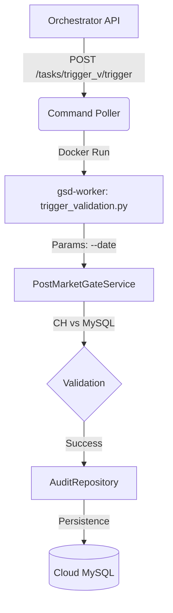

# 远程校验触发器 (Remote Validation Trigger)

本架构支持通过 API 远程触发特定日期的数据审计任务，适用于数据补采后的实时对账或周期性质量抽检。

## 1. 触发流程



## 2. 任务定义与配置

### 2.1 任务 ID
`trigger_validation`

### 2.2 核心脚本
`services/gsd-worker/src/jobs/trigger_validation.py`

### 2.3 配置详情 (tasks.yml)
```yaml
- id: trigger_validation
  name: 远程触发数据校验
  type: docker
  target:
    command: ["jobs.trigger_validation"]
    environment:
      PYTHONPATH: "/app/src"
      STRICT_MODE: "true"
```

## 3. 使用说明

### 3.1 命令行直连测试
在 `gsd-worker` 容器内运行：
```bash
python3 src/jobs/trigger_validation.py --date 2026-01-18
```

### 3.2 Docker 容器调用 (推荐)
通过 Docker Compose 在宿主机直接执行，需注意环境变量注入：
```bash
docker compose -f docker-compose.node-41.yml run --rm \
    --user root \
    -e PYTHONPATH=/app/src:/app/libs/gsd-shared \
    gsd-worker jobs.trigger_validation --date 2026-01-18
```

### 3.2 通过 API 触发
```bash
curl -X POST http://orchestrator:8080/api/v1/tasks/trigger_validation/trigger \
     -H "Content-Type: application/json" \
     -d '{"params": {"date": "2026-01-18"}}'
```

## 4. 业务逻辑
- **日期参数**: 若不传 `--date`，默认为最近一个交易日（Gate-3 逻辑）。
- **校验标准**:
    - 针对全市场维度执行 `KLineStandards` 和 `MarketStandards`。
    - 自动触发对 `tick_data_intraday` 的分时完整性审计。
- **持久化**: 结果自动写入 `data_audit_summaries` 表，前端看板可实时感知。
