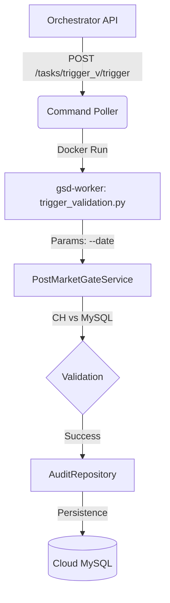

# 远程校验触发器 (Remote Validation Trigger)

本架构支持通过 API 远程触发特定日期的数据审计任务，适用于数据补采后的实时对账或周期性质量抽检。

## 1. 触发流程



## 2. 任务定义与配置

### 2.1 任务 ID
`trigger_validation`

### 2.2 核心脚本
`services/gsd-worker/src/jobs/trigger_validation.py`

### 2.3 配置详情 (tasks.yml)
```yaml
- id: trigger_validation
  name: 远程触发数据校验
  type: docker
  target:
    command: ["jobs.trigger_validation"]
    environment:
      PYTHONPATH: "/app/src"
      STRICT_MODE: "true"
```

## 3. 使用说明

### 3.1 命令行直连测试
在 `gsd-worker` 容器内运行：
```bash
python3 src/jobs/trigger_validation.py --date 2026-01-18
```

### 3.2 Docker 容器调用 (推荐)
通过 Docker Compose 在宿主机直接执行，需注意环境变量注入：
```bash
docker compose -f docker-compose.node-41.yml run --rm \
    --user root \
    -e PYTHONPATH=/app/src:/app/libs/gsd-shared \
    gsd-worker jobs.trigger_validation --date 2026-01-18
```

### 3.2 通过 API 触发
```bash
curl -X POST http://orchestrator:8080/api/v1/tasks/trigger_validation/trigger \
     -H "Content-Type: application/json" \
     -d '{"params": {"date": "2026-01-18"}}'
```

## 4. 核心逻辑与策略

### 4.1 校验流程 (Logic Flow)
脚本复用了 Gate-3 (`PostMarketGateService`) 的全套生产级逻辑：

1.  **数据路由**: 自动根据 `--date` 参数判断：
    *   **今日**: 校验 `tick_data_intraday` 表。
    *   **历史**: 校验 `tick_data` 表。
2.  **指标计算**:
    *   **K线覆盖率**: ClickHouse 本地计数 / MySQL 云端计数。
    *   **分笔覆盖率**: 有 Tick 数据的股票数 / 有 K 线数据的股票数。
    *   **时段完整性**: 检查每只股票的 `active_minutes` 和开盘收盘时间。

### 4.2 安全机制 (Safety Brake)
为防止因数据源异常或休市导致的海量误补采，内置了安全熔断机制：

*   **触发条件**: 分笔覆盖率 **< 80%** (可配置 `SAFETY_THRESHOLD`)。
*   **系统行为**:
    *   ❌ **阻断**: 不会生成任何 `repair_tick` 补采指令。
    *   📝 **记录**: 在审计报告中记录 `FAIL` 级别的 "安全熔断" 事件。
    *   🚨 **告警**: Worker 日志输出 `CRITICAL` 级警报。

### 4.3 分级修复与去重 (Tiered Repair & Dedup)
若未触发熔断（覆盖率 > 80% 但 < 95%），系统执行分级修复：

*   **策略**:
    *   **< 50 只**: 单节点补采。
    *   **50-200 只**: 分片并行补采。
    *   **> 200 只**: 全量分片扫描修复。
*   **任务去重 (Deduplication)**:
    *   系统在插入 `repair_tick` 指令前会检查 `task_commands` 表。
    *   **规则**: 如果 5 分钟内已存在相同参数（日期+分片）的任务，则**自动跳过**，防止重复触发。

### 4.4 结果持久化 (Persistence)
所有校验结果均写入云端 MySQL，支持双层审计：

*   **Summary 表** (`data_audit_summaries`): 记录整体 Pass/Fail 状态。
*   **Details 表** (`data_audit_details`): 记录具体的 `ValidationIssue`。
    *   异常股票详情。
    *   **Actions**: 包括 "安全熔断" 或 "触发补采" 的具体系统行为记录。
