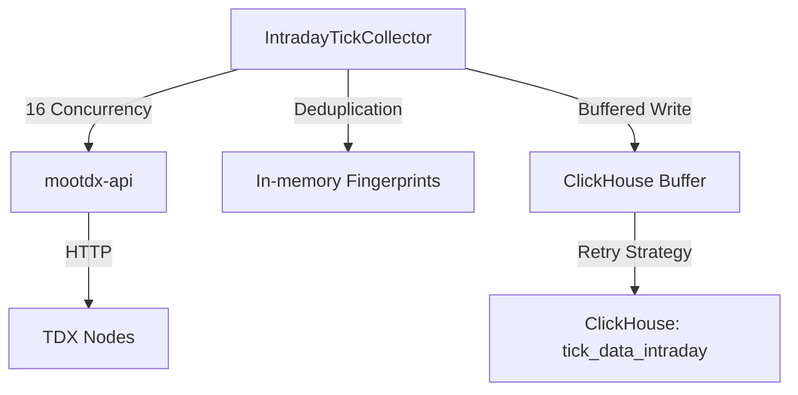

# HS300 盘中分笔实时采集架构设计

## 1. 背景与目标
为了解决 HS300 股票池盘中分笔数据的实时性与完整性问题，设计并实现了独立的 `intraday-tick-collector` 服务。

### 核心目标
- **实时性**：数据从产生到存入 ClickHouse 延迟控制在 10s 以内。
- **完整性**：利用内存储备指纹与 ClickHouse `ReplacingMergeTree` 引擎实现 100% 重复数据过滤。
- **高可用**：支持自动重启、优雅关闭、ClickHouse 写入重试及 HTTP 熔断保护。

## 2. 系统架构

### 2.1 整体流程
系统采用“短轮询 + 内存指纹 + 批量写入”的架构模式。

### 2.2 核心组件
- **`IntradayTickCollector`**: 核心逻辑类，负责调度、去重和缓冲。
- **`CircuitBreaker`**: 熔断器，保护 `mootdx-api` 免受级联故障影响。
- **`CalendarService`**: 交易日历服务，确保仅在 A 股交易日运行。
- **`Tenacity Retry`**: 用于 ClickHouse 写入的指数退避重试机制。

## 3. 关键特性实现

### 3.1 增量去重策略
- **内存层**: 对每只股票维护一个 `maxlen=1000` 的 `deque` 指纹队列。指纹基于 `(time, price, volume, direction)` 的 MD5 哈希生成。
- **数据库层**: `tick_data_intraday` 使用 `ReplacingMergeTree(created_at)`。即使重复数据穿透内存层，也会在合并时被自动去重。

### 3.2 弹性设计 (Resilience)
- **写入重试**: 针对 ClickHouse INSERT 操作，配置了 `tenacity` 重试（最多3次，初始等待2s，指数退避）。
- **请求熔断**: 对 HTTP 请求设置 5 次连续失败阈值及 60s 冷却期的熔断机制。

### 3.3 运行调度
服务采用**自持有调度**模式：
- **自苏醒**: 仅在 9:24-11:31 和 12:59-15:00 时间段活跃。
- **低功耗休眠**: 非交易时段每 60s 检查一次日历。

## 4. 数据字典 (ClickHouse)

| 字段名 | 类型 | 说明 |
| :--- | :--- | :--- |
| `stock_code` | `String` | 股票代码 (不含前缀) |
| `trade_date` | `Date` | 交易日期 |
| `tick_time` | `String` | 时间戳 (HH:mm:ss) |
| `price` | `Decimal(10,3)` | 成交价格 |
| `volume` | `UInt64` | 成交量 |
| `amount` | `Decimal(18,2)` | 成交金额 |
| `direction` | `UInt8` | 0:买入, 1:卖出, 2:中性 |
| `created_at` | `DateTime` | 入库时间 (用于 ReplacingMergeTree) |

## 5. 部署说明
- **容器名**: `intraday-tick-collector`
- **网络模式**: `host` (直连 node-41 上的本地辅助服务)
- **并发配置**: `CONCURRENCY=16`
- **重启策略**: `unless-stopped`

## 6. 监控与维护
- **实时日志**: `docker logs -f intraday-tick-collector`
- **健康检查**: 检查 `/app/logs/intraday_tick_collector.log` 文件的存在性及其更新。
