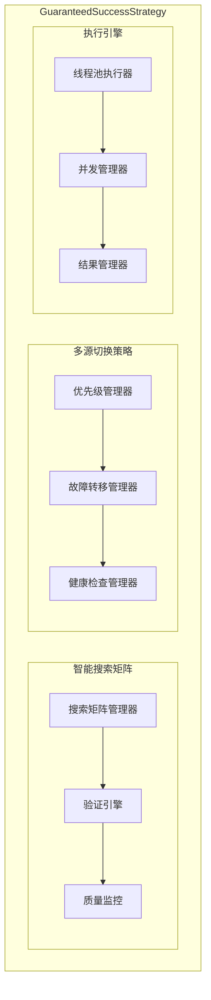
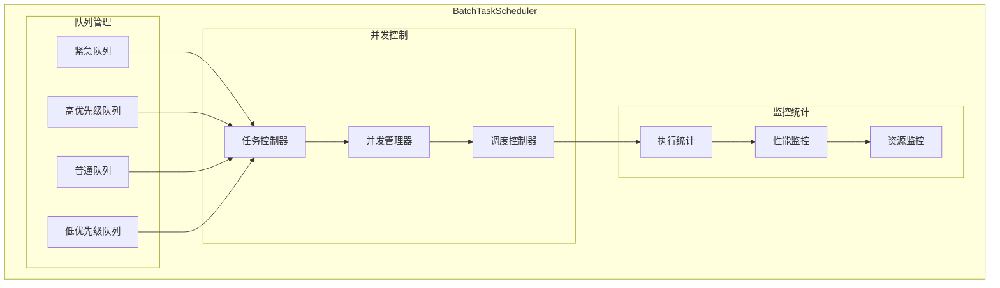

# Domain Architecture: Strategy & Batch Processing

## 1. Introduction
This document details the architecture for the Strategy and Batch Processing sub-domain of the `get-stockdata` service. It focuses on the high-level orchestration of data acquisition tasks, ensuring reliability and efficiency.

## 2. Component Architecture

### 2.1 100% Success Strategy Engine (GuaranteedSuccessStrategy)

**Core Features:**
- Search Matrix based on verified success areas (e.g., Vanke A verification area)
- Intelligent multi-source switching and failover
- Strict data validation and quality assurance
- High concurrency execution and result aggregation

### 2.2 Batch Task Scheduler (BatchTaskScheduler)

**Scheduling Strategy:**
- Four-level priority queue management (Urgent, High, Normal, Low)
- Intelligent concurrency control and resource management
- Real-time execution statistics and performance monitoring
- Dynamic load balancing and task reassignment

## 3. API Interface

### 3.1 100% Success Strategy API

**Endpoints:**
- `POST /api/v1/strategy/execute` - Execute guaranteed success strategy
- `GET /api/v1/strategy/status` - Get strategy status
- `POST /api/v1/strategy/config` - Strategy configuration management

### 3.2 Batch Processing API

**Endpoints:**
- `POST /api/v1/batch/submit` - Submit batch task
- `GET /api/v1/batch/status/{task_id}` - Query task status
- `GET /api/v1/batch/result/{task_id}` - Get task result
