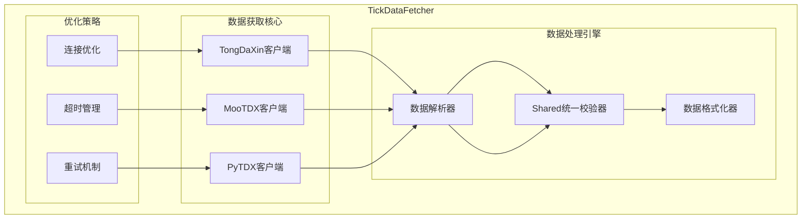
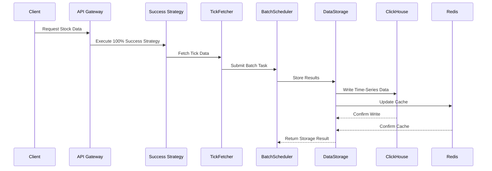

# Domain Architecture: Tick Data High-Frequency System

## 1. Introduction
This document details the architecture for the Tick Data High-Frequency System, a sub-domain of the `get-stockdata` service. It focuses on the acquisition, processing, and storage of granular trade data.

## 2. Component Architecture

### 2.1 Tick Data Fetcher (TickDataFetcher)

**Capabilities:**
- Supports three professional tick data sources: TongDaXin, MooTDX, PyTDX
- Intelligent connection optimization and timeout management
- Strict tick data validation and formatting
- Supports large-scale batch tick data acquisition

## 3. Data Model & Storage

### 3.1 ClickHouse Tick Data Model

Based on the established ClickHouse table structure, the tick data model uses an optimized storage design:

**Main Table - tick_data (Core Trade Data)**
- Primary Key: Stock Code, Name, Exchange, Trade Date
- Time Dimension: Exact Timestamp, Time String
- Core Fields: Price, Volume, Amount
- Quality Fields: Data Source, Quality Score, Duplicate Flag
- Metadata: Create Time, Update Time
- Engine: MergeTree, Partition by Month, Composite Sort Key

**Optimized Table - tick_data_optimized (Production High-Performance)**
- Primary Key: Stock Code, Trade Date, Full Timestamp
- Core Fields: Price, Volume, Amount, Direction
- Quality Fields: Source Type, Call Auction Flag
- Engine: MergeTree, Partition by Month, Clustered Sort Key

### 3.2 Data Flow Architecture

## 4. API Interface

### 4.1 Tick Data Professional API

**Endpoints:**
- `GET /api/v1/ticks/{symbol}` - Get tick data
- `POST /api/v1/ticks/batch` - Batch get tick data
- `GET /api/v1/ticks/{symbol}/analysis` - Tick data statistical analysis

### 4.2 统一校验 (Unified Validation)

所有校验规则由 `gsd-shared` 统一管理：

- **TickValidator**: 分笔数据质量 (采集时 Loose / 审计时 Strict)
- **MarketValidator**: 全市场数据完整性 (K线覆盖率、Tick覆盖率、连续性、异常股数)
- **Consistency**: 价格与成交量对账 (Tick vs KLine)

### 4.3 Tick Data Model Schema

**Tick Data Model Design:**
- **Identity**: Stock Code, Trade Time
- **Transaction**: Price, Volume, Amount
- **Type**: Direction (Buy/Sell/Neutral)
- **Attribute**: Transaction Type Classification
