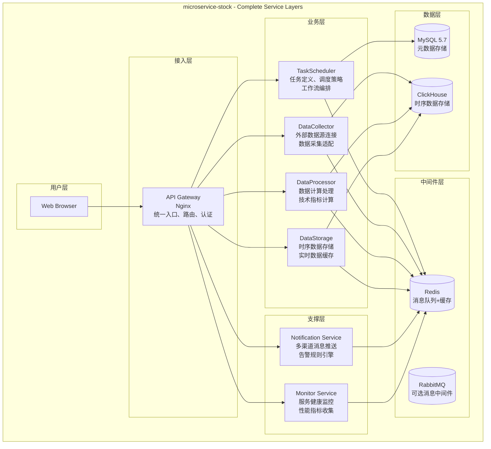

# High Level Architecture

## Technical Summary

microservice-stock 采用完整的事件驱动微服务架构，基于现有架构文档中的服务分层设计，通过 Docker Compose 在单机上模拟多服务环境。系统包含接入层、业务层、支撑层的完整服务栈，使用 Redis、ClickHouse、MySQL 5.7 构建多层次存储体系。该架构既保持了企业级微服务的完整性，又通过容器化简化了个人开发的部署复杂度。

## Platform and Infrastructure Choice

**平台选择：本地 Docker Compose 部署**
- **接入层服务：** API Gateway (Nginx)
- **业务层服务：** TaskScheduler、DataCollector、DataProcessor、DataStorage
- **支撑层服务：** Notification、Monitor
- **核心存储：** Redis、ClickHouse、MySQL 5.7 (外部)
- **部署主机：** 本地服务器 (10G CPU, 64GB RAM, 100GB SSD)

## Repository Structure

**结构：** 完整微服务 Monorepo
```
microservice-stock/
├── services/
│   ├──接入层/
│   │   └── api-gateway/          # Nginx 统一入口
│   ├──业务层/
│   │   ├── task-scheduler/       # Python 核心服务
│   │   ├── data-collector/       # 数据采集服务
│   │   ├── data-processor/       # 数据处理服务
│   │   └── data-storage/         # 数据存储服务
│   ├──支撑层/
│   │   ├── notification/         # 通知服务
│   │   └── monitor/              # 监控服务
│   └──前端/
│       └── web-ui/              # React 管理界面
├── infrastructure/
│   ├── docker-compose.yml       # 服务编排
│   ├── redis/                   # Redis 配置
│   ├── clickhouse/              # ClickHouse 配置
│   └── nginx/                   # API Gateway 配置
├── shared/
│   ├── types/                   # 共享类型定义
│   └── config/                  # 共享配置
└── scripts/                     # 部署和管理脚本
```

## High Level Architecture Diagram



## Architectural Patterns

- **分层微服务架构：** 接入层、业务层、支撑层清晰分离，每层专注特定职责
  - _Rationale:_ 符合企业级架构标准，便于维护和扩展，职责清晰

- **事件驱动架构：** Redis 作为核心消息总线，RabbitMQ 作为可选增强
  - _Rationale:_ 服务间完全解耦，异步通信提升系统吞吐量

- **CQRS + 分层存储：** MySQL 处理元数据，ClickHouse 处理时序数据，Redis 处理缓存
  - _Rationale:_ 不同数据类型使用最适合的存储引擎，优化性能

- **API Gateway 统一接入：** Nginx 提供路由、负载均衡、统一认证
  - _Rationale:_ 简化客户端配置，集中化管控，提升安全性

- **数据流水线架构：** DataCollector → DataProcessor → DataStorage 的经典 ETL 流程
  - _Rationale:_ 标准化数据处理流程，便于监控和优化
