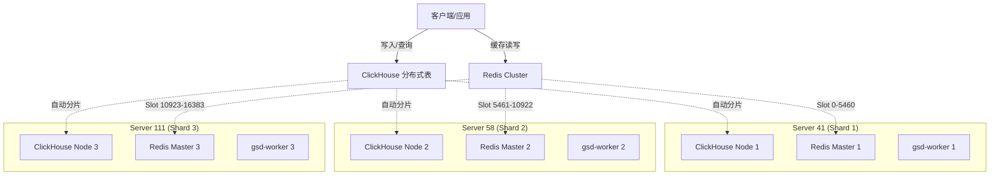

# microservice-stock 架构文档

> **更新时间**: 2026-01-15  
> **当前架构**: 3-Shard 高性能并行集群 (Server 41/58/111)

---

## 🏗️ 架构概览 (v3.0)

本项目采用 **3节点全并行分片架构**，旨在最大化数据采集与即时分析的吞吐量。

### 核心特性
- **ClickHouse**: 3-Shard 无副本架构 (Shard 01/02/03)，数据按 `stock_code` Hash 分片。
- **Redis**: 3-Master 集群 (Port 16379)，Slots 平均分配。
- **并行计算**: 3个 Worker 节点并行处理，性能提升 300%。

---

## 📚 文档索引

### 基础设施 (`infrastructure/`)

| 文档 | 说明 | 状态 |
|------|------|------|
| [clickhouse-3shard-cluster.md](infrastructure/clickhouse-3shard-cluster.md) | ClickHouse 3分片架构详解 | ✅ v3.0 |
| [redis-3shard-cluster.md](infrastructure/redis-3shard-cluster.md) | Redis 3分片架构详解 | ✅ v3.0 |
| [server-hardware.md](infrastructure/SERVER_HARDWARE_ARCHITECTURE.md) | 服务器硬件架构 | ✅ v3.0 |
| [server-41-network.md](infrastructure/SERVER_41_NETWORK_CONFIG.md) | Server 41 三网卡配置详解 | ✅ v3.1 |
| [server-58-network.md](infrastructure/SERVER_58_NETWORK_CONFIG.md) | Server 58 三网卡配置详解 | ✅ v3.1 |
| [server-111-network.md](infrastructure/SERVER_111_NETWORK_CONFIG.md) | Server 111 三网卡配置详解 | ✅ v3.1 |
| [verified-tdx-hosts.md](infrastructure/VERIFIED_TDX_HOSTS_20260111.md) | 已验证的 TDX 节点列表 | ✅ v3.1 |
| [tdx-docker-41.md](data_acquisition/TDX_POOL_DOCKER_CONFIG_41.md) | Server 41 Mootdx 部署指南 | ✅ v3.1 |
| [tdx-docker-58.md](data_acquisition/TDX_POOL_DOCKER_CONFIG_58.md) | Server 58 Mootdx 部署指南 | ✅ v3.1 |
| [tdx-docker-111.md](data_acquisition/TDX_POOL_DOCKER_CONFIG.md) | Server 111 Mootdx 部署指南 | ✅ v3.1 |

### 数据采集 (`data_acquisition/`)

| 文档 | 说明 | 状态 |
|------|------|------|
| [mootdx-api-diagnostic.md](data_acquisition/DIAGNOSTIC_TOOLS.md) | TDX 连接池诊断工具说明 | ✅ 新增 |

### 业务架构 (`services/`)

| 文档 | 说明 | 状态 |
|------|------|------|
| [tick_data_sharding_implementation.md](tick_data_sharding_implementation.md) | 分笔数据分布式 Sharding 实现 | ✅ v3.0 |

### 数据质量门禁 (`data_gates/`)

| 文档 | 说明 | 状态 |
|------|------|------|
| [01_pre_market_gate.md](../../services/task-orchestrator/docs/data_gates/01_pre_market_gate.md) | Gate-1 盘前准入逻辑 | ✅ v4.0 |
| [02_intraday_gate.md](../../services/task-orchestrator/docs/data_gates/02_intraday_gate.md) | Gate-2 盘中监控逻辑 | 🔄 开发中 |
| [03_post_market_gate.md](../../services/task-orchestrator/docs/data_gates/03_post_market_gate.md) | Gate-3 盘后审计逻辑 | ✅ v4.0 |

---

## 📋 相关文档

| 类型 | 位置 |
|------|------|
| 运维文档 | [docs/operations/](../operations/) |
| AI 上下文 | [docs/ai_context/](../ai_context/) |
| 进度报告 | [docs/reports/](../reports/) |
