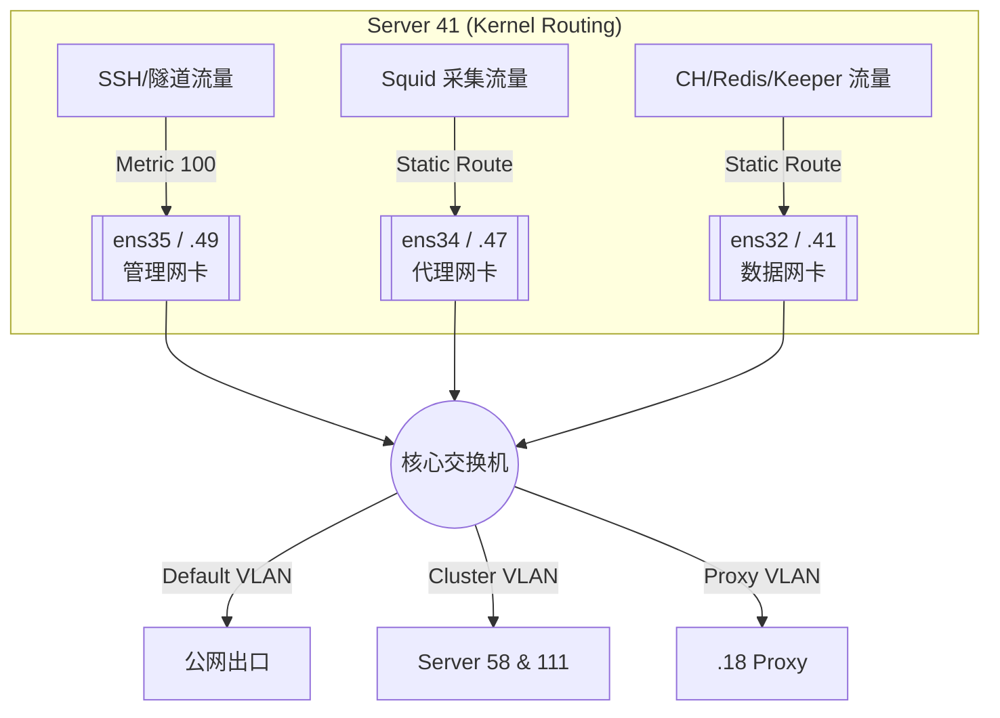

# Server 41 网络配置详解 (3-NIC Architecture)

> **更新日期**: 2026-01-13
> **服务器**: Server 41 (Orchestrator / Shard 1)
> **环境**: 生产环境 (Production)

本文档详细描述了 Server 41 的 **三网卡物理隔离架构**。作为集群的主控节点，Server 41 承载了任务调度、ClickHouse 分片存储以及多链路出口管理等核心职能。

---

## 🏗️ 物理网卡配置 (Physical Interfaces)

Server 41 配备了三块千兆虚拟网卡 (VMXNET3)，分别对应不同的业务平面。

| 接口名称 | IP 地址 (CIDR) | 网关 | 跃点数 (Metric) | 角色 | 描述 |
| :--- | :--- | :--- | :--- | :--- | :--- |
| **ens35** | `192.168.151.49` | `.254` | 100 (Default) | **管理 / 隧道** | SSH 管理、默认公网出口、Gost 加密隧道 |
| **ens34** | `192.168.151.47` | `.254` | 200 | **采集 / 代理** | 专用于 HTTP 采集代理流量 (Squid) |
| **ens32** | `192.168.151.41` | `.254` | 300 | **集群 / 数据** | 内部 ClickHouse/Redis 同步、Keeper Raft 选举 |

---

## 🛣️ 路由策略 (Routing Policies)

系统通过 `Netplan` 策略路由确保了管理流量与数据流量的完全隔离。

### 1. 默认路由 (Default Routes)
- **Metric 100 (`ens35`)**: 系统关键出口，确保管理请求和加密隧道通信具有最高优先级。
- **Metric 200 (`ens34`)**: 采集平面的次优先级出口。
- **Metric 300 (`ens32`)**: 数据平面的备用路由。

### 2. 静态集群路由 (Cluster Static Routes)
为了保证与计算节点 (58/111) 的高效通信，定义了以下强制路径：

```bash
# 目标：Server 58 (Shard 2)
192.168.151.58 via 192.168.151.41 dev ens32  # 走数据网卡 (ens32)

# 目标：Server 111 (Shard 3)
192.168.151.111 via 192.168.151.41 dev ens32  # 走数据网卡 (ens32)

# 目标：Proxy Server (代理服务器)
192.168.151.18 via 192.168.151.47 dev ens34  # 走代理网卡 (ens34)
```

**策略解读**：
*   **同步平面隔离**：Server 41 作为主控，通过 `ens32` 与其他节点进行 Keeper 心跳同步和 ClickHouse 分布式查询。
*   **采集流量分流**：所有发往代理网尖的采集流量被强制绑定在 `ens34`，不干扰集群内部同步。
*   **TDX (7709) 透明穿透**：通达信流量不再强制直连，而是通过宿主机的 `GOST -> Squid (Domestic)` 链路进行透明转发，以绕过网关的 DPI 限制。

---

## 🐳 Docker 网络集成

Server 41 上的所有关键服务（ClickHouse, Redis, gsd-worker）均运行在宿主机网络模式（`network_mode: host`）或直接绑定特定 IP。

### 核心绑定关系
*   **ClickHouse**: 监听 `192.168.151.41`，确保分片同步在 `ens32` 物理链路上运行。
*   **Redis Master 1**: 绑定特定的 Cluster IP，用于 Slots 同步。

---

## 📊 流量拓扑图



## ✅ 验证命令

1.  **查看 IP 与物理网卡映射**:
    ```bash
    ip addr show
    ```
2.  **验证路由偏好**:
    ```bash
    ip route get 192.168.151.58  # 应回显 dev ens32
    ip route get 192.168.151.18  # 应回显 dev ens34
    ip route get 8.8.8.8         # 应回显 dev ens35
    ```
