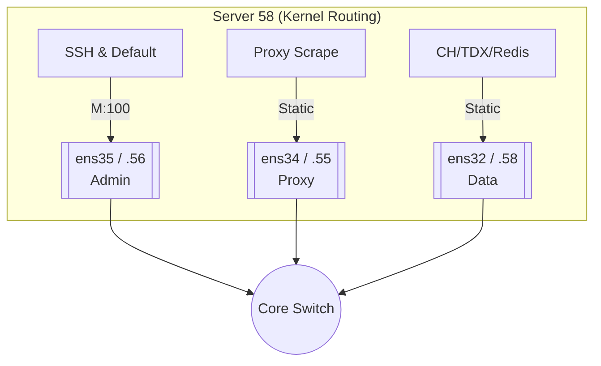

# Server 58 网络配置详解 (3-NIC Architecture)

> **更新日期**: 2026-01-13
> **服务器**: Server 58 (Worker / Shard 2)
> **环境**: 生产环境 (Production)

本文档详细描述了 Server 58 的 **三网卡物理隔离架构**。该架构与集群内其他节点保持高度一致，确保了大规模分笔数据采集过程中的网络确定性。

---

## 🏗️ 物理网卡配置 (Physical Interfaces)

Server 58 配备了三块千兆虚拟网卡 (VMXNET3)。

| 接口名称 | IP 地址 (CIDR) | 网关 | 跃点数 (Metric) | 角色 | 描述 |
| :--- | :--- | :--- | :--- | :--- | :--- |
| **ens35** | `192.168.151.56` | `.254` | 100 (Default) | **管理 / 隧道** | SSH 管理、默认出口、日志上报 |
| **ens34** | `192.168.151.55` | `.254` | 200 | **采集 / 代理** | 专用于 HTTP 采集代理流量 |
| **ens32** | `192.168.151.58` | `.254` | 300 | **集群 / 数据** | 内部数据同步、TDX 行情直连 |

---

## 🛣️ 路由策略 (Routing Policies)

### 1. 默认路由 (Default Priority)
1.  **Metric 100 (`ens35`)**: 承载所有非特定业务流量。
2.  **Metric 200 (`ens34`)**: 备用采集平面。
3.  **Metric 300 (`ens32`)**: 备用数据平面。

### 2. 静态集群路由 (Cluster Static Routes)
为了最小化 Shard 间复制延迟，强制锁定内部通信路径：

```bash
# 目标：Server 41 (Orchestrator)
192.168.151.41 via 192.168.151.58 dev ens32

# 目标：Server 111 (Shard 3)
192.168.151.111 via 192.168.151.58 dev ens32

# 目标：Proxy Server
192.168.151.18 via 192.168.151.55 dev ens34
```

---

## 🐳 Docker 网络集成

与 Server 111 类似，Server 58 上的 `mootdx-api` 容器采用宿主机模式并绑定源 IP。

### `mootdx-api` 绑定配置
*   **配置项**: `TDX_BIND_IP=192.168.151.58`
*   **效果**: 
    1. 应用层发起的 TDX 请求源 IP 锁定为 `.58`。
    2. 路由表匹配 `.58` 到 `ens32`。
    3. TDX 采集流量与管理/代理流量在物理网线层面实现完全隔离。

---

## 📊 流量拓扑图



## ✅ 验证命令

1.  **查看路由明细**:
    ```bash
    ip route show
    ```
2.  **路由追踪测试**:
    ```bash
    ip route get 192.168.151.41  # 应显示 dev ens32
    ip route get 192.168.151.18  # 应显示 dev ens34
    ```
