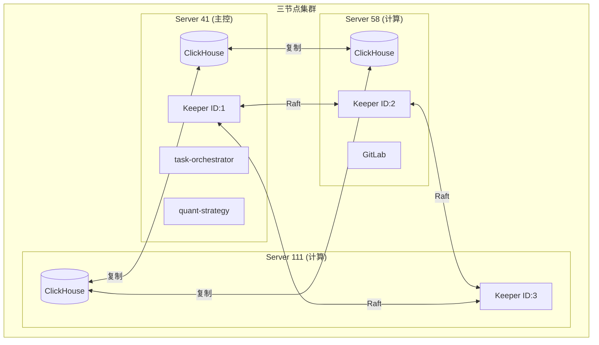

# 三节点集群架构

> **创建时间**: 2026-01-08  
> **状态**: 生产就绪

---

## 架构概述

本文档描述 microservice-stock 的三节点集群架构，用于股票数据采集和量化分析。



---

## 节点职责

### Server 41 (192.168.151.41) - 主控节点

| 服务 | 端口 | 职责 |
|------|:----:|------|
| ClickHouse | 9000/8123 | 数据存储 (副本 1) |
| Keeper | 9181/9234 | 协调服务 (ID: 1) |
| task-orchestrator | 8081 | 任务调度 |
| quant-strategy | 8084 | 策略引擎 |
| get-stockdata | 8083 | 数据 API |
| gsd-worker | - | 分片采集 (SHARD=0) |
| mootdx-api | 8003 | 行情源 |
| Redis | 6379 | 缓存 |
| Prometheus | 9090 | 监控 |

### Server 58 (192.168.151.58) - 计算节点

| 服务 | 端口 | 职责 |
|------|:----:|------|
| ClickHouse | 9000/8123 | 数据存储 (副本 2) |
| Keeper | 9181/9234 | 协调服务 (ID: 2, **Leader**) |
| gsd-worker | - | 分片采集 (SHARD=1) |
| mootdx-api | 8003 | 行情源 |
| GitLab | 8800 | 代码仓库 |

### Server 111 (192.168.151.111) - 计算节点

| 服务 | 端口 | 职责 |
|------|:----:|------|
| ClickHouse | 9000/8123 | 数据存储 (副本 3) |
| Keeper | 9181/9234 | 协调服务 (ID: 3) |
| gsd-worker | - | 分片采集 (SHARD=2) |
| mootdx-api | 8003 | 行情源 |

---

## 高可用特性

### ClickHouse 数据复制

- **引擎**: ReplicatedMergeTree
- **副本数**: 3
- **容错**: 任意 1 节点故障不中断服务
- **同步**: 写入任意节点自动复制到其他节点

### Keeper Raft 共识

- **节点数**: 3
- **Quorum**: 2/3 多数派
- **防脑裂**: 网络分区时自动选举

---

## 分片采集策略

全市场 5000+ 只股票按 Hash 分片：

```python
shard_index = hash(stock_code) % 3
```

| 节点 | SHARD_INDEX | 采集股票数 |
|------|:-----------:|:----------:|
| Server 41 | 0 | ~1764 |
| Server 58 | 1 | ~1765 |
| Server 111 | 2 | ~1764 |

**采集时间**: 三节点并行 < 30 分钟 (单机需 90 分钟)

---

## 网络端口

| 端口 | 协议 | 用途 |
|:----:|:----:|------|
| 8123 | HTTP | ClickHouse HTTP 接口 |
| 9000 | TCP | ClickHouse 原生协议 |
| 9009 | HTTP | 副本间数据同步 |
| 9181 | Keeper | Keeper 客户端 |
| 9234 | Raft | Keeper 节点间 |

---

## 相关文档

- [ClickHouse 复制集群](./clickhouse-replicated-cluster.md)
- [部署架构](../overview/deployment-architecture.md)
- [代码同步策略](../../operations/CODE_SYNC_STRATEGY.md)
