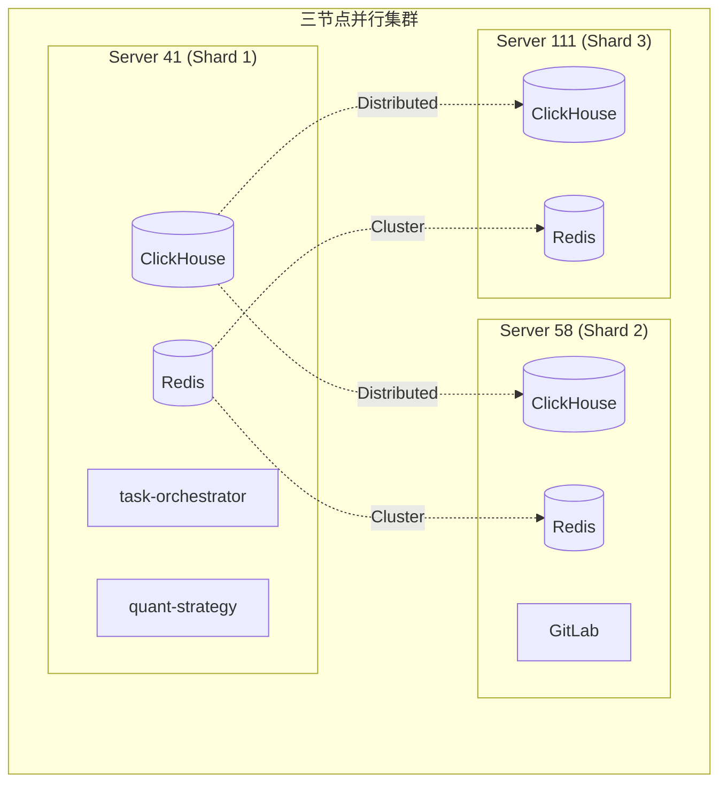

# 三节点集群架构

> **更新时间**: 2026-01-09  
> **状态**: 生产就绪 (v3.0)

---

## 架构概述

本文档描述 microservice-stock 的三节点集群架构，采用 **全分片 (Fully Sharded)** 模式，最大化读写性能。



---

## 节点职责

### Server 41 (192.168.151.41) - 主控节点

| 服务 | 端口 | 职责 |
|------|:----:|------|
| ClickHouse | 9000/8123 | 数据存储 (Shard 01) |
| Keeper | 9181/9234 | 协调服务 (ID: 1) |
| task-orchestrator | 8081 | 任务调度 |
| quant-strategy | 8084 | 策略引擎 |
| get-stockdata | 8083 | 数据 API |
| gsd-worker | - | 分片采集 (SHARD=0) |
| Redis | **16379** | 缓存 (Master 1) |
| Prometheus | 9090 | 监控 |

### Server 58 (192.168.151.58) - 计算节点

| 服务 | 端口 | 职责 |
|------|:----:|------|
| ClickHouse | 9000/8123 | 数据存储 (Shard 02) |
| Keeper | 9181/9234 | 协调服务 (ID: 2) |
| gsd-worker | - | 分片采集 (SHARD=1) |
| Redis | **16379** | 缓存 (Master 2) |
| GitLab | 8800 | 代码仓库 |

### Server 111 (192.168.151.111) - 计算节点

| 服务 | 端口 | 职责 |
|------|:----:|------|
| ClickHouse | 9000/8123 | 数据存储 (Shard 03) |
| Keeper | 9181/9234 | 协调服务 (ID: 3) |
| gsd-worker | - | 分片采集 (SHARD=2) |
| Redis | **16379** | 缓存 (Master 3) |

---

## 核心特性

### 1. ClickHouse 高性能分片 (3-Shard)

- **引擎**: `MergeTree` (Local) + `Distributed` (Global)
- **分片键**: `xxHash64(stock_code)`
- **优势**: 
  - 写入吞吐量提升 300%
  - 单股聚合查询完全本地化 (无跨节点 Shuffle)

### 2. Redis 高性能集群 (3-Master)

- **模式**: Cluster Mode (无副本)
- **端口**: **16379** (非标准端口，避免冲突)
- **Hash Tags**: 使用 `{stock_code}` 确保相关数据落入同一物理节点。

### 3. 分片采集策略

全市场 5000+ 只股票按 Hash 均匀分配给 3 个节点并行采集：

```python
node_index = xxHash64(stock_code) % 3
```

| 节点 | 目标 Shard | 采集股票数 |
|------|:-----------:|:----------:|
| Server 41 | 1 | ~1/3 |
| Server 58 | 2 | ~1/3 |
| Server 111 | 3 | ~1/3 |

---

## 任务编排

采用 **集中式编排，分布式执行**：

- **Server 41**: 运行 `task-orchestrator`，负责生成任务和监控。
- **所有节点**: 运行 `gsd-worker`，通过 Redis 获取属于自己分片的任务。

---

## 网络端口汇总

| 端口 | 协议 | 用途 |
|:----:|:----:|------|
| 8123 | HTTP | ClickHouse HTTP |
| 9000 | TCP | ClickHouse Native |
| 9181 | TCP | Keeper Client |
| 9234 | TCP | Keeper Raft |
| **16379** | TCP | Redis Cluster |
| 26379 | TCP | Redis Bus |

---

## 相关文档

- [ClickHouse 3-Shard 架构](./clickhouse-3shard-cluster.md)
- [Redis 3-Shard 架构](./redis-3shard-cluster.md)
- [部署架构](../overview/deployment-architecture.md)
