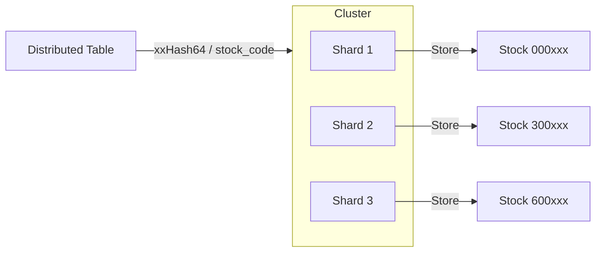

# ClickHouse 3-Shard 高性能架构

> **版本**: 3.0  
> **更新时间**: 2026-01-09  
> **类型**: Performance-First (无副本高性能)

## 1. 架构目标

本项目采用 **3-Shard (无副本)** 架构，旨在最大化数据吞吐量。

- **采集速度**: 3个节点并行写入，理论性能提升3倍。
- **分析速度**: 分布式查询引擎将查询任务分发到3个节点并行计算，大幅降低聚合延迟。
- **存储效率**: 无数据冗余，每一份存储都是有效数据。

## 2. 集群拓扑



### 节点配置

| 物理机 | IP | Shard ID | Keeper ID | 角色 |
|--------|----|----------|-----------|------|
| Server 41 | 192.168.151.41 | 01 | 1 | Shard 1 + Controller |
| Server 58 | 192.168.151.58 | 02 | 2 | Shard 2 |
| Server 111 | 192.168.151.111 | 03 | 3 | Shard 3 |

## 3. 分片策略

### 核心表结构

我们采用了 **Local Table + Distributed Table** 的经典模式，但做了关键优化：

1.  **分片键**: `xxHash64(stock_code)`
    - **原理**: 确保同一只股票的数据（Tick, KLine, OrderFlow）始终落在同一个物理节点上。
    - **优势**: 
        - 计算均线、MACD 等指标时，完全避免跨节点数据传输 (Shuffle)。
        - 极大地提升了单股分析的性能。

2.  **表定义**:

```sql
-- 本地表 (每个节点)
CREATE TABLE tick_data_local ( ... ) ENGINE = MergeTree()
PARTITION BY toYYYYMM(trade_date)
ORDER BY (stock_code, trade_date, tick_time);

-- 分布式表 (路由层)
CREATE TABLE tick_data ( ... ) ENGINE = Distributed(
    'stock_cluster', 
    'stock_data', 
    'tick_data_local', 
    xxHash64(stock_code)
);
```

## 4. 写入流程

应用程序 (gsd-worker) **必须写入分布式表 (`tick_data`)**，而不能直接写入本地表。

1. App 向任意 ClickHouse 节点发送 `INSERT INTO tick_data ...`
2. 接收节点计算 `xxHash64(stock_code)`。
3. 根据 Hash 值，将数据转发到对应的 Shard (41, 58 或 111)。
4. 目标节点将数据写入 `tick_data_local`。

## 5. 查询流程

应用程序 **必须查询分布式表 (`tick_data`)**。

1. App 向任意节点发送 `SELECT count() FROM tick_data`。
2. 接收节点将查询分发给所有 3 个 Shard。
3. 3个 Shard 并行计算各自的 `count()`。
4. 结果汇总到接收节点，返回给 App。

## 6. 运维与扩容

此架构支持无缝扩容。如果需要更高性能：
1. 添加 Server 4 (Shard 4)。
2. 修改 `remote_servers` 配置。
3. 此架构天然支持线性扩展。
