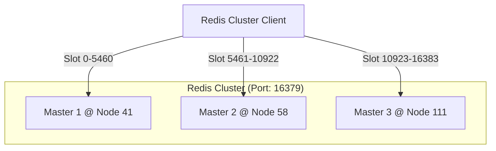

# Redis 3-Shard 高性能集群架构

> **版本**: 3.0  
> **更新时间**: 2026-01-09  
> **端口**: 16379 (自定义端口)

## 1. 架构目标

Redis 集群作为实时数据的 **Hot Storage** (热存储) 和 **Event Bus** (消息总线)，其核心目标是低延迟和高并发。

我们实现了 **3-Master (无副本)** 架构，以确保存储资源被最大化利用。

## 2. 集群拓扑



### 节点职责

| 节点 | IP | 端口 | 角色 | 负责槽位 (Slots) | 
|------|----|------|------|------------------|
| Server 41 | 192.168.151.41 | **16379** | Master | 0 - 5460 |
| Server 58 | 192.168.151.58 | **16379** | Master | 5461 - 10922 |
| Server 111 | 192.168.151.111 | **16379** | Master | 10923 - 16383 |

**关键变更**:
- 端口从标准的 `6379` 迁移到 `16379`，以彻底规避宿主机已有 Redis 服务的冲突，并便于安全策略管理。

## 3. 数据分布机制

Redis Cluster 使用 CRC16 算法进行分片：`HASH_SLOT = CRC16(key) mod 16384`。

### Hash Tags (关键优化)

为了提升批量读取性能，我们在 Key 设计中使用了 **Hash Tags `{...}`**。

- **普通 Key**: `snapshot:000001` -> 可能落在任意分片。
- **优化 Key**: `snapshot:{000001}` -> 只计算 `{}` 内的 Hash。
    - `snapshot:{000001}`
    - `kline:{000001}`
    - `trade:{000001}`
    
**优势**: 
确保同一只股票的所有相关数据（分笔、K线、快照）都位于同一个 Redis 物理节点上。这允许使用 `MGET` 进行原子性批量获取，大幅减少网络 RTT。

## 4. 应用程序适配

由于采用了集群模式，应用程序 (App) **必须** 使用支持 Cluster 的客户端：

- **Python**: `redis.cluster.RedisCluster` (redis-py >= 5.0)
- **配置**:
    ```python
    REDIS_HOST = "192.168.151.41"
    REDIS_PORT = 16379  # NEW PORT
    REDIS_CLUSTER = True
    ```

## 5. 性能基准

实测数据 (2026-01-09):
- **总吞吐量**: ~170,000 requests/sec (3节点合计)
- **单节点吞吐**: ~57,000 requests/sec
- **平均延迟**: ~0.5ms (p50)

此性能足以支撑全市场 5000+ 股票的毫秒级实时行情推送。
