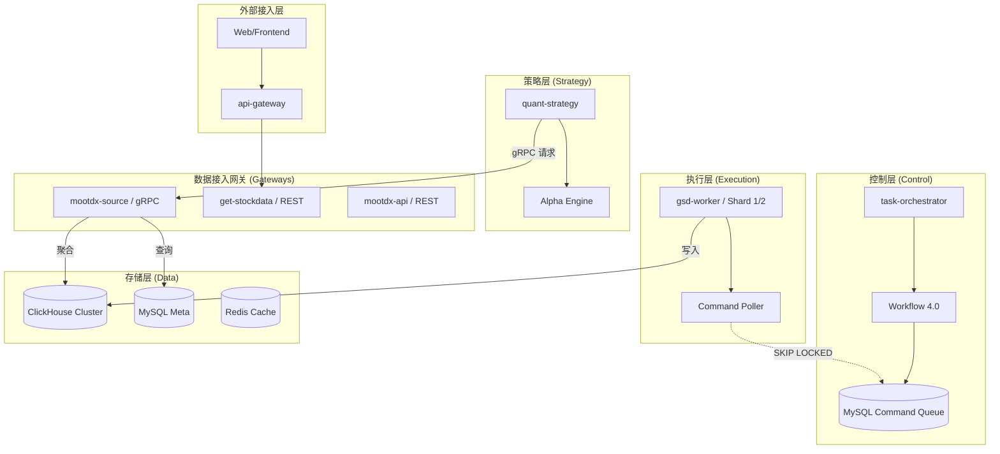

# 系统核心架构 (High Level Architecture)

## 1. 技术概览 (Technical Summary)

`microservice-stock` 是一个以 **分笔数据 (Tick) 为核心**、以 **AI 驱动自愈 (Self-healing)** 为特色的 A 股量化研究与交易底座。系统采用解耦合的分布式微服务架构，通过指令驱动模型实现了采集、审计、计算的完全分离。

**核心设计目标：**
- **数据净水厂**：通过 Gate 1/2/3 三级门禁体系，确保进入 ClickHouse 的数据 100% 准确、完整、归一化。
- **高可用采集**：通过多网卡绑定与动态节点评分，在异构网络环境下实现毫秒级行情抓取。
- **自动化运维**：集成 LLM (gsd-agent) 进行日志诊断与故障自动恢复。

## 2. 部署与基础设施 (Infrastructure)

**平台策略：分布式多节点集群**
系统默认分布在三个核心物理/逻辑节点上，以利用不同节点的网络带宽与计算资源：

- **Shard 0 (Server 41 - Master)**: 
    - 运行 `task-orchestrator` (主调度)
    - 运行 `api-gateway` (统一入口)
    - 存储 MySQL (元数据/指令) 与 Redis (锁/缓存)
- **Shard 1/2 (Server 58/111 - Workers)**: 
    - 运行 `gsd-worker` 集群进行高并发数据采集
    - 运行 `mootdx-api` 实时行情池
- **数据存储层**: 
    - **ClickHouse**: 存储全量 Tick 及各维度特征矩阵。
    - **MySQL (alwaysup)**: 存储任务指令、股票元数据及审计日志。

## 3. 代码库结构 (Repository Structure)

```text
microservice-stock/
├── services/
│   ├── task-orchestrator/     # 指令分发中心，基于 Workflow 4.0 编排工作流
│   ├── gsd-worker/            # 分布式执行节点，通过 CommandPoller 拉取任务
│   ├── get-stockdata/         # 数据入口服务，暴露 RESTful 接口
│   ├── mootdx-source/         # [核心] gRPC 统一数据网关，屏蔽 heterogenous sources
│   ├── quant-strategy/        # 策略计算引擎，生成 OFI/Smart Money 信号
│   ├── api-gateway/           # 基于 Nginx 的统一反向代理与流量控制
│   └── altdata-source/        # 另类数据（GitHub/硬件现货等）采集服务
├── libs/
│   ├── gsd-shared/            # 核心共享库：代码清洗、校验工具、数据模型
│   ├── gsd-agent/             # AI 驱动包：基于 LLM 的故障分析与恢复建议
│   └── common/                # 基础基础设施代码
├── infrastructure/
│   ├── nacos/                 # 服务发现与配置中心
│   ├── clickhouse/            # 分布式数据库配置与 TTL 策略
│   ├── gost/                  # TDX 采集专用代理隧道
│   └── prometheus/            # 监控度量系统
└── docs/                      # 设计文档、Epic 进度与架构决策
```

## 4. 架构总览图 (System Panorama)



## 5. 核心架构模式 (Core Patterns)

- **双链路指令驱动 (Double-Link)**:
  - 控制面不直联执行面，通过 MySQL 行锁 (`FOR UPDATE SKIP LOCKED`) 实现任务的竞争式分发，消除了 Master-Slave 间的强连接依赖。
- **异步优先与非阻塞 (Async First)**:
  - 内部库及接口强制使用 `async/await`。在高频数据网关 `mootdx-source` 中，所有数据库及 Socket 调用均为异步，确保极高的吞吐量。
- **AI 自愈模型 (Self-healing)**:
  - 结合 `gsd-agent`。当盘后门禁审计发现数据空洞时，由 AI 自动读取日志并分析原因，在指令库中生成“重试”或“诊断”逻辑。
- **三级降级存储**:
  - 数据首选分布式 ClickHouse。
  - 若失效则降级至 MySQL 备份。
  - 实时热数据存储于 Redis 集群，提供毫秒级响应。
- **代码标准化门禁 (Enforcement Gate)**:
  - 唯一采用 TS 标准化代码（如 `600519.SH`）。严禁在数据库及核心接口中出现不带后缀或小写的代码格式。

## 6. 数据存储与分布 (Data Storage & Distribution)

系统采用混合存储架构，根据数据的规模、实时性和用途进行分层管理：

### 6.1 ClickHouse (分析型/海量采集)
- **定位**：OLAP 中心。负责存储需要大规模并行计算、高压缩率和时间序列分析的数据。
- **存储内容**：
    - **采集原始数据**：全量历史分笔 (Tick)、实时快照 (Snapshots)、日线/分钟线 K 线。
    - **特征矩阵**：计算后的多维特征向量 (`features` 表)。
    - **大批量元数据镜像**：为支持高性能 Join 计算而镜像的股票/行业关系表。

### 6.2 MySQL (业务型/分析结论)
- **定位**：OLTP 中心与外网访问网关。负责存储强一致性元数据、系统控制状态以及**面向展示/外部调用的复盘结论**。
- **存储内容**：
    - **元数据**：股票基本信息、行业分类（申万/同花顺）。
    - **指令与状态**：任务队列 (`task_commands`)、工作流状态 (`workflow_state`)、审计日志。
    - **分析结果 (核心)**：复盘生成的指标（如 VOL 系列指标、资金流向结论）、策略生成的买卖信号。该层数据量相对较小，方便 API 快速点查及外网安全访问。

### 6.3 Redis (高速缓存/协调层)
- **定位**：高性能临时存储。负责毫秒级响应的实时数据和跨节点竞争协调。
- **职责**：
    - **实时报价缓存**：存储最新的盘中买卖盘五档数据及实时价格。
    - **分布式锁**：利用 Redlock 机制确保分布式环境下的采集任务不冲突。
    - **任务队列缓存**：状态机运行过程中的临时上下文和信号传递。

