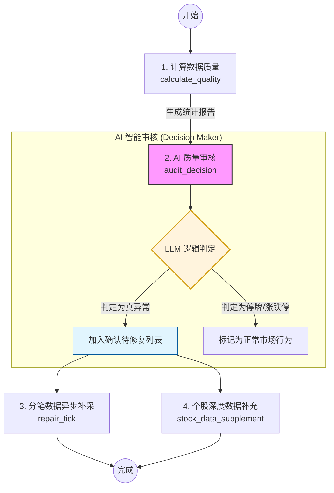

# 盘后数据自愈管线 (Post-Market Audit Workflow 4.0)

## 1. 概述
盘后数据自愈管线是一个基于 Agentic 架构的自动化流程，旨在确保 A 股交易数据（分笔 Tick 与 K 线）的完整性。该流程通过统计分析发现异常，利用 AI (LLM) 进行逻辑审核，最终自动触发针对性的数据补采与修复。

## 2. 流程图

## 3. 步骤详述

### 3.1 统计分析 (calculate_quality)
- **任务**: `calculate_data_quality` (Job: `audit_tick_resilience`)
- **逻辑**: 扫描当日所有股票的分笔数据量。正常交易日分笔数通常约为 4800 (每 3 秒一笔)。若分笔数低于阈值（如 < 1000），则计入异常候选名单。
- **输出**: 包含 `{missing_list, abnormal_list}` 的统计 JSON。

### 3.2 AI 智能决策 (audit_decision)
- **任务**: `ai_quality_gatekeeper`
- **AI 角色**: 财务数据质量审计员。
- **输入**: 步骤 3.1 的统计报告及 target_date。
- **审核逻辑**:
    1.  如果 Tick 计数极低（如 0-10），极大概率是采集失败。
    2.  如果 Tick 计数处于中间地带，结合 AI 知识库判断股票是否可能因停牌、全天涨停/跌停或临时停牌导致成交稀疏。
- **核心优化**:
    - **鲁棒性**: 自动剥离 Markdown 围栏，过滤 LLM 生成的非法控制字符（`\u0000-\u001F`）。
    - **结构化输出**: 通过 `confirmed_bad_codes` 字段提供精准的修复名单。

### 3.3 数据补采 (sync_tick / repair_tick)
- **任务**: `repair_tick` (Job: `sync_tick`)
- **逻辑**: 接收 AI 确认的坏码列表，调用多线程采集引擎从数据源（如 Mootdx）重新拉取全量分笔数据。

### 3.4 深度补充 (stock_data_supplement)
- **任务**: `stock_data_supplement` (Job: `supplement_stock`)
- **逻辑**: 针对 AI 确认的股票，进行除 Tick 以外的其他维度（如 K 线、财务快照）的强制同步，确保该个股在数据库中的数据状态达到“生产就绪”级别。

## 4. 关键数据流

| 数据项 | 来源步骤 | 流向步骤 | 变量引用语法 |
| :--- | :--- | :--- | :--- |
| 统计报告 | `calculate_quality` | `audit_decision` | `{{calculate_quality.output}}` |
| 确认坏码列表 | `audit_decision` | `sync_tick`, `supp_stock` | `{{audit_decision.output.confirmed_bad_codes}}` |
| 目标日期 | Workflow Context | 所有步骤 | `{{target_date}}` |

## 5. 异常处理机制
- **重试机制**: 每个步骤支持配置 `max_attempts`（默认为 1-3 次）。
- **流程控制**: 若 AI 判定没有需要修复的股票，后续步骤将自动跳过（Skip）或执行空列表处理。
- **变量容错**: `FlowController` 支持点号路径解析，当上下文数据为扁平化 JSON 字符串时，系统会自动提取并解析。
