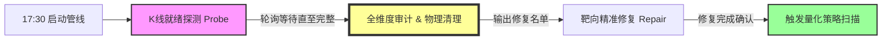

# 盘后数据治理动态管线方案 (Data-Driven Orchestration)

本方案定义了从数据对账到策略执行的**事件驱动 (Event-Driven)** 流程。通过放弃僵化的绝对时间表，改用**动态依赖链**，确保系统在数据质量（Level 1-3）达标前处于强阻塞状态，从而保障生产环境的安全。

## 1. 核心管线拓扑 (Pipeline Topology)

## 2. 关键阶段说明

### 2.1 数据栅栏：K 线就绪探测 (Readiness Probe)
*   **逻辑**: 它是整个管线的“发令枪”。不再假设 17:30 或 18:00 数据一定齐，而是每 5 分钟扫描一次 Clickhouse。
*   **准则**: 只有当 `当日K线覆盖率 > 99.5%` 时，才释放下游任务。
*   **收益**: 消除由于外部数据源延迟导致的校验误报（False Positive）。

### 2.2 审计即清理：L1-L3 闭环 (Audit & Purge)
*   **逻辑**: 在单次 Job (`audit_tick_resilience`) 中完成从发现到处理的闭环。
    1.  **L1 存在性**: 识别完全缺失股。
    2.  **L2/L3 完整与准确性**: 识别断档、价格错误、成交量差额大的个股。
*   **动作**: **发现即删除**。对所有 L2/L3 异常个股立即执行物理 `DELETE`。
*   **状态**: 交付物为干净的“待补采名单”，此时数据库中已为这些个股留出“空白占位”。

### 2.3 确定性修复 (Guaranteed Repair)
*   **逻辑**: 仅针对审计给出的名单进行靶向重拉。
*   **收益**: 由于前序步骤已完成了物理清理，补采的数据将是唯一存在的有效数据，不存在多版本合并或成交量双倍的风险。

### 2.4 最终消费：策略链式触发
*   **逻辑**: 将策略扫描移出 Crontab，改为 Job Chain 的最后一个 Node。
*   **收益**: 实现了 **“无校验，不策略”** 的安全承诺。确保产生的每一条买卖信号，其底层分笔数据都通过了 L1-L3 的全方位体检。

## 3. 运维指标 (SLI)

*   **P95 Ready Time**: 期望 K 线就绪时间（通常 17:30 - 18:15）。
*   **Cleaning Rate**: 成功执行物理清理的异常股比例（目标 100%）。
*   **Zero-Draft Policy**: 严禁在 L1-L3 审计通过之前，由任何下游系统消费当日分笔数据。

---
**架构总结**: 从“按时办事”升级为“按事实（数据状态）办事”。
