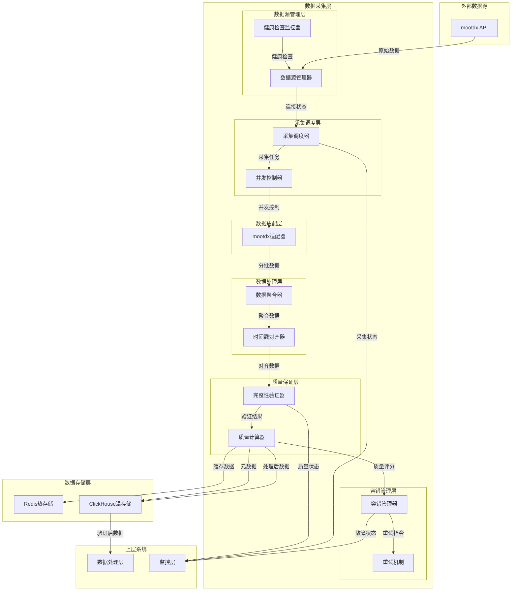

# 数据采集层架构设计

## 📋 文档信息

- **文档版本**: v1.0
- **创建日期**: 2025-11-06
- **作者**: Claude (Architect Agent)
- **适用范围**: 盘后分笔数据分析系统
- **架构风格**: 标准架构文档
- **最后更新**: 2025-11-06

---

## 🎯 系统概述

数据采集层是盘后分笔数据分析系统的核心组件，负责从mootdx数据源获取完整、准确的原始分笔数据。该层确保数据完整性、采集效率和系统可靠性，为上层处理和分析提供高质量的数据基础。

---

## 🏗️ 架构设计

### 核心职责

- **数据接入** - 通过mootdx API获取分笔数据
- **数据质量保证** - 确保数据完整性和准确性
- **采集效率优化** - 提高数据获取速度和并发能力
- **故障恢复** - 处理采集过程中的异常情况

### 架构原则

- **单一职责** - 专注于数据采集功能
- **高可靠性** - 完善的容错和恢复机制
- **高性能** - 支持批量并发采集
- **标准化** - 统一的接口和数据格式

### 数据流向

1. **数据获取流** - mootdx API → 数据源管理器 → 采集调度器 → 并发控制器 → mootdx适配器
2. **数据处理流** - mootdx适配器 → 数据聚合器 → 时间戳对齐器 → 完整性验证器 → 质量计算器
3. **容错处理流** - 质量计算器 → 容错管理器 → 重试机制
4. **数据保存流** - 质量计算器 → ClickHouse（处理后数据） + Redis（缓存数据） + ClickHouse（元数据）
5. **数据输出流** - ClickHouse → 数据处理层（验证后数据）
6. **监控流** - 各组件 → 监控层（状态信息）

### 采集范围定义

#### 1. 时间范围
- **采集时段** - 完整交易时段：09:30-11:30, 13:00-15:00
- **采集时机** - 每日盘后17:00-23:00执行
- **数据延迟** - 允许T+1数据获取，确保数据完整性
- **启动方式** - 定时任务自动执行，支持手动干预

> **启动方式设计**：
>
> **推荐方案：定时任务 + 手动触发**
>
> **1. 定时任务（主要方式）**
> - **工具选择**：使用cron或APScheduler
> - **执行时间**：每日18:00自动启动
> - **容错机制**：失败时自动重试，发送通知
> - **日志记录**：完整的执行日志和状态跟踪
>
> **2. 手动触发（备用方式）**
> - **命令行启动**：`python run.py --date 20241105 --manual`
> - **Web界面**：简单的Flask界面进行手动触发
> - **API接口**：RESTful API支持远程触发
> - **参数配置**：支持指定日期、股票范围等参数
>
> **3. 混合策略**
> - **日常运行**：依赖定时任务自动执行
> - **异常处理**：失败时支持手动补采
> - **数据修复**：历史数据重新采集
> - **测试调试**：开发测试时手动触发

#### 2. 股票范围
- **覆盖市场** - A股市场：沪深主板、创业板、科创板
- **股票类型** - 普通股票、ETF基金（可配置）
- **筛选条件** - 基于流动性、市值等指标动态筛选
- **优先级** - 大盘股优先，小盘股次之

#### 3. 数据字段范围
- **基础字段** - 时间戳、价格、成交量、买卖方向
- **扩展字段** - 成交额、累计成交量、累计成交额
- **质量字段** - 数据来源、采集时间、完整性标识
- **元数据** - 交易日历、股票基础信息、交易状态

#### 4. 采集策略
- **完整性要求** - 交易时段覆盖率≥98%
- **批量大小** - 每批1000条记录，避免内存溢出
- **并发限制** - 同时处理10只股票，控制API调用频率
- **重试策略** - 3次重试，指数退避，最长30分钟

### 数据保存策略

#### 1. 处理后数据保存（主要存储）
- **保存必要性** - 保存验证后的高质量数据，供分析层使用
- **保存位置** - ClickHouse温存储，支持快速查询和分析
- **保存格式** - 原生ClickHouse表结构，优化查询性能
- **保留策略** - 处理后数据永久保留，定期备份

> **个人项目简化说明**：
> 对于个人项目，采用ClickHouse单一存储方案即可满足需求：
> - **成本优化** - 省去MinIO存储成本和维护复杂度
> - **架构简化** - 减少组件数量，降低系统故障点
> - **数据够用** - ClickHouse已保存验证后的高质量数据
> - **后续扩展** - 未来需要时再添加MinIO冷存储

#### 2. 缓存数据保存
- **保存必要性** - 缓存最新采集结果，提高系统响应速度
- **保存位置** - Redis热存储，内存缓存最近7天数据
- **保存格式** - JSON格式，支持快速读取和更新
- **保留策略** - 缓存7天，自动过期清理

> **Redis内存容量估算**：
>
> **数据量计算**：
> - **A股总数**：约5000只股票
> - **日均分笔数据**：每只股票约3000-5000条分笔记录
> - **单条记录大小**：约50字节（时间+价格+成交量+买卖方向）
> - **单日数据量**：5000 × 4000 × 50字节 = 800MB
> - **7日数据量**：800MB × 7 = 5.6GB
>
> **Redis存储优化**：
> - **JSON格式开销**：约增加30%存储空间
> - **Redis内存开销**：约增加20%
> - **预估总需求**：5.6GB × 1.3 × 1.2 ≈ **8.7GB**
>
> **容量建议**：
> - **最低配置**：16GB内存（留有余量）
> - **推荐配置**：32GB内存（支持数据增长）
> - **优化策略**：仅缓存活跃股票（如前1000只），可减少80%内存需求

#### 3. 元数据保存
- **保存必要性** - 保存采集过程元数据，支持质量监控和审计
- **保存内容** - 采集时间、数据质量评分、异常记录、重试日志
- **保存位置** - ClickHouse元数据表
- **保留策略** - 元数据永久保留，用于长期质量分析

---

## 🏗️ 系统架构图



---

## 🔧 核心组件

### 1. 数据源管理器
- **功能** - 数据源注册、健康状态监控
- **职责** - 管理mootdx连接和状态

### 2. 采集调度器
- **功能** - 采集任务编排、并发控制
- **职责** - 合理分配采集任务，控制并发数

### 3. mootdx适配器
- **功能** - 标准化mootdx API调用
- **职责** - 数据格式转换和错误处理

### 4. 数据聚合器
- **功能** - 数据批次合并和处理
- **职责** - 整合分批获取的数据

### 5. 完整性验证器
- **功能** - 数据完整性和质量检查
- **职责** - 验证交易时段覆盖和数据连续性

### 6. 容错管理器
- **功能** - 故障检测和恢复
- **职责** - 自动重试和异常处理

---

## 📊 核心接口规范

### 数据源适配器接口

```python
class DataSourceAdapter:
    """数据源适配器基类"""

    async def connect(self) -> bool:
        """建立连接"""
        pass

    async def get_tick_data(self, symbol: str, date: str, start: int, limit: int) -> List[Dict]:
        """获取分笔数据"""
        pass

    async def check_health(self) -> HealthStatus:
        """健康检查"""
        pass

    async def disconnect(self) -> None:
        """断开连接"""
        pass
```

### 数据批次输出接口

```python
@dataclass
class TickDataBatch:
    """标准数据批次格式"""
    symbol: str
    date: str
    batch_index: int
    trades: List[Dict]
    is_last_batch: bool
    source_metadata: Dict[str, Any]
    quality_metrics: Dict[str, float]
    collection_timestamp: datetime
```

---

## 🔧 配置管理

### 数据源配置

```yaml
data_sources:
  primary:
    type: "mootdx"
    priority: 1
    timeout: 30
    max_retries: 3
    rate_limit: 100
```

### 采集策略配置

```yaml
collection_strategy:
  max_concurrent_symbols: 10
  batch_size: 1000
  completeness_threshold: 0.95
  retry_backoff_factor: 2
  collection_timeout: 300

  quality_requirements:
    min_data_points: 100
    max_time_gap: 300
    trading_hours_coverage: 0.98
```

---

## 📈 关键性能指标

### 采集效率指标
- **数据获取速度** - 每秒处理记录数
- **并发处理能力** - 同时处理股票数量
- **采集成功率** - 成功获取数据的比例
- **数据完整性** - 交易时段覆盖比例

### 系统可靠性指标
- **平均无故障时间** - MTBF
- **平均恢复时间** - MTTR
- **数据源可用性** - mootdx健康状态
- **故障恢复成功率** - 自动恢复成功比例

### 数据质量指标
- **数据准确率** - 通过验证的数据比例
- **时效性** - 数据获取延迟时间
- **完整性评分** - 综合完整性评估

---

## 🐳 Docker部署配置

### ClickHouse部署

```yaml
# docker-compose.yml
version: '3.8'
services:
  clickhouse:
    image: clickhouse/clickhouse-server:23.8.13.6-alpine
    container_name: clickhouse
    ports:
      - "8123:8123"  # HTTP接口
      - "9000:9000"  # TCP接口
    volumes:
      - clickhouse_data:/var/lib/clickhouse
      - ./clickhouse/config.xml:/etc/clickhouse-server/config.xml
    environment:
      CLICKHOUSE_DEFAULT_ACCESS_MANAGEMENT: 1
    restart: unless-stopped
    ulimits:
      nofile:
        soft: 262144
        hard: 262144

volumes:
  clickhouse_data:
```

### Redis部署

```yaml
# 同一docker-compose.yml文件
  redis:
    image: redis:7.2.4-alpine
    container_name: redis
    ports:
      - "6379:6379"
    volumes:
      - redis_data:/data
      - ./redis/redis.conf:/usr/local/etc/redis/redis.conf
    command: redis-server /usr/local/etc/redis/redis.conf
    restart: unless-stopped
    sysctls:
      - net.core.somaxconn=65535

volumes:
  redis_data:
```

### 镜像离线导入方案

**镜像版本信息：**
- **ClickHouse**: `clickhouse/clickhouse-server:23.8.13.6-alpine`
- **Redis**: `redis:7.2.4-alpine`

**离线导入步骤：**

1. **在有网络的环境下载镜像**
```bash
# 下载ClickHouse镜像
docker pull clickhouse/clickhouse-server:23.8.13.6-alpine

# 下载Redis镜像
docker pull redis:7.2.4-alpine

# 保存镜像到tar文件
docker save -o clickhouse-23.8.13.6-alpine.tar clickhouse/clickhouse-server:23.8.13.6-alpine
docker save -o redis-7.2.4-alpine.tar redis:7.2.4-alpine
```

2. **传输镜像文件到目标服务器**
```bash
# 使用scp或其他方式传输
scp clickhouse-23.8.13.6-alpine.tar user@target-server:/path/to/images/
scp redis-7.2.4-alpine.tar user@target-server:/path/to/images/
```

3. **在目标服务器导入镜像**
```bash
# 导入ClickHouse镜像
docker load -i /path/to/images/clickhouse-23.8.13.6-alpine.tar

# 导入Redis镜像
docker load -i /path/to/images/redis-7.2.4-alpine.tar

# 验证镜像导入成功
docker images | grep -E "(clickhouse|redis)"
```

4. **使用docker-compose启动**
```bash
# 启动服务
docker-compose up -d

# 查看服务状态
docker-compose ps
```

**镜像文件大小参考：**
- ClickHouse Alpine版本：约200MB
- Redis Alpine版本：约30MB

### Redis内存配置

```conf
# redis/redis.conf
maxmemory 12gb
maxmemory-policy allkeys-lru
save 900 1
save 300 10
save 60 10000
```

### 个人项目Docker优势

- **快速部署** - 一键启动所有依赖服务
- **环境一致** - 开发、测试、生产环境统一
- **资源隔离** - 容器化隔离，不影响宿主机
- **易于维护** - 版本管理、升级、备份都很方便
- **成本控制** - 按需使用资源，避免服务器浪费

---

## 🚀 个人项目实施路线图

### 第一周：基础环境搭建
```bash
# 项目目录结构（简化版）
fenbi-tick-collector/
├── docker-compose.yml          # Docker配置
├── config/
│   ├── redis/
│   │   └── redis.conf          # Redis配置
│   └── clickhouse/
│       └── config.xml          # ClickHouse配置
├── src/
│   ├── collector.py            # 数据采集器
│   ├── processor.py            # 数据处理器
│   ├── scheduler.py            # 定时调度器
│   └── utils.py                # 工具函数
├── scripts/
│   ├── cron-job.sh             # 定时任务脚本
│   └── manual-run.sh           # 手动执行脚本
├── logs/                       # 日志目录
├── requirements.txt            # Python依赖
├── run.py                      # 主启动脚本
└── README.md                   # 项目说明
```

**第一周任务：**
1. 安装Docker环境
2. 部署ClickHouse和Redis容器
3. 创建基础Python项目结构
4. 测试数据库连接

### 第二周：核心功能开发
**第二周任务：**
1. 实现mootdx数据采集器
2. 基础数据验证功能
3. ClickHouse数据存储
4. 简单的调度器

### 第三周：功能完善
**第三周任务：**
1. 添加Redis缓存
2. 错误处理和重试机制
3. 基础监控功能
4. 性能优化

### 第四周：测试和调优
**第四周任务：**
1. 端到端测试
2. 性能调优
3. 部署脚本完善
4. 文档补充

**个人项目建议：**
- 从最小可行产品(MVP)开始
- 优先实现核心采集功能
- 逐步添加高级特性
- 保持代码简洁易懂

---

## ⚙️ 启动配置示例

### 1. 定时任务配置（cron）

```bash
# scripts/cron-job.sh
#!/bin/bash
cd /path/to/fenbi-tick-collector
source venv/bin/activate
python run.py --scheduled --date $(date +%Y%m%d)

# 添加到crontab（每日18:00执行）
0 18 * * 1-5 /path/to/fenbi-tick-collector/scripts/cron-job.sh >> /path/to/fenbi-tick-collector/logs/cron.log 2>&1
```

### 2. 手动执行脚本

```bash
# scripts/manual-run.sh
#!/bin/bash
DATE=${1:-$(date +%Y%m%d)}
cd /path/to/fenbi-tick-collector
source venv/bin/activate
python run.py --date $DATE --manual

# 使用方法：
# ./scripts/manual-run.sh 20241105
# ./scripts/manual-run.sh  # 默认今天
```

### 3. 主启动脚本示例

```python
# run.py
import argparse
from src.collector import TickDataCollector
from src.scheduler import TaskScheduler

def main():
    parser = argparse.ArgumentParser(description='盘后分笔数据采集系统')
    parser.add_argument('--date', type=str, help='采集日期 (YYYYMMDD)')
    parser.add_argument('--manual', action='store_true', help='手动执行模式')
    parser.add_argument('--scheduled', action='store_true', help='定时任务模式')

    args = parser.parse_args()

    if args.manual or args.scheduled:
        collector = TickDataCollector()
        collector.run_collection(args.date)
    else:
        scheduler = TaskScheduler()
        scheduler.start_scheduler()

if __name__ == "__main__":
    main()
```

### 4. 推荐启动策略

**个人项目最佳实践：**
- **日常工作**：依赖cron定时任务，每天18:00自动执行
- **异常处理**：失败时查看日志，手动执行补救
- **数据补采**：使用手动脚本补采缺失数据
- **开发调试**：直接运行`python run.py --manual --date 20241105`

---

## ✅ 架构设计总结

该数据采集层架构设计专注于mootdx单一数据源，通过分层设计确保系统的可维护性和可靠性。

**核心优势：**
- 架构简洁，专注于核心功能
- 完善的容错和质量保证机制
- 标准化接口支持系统集成
- 配置驱动便于运维管理

**设计原则：**
- 实用优先，避免过度设计
- 模块化架构，支持独立开发和测试
- 高可靠性，保障数据采集稳定性
- 性能优化，支持批量处理需求

该架构为盘后分笔数据分析系统提供了可靠的数据采集基础，确保了后续处理和分析的数据质量。