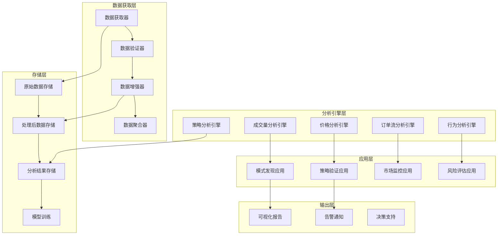

# 盘后分笔数据分析系统

## 📋 文档信息

- **文档版本**: v1.0
- **创建日期**: 2025-11-05
- **作者**: Winston (Architect Agent)
- **适用场景**: 股票盘后分笔数据深度分析
- **分析类型**: 批量分析 + 深度挖掘
- **最后更新**: 2025-11-05

---

## 🎯 系统概述

本文档专门针对盘后分笔数据分析和深度挖掘设计完整的技术方案。盘后分析与盘中实时分析有本质区别：更注重数据的完整性、分析的深度、策略的有效性，而非实时性。

### 盘后分析的核心特点

1. **数据完整性优先** - 必须获取完整的全天交易数据
2. **分析深度** - 支持多维度、多层次的技术分析
3. **策略验证** - 回测和验证投资策略
4. **模式挖掘** - 发现隐藏的交易模式和市场行为
5. **批量处理** - 支持多股票、多时间段的批量分析

---

## 🏗️ 盘后分析架构设计

### 系统架构图



### 数据流架构

```mermaid
sequenceDiagram
    participant Scheduler as 调度器
    participant Collector as 数据收集器
    participant Validator as 数据验证器
    participant Processor as 数据处理器
    participants as 存储系统
    participant Analyzer as 分析引擎
    participant Reporter as 报告生成器

    Scheduler->>Collector: 启动盘后数据收集
    Collector->>Collector: 分批获取完整数据
    Collector->>Validator: 发送原始数据
    Validator->>Processor: 验证通过数据
    Processor->>Processor: 清洗和增强数据
    Processor->>Storage: 存储处理后数据
    Processor->>Analyzer: 触发分析引擎
    Analyzer->>Analyzer: 多维度深度分析
    Analyzer->>Storage: 存储分析结果
    Analyzer->>Reporter: 生成分析报告
    Reporter->>Storage: 存储报告文档
```

---

## 📥 盘后数据获取方案

### 1. 数据收集策略

#### 完整性优先的数据获取器

```python
import asyncio
import logging
from datetime import datetime, date, timedelta
from typing import List, Dict, Optional, Set
from dataclasses import dataclass, asdict
from enum import Enum
import pandas as pd

class AcquisitionMode(Enum):
    """获取模式"""
    COMPREHENSIVE = "comprehensive"    # 全面获取模式
    RETRY_ON_FAILURE = "retry"         # 失败重试模式
    MULTI_SOURCE = "multi_source"      # 多数据源模式
    VERIFICATION = "verification"      # 验证模式

@dataclass
class AfterHoursRequest:
    """盘后数据获取请求"""
    symbols: List[str]
    target_date: date
    acquisition_mode: AcquisitionMode
    min_trades_threshold: int = 1000  # 最小交易笔数阈值
    required_completeness: float = 0.95  # 完整性要求95%
    max_retry_attempts: int = 5
    timeout_per_symbol: int = 300   # 每只股票5分钟超时
    multi_source_enabled: bool = True

@dataclass
class DataCompletenessInfo:
    """数据完整性信息"""
    symbol: str
    date: str
    total_trades: int
    trading_minutes: int
    first_trade_time: str
    last_trade_time: str
    time_gaps: List[Dict]
    missing_minutes: List[str]
    completeness_score: float
    source_info: Dict[str, Any]

class AfterHoursDataCollector:
    """盘后数据收集器"""

    def __init__(self, config: CollectorConfig):
        self.config = config
        self.logger = logging.getLogger(self.__class__.__name__)
        self.data_sources = self._initialize_data_sources()
        self.completeness_checker = DataCompletenessChecker()
        self.retry_manager = RetryManager(config.retry_config)

    async def collect_complete_data(self, request: AfterHoursRequest) -> Dict[str, DataCompletenessInfo]:
        """收集完整的盘后数据"""
        self.logger.info(
            f"开始收集盘后数据: {len(request.symbols)}只股票, "
            f"日期: {request.target_date}, 模式: {request.acquisition_mode.value}"
        )

        results = {}

        for symbol in request.symbols:
            try:
                completeness_info = await self._collect_symbol_data(symbol, request)
                results[symbol] = completeness_info

                # 记录收集结果
                self.logger.info(
                    f"数据收集完成: {symbol} - {completeness_info.total_trades}条, "
                    f"完整性: {completeness_info.completeness_score:.2%}"
                )

            except Exception as e:
                self.logger.error(f"收集{symbol}数据失败: {e}")
                results[symbol] = DataCompletenessInfo(
                    symbol=symbol,
                    date=request.target_date.strftime('%Y%m%d'),
                    total_trades=0,
                    trading_minutes=0,
                    first_trade_time="",
                    last_trade_time="",
                    time_gaps=[],
                    missing_minutes=[],
                    completeness_score=0.0,
                    source_info={'error': str(e)}
                )

        # 生成收集报告
        await self._generate_collection_report(results, request)

        return results

    async def _collect_symbol_data(
        self,
        symbol: str,
        request: AfterHoursRequest
    ) -> DataCompletenessInfo:
        """收集单只股票的完整数据"""

        # 1. 多数据源并行获取
        source_results = await self._collect_from_all_sources(symbol, request)

        # 2. 数据融合和去重
        merged_data = self._merge_source_data(source_results)

        # 3. 数据验证和修复
        validated_data = await self._validate_and_fix_data(merged_data, symbol, request)

        # 4. 完整性检查
        completeness_info = self.completeness_checker.check_completeness(
            validated_data, symbol, request.target_date
        )

        # 5. 如果完整性不足，尝试补充数据
        if completeness_info.completeness_score < request.required_completeness:
            self.logger.warning(
                f"{symbol}数据完整性不足: {completeness_info.completeness_score:.2%} "
                f"尝试补充数据"
            )
            supplementary_data = await self._supplement_missing_data(
                symbol, completeness_info, request
            )

            if supplementary_data:
                validated_data.extend(supplementary_data)
                completeness_info = self.completeness_checker.check_completeness(
                    validated_data, symbol, request.target_date
                )

        # 6. 数据质量最终验证
        final_quality = await self._final_quality_check(validated_data, completeness_info)
        completeness_info.source_info['final_quality'] = final_quality

        return completeness_info

    async def _collect_from_all_sources(
        self,
        symbol: str,
        request: AfterHoursRequest
    ) -> Dict[str, List[Dict]]:
        """从所有数据源并行获取数据"""

        if not request.multi_source_enabled:
            # 单数据源模式
            primary_source = self.data_sources['mootdx']
            data = await self._collect_from_single_source(
                primary_source, symbol, request
            )
            return {'mootdx': data}

        # 多数据源模式
        tasks = []
        for source_name, source in self.data_sources.items():
            task = asyncio.create_task(
                self._collect_from_single_source(source, symbol, request)
            )
            tasks.append((source_name, task))

        # 并行执行所有数据源
        results = {}
        for source_name, task in tasks:
            try:
                data = await task
                if data:
                    results[source_name] = data
                    self.logger.info(f"{source_name}获取到{symbol}数据: {len(data)}条")
                else:
                    self.logger.warning(f"{source_name}未获取到{symbol}数据")
            except Exception as e:
                self.logger.error(f"{source_name}获取{symbol}数据失败: {e}")

        return results

    async def _collect_from_single_source(
        self,
        source: 'DataSourceAdapter',
        symbol: str,
        request: AfterHoursRequest
    ) -> List[Dict]:
        """从单个数据源获取数据"""

        all_trades = []
        offset = 0
        batch_size = request.max_batch_size or 2000
        consecutive_empty_batches = 0
        max_empty_batches = 3

        while True:
            try:
                # 获取当前批次
                batch_data = await source.get_tick_data(
                    symbol=symbol,
                    date=request.target_date.strftime('%Y%m%d'),
                    start=offset,
                    limit=batch_size
                )

                if batch_data and batch_data.trades:
                    all_trades.extend(batch_data.trades)
                    offset += len(batch_data.trades)
                    consecutive_empty_batches = 0

                    self.logger.debug(f"{symbol}批次{offset//batch_size+1}: {len(batch_data.trades)}条")

                else:
                    consecutive_empty_batches += 1
                    self.logger.debug(f"{symbol}空批次{consecutive_empty_batches}")

                    # 连续多个空批次，可能已经获取完毕
                    if consecutive_empty_batches >= max_empty_batches:
                        break

                    # 等待一小段时间再试
                    await asyncio.sleep(1)

                # 检查超时
                if offset > request.max_trades_per_symbol:
                    self.logger.warning(f"{symbol}达到最大交易数限制: {offset}")
                    break

            except Exception as e:
                self.logger.error(f"获取{symbol}批次数据失败: {e}")

                if request.acquisition_mode == AcquisitionMode.RETRY_ON_FAILURE:
                    await asyncio.sleep(5)
                    continue
                else:
                    break

        self.logger.info(f"{symbol}总计获取: {len(all_trades)}条交易数据")
        return all_trades

    def _merge_source_data(self, source_results: Dict[str, List[Dict]]) -> List[Dict]:
        """融合多数据源数据"""

        if not source_results:
            return []

        # 确定优先级顺序（数据源优先级）
        source_priority = ['mootdx', 'tushare', 'custom']

        # 按优先级排序数据源
        prioritized_sources = []
        for source in source_priority:
            if source in source_results:
                prioritized_sources.append(source)

        merged_data = []
        seen_trades = set()
        source_contributions = {}

        for source in prioritized_sources:
            if source not in source_results:
                continue

            source_data = source_results[source]
            source_count = 0

            for trade in source_data:
                # 创建交易唯一标识（时间+价格+成交量）
                trade_id = self._create_trade_id(trade)

                if trade_id not in seen_trades:
                    merged_data.append(trade)
                    seen_trades.add(trade_id)
                    source_count += 1
                else:
                    # 重复数据，记录来源冲突
                    self.logger.debug(f"发现重复交易: {trade_id}")

            source_contributions[source] = source_count
            self.logger.info(f"{source}贡献数据: {source_count}条")

        # 按时间排序
        merged_data.sort(key=lambda x: self._parse_time(x['time']))

        self.logger.info(f"数据融合完成: {len(merged_data)}条, 来源分布: {source_contributions}")
        return merged_data

    def _create_trade_id(self, trade: Dict) -> str:
        """创建交易唯一标识"""
        timestamp = trade['time'].replace(':', '')
        price = f"{trade['price']:.2f}".replace('.', '')
        volume = str(trade['volume'])
        return f"{timestamp}_{price}_{volume}"

    def _parse_time(self, time_str: str) -> datetime.time:
        """解析时间字符串"""
        return datetime.strptime(time_str, '%H:%M:%S').time()

    async def _validate_and_fix_data(
        self,
        data: List[Dict],
        symbol: str,
        request: AfterHoursRequest
    ) -> List[Dict]:
        """验证和修复数据"""

        if not data:
            return []

        self.logger.info(f"开始验证和修复{symbol}数据: {len(data)}条")

        # 1. 基础数据验证
        validated_data = []
        invalid_count = 0

        for trade in data:
            if self._is_valid_trade(trade):
                validated_data.append(trade)
            else:
                invalid_count += 1

        self.logger.info(f"基础验证: 原始{len(data)}条, 有效{len(validated_data)}条, 无效{invalid_count}条")

        # 2. 时间序列验证和修复
        time_fixed_data = self._fix_time_sequence(validated_data)

        # 3. 价格合理性验证和修复
        price_fixed_data = self._fix_price_anomalies(time_fixed_data)

        # 4. 成交量验证和修复
        volume_fixed_data = self._fix_volume_anomalies(price_fixed_data)

        # 5. 去重处理
        deduplicated_data = self._remove_duplicates(volume_fixed_data)

        self.logger.info(
            f"数据验证修复完成: 最终{len(deduplicated_data)}条, "
            f"时间修复{len(time_fixed_data)-len(validated_data)}条, "
            f"价格修复{len(price_fixed_data)-len(time_fixed_data)}条, "
            f"成交量修复{len(volume_fixed_data)-len(price_fixed_data)}条, "
            f"去重{len(deduplicated_data)-len(volume_fixed_data)}条"
        )

        return deduplicated_data

    def _is_valid_trade(self, trade: Dict) -> bool:
        """验证单条交易的有效性"""
        try:
            # 必需字段检查
            required_fields = ['time', 'price', 'volume']
            for field in required_fields:
                if field not in trade or trade[field] is None:
                    return False

            # 价格必须为正数
            if float(trade['price']) <= 0:
                return False

            # 成交量必须为正整数
            if int(trade['volume']) <= 0:
                return False

            # 时间格式验证
            datetime.strptime(trade['time'], '%H:%M:%S')

            return True

        except (ValueError, TypeError, KeyError):
            return False

    def _fix_time_sequence(self, data: List[Dict]) -> List[Dict]:
        """修复时间序列问题"""

        if len(data) <= 1:
            return data

        fixed_data = []
        current_time = datetime.strptime(data[0]['time'], '%H:%M:%S').time()

        for i, trade in enumerate(data):
            try:
                trade_time = datetime.strptime(trade['time'], '%H:%M:%S').time()

                # 检查时间倒流
                if trade_time < current_time and i > 0:
                    self.logger.warning(f"发现时间倒流: {i}位置")
                    # 保持原始时间，但记录问题

                fixed_data.append(trade)
                current_time = trade_time

            except ValueError:
                # 时间格式错误，尝试修复
                try:
                    if i > 0:
                        # 基于前一条交易时间推断
                        prev_time = datetime.strptime(fixed_data[-1]['time'], '%H:%M:%S')
                        fixed_time = (prev_time + timedelta(seconds=1)).time()
                    else:
                        fixed_time = datetime.strptime('09:30:00', '%H:%M:%S').time()

                    fixed_trade = trade.copy()
                    fixed_trade['time'] = fixed_time.strftime('%H:%M:%S')
                    fixed_data.append(fixed_trade)

                except Exception:
                    self.logger.warning(f"无法修复时间格式: 位置{i}")
                    continue

        return fixed_data

    def _fix_price_anomalies(self, data: List[Dict]) -> List[Dict]:
        """修复价格异常"""

        if len(data) <= 1:
            return data

        fixed_data = []
        prev_price = None

        for trade in data:
            current_price = float(trade['price'])

            # 检查异常价格变动
            if prev_price is not None:
                price_change = abs(current_price - prev_price) / prev_price

                # 如果价格变动超过涨跌停限制（约10%），标记为异常
                if price_change > 0.10:
                    self.logger.warning(f"发现异常价格变动: {price_change:.1%}")
                    # 可以选择移除或标记，这里选择标记
                    trade['price_anomaly'] = True
                    trade['price_change'] = price_change
                else:
                    trade['price_anomaly'] = False
                    trade['price_change'] = price_change

            fixed_data.append(trade)
            prev_price = current_price

        return fixed_data

    def _fix_volume_anomalies(self, data: List[Dict]) -> List[Dict]:
        """修复成交量异常"""

        fixed_data = []

        for trade in data:
            volume = trade['volume']

            # 检查成交量异常（过大或过小）
            if volume > 1000000:  # 超过100万股的单笔交易
                self.logger.warning(f"发现异常大单: {volume}股")
                trade['volume_anomaly'] = True
            elif volume < 100:  # 小于100股的交易
                self.logger.warning(f"发现异常小单: {volume}股")
                trade['volume_anomaly'] = True
            else:
                trade['volume_anomaly'] = False

            fixed_data.append(trade)

        return fixed_data

    def _remove_duplicates(self, data: List[Dict]) -> List[Dict]:
        """去除重复数据"""

        seen_trades = set()
        unique_data = []

        for trade in data:
            trade_id = self._create_trade_id(trade)
            if trade_id not in seen_trades:
                unique_data.append(trade)
                seen_trades.add(trade_id)

        return unique_data

    async def _supplement_missing_data(
        self,
        symbol: str,
        completeness_info: DataCompletenessInfo,
        request: AfterHoursRequest
    ) -> List[Dict]:
        """补充缺失数据"""

        if not completeness_info.missing_minutes:
            return []

        self.logger.info(f"开始补充{symbol}缺失数据: {len(completeness_info.missing_minutes)}个时间段")

        supplemented_data = []

        # 尝试从备份数据源补充
        backup_source = self.data_sources.get('backup')
        if backup_source:
            for missing_minute in completeness_info.missing_minutes:
                try:
                    minute_data = await backup_source.get_minute_data(
                        symbol=symbol,
                        date=request.target_date.strftime('%Y%m%d'),
                        minute=missing_minute
                    )

                    if minute_data:
                        supplemented_data.extend(minute_data)
                        self.logger.debug(f"补充{symbol} {missing_minute}分钟数据: {len(minute_data)}条")

                except Exception as e:
                    self.logger.warning(f"补充{missing_minute}分钟数据失败: {e}")

        self.logger.info(f"补充数据完成: {len(supplemented_data)}条")
        return supplemented_data

    async def _final_quality_check(
        self,
        data: List[Dict],
        completeness_info: DataCompletenessInfo
    ) -> Dict:
        """最终质量检查"""

        quality_score = 0.0
        quality_issues = []

        # 1. 数据量检查
        if completeness_info.total_trades >= request.min_trades_threshold:
            quality_score += 0.3
        else:
            quality_issues.append(f"交易量不足: {completeness_info.total_trades} < {request.min_trades_threshold}")

        # 2. 时间覆盖检查
        if completeness_info.trading_minutes >= 230:  # 4小时交易时间约240分钟
            quality_score += 0.2
        else:
            quality_issues.append(f"时间覆盖不足: {completeness_info.trading_minutes}分钟")

        # 3. 数据连续性检查
        if completeness_info.completeness_score >= 0.95:
            quality_score += 0.3
        else:
            quality_issues.append(f"数据不连续: {len(completeness_info.time_gaps)}个时间间隙")

        # 4. 数据源检查
        reliable_sources = completeness_info.source_info.get('reliable_sources', [])
        if len(reliable_sources) > 0:
            quality_score += 0.2
        else:
            quality_issues.append("缺乏可靠数据源")

        return {
            'quality_score': quality_score,
            'quality_issues': quality_issues,
            'total_trades': len(data),
            'reliable_sources': reliable_sources
        }

    async def _generate_collection_report(
        self,
        results: Dict[str, DataCompletenessInfo],
        request: AfterHoursRequest
    ):
        """生成收集报告"""

        total_symbols = len(results)
        successful_symbols = sum(1 for info in results.values() if info.completeness_score > 0.5)
        avg_completeness = sum(info.completeness_score for info in results.values()) / total_symbols if total_symbols > 0 else 0

        report = {
            'collection_date': request.target_date.isoformat(),
            'collection_mode': request.acquisition_mode.value,
            'total_symbols': total_symbols,
            'successful_symbols': successful_symbols,
            'success_rate': successful_symbols / total_symbols if total_symbols > 0 else 0,
            'average_completeness': avg_completeness,
            'symbol_details': {}
        }

        for symbol, info in results.items():
            report['symbol_details'][symbol] = {
                'total_trades': info.total_trades,
                'completeness_score': info.completeness_score,
                'trading_minutes': info.trading_minutes,
                'time_gaps': len(info.time_gaps),
                'source_info': info.source_info
            }

        # 保存报告
        report_path = f"reports/collection_report_{request.target_date.strftime('%Y%m%d')}.json"
        await self._save_report(report, report_path)

        self.logger.info(
            f"收集报告生成完成: 成功率{report['success_rate']:.1%}, "
            f"平均完整性{report['average_completeness']:.1%}"
        )

    async def _save_report(self, report: Dict, path: str):
        """保存报告"""
        try:
            os.makedirs(os.path.dirname(path), exist_ok=True)

            with open(path, 'w', encoding='utf-8') as f:
                json.dump(report, f, indent=2, ensure_ascii=False, default=str)

            self.logger.info(f"报告已保存: {path}")

        except Exception as e:
            self.logger.error(f"保存报告失败: {e}")

class DataCompletenessChecker:
    """数据完整性检查器"""

    def __init__(self):
        self.logger = logging.getLogger(self.__class__.__name__)

    def check_completeness(
        self,
        data: List[Dict],
        symbol: str,
        target_date: date
    ) -> DataCompletenessInfo:
        """检查数据完整性"""

        if not data:
            return DataCompletenessInfo(
                symbol=symbol,
                date=target_date.strftime('%Y%m%d'),
                total_trades=0,
                trading_minutes=0,
                first_trade_time="",
                last_trade_time="",
                time_gaps=[],
                missing_minutes=[],
                completeness_score=0.0,
                source_info={}
            )

        # 1. 基本信息
        total_trades = len(data)
        first_trade = data[0]
        last_trade = data[-1]

        # 2. 交易时间分析
        trading_minutes = self._calculate_trading_minutes(data)
        time_gaps = self._detect_time_gaps(data)
        missing_minutes = self._identify_missing_minutes(data, target_date)

        # 3. 完整性评分
        completeness_score = self._calculate_completeness_score(
            total_trades, trading_minutes, time_gaps, target_date
        )

        return DataCompletenessInfo(
            symbol=symbol,
            date=target_date.strftime('%Y%m%d'),
            total_trades=total_trades,
            trading_minutes=trading_minutes,
            first_trade_time=first_trade['time'],
            last_trade_time=last_trade['time'],
            time_gaps=time_gaps,
            missing_minutes=missing_minutes,
            completeness_score=completeness_score,
            source_info={}
        )

    def _calculate_trading_minutes(self, data: List[Dict]) -> int:
        """计算交易分钟数"""
        if not data:
            return 0

        # 获取交易时间范围
        first_time = datetime.strptime(data[0]['time'], '%H:%M:%S').time()
        last_time = datetime.strptime(data[-1]['time'], '%H:%M:%S').time()

        # 计算分钟数
        first_datetime = datetime.combine(date.today(), first_time)
        last_datetime = datetime.combine(date.today(), last_time)
        total_minutes = int((last_datetime - first_datetime).total_seconds() / 60) + 1

        return total_minutes

    def _detect_time_gaps(self, data: List[Dict]) -> List[Dict]:
        """检测时间间隙"""

        if len(data) <= 1:
            return []

        gaps = []

        for i in range(1, len(data)):
            prev_time = datetime.strptime(data[i-1]['time'], '%H:%M:%S')
            current_time = datetime.strptime(data[i]['time'], '%H:%M:%S')

            time_diff = (current_time - prev_time).total_seconds()

            # 如果时间间隔超过5秒，认为是时间间隙
            if time_diff > 5:
                gaps.append({
                    'position': i,
                    'previous_time': data[i-1]['time'],
                    'current_time': data[i]['time'],
                    'gap_seconds': time_diff
                })

        return gaps

    def _identify_missing_minutes(self, data: List[Dict], target_date: date) -> List[str]:
        """识别缺失的交易分钟"""

        if not data:
            # 如果没有数据，返回所有交易时间
            return self._get_all_trading_minutes(target_date)

        trading_minutes = set()
        existing_minutes = set()

        # 收集存在的交易分钟
        for trade in data:
            time_obj = datetime.strptime(trade['time'], '%H:%M:%S').time()
            minute = time_obj.strftime('%H:%M')
            trading_minutes.add(minute)
            existing_minutes.add(minute)

        # 获取所有应有的交易分钟
        all_minutes = self._get_all_trading_minutes(target_date)

        # 找出缺失的分钟
        missing_minutes = list(all_minutes - existing_minutes)
        missing_minutes.sort()

        return missing_minutes

    def _get_all_trading_minutes(self, date: date) -> Set[str]:
        """获取所有交易分钟"""
        trading_minutes = set()

        # 上午交易时间：9:30-11:30
        morning_start = datetime.combine(date, time(9, 30))
        morning_end = datetime.combine(date, time(11, 30))
        current = morning_start

        while current <= morning_end:
            trading_minutes.add(current.strftime('%H:%M'))
            current += timedelta(minutes=1)

        # 下午交易时间：13:00-15:00
        afternoon_start = datetime.combine(date, time(13, 0))
        afternoon_end = datetime.combine(date, time(15, 0))
        current = afternoon_start

        while current <= afternoon_end:
            trading_minutes.add(current.strftime('%H:%M'))
            current += timedelta(minutes=1)

        return trading_minutes

    def _calculate_completeness_score(
        self,
        total_trades: int,
        trading_minutes: int,
        time_gaps: List[Dict],
        target_date: date
    ) -> float:
        """计算完整性评分"""

        score = 0.0

        # 交易量评分 (40%)
        expected_trades = 1000  # 预期每只股票每天至少1000笔交易
        volume_score = min(total_trades / expected_trades, 1.0) * 0.4

        # 时间覆盖评分 (30%)
        expected_minutes = 240  # 4小时交易时间约240分钟
        time_score = min(trading_minutes / expected_minutes, 1.0) * 0.3

        # 连续性评分 (30%)
        expected_minutes = 240
        gap_penalty = len(time_gaps) / expected_minutes
        continuity_score = max(1.0 - gap_penalty, 0) * 0.3

        score = volume_score + time_score + continuity_score

        return min(score, 1.0)

class RetryManager:
    """重试管理器"""

    def __init__(self, config: RetryConfig):
        self.config = config
        self.logger = logging.getLogger(self.__class__.__class__)

    async def execute_with_retry(
        self,
        func,
        *args,
        **kwargs
    ):
        """带重试执行函数"""

        last_exception = None

        for attempt in range(self.config.max_attempts):
            try:
                return await func(*args, **kwargs)

            except Exception as e:
                last_exception = e

                if attempt == self.config.max_attempts - 1:
                    self.logger.error(f"重试次数已用尽，最终失败: {e}")
                    raise

                wait_time = self.config.base_delay * (2 ** attempt)
                self.logger.warning(
                    f"第{attempt+1}次尝试失败，{wait_time}秒后重试: {e}"
                )
                await asyncio.sleep(wait_time)

        raise last_exception
```

### 2. 数据收集调度器

```python
import asyncio
import schedule
from datetime import datetime, date, time
from typing import List, Dict, Set, Callable
from dataclasses import dataclass

@dataclass
class CollectionSchedule:
    """收集调度配置"""
    schedule_type: str  # "daily", "hourly", "manual"
    execution_time: time  # 执行时间
    symbols: List[str]
    date_range_start: date
    date_range_end: date
    acquisition_mode: AcquisitionMode
    retry_policy: Dict[str, Any]

class AfterHoursScheduler:
    """盘后数据收集调度器"""

    def __init__(self, config: SchedulerConfig):
        self.config = config
        self.logger = logging.getLogger(self.__class__.__name__)
        self.collector = AfterHoursDataCollector(config.collector_config)
        self.schedules = []
        self.is_running = False

    def add_schedule(self, schedule: CollectionSchedule):
        """添加调度任务"""
        self.schedules.append(schedule)
        self.logger.info(f"添加调度任务: {schedule.schedule_type} {schedule.execution_time}")

    def start(self):
        """启动调度器"""
        self.is_running = True
        self.logger.info("盘后数据收集调度器启动")

        # 创建调度任务
        for schedule in self.schedules:
            if schedule.schedule_type == "daily":
                self._schedule_daily_task(schedule)
            elif schedule.type == "hourly":
                self._schedule_hourly_task(schedule)
            elif schedule.type == "manual":
                pass  # 手动任务不自动调度

        # 启动调度循环
        asyncio.create_task(self._run_scheduler())

    def stop(self):
        """停止调度器"""
        self.is_running = False
        self.logger.info("盘后数据收集调度器停止")

    def _schedule_daily_task(self, schedule: CollectionSchedule):
        """调度每日任务"""
        def daily_task():
            if not self.is_running:
                return

            # 检查是否到了执行时间
            now = datetime.now().time()
            if now >= schedule.execution_time:
                self.logger.info(f"执行每日任务: {schedule.symbols}")

                asyncio.create_task(
                    self._execute_collection_schedule(schedule)
                )

        schedule.every_day(daily_task)

    def _schedule_hourly_task(self, schedule: CollectionSchedule):
        """调度每小时任务"""
        def hourly_task():
            if not self.is_running:
                return

            # 检查是否到了执行时间
            now = datetime.now().time()
            if now.minute == schedule.execution_time.minute:
                self.logger.info(f"执行每小时任务: {schedule.symbols}")

                asyncio.create_task(
                    self._execute_collection_schedule(schedule)
                )

        schedule.every().hour.at(schedule.execution_time.minute).do(hourly_task)

    async def _run_scheduler(self):
        """运行调度循环"""
        while self.is_running:
            try:
                schedule.run_pending()
                await asyncio.sleep(1)
            except Exception as e:
                self.logger.error(f"调度器异常: {e}")
                await asyncio.sleep(10)

    async def _execute_collection_schedule(self, schedule: CollectionSchedule):
        """执行收集调度"""
        try:
            # 计算目标日期
            if schedule.date_range_end == date.today():
                # 如果结束日期是今天，使用昨天的数据
                target_date = date.today() - timedelta(days=1)
            else:
                target_date = schedule.date_range_end

            # 创建收集请求
            request = AfterHoursRequest(
                symbols=schedule.symbols,
                target_date=target_date,
                acquisition_mode=schedule.acquisition_mode,
                min_trades_threshold=schedule.retry_policy.get('min_trades_threshold', 1000),
                required_completeness=schedule.retry_policy.get('required_completeness', 0.95),
                max_retry_attempts=schedule.retry_policy.get('max_retry_attempts', 3),
                timeout_per_symbol=schedule.retry_policy.get('timeout_per_symbol', 300),
                multi_source_enabled=schedule.retry_policy.get('multi_source_enabled', True)
            )

            # 执行数据收集
            results = await self.collector.collect_complete_data(request)

            # 处理结果
            await self._process_collection_results(results, schedule)

        except Exception as e:
            self.logger.error(f"执行收集任务失败: {e}")

    async def _process_collection_results(
        self,
        results: Dict[str, DataCompletenessInfo],
        schedule: CollectionSchedule
    ):
        """处理收集结果"""

        total_symbols = len(results)
        successful_symbols = sum(1 for info in results.values() if info.completeness_score > 0.5)

        self.logger.info(
            f"收集任务完成: {successful_symbols}/{total_symbols} 成功, "
            f"平均完整性: {sum(info.completeness_info for info in results.values()) / total_symbols:.1%}"
        )

        # 触发后续分析任务
        await self._trigger_post_collection_analysis(results)

    async def _trigger_post_collection_analysis(self, results: Dict[str, DataCompletenessInfo]):
        """触发收集后分析任务"""

        successful_symbols = [
            symbol for symbol, info in results.items()
            if info.completeness_score > 0.5
        ]

        if successful_symbols:
            self.logger.info(f"触发后续分析任务: {len(successful_symbols)}只股票")

            # 这里可以触发各种分析任务
            # 例如：成交量分析、价格模式分析、参与者行为分析等
            await self._schedule_analysis_tasks(successful_symbols)

    async def _schedule_analysis_tasks(self, symbols: List[str]):
        """调度分析任务"""
        # 这里可以集成到你的分析引擎
        analysis_tasks = [
            asyncio.create_task(self._run_volume_analysis(symbol))
            for symbol in symbols
        ]

        for task in analysis_tasks:
            try:
                await task
            except Exception as e:
                self.logger.error(f"分析任务执行失败: {e}")

    async def _run_volume_analysis(self, symbol: str):
        """运行成交量分析"""
        # 这里实现具体的分析逻辑
        self.logger.info(f"开始{symbol}成交量分析")
        # ... 分析逻辑 ...

    async def add_immediate_task(
        self,
        symbols: List[str],
        target_date: date = None
    ):
        """添加立即执行任务"""
        if target_date is None:
            target_date = date.today() - timedelta(days=1)

        schedule = CollectionSchedule(
            schedule_type="manual",
            execution_time=time(20, 0),  # 晚上8点
            symbols=symbols,
            date_range_start=target_date,
            date_range_end=target_date,
            acquisition_mode=AcquisitionMode.COMPREHENSIVE,
            retry_policy={}
        )

        await self._execute_collection_schedule(schedule)
```

---

## 🎯 盘后数据增强方案
TodoWrite
<arg_key>todos</arg_key>
<arg_value>[{"content": "设计盘后分笔数据获取方案", "status": "completed", "activeForm": "设计盘后分笔数据获取方案"}, {"content": "设计盘后数据处理和分析流程", "status": "in_progress", "activeForm": "设计盘后数据处理和分析流程"}, {"content": "设计盘后数据批量处理架构", "status": "pending", "activeForm": "设计盘后数据批量处理架构"}, {"content": "创建盘后分析策略框架", "status": "pending", "activeForm": "创建盘后分析策略框架"}, {"content": "生成盘后系统实现代码", "status": "pending", "activeForm": "生成盘后系统实现代码"}]