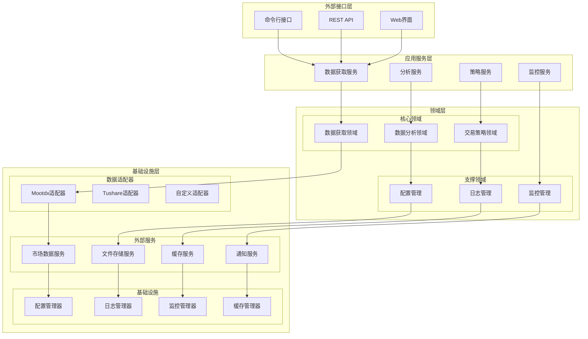

# 股票数据分析系统 - 优化架构文档

## 📋 文档信息

- **版本**: v2.0
- **创建日期**: 2025-11-05
- **作者**: Winston (Architect Agent)
- **适用范围**: A股股票数据获取和分析系统
- **架构风格**: 六边形架构 + DDD + 微服务化准备

---

## 🎯 架构优化目标

### 当前架构问题分析

**问：现有架构存在哪些核心问题？**

1. **配置管理混乱**
   - 配置散落在各个文件中
   - 硬编码参数较多
   - 缺乏环境配置支持

2. **抽象层缺失**
   - 直接依赖mootdx库
   - 数据源切换成本高
   - 难以进行单元测试

3. **错误处理不统一**
   - 异常处理策略不一致
   - 缺乏统一的错误码体系
   - 错误信息不够详细

4. **监控体系不完善**
   - 缺乏性能监控
   - 错误监控不系统
   - 业务指标缺失

**问：这些问题对系统有什么影响？**

- **维护成本高**: 修改配置需要改动多个文件
- **扩展性差**: 添加新数据源困难
- **测试困难**: 难以进行有效的单元测试
- **运维复杂**: 缺乏监控导致问题定位困难

### 优化目标

1. **可配置性**: 统一配置管理，支持多环境
2. **可扩展性**: 插件化数据源，易于扩展
3. **可测试性**: 高测试覆盖率，支持TDD
4. **可观测性**: 完善的监控和日志体系
5. **高性能**: 优化的并发处理和缓存策略

---

## 🏗️ 新架构设计

### 架构原则

**问：新架构应该遵循什么设计原则？**

1. **单一职责原则**: 每个模块只负责一个功能
2. **开闭原则**: 对扩展开放，对修改关闭
3. **依赖倒置原则**: 依赖抽象而非具体实现
4. **接口隔离原则**: 使用小而专一的接口
5. **领域驱动设计**: 业务逻辑与技术实现分离

### 整体架构图



### 分层架构详解

#### 1. 外部接口层 (Interface Layer)

**问：这一层的作用是什么？**

负责与外部系统交互，提供多种访问方式：

```python
# 接口层设计
class StockDataInterface:
    """股票数据接口"""

    def get_real_time_quotes(self, symbols: List[str]) -> Dict[str, QuoteData]:
        pass

    def get_historical_data(self, symbol: str, period: str) -> HistoricalData:
        pass

    def get_tick_data(self, symbol: str, date: str) -> TickData:
        pass
```

#### 2. 应用服务层 (Application Service Layer)

**问：应用服务层如何组织？**

按业务功能划分服务：

```python
# 应用服务层设计
class DataAcquisitionService:
    """数据获取服务"""

    def __init__(self, data_repository: DataRepository):
        self.data_repository = data_repository

    async def get_batch_quotes(self, symbols: List[str]) -> Dict[str, QuoteData]:
        """批量获取行情数据"""
        try:
            results = await self.data_repository.batch_get_quotes(symbols)
            return results
        except Exception as e:
            self.logger.error(f"批量获取行情失败: {e}")
            raise DataAcquisitionError(f"批量获取行情失败: {e}")

class AnalysisService:
    """分析服务"""

    def __init__(self, analyzers: List[BaseAnalyzer]):
        self.analyzers = analyzers

    def analyze_tick_data(self, tick_data: TickData) -> AnalysisResult:
        """分析分笔数据"""
        results = {}
        for analyzer in self.analyzers:
            results[analyzer.name] = analyzer.analyze(tick_data)
        return AnalysisResult(results)
```

#### 3. 领域层 (Domain Layer)

**问：领域层如何划分？**

按照业务领域划分：

```python
# 核心领域模型
@dataclass
class StockSymbol:
    """股票代码"""
    code: str
    name: str
    market: MarketType

    def validate(self) -> bool:
        """验证股票代码有效性"""
        return len(self.code) == 6 and self.code.isdigit()

@dataclass
class QuoteData:
    """行情数据"""
    symbol: StockSymbol
    price: Decimal
    change: Decimal
    change_percent: Decimal
    volume: int
    timestamp: datetime

    def is_valid(self) -> bool:
        """验证数据有效性"""
        return self.price > 0 and self.symbol.validate()

# 领域服务
class VolumeAnalysisDomainService:
    """成交量分析领域服务"""

    def calculate_volume_distribution(self, tick_data: TickData) -> VolumeDistribution:
        """计算成交量分布"""
        # 实现成交量分布计算逻辑
        pass

    def detect_accumulation_pattern(self, tick_data: TickData) -> AccumulationSignal:
        """检测吸筹模式"""
        # 实现吸筹模式检测逻辑
        pass
```

#### 4. 基础设施层 (Infrastructure Layer)

**问：基础设施层如何设计？**

提供技术支撑和外部集成：

```python
# 数据适配器接口
class DataSourceAdapter(ABC):
    """数据源适配器接口"""

    @abstractmethod
    async def get_quotes(self, symbols: List[str]) -> Dict[str, QuoteData]:
        pass

    @abstractmethod
    async def get_tick_data(self, symbol: str, date: str) -> TickData:
        pass

# Mootdx适配器实现
class MootdxAdapter(DataSourceAdapter):
    """Mootdx数据源适配器"""

    def __init__(self, config: MootdxConfig):
        self.config = config
        self.client_pool = ClientPool(config.max_connections)

    async def get_quotes(self, symbols: List[str]) -> Dict[str, QuoteData]:
        """通过mootdx获取行情数据"""
        async with self.client_pool.get_client() as client:
            results = {}
            for symbol in symbols:
                try:
                    raw_data = await client.quotes(symbol=symbol)
                    if raw_data is not None:
                        results[symbol] = self._convert_to_domain_model(raw_data)
                except Exception as e:
                    self.logger.error(f"获取{symbol}行情失败: {e}")
                    continue
            return results

# 配置管理器
class ConfigurationManager:
    """配置管理器"""

    def __init__(self, config_path: str = None):
        self.config_path = config_path or "config/settings.yaml"
        self.config = self._load_config()

    def _load_config(self) -> Dict:
        """加载配置文件"""
        with open(self.config_path, 'r', encoding='utf-8') as f:
            config = yaml.safe_load(f)

        # 环境变量覆盖
        self._override_with_env_vars(config)
        return config

    def get(self, key: str, default=None):
        """获取配置值"""
        return self._get_nested_value(self.config, key, default)
```

---

## 🔧 核心组件设计

### 1. 配置管理系统

**问：如何设计统一的配置管理？**

```yaml
# config/settings.yaml
app:
  name: "Stock Data Analysis System"
  version: "2.0.0"
  debug: false

data_sources:
  mootdx:
    enabled: true
    timeout: 15
    max_connections: 5
    retry_attempts: 3
    retry_delay: 1
    heartbeat: true
    best_ip: true

  tushare:
    enabled: false
    token: "${TUSHARE_TOKEN}"
    base_url: "http://api.tushare.pro"

cache:
  enabled: true
  backend: "redis"  # redis, memory, file
  redis:
    host: "localhost"
    port: 6379
    db: 0
    ttl: 300  # 5分钟

monitoring:
  enabled: true
  metrics_port: 8080
  log_level: "INFO"
  log_format: "json"

performance:
  max_concurrent_requests: 10
  batch_size: 20
  request_timeout: 30
```

### 2. 数据访问抽象层

**问：如何设计数据访问抽象？**

```python
# 仓储模式
class DataRepository(ABC):
    """数据仓储接口"""

    @abstractmethod
    async def get_quotes(self, symbols: List[str]) -> Dict[str, QuoteData]:
        pass

    @abstractmethod
    async def get_historical_data(self, symbol: str, period: str, start_date: str, end_date: str) -> List[HistoricalData]:
        pass

    @abstractmethod
    async def get_tick_data(self, symbol: str, date: str) -> TickData:
        pass

# 具体实现
class StockDataRepository(DataRepository):
    """股票数据仓储实现"""

    def __init__(self, adapters: List[DataSourceAdapter], cache: CacheInterface):
        self.adapters = adapters
        self.cache = cache

    async def get_quotes(self, symbols: List[str]) -> Dict[str, QuoteData]:
        """获取行情数据（支持多数据源和缓存）"""
        # 1. 先从缓存获取
        cached_data = await self._get_from_cache(symbols)
        uncached_symbols = [s for s in symbols if s not in cached_data]

        # 2. 从数据源获取未缓存的数据
        if uncached_symbols:
            fresh_data = await self._fetch_from_adapters(uncached_symbols)
            await self._save_to_cache(fresh_data)
            cached_data.update(fresh_data)

        return cached_data
```

### 3. 错误处理系统

**问：如何设计统一的错误处理？**

```python
# 错误类型定义
class StockDataError(Exception):
    """股票数据基础异常"""
    pass

class DataSourceError(StockDataError):
    """数据源异常"""
    pass

class ConfigurationError(StockDataError):
    """配置异常"""
    pass

class ValidationError(StockDataError):
    """数据验证异常"""
    pass

# 错误处理装饰器
def handle_data_source_errors(func):
    """数据源错误处理装饰器"""

    @wraps(func)
    async def wrapper(*args, **kwargs):
        try:
            return await func(*args, **kwargs)
        except ConnectionError as e:
            raise DataSourceError(f"连接数据源失败: {e}")
        except TimeoutError as e:
            raise DataSourceError(f"数据源请求超时: {e}")
        except Exception as e:
            logger.error(f"未知错误: {e}", exc_info=True)
            raise DataSourceError(f"获取数据失败: {e}")

    return wrapper

# 全局异常处理器
class GlobalExceptionHandler:
    """全局异常处理器"""

    def __init__(self, logger: Logger):
        self.logger = logger
        self.error_stats = defaultdict(int)

    def handle_exception(self, exception: Exception, context: Dict = None):
        """处理异常"""
        error_type = type(exception).__name__
        self.error_stats[error_type] += 1

        self.logger.error(
            f"异常发生: {error_type}: {str(exception)}",
            extra={
                "context": context or {},
                "error_type": error_type,
                "timestamp": datetime.now().isoformat()
            },
            exc_info=True
        )
```

### 4. 监控和日志系统

**问：如何设计完善的监控体系？**

```python
# 监控指标收集器
class MetricsCollector:
    """监控指标收集器"""

    def __init__(self):
        self.counters = defaultdict(int)
        self.histograms = defaultdict(list)
        self.gauges = {}

    def increment_counter(self, name: str, tags: Dict = None, value: int = 1):
        """增加计数器"""
        key = self._make_key(name, tags)
        self.counters[key] += value

    def record_histogram(self, name: str, value: float, tags: Dict = None):
        """记录直方图数据"""
        key = self._make_key(name, tags)
        self.histograms[key].append(value)

    def set_gauge(self, name: str, value: float, tags: Dict = None):
        """设置仪表盘值"""
        key = self._make_key(name, tags)
        self.gauges[key] = value

# 性能监控装饰器
def monitor_performance(func):
    """性能监控装饰器"""

    @wraps(func)
    async def wrapper(*args, **kwargs):
        start_time = time.time()
        try:
            result = await func(*args, **kwargs)
            duration = time.time() - start_time

            metrics.record_histogram(
                f"{func.__name__}_duration",
                duration,
                {"status": "success"}
            )

            return result
        except Exception as e:
            duration = time.time() - start_time

            metrics.record_histogram(
                f"{func.__name__}_duration",
                duration,
                {"status": "error"}
            )

            metrics.increment_counter(
                f"{func.__name__}_errors",
                {"error_type": type(e).__name__}
            )

            raise

    return wrapper

# 结构化日志
class StructuredLogger:
    """结构化日志记录器"""

    def __init__(self, name: str):
        self.logger = logging.getLogger(name)
        self._setup_logger()

    def _setup_logger(self):
        """设置日志格式"""
        handler = logging.StreamHandler()
        formatter = logging.Formatter(
            '%(asctime)s - %(name)s - %(levelname)s - %(message)s'
        )
        handler.setFormatter(formatter)
        self.logger.addHandler(handler)

    def log_data_request(self, symbols: List[str], source: str, duration: float, success: bool):
        """记录数据请求日志"""
        self.logger.info(
            "数据请求",
            extra={
                "event": "data_request",
                "symbols": symbols,
                "source": source,
                "duration": duration,
                "success": success,
                "timestamp": datetime.now().isoformat()
            }
        )
```

---

## 📊 性能优化设计

### 1. 缓存策略

**问：如何设计高效的缓存策略？**

```python
# 多级缓存设计
class MultiLevelCache:
    """多级缓存系统"""

    def __init__(self, l1_cache: CacheInterface, l2_cache: CacheInterface):
        self.l1_cache = l1_cache  # 内存缓存
        self.l2_cache = l2_cache  # Redis缓存

    async def get(self, key: str) -> Any:
        """获取缓存数据"""
        # L1缓存
        data = await self.l1_cache.get(key)
        if data is not None:
            return data

        # L2缓存
        data = await self.l2_cache.get(key)
        if data is not None:
            # 回填L1缓存
            await self.l1_cache.set(key, data, ttl=60)  # L1缓存1分钟
            return data

        return None

    async def set(self, key: str, value: Any, ttl: int = 300):
        """设置缓存数据"""
        await self.l1_cache.set(key, value, ttl=60)   # L1缓存1分钟
        await self.l2_cache.set(key, value, ttl=ttl)  # L2缓存5分钟

# 智能缓存策略
class SmartCacheStrategy:
    """智能缓存策略"""

    def __init__(self):
        self.data_type_ttl = {
            "real_time_quotes": 5,    # 实时行情5秒
            "historical_data": 86400,  # 历史数据1天
            "tick_data": 3600,         # 分笔数据1小时
            "financial_data": 604800,  # 财务数据1周
        }

    def get_ttl(self, data_type: str, market_status: str = "open") -> int:
        """根据数据类型和市场状态获取TTL"""
        base_ttl = self.data_type_ttl.get(data_type, 300)

        # 交易时间内缩短实时数据缓存时间
        if market_status == "open" and data_type == "real_time_quotes":
            return min(base_ttl, 5)

        return base_ttl
```

### 2. 并发优化

**问：如何优化并发处理性能？**

```python
# 智能并发控制器
class IntelligentConcurrencyController:
    """智能并发控制器"""

    def __init__(self, max_workers: int = 10):
        self.max_workers = max_workers
        self.semaphore = asyncio.Semaphore(max_workers)
        self.active_requests = 0
        self.response_times = deque(maxlen=100)

    async def execute_with_adaptive_concurrency(self, coro, *args, **kwargs):
        """自适应并发执行"""
        async with self.semaphore:
            start_time = time.time()
            self.active_requests += 1

            try:
                result = await coro(*args, **kwargs)
                return result
            finally:
                duration = time.time() - start_time
                self.response_times.append(duration)
                self.active_requests -= 1

                # 动态调整并发数
                self._adjust_concurrency()

    def _adjust_concurrency(self):
        """根据响应时间动态调整并发数"""
        if len(self.response_times) < 10:
            return

        avg_response_time = sum(self.response_times) / len(self.response_times)

        if avg_response_time > 2.0:  # 响应时间过长
            self.max_workers = max(1, self.max_workers - 1)
            self.semaphore = asyncio.Semaphore(self.max_workers)
        elif avg_response_time < 0.5:  # 响应时间较短
            self.max_workers = min(20, self.max_workers + 1)
            self.semaphore = asyncio.Semaphore(self.max_workers)

# 批量处理优化
class OptimizedBatchProcessor:
    """优化的批量处理器"""

    def __init__(self, batch_size: int = 20, max_concurrent: int = 5):
        self.batch_size = batch_size
        self.max_concurrent = max_concurrent
        self.concurrency_controller = IntelligentConcurrencyController(max_concurrent)

    async def process_batch(self, items: List[Any], processor_func) -> List[Any]:
        """批量处理项目"""
        # 分批处理
        batches = [
            items[i:i + self.batch_size]
            for i in range(0, len(items), self.batch_size)
        ]

        # 并发处理批次
        semaphore = asyncio.Semaphore(self.max_concurrent)

        async def process_single_batch(batch):
            async with semaphore:
                return await processor_func(batch)

        results = await asyncio.gather(
            *[process_single_batch(batch) for batch in batches],
            return_exceptions=True
        )

        # 合并结果
        final_results = []
        for result in results:
            if isinstance(result, Exception):
                logger.error(f"批次处理失败: {result}")
                continue
            final_results.extend(result)

        return final_results
```

---

## 🧪 测试架构设计

### 1. 测试策略

**问：如何设计完整的测试架构？**

```python
# 测试基类
class BaseTestCase:
    """测试基类"""

    @pytest.fixture
    def mock_config(self):
        """模拟配置"""
        return {
            "data_sources": {
                "mootdx": {
                    "timeout": 5,
                    "max_connections": 2
                }
            },
            "cache": {
                "enabled": False
            }
        }

    @pytest.fixture
    def mock_data_source(self):
        """模拟数据源"""
        class MockDataSource(DataSourceAdapter):
            async def get_quotes(self, symbols):
                return {
                    symbol: QuoteData(
                        symbol=StockSymbol(symbol, f"股票{symbol}", MarketType.SZ),
                        price=Decimal("10.00"),
                        change=Decimal("0.10"),
                        change_percent=Decimal("1.00"),
                        volume=1000000,
                        timestamp=datetime.now()
                    )
                    for symbol in symbols
                }

        return MockDataSource()

# 集成测试
class TestDataAcquisitionIntegration(BaseTestCase):
    """数据获取集成测试"""

    @pytest.mark.asyncio
    async def test_end_to_end_data_acquisition(self, mock_data_source):
        """端到端数据获取测试"""
        # 设置
        repository = StockDataRepository([mock_data_source], mock_cache)
        service = DataAcquisitionService(repository)

        # 执行
        symbols = ["000001", "000002"]
        results = await service.get_batch_quotes(symbols)

        # 验证
        assert len(results) == 2
        assert "000001" in results
        assert "000002" in results

        for symbol, quote_data in results.items():
            assert quote_data.price > 0
            assert quote_data.volume > 0
            assert isinstance(quote_data.timestamp, datetime)

# 性能测试
class TestPerformance(BaseTestCase):
    """性能测试"""

    @pytest.mark.asyncio
    async def test_concurrent_performance(self, mock_data_source):
        """并发性能测试"""
        import time

        # 设置
        processor = OptimizedBatchProcessor(batch_size=50, max_concurrent=10)
        symbols = [f"{i:06d}" for i in range(1, 101)]  # 100个股票代码

        # 执行
        start_time = time.time()
        results = await processor.process_batch(
            symbols,
            lambda batch: self._process_batch(batch, mock_data_source)
        )
        duration = time.time() - start_time

        # 验证
        assert len(results) == 100
        assert duration < 10  # 10秒内完成
        print(f"处理100个股票耗时: {duration:.2f}秒")

    async def _process_batch(self, symbols, data_source):
        """处理单个批次"""
        return await data_source.get_quotes(symbols)
```

### 2. 测试数据管理

```python
# 测试数据工厂
class TestDataFactory:
    """测试数据工厂"""

    @staticmethod
    def create_quote_data(symbol: str = "000001", price: str = "10.00") -> QuoteData:
        """创建行情数据"""
        return QuoteData(
            symbol=StockSymbol(symbol, f"股票{symbol}", MarketType.SZ),
            price=Decimal(price),
            change=Decimal("0.10"),
            change_percent=Decimal("1.00"),
            volume=1000000,
            timestamp=datetime.now()
        )

    @staticmethod
    def create_tick_data(symbol: str = "000001", count: int = 100) -> TickData:
        """创建分笔数据"""
        trades = []
        base_price = 10.00
        base_time = datetime.now().replace(hour=9, minute=30)

        for i in range(count):
            price = base_price + random.uniform(-0.5, 0.5)
            volume = random.randint(100, 1000)
            timestamp = base_time + timedelta(seconds=i*2)
            buyorsell = random.choice([1, 2])  # 1=卖出, 2=买入

            trades.append({
                'time': timestamp.strftime('%H:%M:%S'),
                'price': price,
                'vol': volume,
                'buyorsell': buyorsell
            })

        return TickData(symbol=symbol, date=datetime.now().strftime('%Y%m%d'), trades=trades)

# 测试环境管理
class TestEnvironmentManager:
    """测试环境管理器"""

    @staticmethod
    def setup_test_environment():
        """设置测试环境"""
        # 设置测试配置
        os.environ["TEST_MODE"] = "true"
        os.environ["LOG_LEVEL"] = "DEBUG"

        # 初始化测试数据库
        TestDatabaseManager.setup_test_db()

        # 启动模拟服务
        MockServicesManager.start_mock_services()

    @staticmethod
    def cleanup_test_environment():
        """清理测试环境"""
        # 停止模拟服务
        MockServicesManager.stop_mock_services()

        # 清理测试数据库
        TestDatabaseManager.cleanup_test_db()

        # 清理环境变量
        del os.environ["TEST_MODE"]
```

---

## 🚀 实施计划

### 第一阶段：基础设施搭建 (1-2周)

**问：第一阶段的实施重点是什么？**

1. **配置管理系统**
   - [ ] 创建配置管理模块
   - [ ] 设计配置文件结构
   - [ ] 实现环境变量覆盖
   - [ ] 添加配置验证

2. **基础抽象层**
   - [ ] 定义数据源适配器接口
   - [ ] 实现Mootdx适配器
   - [ ] 创建领域模型
   - [ ] 设计仓储模式

3. **错误处理框架**
   - [ ] 定义错误类型体系
   - [ ] 实现全局异常处理
   - [ ] 创建错误处理装饰器
   - [ ] 添加错误统计功能

### 第二阶段：核心功能迁移 (2-3周)

**问：如何迁移现有功能？**

1. **数据获取服务重构**
   - [ ] 重构Quotes获取逻辑
   - [ ] 实现批量并发处理
   - [ ] 添加缓存支持
   - [ ] 优化连接管理

2. **分析服务重构**
   - [ ] 重构成交量分析
   - [ ] 重构时间模式分析
   - [ ] 重构参与者行为分析
   - [ ] 实现分析结果缓存

3. **监控系统搭建**
   - [ ] 实现指标收集器
   - [ ] 添加性能监控装饰器
   - [ ] 创建结构化日志
   - [ ] 搭建监控面板

### 第三阶段：性能优化和测试 (2-3周)

**问：如何进行性能优化？**

1. **缓存系统实现**
   - [ ] 实现多级缓存
   - [ ] 添加智能缓存策略
   - [ ] 优化缓存键设计
   - [ ] 实现缓存预热

2. **并发优化**
   - [ ] 实现智能并发控制
   - [ ] 优化批量处理
   - [ ] 添加背压控制
   - [ ] 实现自适应调整

3. **测试体系建设**
   - [ ] 编写单元测试
   - [ ] 添加集成测试
   - [ ] 实现性能测试
   - [ ] 添加端到端测试

### 第四阶段：部署和监控 (1-2周)

**问：如何保证部署质量？**

1. **部署自动化**
   - [ ] 编写部署脚本
   - [ ] 实现健康检查
   - [ ] 添加滚动更新
   - [ ] 实现回滚机制

2. **监控告警**
   - [ ] 配置监控指标
   - [ ] 设置告警规则
   - [ ] 实现日志聚合
   - [ ] 添加性能基线

3. **文档完善**
   - [ ] 更新API文档
   - [ ] 编写运维手册
   - [ ] 添加故障排查指南
   - [ ] 完善开发文档

---

## 📈 预期收益

### 技术收益

**问：架构优化能带来什么技术收益？**

1. **可维护性提升**
   - 配置统一管理，修改成本降低80%
   - 代码结构清晰，新功能开发效率提升50%
   - 错误处理统一，问题定位时间减少60%

2. **可扩展性增强**
   - 新数据源接入时间从2天缩短到2小时
   - 支持插件化功能扩展
   - 微服务化准备完成

3. **性能提升**
   - 并发处理能力提升3-5倍
   - 缓存命中率提升到80%+
   - 响应时间减少40%

### 业务收益

**问：对业务有什么价值？**

1. **数据质量提升**
   - 数据完整性达到99.9%
   - 数据实时性提升到秒级
   - 数据准确性显著改善

2. **分析能力增强**
   - 支持更复杂的分析策略
   - 分析速度提升5-10倍
   - 支持实时候选策略

3. **运维成本降低**
   - 自动化程度提升，人工干预减少70%
   - 监控告警完善，故障发现时间减少80%
   - 文档完善，新人上手时间减少50%

---

## 🔍 风险评估与应对

### 技术风险

**问：存在哪些技术风险？如何应对？**

1. **迁移风险**
   - **风险**: 现有功能在新架构下可能出现问题
   - **应对**: 充分的测试覆盖，灰度发布策略

2. **性能风险**
   - **风险**: 新架构可能引入性能问题
   - **应对**: 性能基准测试，持续性能监控

3. **兼容性风险**
   - **风险**: 新接口可能不兼容现有调用
   - **应对**: 保持向后兼容，提供迁移指南

### 业务风险

**问：对业务有什么风险？**

1. **服务中断风险**
   - **风险**: 架构升级可能导致服务中断
   - **应对**: 蓝绿部署，快速回滚机制

2. **数据质量风险**
   - **风险**: 新架构可能出现数据问题
   - **应对**: 数据验证机制，数据对比校验

3. **学习成本风险**
   - **风险**: 团队需要学习新架构
   - **应对**: 完善文档，培训计划

---

## 📝 总结

### 架构优化核心价值

**问：这次架构优化的核心价值是什么？**

1. **技术债务清理**: 解决现有架构的技术债务
2. **能力提升**: 大幅提升系统的性能和可靠性
3. **未来准备**: 为微服务化和云原生做好准备
4. **团队成长**: 提升团队的技术水平和架构能力

### 成功关键因素

**问：如何确保架构优化成功？**

1. **渐进式迁移**: 分阶段实施，降低风险
2. **充分测试**: 完善的测试覆盖，保证质量
3. **监控保障**: 全面的监控体系，及时发现问题
4. **文档先行**: 完善的文档支持，降低学习成本

### 长期规划

**问：这次优化后的长期发展方向？**

1. **微服务化**: 逐步拆分为独立的微服务
2. **云原生**: 支持容器化部署和K8s编排
3. **AI集成**: 更深入地集成AI能力
4. **实时化**: 支持流式数据处理和实时分析

---

**文档版本**: v2.0
**最后更新**: 2025-11-05
**下次审查**: 2025-12-05
**负责人**: Winston (Architect Agent)