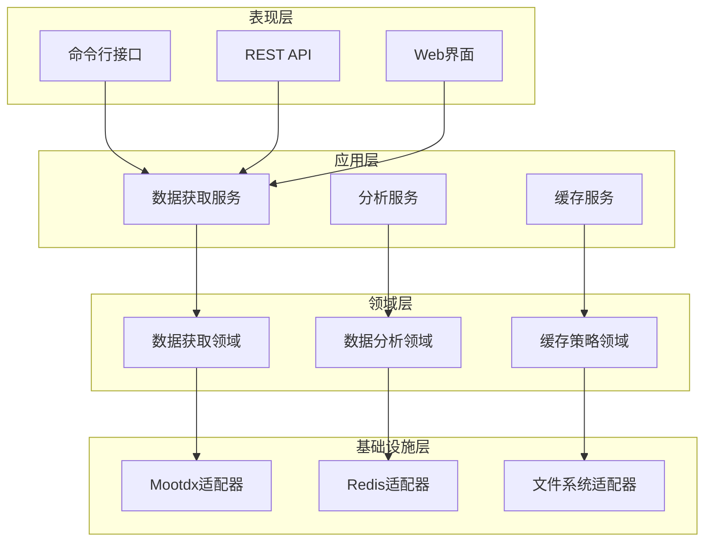
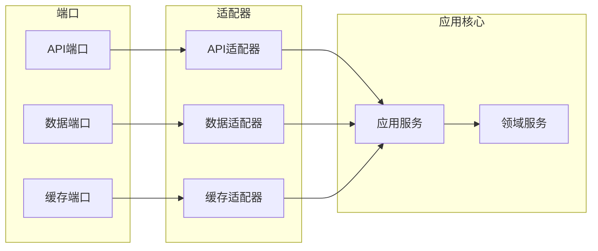
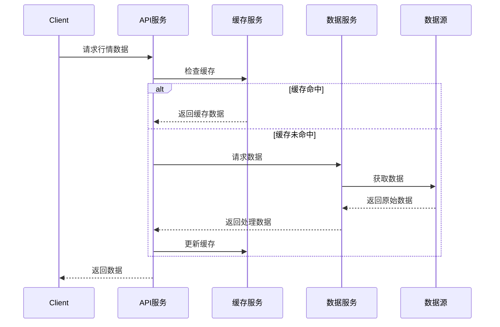
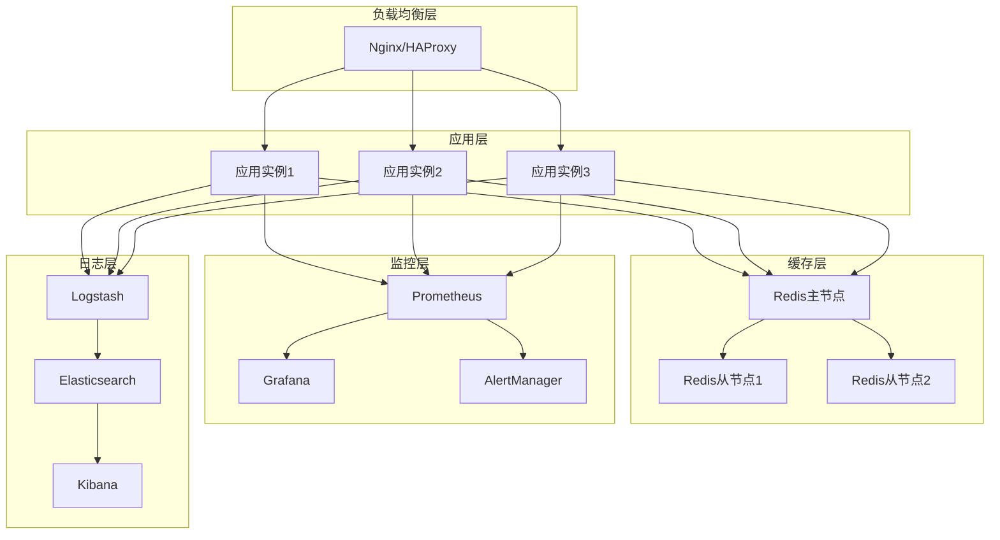
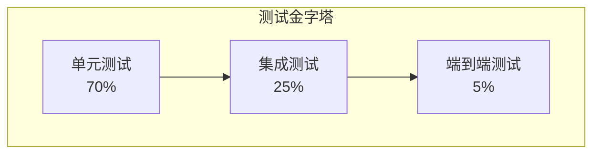

# 股票数据分析系统 - 标准架构文档

## 📋 文档信息

| 项目 | 内容 |
|------|------|
| **文档版本** | v1.0 |
| **创建日期** | 2025-11-05 |
| **作者** | Winston (Architect Agent) |
| **审批状态** | 草稿 |
| **适用范围** | 股票数据分析系统架构设计 |
| **架构风格** | 分层架构 + 六边形架构 |

---

## 1. 引言

### 1.1 文档目的

本文档定义了股票数据分析系统的整体架构设计，为系统开发、部署和维护提供技术指导。

### 1.2 项目背景

本项目旨在构建一个高性能、可扩展的股票数据获取和分析系统，支持实时行情、历史数据、分笔数据的获取和处理。

### 1.3 范围

**包含范围：**
- 股票数据获取模块
- 数据分析和处理模块
- 缓存和存储系统
- API接口层
- 监控和日志系统

**不包含范围：**
- 前端用户界面
- 交易执行系统
- 风控系统
- 第三方数据源集成

### 1.4 目标读者

- 架构师
- 技术负责人
- 开发工程师
- 测试工程师
- 运维工程师

---

## 2. 系统概述

### 2.1 业务目标

| 业务目标 | 优先级 | 度量指标 |
|----------|--------|----------|
| 提高数据获取效率 | 高 | 响应时间 < 500ms |
| 支持大规模并发 | 高 | 支持 1000+ 并发请求 |
| 提升系统稳定性 | 中 | 可用性 > 99.9% |
| 降低维护成本 | 中 | 减少 60% 人工维护 |

### 2.2 功能需求

#### 2.2.1 核心功能

| 功能模块 | 功能描述 | 优先级 |
|----------|----------|--------|
| 数据获取 | 实时行情、历史数据、分笔数据 | 高 |
| 数据处理 | 数据清洗、格式转换、验证 | 高 |
| 缓存管理 | 多级缓存、智能策略 | 中 |
| 监控告警 | 性能监控、错误告警 | 中 |

#### 2.2.2 非功能性需求

| 需求类别 | 具体要求 | 验收标准 |
|----------|----------|----------|
| **性能** | API响应时间 | P95 < 500ms, P99 < 1000ms |
| **性能** | 并发处理能力 | 支持 1000+ 并发请求 |
| **可用性** | 系统可用性 | > 99.9% (月度) |
| **可扩展性** | 水平扩展能力 | 支持线性扩展到10+节点 |
| **安全性** | 数据传输安全 | HTTPS/TLS加密 |
| **安全性** | 访问控制 | API认证和授权 |

### 2.3 约束条件

#### 2.3.1 技术约束

- **编程语言**: Python 3.12+
- **框架限制**: 必须支持mootdx库
- **数据库**: Redis缓存，文件存储
- **部署环境**: Docker容器化

#### 2.3.2 业务约束

- **交易时间限制**: 实时数据仅在交易时间可用
- **数据源限制**: 仅支持A股市场数据
- **合规要求**: 遵循金融数据使用规范

---

## 3. 架构设计

### 3.1 架构原则

1. **单一职责原则** - 每个组件只负责一个明确的功能
2. **开闭原则** - 对扩展开放，对修改关闭
3. **依赖倒置原则** - 依赖抽象接口，不依赖具体实现
4. **高内聚低耦合** - 组件内部高度内聚，组件之间松散耦合

### 3.2 架构模式选择

#### 3.2.1 分层架构



#### 3.2.2 六边形架构



### 3.3 组件设计

#### 3.3.1 数据获取组件

```python
# 组件接口定义
class DataSourceInterface(ABC):
    """数据源接口"""

    @abstractmethod
    async def get_quotes(self, symbols: List[str]) -> Dict[str, QuoteData]:
        """获取行情数据"""
        pass

    @abstractmethod
    async def get_tick_data(self, symbol: str, date: str) -> TickData:
        """获取分笔数据"""
        pass

# 组件实现
class MootdxDataSource(DataSourceInterface):
    """Mootdx数据源实现"""

    def __init__(self, config: MootdxConfig):
        self.config = config
        self.client_pool = ClientPool(config.max_connections)

    async def get_quotes(self, symbols: List[str]) -> Dict[str, QuoteData]:
        # 具体实现
        pass
```

#### 3.3.2 缓存组件

```python
class CacheInterface(ABC):
    """缓存接口"""

    @abstractmethod
    async def get(self, key: str) -> Optional[Any]:
        pass

    @abstractmethod
    async def set(self, key: str, value: Any, ttl: int) -> None:
        pass

class MultiLevelCache(CacheInterface):
    """多级缓存实现"""

    def __init__(self, l1_cache: CacheInterface, l2_cache: CacheInterface):
        self.l1_cache = l1_cache  # 内存缓存
        self.l2_cache = l2_cache  # Redis缓存
```

### 3.4 数据模型

#### 3.4.1 核心数据模型

```python
@dataclass
class StockSymbol:
    """股票代码"""
    code: str
    name: str
    market: MarketType

    def validate(self) -> bool:
        return len(self.code) == 6 and self.code.isdigit()

@dataclass
class QuoteData:
    """行情数据"""
    symbol: StockSymbol
    price: Decimal
    change: Decimal
    change_percent: Decimal
    volume: int
    timestamp: datetime

    def to_dict(self) -> Dict:
        return {
            'symbol': self.symbol.code,
            'name': self.symbol.name,
            'price': float(self.price),
            'change': float(self.change),
            'change_percent': float(self.change_percent),
            'volume': self.volume,
            'timestamp': self.timestamp.isoformat()
        }
```

#### 3.4.2 数据流图



---

## 4. 技术选型

### 4.1 技术选型标准

| 评估维度 | 权重 | 说明 |
|----------|------|------|
| 成熟度 | 30% | 技术的稳定性和社区支持 |
| 性能 | 25% | 执行效率和资源消耗 |
| 可维护性 | 20% | 代码可读性和维护成本 |
| 学习成本 | 15% | 团队上手难度 |
| 生态支持 | 10% | 第三方库和工具支持 |

### 4.2 核心技术栈

#### 4.2.1 后端技术

| 技术类别 | 选用技术 | 版本 | 选型理由 |
|----------|----------|------|----------|
| **编程语言** | Python | 3.12+ | 生态丰富，数据分析能力强 |
| **Web框架** | FastAPI | 0.104+ | 高性能，自动文档生成 |
| **异步框架** | asyncio | 内置 | 原生异步支持 |
| **数据获取** | mootdx | 0.11.7 | 项目现有依赖，功能完整 |
| **数据处理** | pandas | 2.0+ | 数据分析标准库 |
| **缓存** | Redis | 7.0+ | 高性能内存数据库 |

#### 4.2.2 基础设施

| 技术类别 | 选用技术 | 版本 | 选型理由 |
|----------|----------|------|----------|
| **容器化** | Docker | 24.0+ | 标准化部署 |
| **编排** | Docker Compose | 2.0+ | 简化多容器管理 |
| **监控** | Prometheus | 2.40+ | 时间序列数据库 |
| **可视化** | Grafana | 10.0+ | 监控面板 |
| **日志** | ELK Stack | 8.0+ | 日志聚合分析 |

### 4.3 技术对比分析

#### 4.3.1 Web框架对比

| 框架 | 性能 | 学习成本 | 生态 | 文档质量 | 总分 |
|------|------|----------|------|----------|------|
| FastAPI | 9 | 7 | 8 | 9 | 8.4 |
| Flask | 7 | 9 | 9 | 8 | 8.1 |
| Django | 6 | 5 | 10 | 9 | 7.6 |

**结论**: 选择FastAPI，性能优势明显，学习成本适中。

#### 4.3.2 缓存方案对比

| 方案 | 性能 | 可靠性 | 扩展性 | 成本 | 总分 |
|------|------|--------|--------|------|------|
| Redis | 9 | 8 | 9 | 7 | 8.4 |
| Memcached | 9 | 7 | 7 | 8 | 7.8 |
| 本地缓存 | 10 | 6 | 4 | 10 | 7.6 |

**结论**: 选择Redis，在性能、可靠性和扩展性之间达到平衡。

---

## 5. 接口设计

### 5.1 API设计原则

1. **RESTful设计** - 遵循REST架构风格
2. **版本控制** - 通过URL路径进行版本控制
3. **统一响应格式** - 标准化的JSON响应结构
4. **错误处理** - 标准化的错误码和错误信息

### 5.2 API接口定义

#### 5.2.1 行情数据接口

```http
GET /api/v1/quotes?symbols={symbols}
```

**请求参数:**
- symbols: 股票代码列表，逗号分隔

**响应示例:**
```json
{
  "code": 200,
  "message": "success",
  "data": {
    "000001": {
      "symbol": "000001",
      "name": "平安银行",
      "price": 10.50,
      "change": 0.10,
      "change_percent": 0.96,
      "volume": 1000000,
      "timestamp": "2025-11-05T10:30:00Z"
    }
  },
  "timestamp": "2025-11-05T10:30:01Z"
}
```

#### 5.2.2 分笔数据接口

```http
GET /api/v1/ticks/{symbol}?date={date}&offset={offset}&limit={limit}
```

**请求参数:**
- symbol: 股票代码
- date: 交易日期 (YYYYMMDD)
- offset: 偏移量，默认0
- limit: 返回条数，默认100

### 5.3 数据模型定义

#### 5.3.1 通用响应模型

```python
from pydantic import BaseModel
from typing import Optional, Any
from datetime import datetime

class ApiResponse(BaseModel):
    """API响应模型"""
    code: int
    message: str
    data: Optional[Any] = None
    timestamp: datetime

    class Config:
        json_encoders = {
            datetime: lambda v: v.isoformat()
        }
```

#### 5.3.2 行情数据模型

```python
class QuoteData(BaseModel):
    """行情数据模型"""
    symbol: str
    name: str
    price: float
    change: float
    change_percent: float
    volume: int
    timestamp: datetime
```

---

## 6. 部署架构

### 6.1 部署拓扑



### 6.2 容器化配置

#### 6.2.1 Dockerfile

```dockerfile
FROM python:3.12-slim

WORKDIR /app

# 安装系统依赖
RUN apt-get update && apt-get install -y \
    gcc \
    && rm -rf /var/lib/apt/lists/*

# 复制依赖文件
COPY requirements.txt .
RUN pip install --no-cache-dir -r requirements.txt

# 复制应用代码
COPY . .

# 创建非root用户
RUN useradd --create-home --shell /bin/bash app \
    && chown -R app:app /app
USER app

# 暴露端口
EXPOSE 8000

# 健康检查
HEALTHCHECK --interval=30s --timeout=3s --start-period=5s --retries=3 \
    CMD curl -f http://localhost:8000/health || exit 1

# 启动命令
CMD ["uvicorn", "main:app", "--host", "0.0.0.0", "--port", "8000"]
```

#### 6.2.2 Docker Compose

```yaml
version: '3.8'

services:
  app:
    build: .
    ports:
      - "8000:8000"
    environment:
      - REDIS_URL=redis://redis:6379
      - LOG_LEVEL=INFO
      - WORKERS=4
    depends_on:
      - redis
    restart: unless-stopped
    deploy:
      replicas: 3
      resources:
        limits:
          cpus: '1.0'
          memory: 512M
        reservations:
          cpus: '0.5'
          memory: 256M

  redis:
    image: redis:7-alpine
    ports:
      - "6379:6379"
    volumes:
      - redis_data:/data
    restart: unless-stopped
    deploy:
      resources:
        limits:
          cpus: '0.5'
          memory: 256M

  nginx:
    image: nginx:alpine
    ports:
      - "80:80"
      - "443:443"
    volumes:
      - ./nginx/nginx.conf:/etc/nginx/nginx.conf
      - ./nginx/ssl:/etc/nginx/ssl
    depends_on:
      - app
    restart: unless-stopped

  prometheus:
    image: prom/prometheus
    ports:
      - "9090:9090"
    volumes:
      - ./monitoring/prometheus.yml:/etc/prometheus/prometheus.yml
      - prometheus_data:/prometheus
    restart: unless-stopped

  grafana:
    image: grafana/grafana
    ports:
      - "3000:3000"
    environment:
      - GF_SECURITY_ADMIN_PASSWORD=admin
    volumes:
      - grafana_data:/var/lib/grafana
      - ./monitoring/grafana:/etc/grafana/provisioning
    restart: unless-stopped

volumes:
  redis_data:
  prometheus_data:
  grafana_data:
```

### 6.3 扩展性设计

#### 6.3.1 水平扩展策略

```yaml
# Kubernetes部署配置示例
apiVersion: apps/v1
kind: Deployment
metadata:
  name: stock-analysis-app
spec:
  replicas: 3
  selector:
    matchLabels:
      app: stock-analysis-app
  template:
    metadata:
      labels:
        app: stock-analysis-app
    spec:
      containers:
      - name: app
        image: stock-analysis-system:latest
        ports:
        - containerPort: 8000
        env:
        - name: REDIS_URL
          value: "redis://redis-service:6379"
        resources:
          requests:
            memory: "256Mi"
            cpu: "250m"
          limits:
            memory: "512Mi"
            cpu: "500m"
        livenessProbe:
          httpGet:
            path: /health
            port: 8000
          initialDelaySeconds: 30
          periodSeconds: 10
        readinessProbe:
          httpGet:
            path: /ready
            port: 8000
          initialDelaySeconds: 5
          periodSeconds: 5
---
apiVersion: v1
kind: Service
metadata:
  name: stock-analysis-service
spec:
  selector:
    app: stock-analysis-app
  ports:
  - port: 80
    targetPort: 8000
  type: LoadBalancer
```

---

## 7. 监控和运维

### 7.1 监控指标

#### 7.1.1 系统指标

| 指标名称 | 类型 | 描述 | 告警阈值 |
|----------|------|------|----------|
| cpu_usage | Gauge | CPU使用率 | > 80% |
| memory_usage | Gauge | 内存使用率 | > 85% |
| disk_usage | Gauge | 磁盘使用率 | > 90% |
| network_io | Counter | 网络I/O | - |

#### 7.1.2 应用指标

| 指标名称 | 类型 | 描述 | 告警阈值 |
|----------|------|------|----------|
| http_requests_total | Counter | HTTP请求总数 | - |
| http_request_duration | Histogram | HTTP请求延迟 | P95 > 1s |
| http_requests_errors | Counter | HTTP错误数 | 错误率 > 5% |
| cache_hit_rate | Gauge | 缓存命中率 | < 80% |

### 7.2 告警规则

```yaml
# prometheus告警规则
groups:
  - name: stock-analysis-alerts
    rules:
      - alert: HighErrorRate
        expr: rate(http_requests_total{status=~"5.."}[5m]) / rate(http_requests_total[5m]) > 0.05
        for: 2m
        labels:
          severity: warning
        annotations:
          summary: "错误率过高"
          description: "错误率超过5%，当前值: {{ $value }}"

      - alert: HighResponseTime
        expr: histogram_quantile(0.95, rate(http_request_duration_seconds_bucket[5m])) > 1
        for: 5m
        labels:
          severity: critical
        annotations:
          summary: "响应时间过长"
          description: "95%分位响应时间超过1秒，当前值: {{ $value }}s"

      - alert: LowCacheHitRate
        expr: cache_hit_rate < 0.8
        for: 10m
        labels:
          severity: warning
        annotations:
          summary: "缓存命中率过低"
          description: "缓存命中率低于80%，当前值: {{ $value }}"
```

### 7.3 日志管理

#### 7.3.1 日志格式

```json
{
  "timestamp": "2025-11-05T10:30:00Z",
  "level": "INFO",
  "logger": "stock_analysis.services.data_acquisition",
  "message": "批量获取行情数据成功",
  "context": {
    "symbols": ["000001", "000002"],
    "source": "mootdx",
    "duration": 0.25,
    "count": 2
  },
  "trace_id": "abc123",
  "span_id": "def456"
}
```

#### 7.3.2 日志收集配置

```yaml
# filebeat配置
filebeat.inputs:
- type: log
  enabled: true
  paths:
    - /app/logs/*.log
  json.keys_under_root: true
  json.add_error_key: true
  fields:
    service: stock-analysis
    environment: production

output.elasticsearch:
  hosts: ["elasticsearch:9200"]
  index: "stock-analysis-%{+yyyy.MM.dd}"

setup.kibana:
  host: "kibana:5601"
```

---

## 8. 安全设计

### 8.1 安全威胁分析

| 威胁类型 | 风险等级 | 影响 | 防护措施 |
|----------|----------|------|----------|
| SQL注入 | 低 | 数据泄露 | 参数化查询 |
| XSS攻击 | 中 | 用户数据泄露 | 输入验证、输出编码 |
| CSRF攻击 | 中 | 未授权操作 | CSRF Token |
| DDoS攻击 | 高 | 服务不可用 | 限流、WAF |
| 数据泄露 | 高 | 敏感信息泄露 | 加密存储、访问控制 |

### 8.2 安全措施

#### 8.2.1 认证和授权

```python
from fastapi import Depends, HTTPException, status
from fastapi.security import HTTPBearer, HTTPAuthorizationCredentials
import jwt

security = HTTPBearer()

async def verify_token(credentials: HTTPAuthorizationCredentials = Depends(security)):
    try:
        payload = jwt.decode(credentials.credentials, SECRET_KEY, algorithms=[ALGORITHM])
        username: str = payload.get("sub")
        if username is None:
            raise HTTPException(
                status_code=status.HTTP_401_UNAUTHORIZED,
                detail="Invalid token"
            )
        return username
    except jwt.PyJWTError:
        raise HTTPException(
            status_code=status.HTTP_401_UNAUTHORIZED,
            detail="Invalid token"
        )

@app.get("/api/v1/protected")
async def protected_endpoint(username: str = Depends(verify_token)):
    return {"message": f"Hello {username}"}
```

#### 8.2.2 数据加密

```python
from cryptography.fernet import Fernet

class EncryptionService:
    def __init__(self, key: str):
        self.cipher = Fernet(key.encode())

    def encrypt(self, data: str) -> str:
        encrypted_data = self.cipher.encrypt(data.encode())
        return encrypted_data.decode()

    def decrypt(self, encrypted_data: str) -> str:
        decrypted_data = self.cipher.decrypt(encrypted_data.encode())
        return decrypted_data.decode()
```

### 8.3 网络安全

#### 8.3.1 HTTPS配置

```nginx
server {
    listen 443 ssl http2;
    server_name api.stock-analysis.com;

    ssl_certificate /etc/nginx/ssl/cert.pem;
    ssl_certificate_key /etc/nginx/ssl/key.pem;

    ssl_protocols TLSv1.2 TLSv1.3;
    ssl_ciphers ECDHE-RSA-AES256-GCM-SHA512:DHE-RSA-AES256-GCM-SHA512;
    ssl_prefer_server_ciphers off;

    add_header Strict-Transport-Security "max-age=63072000" always;
    add_header X-Frame-Options DENY;
    add_header X-Content-Type-Options nosniff;

    location / {
        proxy_pass http://app:8000;
        proxy_set_header Host $host;
        proxy_set_header X-Real-IP $remote_addr;
        proxy_set_header X-Forwarded-For $proxy_add_x_forwarded_for;
        proxy_set_header X-Forwarded-Proto $scheme;
    }
}
```

---

## 9. 测试策略

### 9.1 测试金字塔



### 9.2 测试类型

| 测试类型 | 目标 | 工具 | 覆盖率要求 |
|----------|------|------|------------|
| 单元测试 | 验证单个组件功能 | pytest | 90%+ |
| 集成测试 | 验证组件间交互 | pytest + testcontainers | 80%+ |
| 端到端测试 | 验证完整业务流程 | playwright | 核心场景100% |
| 性能测试 | 验证性能指标 | locust | 性能基线 |
| 安全测试 | 验证安全措施 | bandit, safety | 关键路径100% |

### 9.3 测试环境

#### 9.3.1 测试环境配置

```yaml
# docker-compose.test.yml
version: '3.8'

services:
  app-test:
    build: .
    environment:
      - TESTING=true
      - REDIS_URL=redis://redis-test:6379
    depends_on:
      - redis-test
      - mock-data-source

  redis-test:
    image: redis:7-alpine
    ports:
      - "6380:6379"

  mock-data-source:
    build: ./tests/mocks
    ports:
      - "8081:8080"
```

#### 9.3.2 测试数据管理

```python
class TestDataFactory:
    """测试数据工厂"""

    @staticmethod
    def create_quote_data(symbol: str = "000001", price: float = 10.50) -> QuoteData:
        return QuoteData(
            symbol=symbol,
            name=f"测试股票{symbol}",
            price=price,
            change=0.10,
            change_percent=0.96,
            volume=1000000,
            timestamp=datetime.now()
        )

    @staticmethod
    def create_batch_quotes(count: int = 10) -> List[QuoteData]:
        return [
            TestDataFactory.create_quote_data(
                symbol=f"{i:06d}",
                price=10.0 + i * 0.1
            )
            for i in range(1, count + 1)
        ]
```

---

## 10. 实施计划

### 10.1 项目里程碑

| 里程碑 | 时间节点 | 交付物 | 成功标准 |
|--------|----------|--------|----------|
| M1: 基础架构 | 第2周末 | 配置管理、抽象层、错误处理 | 基础组件可运行 |
| M2: 核心功能 | 第5周末 | 数据获取、分析服务、API层 | 核心功能完整 |
| M3: 性能优化 | 第7周末 | 缓存优化、并发优化 | 性能指标达标 |
| M4: 部署上线 | 第10周末 | 容器化、监控、文档 | 生产环境运行 |

### 10.2 资源需求

| 资源类型 | 需求 | 时间安排 |
|----------|------|----------|
| 开发人员 | 3人 | 全程 |
| 测试人员 | 1人 | 第3周开始 |
| 运维人员 | 1人 | 第7周开始 |
| 开发环境 | 8核16GB | 第1周准备 |
| 测试环境 | 16核32GB | 第3周准备 |
| 生产环境 | 32核64GB | 第8周准备 |

### 10.3 风险管理

| 风险项 | 概率 | 影响 | 应对措施 | 负责人 |
|--------|------|------|----------|--------|
| 性能不达标 | 中 | 高 | 提前性能测试，优化关键路径 | 技术负责人 |
| 进度延期 | 中 | 中 | 敏捷开发，调整优先级 | 项目经理 |
| 人员流失 | 低 | 高 | 知识文档化，备份计划 | 技术负责人 |
| 第三方依赖问题 | 中 | 中 | 版本锁定，备选方案 | 开发团队 |

---

## 11. 附录

### 11.1 术语表

| 术语 | 定义 |
|------|------|
| API | Application Programming Interface，应用程序接口 |
| CLI | Command Line Interface，命令行接口 |
| QPS | Queries Per Second，每秒查询数 |
| P95 | 95分位数，95%的请求响应时间都小于此值 |
| SLA | Service Level Agreement，服务水平协议 |
| TTL | Time To Live，生存时间 |

### 11.2 参考资料

1. [FastAPI官方文档](https://fastapi.tiangolo.com/)
2. [Docker官方文档](https://docs.docker.com/)
3. [Prometheus监控指南](https://prometheus.io/docs/)
4. [Redis最佳实践](https://redis.io/documentation)
5. [Python异步编程](https://docs.python.org/3/library/asyncio.html)

### 11.3 变更历史

| 版本 | 日期 | 变更内容 | 作者 |
|------|------|----------|------|
| v1.0 | 2025-11-05 | 初始版本 | Winston |
| | | | |

---

## 文档审批

| 角色 | 姓名 | 签名 | 日期 |
|------|------|------|------|
| 架构师 | Winston | | |
| 技术负责人 | | | |
| 项目经理 | | | |

---

**文档状态**: 草稿
**下次评审**: 2025-11-12
**归档位置**: /docs/architecture/standard-architecture-template.md