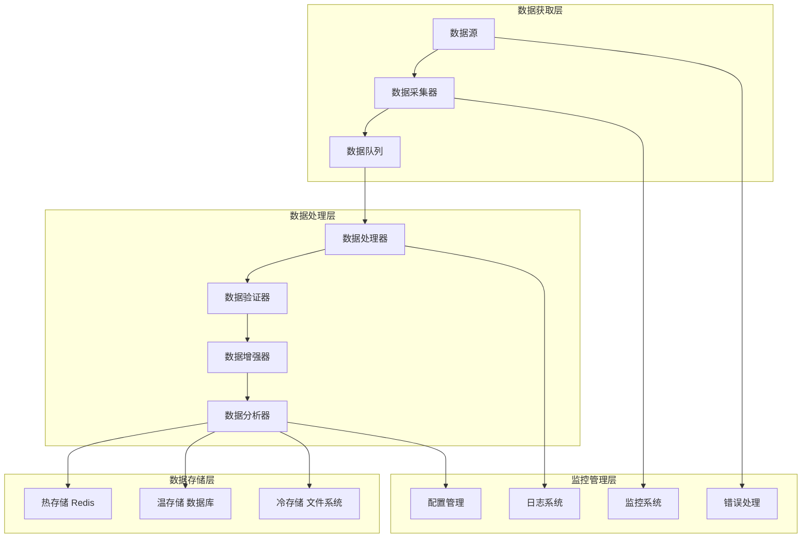
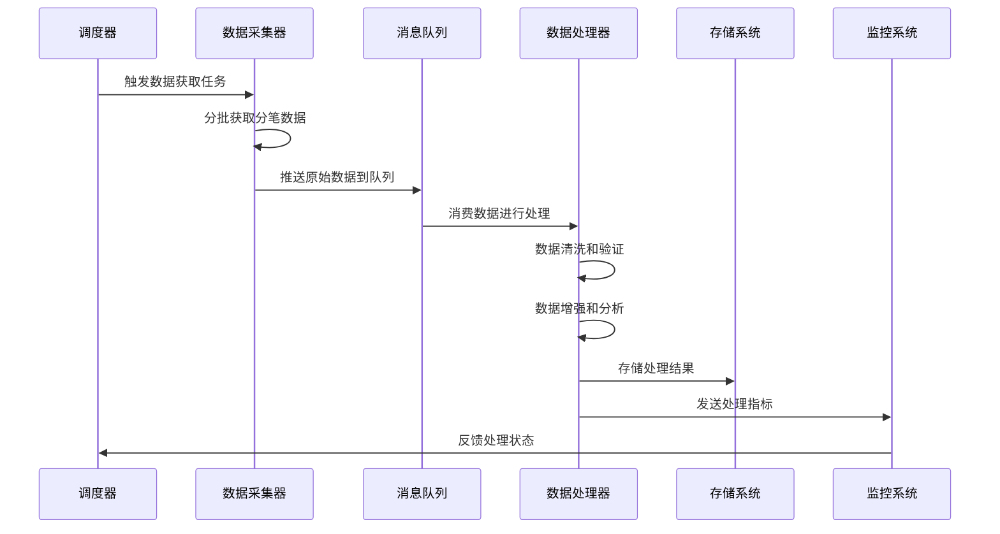

# 分笔数据完整处理方案

## 📋 文档信息

- **文档版本**: v1.0
- **创建日期**: 2025-11-05
- **作者**: Winston (Architect Agent)
- **适用范围**: 股票分笔数据处理系统
- **架构风格**: 流水线架构 + 事件驱动
- **最后更新**: 2025-11-05

---

## 🎯 系统概述

本文档设计了一个完整的分笔数据处理方案，涵盖数据获取、处理、保存的全流程。该方案针对分笔数据分析的特殊需求，确保数据的完整性、准确性和实时性。

### 核心目标

1. **数据完整性** - 确保获取完整的交易时段数据
2. **数据准确性** - 保证价格、成交量、时间的精确性
3. **处理效率** - 支持大批量数据的快速处理
4. **存储优化** - 高效的数据存储和检索
5. **实时处理** - 支持实时数据的流式处理

---

## 🏗️ 整体架构设计

### 系统架构图



### 数据流架构



---

## 📥 数据获取方案

### 1. 数据采集器设计

#### 1.1 核心采集器类

```python
import asyncio
import logging
from datetime import datetime, date, timedelta
from typing import List, Dict, Optional, AsyncGenerator
from dataclasses import dataclass, asdict
from enum import Enum

class DataSourceType(Enum):
    """数据源类型"""
    MOOTDX = "mootdx"
    TUSHARE = "tushare"
    CUSTOM = "custom"

@dataclass
class TickDataRequest:
    """分笔数据获取请求"""
    symbol: str
    date: str
    source: DataSourceType = DataSourceType.MOOTDX
    batch_size: int = 1000
    ensure_completeness: bool = True
    max_retries: int = 3
    timeout: int = 30

@dataclass
class TickDataBatch:
    """分笔数据批次"""
    symbol: str
    date: str
    batch_index: int
    trades: List[Dict]
    is_last_batch: bool
    total_count: Optional[int] = None

class TickDataCollector:
    """分笔数据采集器"""

    def __init__(self, config: CollectorConfig):
        self.config = config
        self.logger = logging.getLogger(self.__class__.__name__)
        self.data_sources = self._initialize_data_sources()

    async def collect_tick_data(self, request: TickDataRequest) -> AsyncGenerator[TickDataBatch, None]:
        """收集分笔数据

        Args:
            request: 数据获取请求

        Yields:
            TickDataBatch: 分批的数据
        """
        self.logger.info(f"开始收集分笔数据: {request.symbol} {request.date}")

        # 1. 数据源选择
        data_source = self.data_sources[request.source.value]

        # 2. 分批获取数据
        async for batch in self._collect_in_batches(data_source, request):
            yield batch

        self.logger.info(f"分笔数据收集完成: {request.symbol} {request.date}")

    async def _collect_in_batches(
        self,
        data_source: 'DataSourceAdapter',
        request: TickDataRequest
    ) -> AsyncGenerator[TickDataBatch, None]:
        """分批获取数据"""
        offset = 0
        batch_index = 0
        total_collected = 0

        while True:
            batch_index += 1

            try:
                # 获取当前批次数据
                batch_data = await data_source.get_tick_data(
                    symbol=request.symbol,
                    date=request.date,
                    start=offset,
                    limit=request.batch_size
                )

                if not batch_data or len(batch_data.trades) == 0:
                    # 无更多数据，发送空批次标记结束
                    yield TickDataBatch(
                        symbol=request.symbol,
                        date=request.date,
                        batch_index=batch_index,
                        trades=[],
                        is_last_batch=True,
                        total_count=total_collected
                    )
                    break

                # 创建批次对象
                batch = TickDataBatch(
                    symbol=request.symbol,
                    date=request.date,
                    batch_index=batch_index,
                    trades=batch_data.trades,
                    is_last_batch=len(batch_data.trades) < request.batch_size,
                    total_count=total_collected + len(batch_data.trades)
                )

                yield batch
                total_collected += len(batch_data.trades)
                offset += request.batch_size

                # 控制获取频率
                await asyncio.sleep(self.config.fetch_interval)

                if batch.is_last_batch:
                    break

            except Exception as e:
                self.logger.error(f"获取第{batch_index}批数据失败: {e}")
                if batch_index >= request.max_retries:
                    raise
                await asyncio.sleep(2 ** batch_index)  # 指数退避

    def _initialize_data_sources(self) -> Dict[str, 'DataSourceAdapter']:
        """初始化数据源"""
        return {
            DataSourceType.MOOTDX.value: MootdxAdapter(self.config.mootdx_config),
            DataSourceType.TUSHARE.value: TushareAdapter(self.config.tushare_config),
            DataSourceType.CUSTOM.value: CustomAdapter(self.config.custom_config)
        }
```

#### 1.2 数据源适配器

```python
from abc import ABC, abstractmethod

class DataSourceAdapter(ABC):
    """数据源适配器基类"""

    @abstractmethod
    async def get_tick_data(
        self,
        symbol: str,
        date: str,
        start: int = 0,
        limit: int = 1000
    ) -> 'TickData':
        """获取分笔数据"""
        pass

class MootdxAdapter(DataSourceAdapter):
    """Mootdx数据源适配器"""

    def __init__(self, config: MootdxConfig):
        self.config = config
        self.client_pool = ClientPool(config)
        self.logger = logging.getLogger(self.__class__.__name__)

    async def get_tick_data(
        self,
        symbol: str,
        date: str,
        start: int = 0,
        limit: int = 1000
    ) -> 'TickData':
        """通过mootdx获取分笔数据"""

        async with self.client_pool.get_client() as client:
            try:
                # 调用mootdx API
                raw_data = client.transactions(
                    symbol=symbol,
                    date=date,
                    start=start,
                    offset=limit
                )

                if raw_data is None or len(raw_data) == 0:
                    return TickData.empty(symbol, date)

                # 数据格式转换
                trades = self._convert_mootdx_format(raw_data)

                return TickData(
                    symbol=symbol,
                    date=date,
                    trades=trades,
                    source="mootdx",
                    fetch_time=datetime.now()
                )

            except Exception as e:
                self.logger.error(f"Mootdx获取数据失败: {symbol} {date}, {e}")
                raise DataSourceError(f"获取分笔数据失败: {e}")

    def _convert_mootdx_format(self, raw_data) -> List[Dict]:
        """转换mootdx数据格式"""
        trades = []
        for _, row in raw_data.iterrows():
            trade = {
                'time': row['time'],
                'price': float(row['price']),
                'volume': int(row['vol']),
                'buyorsell': int(row.get('buyorsell', 0)),
                'timestamp': datetime.combine(
                    datetime.now().date(),
                    datetime.strptime(row['time'], '%H:%M:%S').time()
                )
            }
            trades.append(trade)

        return trades

class ClientPool:
    """客户端连接池"""

    def __init__(self, config: MootdxConfig):
        self.config = config
        self._pool = asyncio.Queue(maxsize=config.max_connections)
        self._created_clients = 0
        self._lock = asyncio.Lock()

    async def get_client(self):
        """获取客户端连接"""
        try:
            # 尝试从池中获取现有连接
            client = self._pool.get_nowait()
            return PooledClient(client, self)
        except asyncio.QueueEmpty:
            # 池中没有连接，创建新连接
            async with self._lock:
                if self._created_clients < self.config.max_connections:
                    client = self._create_client()
                    self._created_clients += 1
                    return PooledClient(client, self)
                else:
                    # 等待可用连接
                    client = await self._pool.get()
                    return PooledClient(client, self)

    def return_client(self, client):
        """归还客户端连接"""
        try:
            self._pool.put_nowait(client)
        except asyncio.QueueFull:
            # 池已满，关闭连接
            client.close()
            self._created_clients -= 1

    def _create_client(self):
        """创建新的客户端连接"""
        return Quotes.factory(
            market='std',
            multithread=True,
            heartbeat=True,
            bestip=True,
            timeout=self.config.timeout
        )

class PooledClient:
    """池化客户端包装器"""

    def __init__(self, client, pool: ClientPool):
        self.client = client
        self.pool = pool

    async def __aenter__(self):
        return self.client

    async def __aexit__(self, exc_type, exc_val, exc_tb):
        self.pool.return_client(self.client)
```

### 2. 调度器设计

```python
import asyncio
from datetime import datetime, time
from typing import List, Set
from dataclasses import dataclass

@dataclass
class CollectionTask:
    """数据收集任务"""
    symbol: str
    date: str
    priority: int = 0
    retry_count: int = 0
    max_retries: int = 3
    created_at: datetime = None

    def __post_init__(self):
        if self.created_at is None:
            self.created_at = datetime.now()

class TickDataScheduler:
    """分笔数据调度器"""

    def __init__(self, config: SchedulerConfig):
        self.config = config
        self.logger = logging.getLogger(self.__class__.__name__)
        self.collector = TickDataCollector(config.collector_config)
        self.task_queue = asyncio.PriorityQueue()
        self.running_tasks: Set[asyncio.Task] = set()
        self.is_running = False

    async def start(self):
        """启动调度器"""
        self.is_running = True
        self.logger.info("分笔数据调度器启动")

        # 启动任务处理循环
        task_processor = asyncio.create_task(self._process_tasks())

        # 启动定时任务生成器
        task_generator = asyncio.create_task(self._generate_scheduled_tasks())

        # 启动健康检查
        health_checker = asyncio.create_task(self._health_check())

        try:
            await asyncio.gather(task_processor, task_generator, health_checker)
        except asyncio.CancelledError:
            self.logger.info("调度器停止")
        finally:
            await self._cleanup()

    async def stop(self):
        """停止调度器"""
        self.is_running = False
        # 取消所有运行中的任务
        for task in self.running_tasks:
            task.cancel()

        # 等待任务完成
        if self.running_tasks:
            await asyncio.gather(*self.running_tasks, return_exceptions=True)

    async def add_task(self, task: CollectionTask):
        """添加收集任务"""
        priority = (task.priority, task.created_at.timestamp())
        await self.task_queue.put((priority, task))
        self.logger.debug(f"添加收集任务: {task.symbol} {task.date}")

    async def _process_tasks(self):
        """处理任务队列"""
        while self.is_running:
            try:
                # 获取任务（带超时）
                priority, task = await asyncio.wait_for(
                    self.task_queue.get(),
                    timeout=1.0
                )

                # 创建处理任务
                processor_task = asyncio.create_task(
                    self._process_single_task(task)
                )
                self.running_tasks.add(processor_task)

                # 任务完成后自动清理
                processor_task.add_callback(
                    lambda t: self.running_tasks.discard(t)
                )

            except asyncio.TimeoutError:
                # 超时继续循环
                continue
            except Exception as e:
                self.logger.error(f"任务处理异常: {e}")

    async def _process_single_task(self, task: CollectionTask):
        """处理单个任务"""
        try:
            self.logger.info(f"开始处理任务: {task.symbol} {task.date}")

            request = TickDataRequest(
                symbol=task.symbol,
                date=task.date,
                batch_size=self.config.batch_size,
                ensure_completeness=True
            )

            # 收集数据并存储
            collected_count = 0
            async for batch in self.collector.collect_tick_data(request):
                await self._store_batch(batch)
                collected_count += len(batch.trades)

                if batch.is_last_batch:
                    self.logger.info(
                        f"任务完成: {task.symbol} {task.date}, "
                        f"总记录数: {collected_count}"
                    )
                    break

        except Exception as e:
            self.logger.error(f"任务处理失败: {task.symbol} {task.date}, {e}")

            # 重试逻辑
            if task.retry_count < task.max_retries:
                task.retry_count += 1
                await asyncio.sleep(2 ** task.retry_count)  # 指数退避
                await self.add_task(task)
                self.logger.info(f"任务重试: {task.symbol} {task.date}")
            else:
                self.logger.error(f"任务最终失败: {task.symbol} {task.date}")

    async def _generate_scheduled_tasks(self):
        """生成定时任务"""
        while self.is_running:
            try:
                # 获取需要收集数据的股票列表
                symbols = await self._get_active_symbols()
                target_date = self._get_target_date()

                # 为每个股票生成收集任务
                for symbol in symbols:
                    task = CollectionTask(
                        symbol=symbol,
                        date=target_date,
                        priority=self._calculate_priority(symbol, target_date)
                    )
                    await self.add_task(task)

                # 等待下一个调度周期
                await asyncio.sleep(self.config.schedule_interval)

            except Exception as e:
                self.logger.error(f"定时任务生成失败: {e}")
                await asyncio.sleep(60)  # 错误后等待1分钟

    async def _store_batch(self, batch: TickDataBatch):
        """存储批次数据"""
        # 发送到消息队列进行异步处理
        await self.config.message_queue.put(
            {
                'type': 'tick_data_batch',
                'data': asdict(batch),
                'timestamp': datetime.now().isoformat()
            }
        )

    def _calculate_priority(self, symbol: str, date: str) -> int:
        """计算任务优先级"""
        # 根据股票重要性和数据新鲜度计算优先级
        base_priority = 0

        # 大盘股优先级更高
        if symbol.startswith('6'):  # 上海主板
            base_priority += 10
        elif symbol.startswith('00'):  # 深圳主板
            base_priority += 8
        elif symbol.startswith('30'):  # 创业板
            base_priority += 6

        # 当日数据优先级更高
        if date == datetime.now().strftime('%Y%m%d'):
            base_priority += 20

        return base_priority

    async def _get_active_symbols(self) -> List[str]:
        """获取活跃股票列表"""
        # 这里可以从配置文件或数据库获取
        return self.config.active_symbols

    def _get_target_date(self) -> str:
        """获取目标日期"""
        now = datetime.now()

        # 如果在交易时间内，获取当日数据
        if self._is_trading_time(now):
            return now.strftime('%Y%m%d')
        else:
            # 否则获取最近一个交易日
            return self._get_last_trading_date(now).strftime('%Y%m%d')

    def _is_trading_time(self, dt: datetime) -> bool:
        """判断是否为交易时间"""
        if dt.weekday() >= 5:  # 周末
            return False

        current_time = dt.time()
        morning_start = time(9, 30)
        morning_end = time(11, 30)
        afternoon_start = time(13, 0)
        afternoon_end = time(15, 0)

        return (morning_start <= current_time <= morning_end or
                afternoon_start <= current_time <= afternoon_end)

    def _get_last_trading_date(self, dt: datetime) -> date:
        """获取最近交易日"""
        # 简化实现，实际应该查询交易日历
        while dt.weekday() >= 5:  # 周末
            dt -= timedelta(days=1)
        return dt.date()

    async def _health_check(self):
        """健康检查"""
        while self.is_running:
            try:
                # 检查队列长度
                queue_size = self.task_queue.qsize()
                if queue_size > 1000:
                    self.logger.warning(f"任务队列积压过多: {queue_size}")

                # 检查运行任务数
                running_count = len(self.running_tasks)
                if running_count > self.config.max_concurrent_tasks:
                    self.logger.warning(f"并发任务数过多: {running_count}")

                await asyncio.sleep(60)  # 每分钟检查一次

            except Exception as e:
                self.logger.error(f"健康检查失败: {e}")
                await asyncio.sleep(60)

    async def _cleanup(self):
        """清理资源"""
        self.logger.info("清理调度器资源")
```

---

## 🔧 数据处理方案
TodoWrite
<arg_key>todos</arg_key>
<arg_value>[{"content": "设计数据获取方案", "status": "completed", "activeForm": "设计数据获取方案"}, {"content": "设计数据处理方案", "status": "in_progress", "activeForm": "设计数据处理方案"}, {"content": "设计数据保存方案", "status": "pending", "activeForm": "设计数据保存方案"}, {"content": "创建完整的数据流水线架构", "status": "pending", "activeForm": "创建完整的数据流水线架构"}, {"content": "生成实现代码示例", "status": "pending", "activeForm": "生成实现代码示例"}]