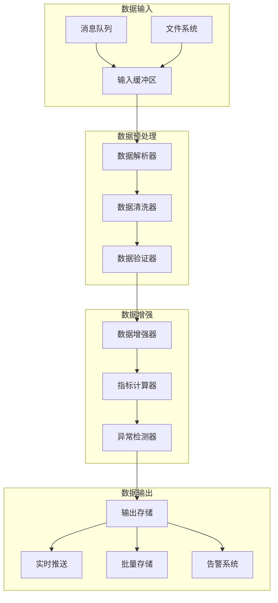
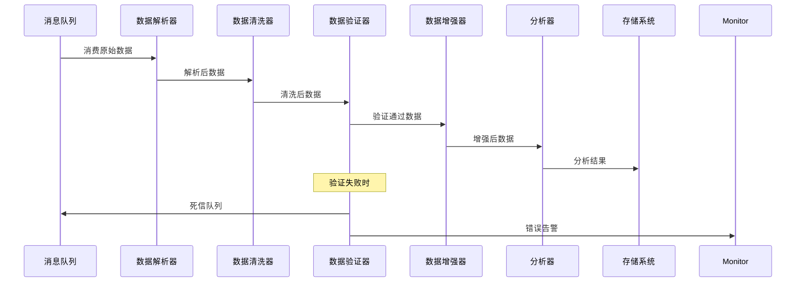

# 分笔数据处理方案

## 📋 文档信息

- **文档版本**: v1.0
- **创建日期**: 2025-11-05
- **作者**: Winston (Architect Agent)
- **适用范围**: 股票分笔数据处理系统
- **处理模式**: 流式处理 + 批处理
- **最后更新**: 2025-11-05

---

## 🎯 处理方案概述

本方案设计了一个高效、可扩展的分笔数据处理系统，支持实时流处理和批量处理两种模式。系统采用事件驱动架构，确保数据处理的准确性和及时性。

### 处理目标

1. **数据清洗** - 去除异常数据，修复格式问题
2. **数据验证** - 确保数据完整性和准确性
3. **数据增强** - 添加计算字段和衍生指标
4. **实时分析** - 支持实时技术指标计算
5. **批量分析** - 支持历史数据的深度分析

---

## 🏗️ 处理架构设计

### 处理流水线架构



### 处理流程图



---

## 📥 数据输入处理

### 1. 消息队列消费者

```python
import asyncio
import json
import logging
from typing import Dict, Any, Optional
from dataclasses import dataclass
from datetime import datetime

@dataclass
class ProcessingMessage:
    """处理消息"""
    message_id: str
    message_type: str
    data: Dict[str, Any]
    timestamp: datetime
    retry_count: int = 0
    max_retries: int = 3

class TickDataConsumer:
    """分笔数据消费者"""

    def __init__(self, config: ConsumerConfig):
        self.config = config
        self.logger = logging.getLogger(self.__class__.__name__)
        self.message_queue = asyncio.Queue(maxsize=config.queue_size)
        self.dead_letter_queue = asyncio.Queue(maxsize=1000)
        self.processors = {}

    async def start(self):
        """启动消费者"""
        self.logger.info("分笔数据消费者启动")

        # 启动多个消费协程
        consumer_tasks = [
            asyncio.create_task(self._consume_messages())
            for _ in range(self.config.consumer_count)
        ]

        # 启动死信队列处理器
        dead_letter_task = asyncio.create_task(self._process_dead_letters())

        try:
            await asyncio.gather(*consumer_tasks, dead_letter_task)
        except asyncio.CancelledError:
            self.logger.info("消费者停止")

    async def _consume_messages(self):
        """消费消息"""
        while True:
            try:
                # 从消息队列获取消息
                raw_message = await self.config.message_broker.receive_message(
                    queue=self.config.queue_name,
                    timeout=5.0
                )

                if raw_message:
                    message = self._parse_message(raw_message)
                    await self._process_message(message)

            except Exception as e:
                self.logger.error(f"消息消费异常: {e}")
                await asyncio.sleep(1)

    def _parse_message(self, raw_message: Any) -> ProcessingMessage:
        """解析消息"""
        try:
            if isinstance(raw_message, str):
                data = json.loads(raw_message)
            else:
                data = raw_message

            return ProcessingMessage(
                message_id=data.get('message_id', self._generate_message_id()),
                message_type=data.get('type', 'unknown'),
                data=data.get('data', {}),
                timestamp=datetime.fromisoformat(data.get('timestamp', datetime.now().isoformat()))
            )
        except Exception as e:
            self.logger.error(f"消息解析失败: {e}")
            raise

    async def _process_message(self, message: ProcessingMessage):
        """处理消息"""
        try:
            # 获取对应的处理器
            processor = self.processors.get(message.message_type)
            if not processor:
                self.logger.warning(f"未知消息类型: {message.message_type}")
                return

            # 处理消息
            await processor.process(message)

        except Exception as e:
            self.logger.error(f"消息处理失败: {message.message_id}, {e}")

            # 重试逻辑
            if message.retry_count < message.max_retries:
                message.retry_count += 1
                await asyncio.sleep(2 ** message.retry_count)
                await self.message_queue.put(message)
            else:
                await self.dead_letter_queue.put(message)
                self.logger.error(f"消息最终失败: {message.message_id}")

    def register_processor(self, message_type: str, processor: 'MessageProcessor'):
        """注册消息处理器"""
        self.processors[message_type] = processor
        self.logger.info(f"注册消息处理器: {message_type}")

    async def _process_dead_letters(self):
        """处理死信消息"""
        while True:
            try:
                message = await asyncio.wait_for(
                    self.dead_letter_queue.get(),
                    timeout=60.0
                )
                self.logger.error(
                    f"死信消息: {message.message_id}, "
                    f"类型: {message.message_type}, "
                    f"重试次数: {message.retry_count}"
                )
                # 可以发送告警或写入特殊存储
            except asyncio.TimeoutError:
                continue

    def _generate_message_id(self) -> str:
        """生成消息ID"""
        import uuid
        return str(uuid.uuid4())

class MessageProcessor(ABC):
    """消息处理器基类"""

    @abstractmethod
    async def process(self, message: ProcessingMessage):
        """处理消息"""
        pass
```

### 2. 批量数据处理器

```python
class BatchTickDataProcessor(MessageProcessor):
    """批量分笔数据处理器"""

    def __init__(self, config: ProcessorConfig):
        self.config = config
        self.logger = logging.getLogger(self.__class__.__name__)

        # 初始化处理组件
        self.parser = TickDataParser()
        self.cleaner = TickDataCleaner(config.cleaning_config)
        self.validator = TickDataValidator(config.validation_config)
        self.enhancer = TickDataEnhancer(config.enhancement_config)
        self.analyzer = TickDataAnalyzer(config.analysis_config)

    async def process(self, message: ProcessingMessage):
        """处理批量数据消息"""
        try:
            batch_data = message.data

            # 1. 数据解析
            parsed_batch = self.parser.parse_batch(batch_data)

            # 2. 数据清洗
            cleaned_batch = await self.cleaner.clean_batch(parsed_batch)

            # 3. 数据验证
            validation_result = await self.validator.validate_batch(cleaned_batch)

            if not validation_result.is_valid:
                self.logger.warning(
                    f"数据验证失败: {validation_result.errors}"
                )
                # 可以选择部分处理或发送告警
                cleaned_batch = validation_result.cleaned_data

            # 4. 数据增强
            enhanced_batch = await self.enhancer.enhance_batch(cleaned_batch)

            # 5. 数据分析
            analysis_result = await self.analyzer.analyze_batch(enhanced_batch)

            # 6. 存储结果
            await self._store_results(enhanced_batch, analysis_result)

            self.logger.info(
                f"批量处理完成: {batch_data.get('symbol')} "
                f"记录数: {len(enhanced_batch.trades)}"
            )

        except Exception as e:
            self.logger.error(f"批量处理失败: {e}")
            raise
```

---

## 🧹 数据清洗方案

### 1. 数据清洗器

```python
import pandas as pd
import numpy as np
from typing import List, Dict, Tuple, Optional
from datetime import datetime, time

class TickDataCleaner:
    """分笔数据清洗器"""

    def __init__(self, config: CleaningConfig):
        self.config = config
        self.logger = logging.getLogger(self.__class__.__name__)

    async def clean_batch(self, batch_data: 'TickDataBatch') -> 'TickDataBatch':
        """清洗批量数据"""
        if not batch_data.trades:
            return batch_data

        # 转换为DataFrame进行处理
        df = pd.DataFrame(batch_data.trades)

        # 1. 去重处理
        df = self._remove_duplicates(df)

        # 2. 时间处理
        df = self._process_timestamps(df)

        # 3. 价格处理
        df = self._clean_prices(df)

        # 4. 成交量处理
        df = self._clean_volumes(df)

        # 5. 异常值处理
        df = self._handle_outliers(df)

        # 6. 时间排序
        df = self._sort_by_time(df)

        # 转换回列表格式
        cleaned_trades = df.to_dict('records')

        self.logger.info(
            f"数据清洗完成: 原始{len(batch_data.trades)}条, "
            f"清洗后{len(cleaned_trades)}条"
        )

        return TickDataBatch(
            symbol=batch_data.symbol,
            date=batch_data.date,
            batch_index=batch_data.batch_index,
            trades=cleaned_trades,
            is_last_batch=batch_data.is_last_batch,
            total_count=len(cleaned_trades)
        )

    def _remove_duplicates(self, df: pd.DataFrame) -> pd.DataFrame:
        """去除重复数据"""
        original_count = len(df)

        # 基于时间戳和价格去重
        df = df.drop_duplicates(subset=['time', 'price', 'volume'], keep='first')

        removed_count = original_count - len(df)
        if removed_count > 0:
            self.logger.info(f"去除重复数据: {removed_count}条")

        return df

    def _process_timestamps(self, df: pd.DataFrame) -> pd.DataFrame:
        """处理时间戳"""
        # 确保时间格式统一
        df['time'] = df['time'].astype(str)

        # 验证时间格式
        invalid_times = df[~df['time'].str.match(r'^\d{2}:\d{2}:\d{2}$')]
        if len(invalid_times) > 0:
            self.logger.warning(f"发现无效时间格式: {len(invalid_times)}条")
            df = df[df['time'].str.match(r'^\d{2}:\d{2}:\d{2}$')]

        # 转换为时间对象
        df['timestamp'] = pd.to_datetime(
            df['time'].apply(
                lambda x: datetime.strptime(x, '%H:%M:%S').time()
            ),
            format='%H:%M:%S'
        )

        return df

    def _clean_prices(self, df: pd.DataFrame) -> pd.DataFrame:
        """清洗价格数据"""
        original_count = len(df)

        # 转换价格类型
        df['price'] = pd.to_numeric(df['price'], errors='coerce')

        # 去除无效价格
        df = df[
            (df['price'] > 0) &
            (df['price'].notna())
        ]

        # 价格精度处理（保留2位小数）
        df['price'] = df['price'].round(2)

        removed_count = original_count - len(df)
        if removed_count > 0:
            self.logger.info(f"价格清洗去除数据: {removed_count}条")

        return df

    def _clean_volumes(self, df: pd.DataFrame) -> pd.DataFrame:
        """清洗成交量数据"""
        original_count = len(df)

        # 转换成交量类型
        df['volume'] = pd.to_numeric(df['volume'], errors='coerce')

        # 去除无效成交量
        df = df[
            (df['volume'] > 0) &
            (df['volume'].notna())
        ]

        # 成交量必须是整数
        df['volume'] = df['volume'].astype(int)

        removed_count = original_count - len(df)
        if removed_count > 0:
            self.logger.info(f"成交量清洗去除数据: {removed_count}条")

        return df

    def _handle_outliers(self, df: pd.DataFrame) -> pd.DataFrame:
        """处理异常值"""
        if len(df) < 10:  # 数据太少不处理异常值
            return df

        original_count = len(df)

        # 价格异常值检测
        price_mean = df['price'].mean()
        price_std = df['price'].std()

        # 移除超出3个标准差的价格
        price_outliers = np.abs(df['price'] - price_mean) > 3 * price_std
        if price_outliers.any():
            self.logger.warning(f"发现价格异常值: {price_outliers.sum()}条")
            df = df[~price_outliers]

        # 成交量异常值检测
        volume_mean = df['volume'].mean()
        volume_std = df['volume'].std()

        # 移除超出5个标准差的成交量
        volume_outliers = np.abs(df['volume'] - volume_mean) > 5 * volume_std
        if volume_outliers.any():
            self.logger.warning(f"发现成交量异常值: {volume_outliers.sum()}条")
            df = df[~volume_outliers]

        removed_count = original_count - len(df)
        if removed_count > 0:
            self.logger.info(f"异常值处理去除数据: {removed_count}条")

        return df

    def _sort_by_time(self, df: pd.DataFrame) -> pd.DataFrame:
        """按时间排序"""
        return df.sort_values('timestamp').reset_index(drop=True)

class RealTimeTickCleaner:
    """实时数据清洗器"""

    def __init__(self, config: CleaningConfig):
        self.config = config
        self.logger = logging.getLogger(self.__class__.__name__)
        self.price_history = {}  # 记录历史价格用于异常检测
        self.volume_stats = {}   # 记录成交量统计

    async def clean_real_time_tick(self, tick: Dict) -> Optional[Dict]:
        """清洗实时单条数据"""
        try:
            # 1. 基础验证
            if not self._validate_basic_tick(tick):
                return None

            # 2. 价格处理
            tick = self._clean_tick_price(tick)

            # 3. 成交量处理
            tick = self._clean_tick_volume(tick)

            # 4. 时间处理
            tick = self._clean_tick_time(tick)

            # 5. 异常检测
            if self._detect_anomaly(tick):
                self.logger.warning(f"检测到异常数据: {tick}")
                return None

            return tick

        except Exception as e:
            self.logger.error(f"实时数据清洗失败: {e}")
            return None

    def _validate_basic_tick(self, tick: Dict) -> bool:
        """基础验证"""
        required_fields = ['symbol', 'time', 'price', 'volume']

        for field in required_fields:
            if field not in tick or tick[field] is None:
                return False

        return True

    def _clean_tick_price(self, tick: Dict) -> Dict:
        """清洗单条数据的价格"""
        try:
            price = float(tick['price'])

            if price <= 0:
                return None

            # 保留2位小数
            tick['price'] = round(price, 2)

            return tick

        except (ValueError, TypeError):
            return None

    def _clean_tick_volume(self, tick: Dict) -> Dict:
        """清洗单条数据的成交量"""
        try:
            volume = int(tick['volume'])

            if volume <= 0:
                return None

            tick['volume'] = volume
            return tick

        except (ValueError, TypeError):
            return None

    def _clean_tick_time(self, tick: Dict) -> Dict:
        """清洗单条数据的时间"""
        try:
            time_str = tick['time']

            # 验证时间格式
            if isinstance(time_str, str):
                time_obj = datetime.strptime(time_str, '%H:%M:%S').time()
            else:
                time_obj = time_str

            tick['timestamp'] = time_obj
            return tick

        except ValueError:
            return None

    def _detect_anomaly(self, tick: Dict) -> bool:
        """检测异常数据"""
        symbol = tick['symbol']
        price = tick['price']
        volume = tick['volume']

        # 初始化历史记录
        if symbol not in self.price_history:
            self.price_history[symbol] = []
            self.volume_stats[symbol] = {'mean': 0, 'std': 0}

        # 价格异常检测
        if len(self.price_history[symbol]) >= 10:
            recent_prices = self.price_history[symbol][-10:]
            price_mean = np.mean(recent_prices)
            price_std = np.std(recent_prices)

            # 价格变动超过5%认为异常
            price_change = abs(price - price_mean) / price_mean
            if price_change > 0.05:
                return True

        # 更新历史记录
        self.price_history[symbol].append(price)
        if len(self.price_history[symbol]) > 100:
            self.price_history[symbol].pop(0)

        return False
```

---

## ✅ 数据验证方案

### 1. 数据验证器

```python
from typing import List, Dict, Optional, Tuple
from dataclasses import dataclass
from enum import Enum

class ValidationLevel(Enum):
    """验证级别"""
    BASIC = "basic"      # 基础验证
    STANDARD = "standard" # 标准验证
    STRICT = "strict"    # 严格验证

@dataclass
class ValidationResult:
    """验证结果"""
    is_valid: bool
    errors: List[str]
    warnings: List[str]
    cleaned_data: Optional[List[Dict]] = None
    statistics: Optional[Dict] = None

@dataclass
class ValidationRule:
    """验证规则"""
    name: str
    description: str
    level: ValidationLevel
    validator_func: callable
    is_critical: bool = True

class TickDataValidator:
    """分笔数据验证器"""

    def __init__(self, config: ValidationConfig):
        self.config = config
        self.logger = logging.getLogger(self.__class__.__name__)
        self.rules = self._initialize_validation_rules()

    def _initialize_validation_rules(self) -> List[ValidationRule]:
        """初始化验证规则"""
        return [
            ValidationRule(
                name="time_sequence",
                description="时间序列连续性验证",
                level=ValidationLevel.STANDARD,
                validator_func=self._validate_time_sequence
            ),
            ValidationRule(
                name="price_range",
                description="价格范围合理性验证",
                level=ValidationLevel.BASIC,
                validator_func=self._validate_price_range
            ),
            ValidationRule(
                name="volume_consistency",
                description="成交量一致性验证",
                level=ValidationLevel.STANDARD,
                validator_func=self._validate_volume_consistency
            ),
            ValidationRule(
                name="trading_hours",
                description="交易时间验证",
                level=ValidationLevel.BASIC,
                validator_func=self._validate_trading_hours
            ),
            ValidationRule(
                name="data_completeness",
                description="数据完整性验证",
                level=ValidationLevel.STRICT,
                validator_func=self._validate_data_completeness
            ),
            ValidationRule(
                name="price_continuity",
                description="价格连续性验证",
                level=ValidationLevel.STANDARD,
                validator_func=self._validate_price_continuity
            )
        ]

    async def validate_batch(self, batch_data: 'TickDataBatch') -> ValidationResult:
        """验证批量数据"""
        if not batch_data.trades:
            return ValidationResult(
                is_valid=False,
                errors=["数据为空"],
                warnings=[]
            )

        errors = []
        warnings = []
        cleaned_data = batch_data.trades.copy()
        statistics = {}

        # 根据配置选择验证级别
        applicable_rules = [
            rule for rule in self.rules
            if self._should_apply_rule(rule, self.config.validation_level)
        ]

        for rule in applicable_rules:
            try:
                rule_result = rule.validator_func(cleaned_data)

                if not rule_result.is_valid:
                    if rule.is_critical:
                        errors.extend(rule_result.errors)
                    else:
                        warnings.extend(rule_result.errors)

                if rule_result.cleaned_data:
                    cleaned_data = rule_result.cleaned_data

                if rule_result.statistics:
                    statistics.update(rule_result.statistics)

            except Exception as e:
                error_msg = f"验证规则'{rule.name}'执行失败: {e}"
                self.logger.error(error_msg)
                if rule.is_critical:
                    errors.append(error_msg)

        return ValidationResult(
            is_valid=len(errors) == 0,
            errors=errors,
            warnings=warnings,
            cleaned_data=cleaned_data if cleaned_data != batch_data.trades else None,
            statistics=statistics
        )

    def _should_apply_rule(self, rule: ValidationRule, level: ValidationLevel) -> bool:
        """判断是否应该应用验证规则"""
        rule_levels = {
            ValidationLevel.BASIC: 0,
            ValidationLevel.STANDARD: 1,
            ValidationLevel.STRICT: 2
        }

        return rule_levels[rule.level] <= rule_levels[level]

    def _validate_time_sequence(self, data: List[Dict]) -> ValidationResult:
        """验证时间序列连续性"""
        errors = []
        warnings = []

        if len(data) < 2:
            return ValidationResult(is_valid=True, errors=[], warnings=[])

        # 检查时间顺序
        time_issues = []
        for i in range(1, len(data)):
            current_time = data[i]['timestamp']
            prev_time = data[i-1]['timestamp']

            if current_time < prev_time:
                time_issues.append(f"时间倒流: 位置{i}")
            elif current_time == prev_time:
                time_issues.append(f"时间重复: 位置{i}")

        if time_issues:
            errors.extend(time_issues)

        # 检查时间间隔异常
        large_gaps = []
        for i in range(1, len(data)):
            time_diff = (data[i]['timestamp'] - data[i-1]['timestamp']).total_seconds()
            if time_diff > 300:  # 5分钟
                large_gaps.append(f"大时间间隔: 位置{i}, 间隔{time_diff}秒")

        if large_gaps:
            warnings.extend(large_gaps)

        return ValidationResult(
            is_valid=len(errors) == 0,
            errors=errors,
            warnings=warnings
        )

    def _validate_price_range(self, data: List[Dict]) -> ValidationResult:
        """验证价格范围合理性"""
        errors = []

        for i, trade in enumerate(data):
            price = trade['price']

            # 价格必须为正数
            if price <= 0:
                errors.append(f"价格非正数: 位置{i}, 价格{price}")

            # A股价格范围检查（假设合理范围0.01-1000）
            if price < 0.01 or price > 1000:
                errors.append(f"价格超出合理范围: 位置{i}, 价格{price}")

        return ValidationResult(
            is_valid=len(errors) == 0,
            errors=errors,
            warnings=[]
        )

    def _validate_volume_consistency(self, data: List[Dict]) -> ValidationResult:
        """验证成交量一致性"""
        errors = []

        for i, trade in enumerate(data):
            volume = trade['volume']

            # 成交量必须为正整数
            if volume <= 0:
                errors.append(f"成交量非正数: 位置{i}, 成交量{volume}")

            if not isinstance(volume, int):
                errors.append(f"成交量非整数: 位置{i}, 成交量{volume}")

        return ValidationResult(
            is_valid=len(errors) == 0,
            errors=errors,
            warnings=[]
        )

    def _validate_trading_hours(self, data: List[Dict]) -> ValidationResult:
        """验证交易时间"""
        errors = []
        warnings = []

        # A股交易时间
        morning_start = time(9, 30)
        morning_end = time(11, 30, 30)  # 延长30秒容差
        afternoon_start = time(13, 0)
        afternoon_end = time(15, 0, 30)   # 延长30秒容差

        out_of_hours_count = 0

        for trade in data:
            trade_time = trade['timestamp']

            is_morning = morning_start <= trade_time <= morning_end
            is_afternoon = afternoon_start <= trade_time <= afternoon_end

            if not (is_morning or is_afternoon):
                out_of_hours_count += 1

        if out_of_hours_count > 0:
            ratio = out_of_hours_count / len(data)
            if ratio > 0.1:  # 超过10%的数据在交易时间外
                errors.append(f"过多非交易时间数据: {out_of_hours_count}/{len(data)}")
            else:
                warnings.append(f"少量非交易时间数据: {out_of_hours_count}/{len(data)}")

        return ValidationResult(
            is_valid=len(errors) == 0,
            errors=errors,
            warnings=warnings
        )

    def _validate_data_completeness(self, data: List[Dict]) -> ValidationResult:
        """验证数据完整性"""
        warnings = []

        if len(data) < 100:  # 数据量过少
            warnings.append(f"数据量较少: {len(data)}条")

        # 检查交易时段覆盖
        if data:
            first_time = data[0]['timestamp']
            last_time = data[-1]['timestamp']

            expected_duration = 4 * 3600  # 4小时交易时间
            actual_duration = (last_time - first_time).total_seconds()

            coverage_ratio = actual_duration / expected_duration
            if coverage_ratio < 0.5:
                warnings.append(f"交易时段覆盖不足: {coverage_ratio:.1%}")

        return ValidationResult(
            is_valid=True,
            errors=[],
            warnings=warnings
        )

    def _validate_price_continuity(self, data: List[Dict]) -> ValidationResult:
        """验证价格连续性"""
        warnings = []

        if len(data) < 2:
            return ValidationResult(is_valid=True, errors=[], warnings=[])

        # 检查价格跳跃
        price_jumps = []
        for i in range(1, len(data)):
            prev_price = data[i-1]['price']
            curr_price = data[i]['price']

            if prev_price > 0:
                price_change = abs(curr_price - prev_price) / prev_price
                if price_change > 0.05:  # 5%的价格跳跃
                    price_jumps.append(f"价格跳跃: 位置{i}, 变动{price_change:.1%}")

        if price_jumps:
            warnings.extend(price_jumps[:10])  # 只显示前10个

        return ValidationResult(
            is_valid=True,
            errors=[],
            warnings=warnings
        )
```

---

## 📈 数据增强方案

### 1. 数据增强器

```python
import pandas as pd
import numpy as np
from typing import List, Dict, Optional
from datetime import datetime, time, timedelta

class TickDataEnhancer:
    """分笔数据增强器"""

    def __init__(self, config: EnhancementConfig):
        self.config = config
        self.logger = logging.getLogger(self.__class__.__name__)

    async def enhance_batch(self, batch_data: 'TickDataBatch') -> 'TickDataBatch':
        """增强批量数据"""
        if not batch_data.trades:
            return batch_data

        # 转换为DataFrame进行处理
        df = pd.DataFrame(batch_data.trades)

        # 1. 计算累计成交量
        df = self._calculate_cumulative_volume(df)

        # 2. 计算累计成交额
        df = self._calculate_cumulative_amount(df)

        # 3. 计算VWAP
        df = self._calculate_vwap(df)

        # 4. 添加买卖标识
        df = self._enhance_buy_sell_indicator(df)

        # 5. 计算价格变化
        df = self._calculate_price_changes(df)

        # 6. 添加时间特征
        df = self._add_time_features(df)

        # 7. 计算统计指标
        df = self._calculate_statistical_features(df)

        # 转换回列表格式
        enhanced_trades = df.to_dict('records')

        self.logger.info(
            f"数据增强完成: {batch_data.symbol} "
            f"增强字段数: {len(enhanced_trades[0]) - len(batch_data.trades[0])}"
        )

        return TickDataBatch(
            symbol=batch_data.symbol,
            date=batch_data.date,
            batch_index=batch_data.batch_index,
            trades=enhanced_trades,
            is_last_batch=batch_data.is_last_batch,
            total_count=len(enhanced_trades)
        )

    def _calculate_cumulative_volume(self, df: pd.DataFrame) -> pd.DataFrame:
        """计算累计成交量"""
        df['cumulative_volume'] = df['volume'].cumsum()
        return df

    def _calculate_cumulative_amount(self, df: pd.DataFrame) -> pd.DataFrame:
        """计算累计成交额"""
        df['amount'] = df['price'] * df['volume']
        df['cumulative_amount'] = df['amount'].cumsum()
        return df

    def _calculate_vwap(self, df: pd.DataFrame) -> pd.DataFrame:
        """计算成交量加权平均价格"""
        df['vwap'] = df['cumulative_amount'] / df['cumulative_volume']
        return df

    def _enhance_buy_sell_indicator(self, df: pd.DataFrame) -> pd.DataFrame:
        """增强买卖标识"""
        if 'buyorsell' not in df.columns:
            # 如果没有买卖标识，尝试根据价格变化推断
            df['buyorsell'] = 0  # 未知
            return df

        # 增强买卖标识
        df['buy_volume'] = np.where(df['buyorsell'] == 2, df['volume'], 0)
        df['sell_volume'] = np.where(df['buyorsell'] == 1, df['volume'], 0)

        df['cumulative_buy_volume'] = df['buy_volume'].cumsum()
        df['cumulative_sell_volume'] = df['sell_volume'].cumsum()

        # 计算买卖力量对比
        total_volume = df['cumulative_buy_volume'] + df['cumulative_sell_volume']
        df['buy_ratio'] = df['cumulative_buy_volume'] / total_volume
        df['sell_ratio'] = df['cumulative_sell_volume'] / total_volume

        return df

    def _calculate_price_changes(self, df: pd.DataFrame) -> pd.DataFrame:
        """计算价格变化"""
        df['price_change'] = df['price'].diff()
        df['price_change_pct'] = df['price'].pct_change() * 100

        # 相对于开盘价的变化
        if len(df) > 0:
            open_price = df.iloc[0]['price']
            df['change_from_open'] = df['price'] - open_price
            df['change_from_open_pct'] = (df['price'] - open_price) / open_price * 100

        return df

    def _add_time_features(self, df: pd.DataFrame) -> pd.DataFrame:
        """添加时间特征"""
        # 转换为完整时间戳
        base_date = datetime.strptime(df.iloc[0]['time'][:10], '%Y-%m-%d').date()
        df['full_timestamp'] = df.apply(
            lambda row: datetime.combine(base_date, row['timestamp']),
            axis=1
        )

        # 时间特征
        df['seconds_from_start'] = (
            df['full_timestamp'] - df['full_timestamp'].iloc[0]
        ).dt.total_seconds()

        # 交易时段标识
        df['trading_session'] = df['timestamp'].apply(self._get_trading_session)

        return df

    def _get_trading_session(self, timestamp: time) -> str:
        """获取交易时段"""
        morning_start = time(9, 30)
        morning_end = time(11, 30)
        afternoon_start = time(13, 0)
        afternoon_end = time(15, 0)

        if morning_start <= timestamp <= morning_end:
            return "morning"
        elif afternoon_start <= timestamp <= afternoon_end:
            return "afternoon"
        else:
            return "off_hours"

    def _calculate_statistical_features(self, df: pd.DataFrame) -> pd.DataFrame:
        """计算统计特征"""
        # 滑动窗口统计
        window_sizes = [5, 10, 20, 50]

        for window in window_sizes:
            if len(df) >= window:
                # 滑动平均价格
                df[f'price_ma_{window}'] = df['price'].rolling(window=window).mean()

                # 滑动平均成交量
                df[f'volume_ma_{window}'] = df['volume'].rolling(window=window).mean()

                # 价格标准差
                df[f'price_std_{window}'] = df['price'].rolling(window=window).std()

                # 成交量标准差
                df[f'volume_std_{window}'] = df['volume'].rolling(window=window).std()

        # 价格相对位置（当前价格在最近N笔中的位置）
        for window in [10, 20]:
            if len(df) >= window:
                df[f'price_percentile_{window}'] = df['price'].rolling(window=window).apply(
                    lambda x: (x.iloc[-1] - x.min()) / (x.max() - x.min()) if x.max() != x.min() else 0.5
                )

        return df

class RealTimeTickEnhancer:
    """实时数据增强器"""

    def __init__(self, config: EnhancementConfig):
        self.config = config
        self.logger = logging.getLogger(self.__class__.__name__)
        self.state = {}  # 保存状态信息

    async def enhance_real_time_tick(self, tick: Dict) -> Optional[Dict]:
        """增强实时单条数据"""
        try:
            symbol = tick['symbol']

            # 初始化状态
            if symbol not in self.state:
                self.state[symbol] = {
                    'cumulative_volume': 0,
                    'cumulative_amount': 0,
                    'cumulative_buy_volume': 0,
                    'cumulative_sell_volume': 0,
                    'last_price': None,
                    'price_history': [],
                    'volume_history': []
                }

            state = self.state[symbol]

            # 1. 基础计算
            tick['amount'] = tick['price'] * tick['volume']

            # 2. 累计值
            state['cumulative_volume'] += tick['volume']
            state['cumulative_amount'] += tick['amount']

            tick['cumulative_volume'] = state['cumulative_volume']
            tick['cumulative_amount'] = state['cumulative_amount']

            # 3. VWAP
            if state['cumulative_volume'] > 0:
                tick['vwap'] = state['cumulative_amount'] / state['cumulative_volume']

            # 4. 买卖标识增强
            if 'buyorsell' in tick:
                if tick['buyorsell'] == 2:  # 买入
                    state['cumulative_buy_volume'] += tick['volume']
                elif tick['buyorsell'] == 1:  # 卖出
                    state['cumulative_sell_volume'] += tick['volume']

                total_volume = state['cumulative_buy_volume'] + state['cumulative_sell_volume']
                if total_volume > 0:
                    tick['buy_ratio'] = state['cumulative_buy_volume'] / total_volume
                    tick['sell_ratio'] = state['cumulative_sell_volume'] / total_volume

            # 5. 价格变化
            if state['last_price'] is not None:
                tick['price_change'] = tick['price'] - state['last_price']
                tick['price_change_pct'] = (tick['price_change'] / state['last_price']) * 100

            state['last_price'] = tick['price']

            # 6. 统计特征
            state['price_history'].append(tick['price'])
            state['volume_history'].append(tick['volume'])

            # 保持历史数据长度
            max_history = 50
            if len(state['price_history']) > max_history:
                state['price_history'].pop(0)
                state['volume_history'].pop(0)

            # 计算滑动统计
            if len(state['price_history']) >= 5:
                tick['price_ma_5'] = np.mean(state['price_history'][-5:])
                tick['price_std_5'] = np.std(state['price_history'][-5:])

            if len(state['price_history']) >= 20:
                tick['price_ma_20'] = np.mean(state['price_history'][-20:])
                tick['price_std_20'] = np.std(state['price_history'][-20:])

            return tick

        except Exception as e:
            self.logger.error(f"实时数据增强失败: {e}")
            return None

    def reset_symbol_state(self, symbol: str):
        """重置股票状态"""
        if symbol in self.state:
            del self.state[symbol]
            self.logger.info(f"重置股票状态: {symbol}")
```

---

## 📊 数据分析方案

### 1. 实时分析器

```python
from typing import Dict, List, Optional, Callable
from dataclasses import dataclass, asdict
from enum import Enum

class AnalysisType(Enum):
    """分析类型"""
    VOLUME_DISTRIBUTION = "volume_distribution"
    PRICE_IMPACT = "price_impact"
    ORDER_FLOW = "order_flow"
    PARTICIPANT_BEHAVIOR = "participant_behavior"
    TECHNICAL_INDICATORS = "technical_indicators"

@dataclass
class AnalysisResult:
    """分析结果"""
    symbol: str
    timestamp: datetime
    analysis_type: AnalysisType
    indicators: Dict[str, float]
    signals: List[Dict[str, Any]]
    metadata: Dict[str, Any]

class TickDataAnalyzer:
    """分笔数据分析器"""

    def __init__(self, config: AnalysisConfig):
        self.config = config
        self.logger = logging.getLogger(self.__class__.__name__)
        self.analyzers = self._initialize_analyzers()
        self.state = {}  # 保存分析状态

    def _initialize_analyzers(self) -> Dict[AnalysisType, 'BaseAnalyzer']:
        """初始化分析器"""
        return {
            AnalysisType.VOLUME_DISTRIBUTION: VolumeDistributionAnalyzer(self.config.volume_config),
            AnalysisType.PRICE_IMPACT: PriceImpactAnalyzer(self.config.price_config),
            AnalysisType.ORDER_FLOW: OrderFlowAnalyzer(self.config.order_flow_config),
            AnalysisType.PARTICIPANT_BEHAVIOR: ParticipantBehaviorAnalyzer(self.config.participant_config),
            AnalysisType.TECHNICAL_INDICATORS: TechnicalIndicatorsAnalyzer(self.config.technical_config)
        }

    async def analyze_batch(self, batch_data: 'TickDataBatch') -> List[AnalysisResult]:
        """分析批量数据"""
        results = []

        for analysis_type, analyzer in self.analyzers.items():
            try:
                result = await analyzer.analyze_batch(batch_data)
                if result:
                    results.append(result)
            except Exception as e:
                self.logger.error(f"批量分析失败 {analysis_type.value}: {e}")

        return results

    async def analyze_real_time_tick(self, tick: Dict) -> List[AnalysisResult]:
        """分析实时数据"""
        symbol = tick['symbol']
        results = []

        # 初始化状态
        if symbol not in self.state:
            self.state[symbol] = {
                'tick_buffer': [],
                'analysis_cache': {},
                'last_analysis_time': {}
            }

        state = self.state[symbol]

        # 添加到缓冲区
        state['tick_buffer'].append(tick)

        # 保持缓冲区大小
        max_buffer_size = 1000
        if len(state['tick_buffer']) > max_buffer_size:
            state['tick_buffer'].pop(0)

        # 执行分析
        for analysis_type, analyzer in self.analyzers.items():
            try:
                # 检查分析频率
                if self._should_analyze(symbol, analysis_type):
                    result = await analyzer.analyze_real_time(state['tick_buffer'])
                    if result:
                        results.append(result)
                        state['last_analysis_time'][analysis_type] = datetime.now()
            except Exception as e:
                self.logger.error(f"实时分析失败 {analysis_type.value}: {e}")

        return results

    def _should_analyze(self, symbol: str, analysis_type: AnalysisType) -> bool:
        """判断是否应该执行分析"""
        state = self.state[symbol]

        # 获取分析间隔配置
        intervals = {
            AnalysisType.VOLUME_DISTRIBUTION: 60,  # 1分钟
            AnalysisType.PRICE_IMPACT: 30,          # 30秒
            AnalysisType.ORDER_FLOW: 10,            # 10秒
            AnalysisType.PARTICIPANT_BEHAVIOR: 60, # 1分钟
            AnalysisType.TECHNICAL_INDICATORS: 15  # 15秒
        }

        interval = intervals.get(analysis_type, 30)
        last_time = state['last_analysis_time'].get(analysis_type)

        if last_time is None:
            return True

        return (datetime.now() - last_time).total_seconds() >= interval

class VolumeDistributionAnalyzer(BaseAnalyzer):
    """成交量分布分析器"""

    def __init__(self, config: VolumeAnalysisConfig):
        self.config = config
        self.logger = logging.getLogger(self.__class__.__name__)

    async def analyze_batch(self, batch_data: 'TickDataBatch') -> Optional[AnalysisResult]:
        """分析批量成交量分布"""
        if not batch_data.trades:
            return None

        df = pd.DataFrame(batch_data.trades)

        # 计算成交量分布
        volume_by_price = df.groupby('price')['volume'].sum().reset_index()

        # 计算分布特征
        total_volume = volume_by_price['volume'].sum()
        volume_by_price['volume_ratio'] = volume_by_price['volume'] / total_volume

        # 计算分布指标
        price_weighted_avg = (volume_by_price['price'] * volume_by_price['volume_ratio']).sum()
        volume_concentration = (volume_by_price['volume_ratio'] ** 2).sum()

        # 识别支撑位和阻力位
        support_resistance = self._identify_support_resistance(volume_by_price)

        indicators = {
            'vwap': price_weighted_avg,
            'volume_concentration': volume_concentration,
            'total_volume': total_volume,
            'unique_price_levels': len(volume_by_price),
            'max_volume_price': volume_by_price.loc[volume_by_price['volume'].idxmax(), 'price'],
            'min_volume_price': volume_by_price.loc[volume_by_price['volume'].idxmin(), 'price']
        }

        signals = []

        # 检测异常成交量
        if volume_concentration > 0.3:  # 30%以上成交量集中在单一价格
            signals.append({
                'type': 'volume_concentration',
                'message': f'成交量高度集中，集中度: {volume_concentration:.2%}',
                'level': 'warning'
            })

        return AnalysisResult(
            symbol=batch_data.symbol,
            timestamp=datetime.now(),
            analysis_type=AnalysisType.VOLUME_DISTRIBUTION,
            indicators=indicators,
            signals=signals,
            metadata={
                'price_levels': volume_by_price.to_dict('records'),
                'support_resistance': support_resistance
            }
        )

    async def analyze_real_time(self, tick_buffer: List[Dict]) -> Optional[AnalysisResult]:
        """实时成交量分布分析"""
        if len(tick_buffer) < 50:  # 数据不足
            return None

        df = pd.DataFrame(tick_buffer)

        # 只分析最近的100笔数据
        recent_data = df.tail(100)

        # 计算实时指标
        volume_by_price = recent_data.groupby('price')['volume'].sum()
        total_volume = volume_by_price.sum()

        if total_volume == 0:
            return None

        # 计算VWAP
        vwap = (volume_by_price.index * volume_by_price).sum() / total_volume

        # 当前价格相对VWAP的位置
        current_price = tick_buffer[-1]['price']
        price_vs_vwap = (current_price - vwap) / vwap * 100

        indicators = {
            'realtime_vwap': vwap,
            'price_vs_vwap_pct': price_vs_vwap,
            'recent_volume': total_volume,
            'active_price_levels': len(volume_by_price)
        }

        signals = []

        # 检测价格偏离VWAP
        if abs(price_vs_vwap) > 2:  # 偏离超过2%
            direction = "高于" if price_vs_vwap > 0 else "低于"
            signals.append({
                'type': 'price_vwap_deviation',
                'message': f'当前价格{direction}VWAP {abs(price_vs_vwap):.2f}%',
                'level': 'info'
            })

        return AnalysisResult(
            symbol=tick_buffer[-1]['symbol'],
            timestamp=datetime.now(),
            analysis_type=AnalysisType.VOLUME_DISTRIBUTION,
            indicators=indicators,
            signals=signals,
            metadata={'buffer_size': len(tick_buffer)}
        )

    def _identify_support_resistance(self, volume_by_price: pd.DataFrame) -> Dict:
        """识别支撑位和阻力位"""
        # 按成交量排序
        sorted_volume = volume_by_price.sort_values('volume', ascending=False)

        # 取成交量最大的几个价格作为支撑/阻力位
        top_levels = sorted_volume.head(5)

        support_levels = []
        resistance_levels = []

        for _, row in top_levels.iterrows():
            level = {
                'price': row['price'],
                'volume': row['volume'],
                'volume_ratio': row['volume_ratio']
            }

            # 简单判断：较低价格为支撑位，较高价格为阻力位
            median_price = volume_by_price['price'].median()
            if row['price'] <= median_price:
                support_levels.append(level)
            else:
                resistance_levels.append(level)

        return {
            'support_levels': support_levels,
            'resistance_levels': resistance_levels
        }

class BaseAnalyzer(ABC):
    """分析器基类"""

    @abstractmethod
    async def analyze_batch(self, batch_data: 'TickDataBatch') -> Optional[AnalysisResult]:
        """分析批量数据"""
        pass

    @abstractmethod
    async def analyze_real_time(self, tick_buffer: List[Dict]) -> Optional[AnalysisResult]:
        """分析实时数据"""
        pass
```

---

## 📋 完整处理流程配置

### 配置文件示例

```yaml
# processing_config.yaml
data_processing:
  # 消费者配置
  consumer:
    queue_name: "tick_data_queue"
    consumer_count: 3
    queue_size: 1000
    message_broker:
      type: "redis"  # redis, rabbitmq, kafka
      host: "localhost"
      port: 6379

  # 数据清洗配置
  cleaning:
    remove_duplicates: true
    handle_outliers: true
    price_precision: 2
    volume_precision: 0
    time_format: "%H:%M:%S"

  # 数据验证配置
  validation:
    level: "standard"  # basic, standard, strict
    check_time_sequence: true
    check_price_range: true
    check_trading_hours: true
    max_time_gap: 300  # 5分钟

  # 数据增强配置
  enhancement:
    calculate_vwap: true
    calculate_cumulative: true
    add_time_features: true
    sliding_windows: [5, 10, 20, 50]
    max_history_size: 1000

  # 数据分析配置
  analysis:
    enabled_analyzers:
      - volume_distribution
      - price_impact
      - order_flow
      - participant_behavior
      - technical_indicators

    analysis_intervals:
      volume_distribution: 60    # 秒
      price_impact: 30
      order_flow: 10
      participant_behavior: 60
      technical_indicators: 15

    alert_thresholds:
      volume_concentration: 0.3
      price_impact: 0.02
      unusual_activity: 2.0

# logging_config.yaml
logging:
  level: "INFO"
  format: "json"
  handlers:
    - type: "console"
    - type: "file"
      filename: "logs/tick_processing.log"
      max_size: "100MB"
      backup_count: 5
```

---

## 🚀 部署和监控

### Docker配置

```dockerfile
# Dockerfile.processor
FROM python:3.12-slim

WORKDIR /app

COPY requirements.txt .
RUN pip install --no-cache-dir -r requirements.txt

COPY src/ ./src/
COPY config/ ./config/

ENV PYTHONPATH=/app/src

CMD ["python", "-m", "src.main.processor"]
```

### 监控指标

```python
# 监控指标定义
PROCESSING_METRICS = {
    "messages_processed_total": "Counter",
    "processing_duration_seconds": "Histogram",
    "data_quality_score": "Gauge",
    "error_rate": "Gauge",
    "queue_size": "Gauge"
}
```

这个完整的分笔数据处理方案涵盖了从数据获取到存储的全流程，确保了数据的完整性、准确性和实时性，能够支撑各种复杂的分析需求。

需要我继续设计数据保存方案吗？