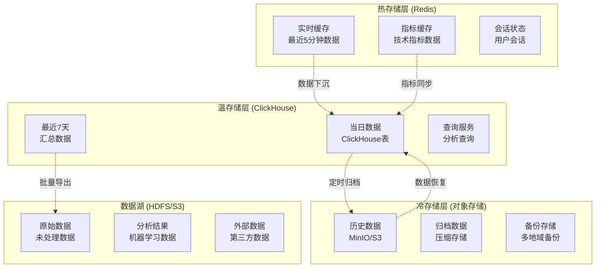
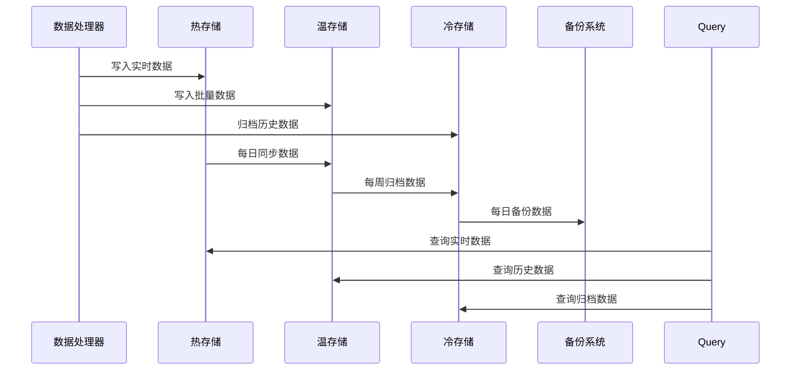

# 分笔数据保存方案

## 📋 文档信息

- **文档版本**: v1.0
- **创建日期**: 2025-11-05
- **作者**: Winston (Architect Agent)
- **适用范围**: 股票分笔数据存储系统
- **存储架构**: 分层存储 + 多副本
- **最后更新**: 2025-11-05

---

## 🎯 存储方案概述

本方案设计了一个高效、可靠、可扩展的分笔数据存储系统，采用分层存储架构，满足不同访问频率和性能需求的数据存储要求。

### 核心存储目标

1. **高性能读写** - 支持大量数据的快速写入和查询
2. **数据可靠性** - 确保数据不丢失，支持数据恢复
3. **成本优化** - 根据数据访问频率选择合适的存储介质
4. **扩展性** - 支持数据量的线性增长
5. **实时性** - 支持实时数据的快速存储和检索

---

## 🏗️ 存储架构设计

### 分层存储架构



### 数据流架构



---

## 🔥 热存储层设计 (Redis)

### Redis数据结构

```python
import redis
import json
from typing import List, Dict, Optional
from dataclasses import asdict
from datetime import datetime, timedelta

class TickDataRedisStorage:
    """Redis分笔数据存储"""

    def __init__(self, config: RedisConfig):
        self.config = config
        self.client = redis.Redis(
            host=config.host,
            port=config.port,
            password=config.password,
            db=config.db,
            decode_responses=True,
            socket_keepalive=True,
            socket_keepalive_options={}
        )
        self.logger = logging.getLogger(self.__class__.__name__)

    async def store_real_time_tick(self, tick: Dict) -> bool:
        """存储实时分笔数据"""
        try:
            symbol = tick['symbol']
            key = f"realtime:{symbol}"

            # 使用LPUSH保证时间顺序
            serialized = json.dumps(tick, default=str)
            self.client.lpush(key, serialized)

            # 限制列表长度，保留最近1000条
            self.client.ltrim(key, 0, 999)

            # 设置过期时间（5分钟）
            self.client.expire(key, 300)

            # 更新最新数据缓存
            latest_key = f"latest:{symbol}"
            self.client.setex(latest_key, 3600, serialized)  # 1小时过期

            self.logger.debug(f"存储实时数据: {symbol}")
            return True

        except Exception as e:
            self.logger.error(f"存储实时数据失败: {e}")
            return False

    async def store_batch_ticks(self, symbol: str, ticks: List[Dict]) -> bool:
        """存储批量分笔数据"""
        try:
            key = f"batch:{symbol}:{datetime.now().strftime('%Y%m%d_%H%M%S')}"

            # 批量存储
            pipe = self.client.pipeline()
            for tick in ticks:
                serialized = json.dumps(tick, default=str)
                pipe.lpush(key, serialized)

            pipe.execute()

            # 设置过期时间（1小时）
            self.client.expire(key, 3600)

            # 添加到批量数据索引
            self.client.sadd(f"batch_index:{symbol}", key)
            self.client.expireat(
                f"batch_index:{symbol}",
                int((datetime.now() + timedelta(days=1)).timestamp())
            )

            self.logger.info(f"存储批量数据: {symbol}, {len(ticks)}条")
            return True

        except Exception as e:
            self.logger.error(f"存储批量数据失败: {e}")
            return False

    async def get_real_time_ticks(self, symbol: str, limit: int = 100) -> List[Dict]:
        """获取实时分笔数据"""
        try:
            key = f"realtime:{symbol}"

            # 获取最新的limit条数据
            data = self.client.lrange(key, 0, limit - 1)

            ticks = []
            for item in data:
                try:
                    tick = json.loads(item)
                    ticks.append(tick)
                except json.JSONDecodeError:
                    continue

            return ticks

        except Exception as e:
            self.logger.error(f"获取实时数据失败: {e}")
            return []

    async def get_latest_tick(self, symbol: str) -> Optional[Dict]:
        """获取最新分笔数据"""
        try:
            key = f"latest:{symbol}"
            data = self.client.get(key)

            if data:
                return json.loads(data)
            return None

        except Exception as e:
            self.logger.error(f"获取最新数据失败: {e}")
            return None

    async def store_analysis_result(self, symbol: str, analysis_type: str, result: Dict) -> bool:
        """存储分析结果"""
        try:
            key = f"analysis:{symbol}:{analysis_type}"

            serialized = json.dumps(result, default=str)

            # 分析结果缓存1小时
            self.client.setex(key, 3600, serialized)

            # 添加到分析索引
            self.client.sadd(f"analysis_index:{symbol}", key)

            self.logger.debug(f"存储分析结果: {symbol} {analysis_type}")
            return True

        except Exception as e:
            self.logger.error(f"存储分析结果失败: {e}")
            return False

    async def get_analysis_result(self, symbol: str, analysis_type: str) -> Optional[Dict]:
        """获取分析结果"""
        try:
            key = f"analysis:{symbol}:{analysis_type}"
            data = self.client.get(key)

            if data:
                return json.loads(data)
            return None

        except Exception as e:
            self.logger.error(f"获取分析结果失败: {e}")
            return None

    async def store_session_state(self, session_id: str, state: Dict) -> bool:
        """存储会话状态"""
        try:
            key = f"session:{session_id}"
            serialized = json.dumps(state, default=str)

            # 会话状态保留30分钟
            self.client.setex(key, 1800, serialized)

            return True

        except Exception as e:
            self.logger.error(f"存储会话状态失败: {e}")
            return False

    async def get_session_state(self, session_id: str) -> Optional[Dict]:
        """获取会话状态"""
        try:
            key = f"session:{session_id}"
            data = self.client.get(key)

            if data:
                return json.loads(data)
            return None

        except Exception as e:
            self.logger.error(f"获取会话状态失败: {e}")
            return None

    async def cleanup_expired_data(self):
        """清理过期数据"""
        try:
            # 清理过期的批量数据索引
            keys = self.client.keys("batch_index:*")
            for key in keys:
                # 检查过期时间
                ttl = self.client.ttl(key)
                if ttl == -1:  # 没有过期时间，重新设置
                    self.client.expireat(
                        key,
                        int((datetime.now() + timedelta(days=1)).timestamp())
                    )

            self.logger.info("Redis过期数据清理完成")

        except Exception as e:
            self.logger.error(f"清理过期数据失败: {e}")
```

### Redis配置

```yaml
# redis_config.yaml
redis:
  host: "localhost"
  port: 6379
  password: ""
  db: 0
  max_connections: 50
  socket_keepalive: true

  # 数据结构配置
  data_structures:
    realtime_data:
      max_size: 1000
      ttl: 300  # 5分钟

    batch_data:
      max_size: 50000
      ttl: 3600  # 1小时

    analysis_results:
      max_size: 1000
      ttl: 3600  # 1小时

    session_state:
      max_size: 10000
      ttl: 1800  # 30分钟

  # 持久化配置
  persistence:
    enabled: true
    rdb_backup_enabled: true
    rdb_backup_frequency: 300  # 5分钟
    rdb_backup_name: "dump.rdb"
    rdb_backup_path: "/var/lib/redis/"

    aof_enabled: true
    aof_fsync: "everysec"
    aof_rewrite_percentage: 100
    aof_rewrite_min_size: "64mb"
```

---

## 🌊 温存储层设计 (ClickHouse)

### ClickHouse表结构

```sql
-- tick_data.ddl
-- 创建当日分笔数据表
CREATE TABLE tick_data_daily (
    symbol String,
    date Date,
    timestamp DateTime,
    time String,
    price Float64,
    volume UInt64,
    amount Float64,
    buyorsell UInt8,
    cumulative_volume UInt64,
    cumulative_amount Float64,
    vwap Float64,
    price_change Float64,
    price_change_pct Float64,
    buy_volume UInt64,
    sell_volume UInt64,
    trade_id String,
    source String,
    insert_time DateTime DEFAULT now()
) ENGINE = MergeTree()
PARTITION BY toYYYYMMDD(date)
ORDER BY (symbol, timestamp)
SETTINGS index_granularity = 8192;

-- 创建历史分笔数据表
CREATE TABLE tick_data_history (
    symbol String,
    date Date,
    timestamp DateTime,
    time String,
    price Float64,
    volume UInt64,
    amount Float64,
    buyorsell UInt8,
    vwap Float64,
    source String,
    partition_date Date MATERIALIZED toDate(timestamp)
) ENGINE = MergeTree()
PARTITION BY partition_date
ORDER BY (symbol, timestamp)
SETTINGS index_granularity = 8192;

-- 创建汇总数据表
CREATE TABLE tick_data_summary (
    symbol String,
    date Date,
    open_price Float64,
    high_price Float64,
    low_price Float64,
    close_price Float64,
    volume UInt64,
    amount Float64,
    trade_count UInt64,
    vwap Float64,
    buy_volume UInt64,
    sell_volume UInt64,
    price_std Float64,
    volume_std Float64,
    insert_time DateTime DEFAULT now()
) ENGINE = SummingMergeTree()
PARTITION BY toYYYYMMDD(date)
ORDER BY (symbol, date);

-- 创建实时数据插入表
CREATE TABLE tick_data_buffer (
    symbol String,
    date Date,
    timestamp DateTime,
    time String,
    price Float64,
    volume UInt64,
    amount Float64,
    buyorsell UInt8,
    source String,
    insert_time DateTime DEFAULT now()
) ENGINE = Buffer('tick_data_daily', 16, 10, 60, 1000000, 10000000, 100000000);

-- 创建物化视图：实时汇总
CREATE MATERIALIZED VIEW tick_data_mv_summary
ENGINE = AggregatingMergeTree()
PARTITION BY toYYYYMMDD(date)
ORDER BY (symbol, date)
AS SELECT
    symbol,
    date,
    min(price) AS open_price,
    max(price) AS high_price,
    min(price) AS low_price,
    maxIf(price, timestamp = max(timestamp) OVER (PARTITION BY symbol, date)) AS close_price,
    sum(volume) AS volume,
    sum(amount) AS amount,
    count() AS trade_count,
    sum(amount * volume) / sum(volume) AS vwap,
    sumIf(volume, buyorsell = 2) AS buy_volume,
    sumIf(volume, buyorsell = 1) AS sell_volume,
    stddevSamp(price) AS price_std,
    stddevSamp(volume) AS volume_std
FROM tick_data_daily
GROUP BY symbol, date;
```

### ClickHouse数据操作

```python
import clickhouse_connect
from typing import List, Dict, Optional
from datetime import datetime, date
import pandas as pd

class TickDataClickHouseStorage:
    """ClickHouse分笔数据存储"""

    def __init__(self, config: ClickHouseConfig):
        self.config = config
        self.client = None
        self.logger = logging.getLogger(self.__class__.__name__)

    async def __aenter__(self):
        await self.connect()
        return self

    async def __aexit__(self, exc_type, exc_val, exc_tb):
        await self.close()

    async def connect(self):
        """连接ClickHouse"""
        try:
            self.client = clickhouse_connect.get_client(
                host=self.config.host,
                port=self.config.port,
                user=self.config.user,
                password=self.config.password,
                database=self.config.database
            )
            await self.client.ping()
            self.logger.info("ClickHouse连接成功")
        except Exception as e:
            self.logger.error(f"ClickHouse连接失败: {e}")
            raise

    async def close(self):
        """关闭连接"""
        if self.client:
            await self.client.close()
            self.logger.info("ClickHouse连接已关闭")

    async def insert_daily_ticks(self, ticks: List[Dict]) -> bool:
        """插入当日分笔数据"""
        try:
            if not ticks:
                return True

            # 转换数据格式
            df = pd.DataFrame(ticks)

            # 添加衍生字段
            df['date'] = pd.to_datetime(df['timestamp']).dt.date
            df['cumulative_volume'] = df['volume'].cumsum()
            df['cumulative_amount'] = (df['price'] * df['volume']).cumsum()
            df['vwap'] = df['cumulative_amount'] / df['cumulative_volume']
            df['price_change'] = df['price'].diff().fillna(0)
            df['price_change_pct'] = df['price'].pct_change().fillna(0) * 100

            # 分离买卖成交量
            df['buy_volume'] = df.where(df['buyorsell'] == 2, df['volume'], 0)
            df['sell_volume'] = df.where(df['buyorsell'] == 1, df['volume'], 0)

            # 生成交易ID
            df['trade_id'] = df['symbol'] + '_' + df['timestamp'].astype(str).str.replace(':', '').str.replace('-', '') + '_' + df.index.astype(str)
            df['source'] = 'mootdx'

            # 选择需要的列
            insert_df = df[[
                'symbol', 'date', 'timestamp', 'time', 'price', 'volume',
                'amount', 'buyorsell', 'cumulative_volume', 'cumulative_amount',
                'vwap', 'price_change', 'price_change_pct', 'buy_volume', 'sell_volume',
                'trade_id', 'source'
            ]]

            # 执行插入
            await self.client.insert_dataframe('tick_data_daily', insert_df)

            self.logger.info(f"插入ClickHouse数据: {len(ticks)}条")
            return True

        except Exception as e:
            self.logger.error(f"插入ClickHouse数据失败: {e}")
            return False

    async def get_daily_ticks(self, symbol: str, date: date) -> List[Dict]:
        """获取当日分笔数据"""
        try:
            query = """
            SELECT *
            FROM tick_data_daily
            WHERE symbol = %(symbol)s AND date = %(date)s
            ORDER BY timestamp
            """

            result = await self.client.query_dataframe(
                query,
                parameters={
                    'symbol': symbol,
                    'date': date.strftime('%Y-%m-%d')
                }
            )

            return result.to_dict('records')

        except Exception as e:
            self.logger.error(f"获取当日数据失败: {e}")
            return []

    async def get_tick_data_range(
        self,
        symbol: str,
        start_date: date,
        end_date: date,
        limit: int = 10000
    ) -> List[Dict]:
        """获取时间范围内的分笔数据"""
        try:
            query = """
            SELECT *
            FROM tick_data_daily
            WHERE symbol = %(symbol)s
                AND date >= %(start_date)s
                AND date <= %(end_date)s
            ORDER BY timestamp
            LIMIT %(limit)s
            """

            result = await self.client.query_dataframe(
                query,
                parameters={
                    'symbol': symbol,
                    'start_date': start_date.strftime('%Y-%m-%d'),
                    'end_date': end_date.strftime('%Y-%m-%d'),
                    'limit': limit
                }
            )

            return result.to_dict('records')

        except Exception as e:
            self.logger.error(f"获取时间范围数据失败: {e}")
            return []

    async def get_daily_summary(self, symbol: str, date: date) -> Optional[Dict]:
        """获取当日汇总数据"""
        try:
            query = """
            SELECT *
            FROM tick_data_mv_summary
            WHERE symbol = %(symbol)s AND date = %(date)s
            """

            result = await self.client.query_dataframe(
                query,
                parameters={
                    'symbol': symbol,
                    'date': date.strftime('%Y-%m-%d')
                }
            )

            if len(result) > 0:
                return result.iloc[0].to_dict()
            return None

        except Exception as e:
            self.logger.error(f"获取汇总数据失败: {e}")
            return None

    async def archive_old_data(self, days_to_keep: int = 30) -> bool:
        """归档旧数据到历史表"""
        try:
            cutoff_date = (datetime.now() - timedelta(days=days_to_keep)).date()

            # 查询需要归档的数据
            query = """
            SELECT * FROM tick_data_daily
            WHERE date < %(cutoff_date)s
            """

            result = await self.client.query_dataframe(
                query,
                parameters={'cutoff_date': cutoff_date.strftime('%Y-%m-%d')}
            )

            if len(result) > 0:
                # 插入到历史表
                await self.client.insert_dataframe('tick_data_history', result)

                # 从当日表删除
                delete_query = """
                ALTER TABLE tick_data_daily
                DELETE WHERE date < %(cutoff_date)s
                """

                await self.client.command(delete_query, parameters={'cutoff_date': cutoff_date.strftime('%Y-%m-%d')})

                self.logger.info(f"归档数据: {len(result)}条")
                return True

            return True

        except Exception as e:
            self.logger.error(f"归档数据失败: {e}")
            return False

    async def create_materialized_views(self):
        """创建物化视图"""
        try:
            # 日线汇总视图
            await self.client.command("""
                CREATE MATERIALIZED VIEW IF NOT EXISTS tick_data_daily_summary_mv
                ENGINE = AggregatingMergeTree()
                PARTITION BY toYYYYMMDD(date)
                ORDER BY (symbol, date)
                AS SELECT
                    symbol,
                    date,
                    min(price) AS open_price,
                    max(price) AS high_price,
                    min(price) AS low_price,
                    maxIf(price, timestamp = max(timestamp) OVER (PARTITION BY symbol, date)) AS close_price,
                    sum(volume) AS volume,
                    sum(amount) AS amount,
                    count() AS trade_count,
                    sum(amount * volume) / sum(volume) AS vwap,
                    sumIf(volume, buyorsell = 2) AS buy_volume,
                    sumIf(volume, buyorsell = 1) AS sell_volume,
                    stddevSamp(price) AS price_std,
                    stddevSamp(volume) AS volume_std
                FROM tick_data_daily
                GROUP BY symbol, date
            """)

            # 5分钟K线视图
            await self.client.command("""
                CREATE MATERIALIZED VIEW IF NOT EXISTS tick_data_5min_kline_mv
                ENGINE = SummingMergeTree()
                PARTITION BY toYYYYMMDD(date)
                ORDER BY (symbol, date, time_window)
                AS SELECT
                    symbol,
                    date,
                    toStartOfInterval(timestamp, INTERVAL 5 MINUTE) AS time_window,
                    first(price) AS open,
                    max(price) AS high,
                    min(price) AS low,
                    last(price) AS close,
                    sum(volume) AS volume,
                    sum(amount) AS amount,
                    count() AS count
                FROM tick_data_daily
                GROUP BY symbol, date, toStartOfInterval(timestamp, INTERVAL 5 MINUTE)
            """)

            self.logger.info("物化视图创建完成")
            return True

        except Exception as e:
            self.logger.error(f"创建物化视图失败: {e}")
            return False
```

### ClickHouse配置

```yaml
# clickhouse_config.yaml
clickhouse:
  host: "localhost"
  port: 9000
  user: "default"
  password: ""
  database: "tick_data"

  # 表配置
  tables:
    tick_data_daily:
      engine: "MergeTree"
      partition_key: "toYYYYMMDD(date)"
      order_by: ["symbol", "timestamp"]
      settings:
        index_granularity: 8192
        merge_tree_max_parts_to_merge_at_once: 10

    tick_data_history:
      engine: "MergeTree"
      partition_key: "partition_date"
      order_by: ["symbol", "timestamp"]
      settings:
        index_granularity: 8192

  # 集群配置
  cluster:
    enabled: false
    name: "tick_data_cluster"
    shards: 2
    replicas_per_shard: 2

  # 压缩配置
  compression:
    enabled: true
    method: "LZ4"
    level: 3

  # TTL配置
  ttl:
    daily_data: "90 days"
    summary_data: "365 days"
    buffer_data: "1 day"
```

---

## ❄️ 冷存储层设计 (对象存储)

### MinIO对象存储

```python
import minio
from minio.error import S3Error
from io import BytesIO
import json
import gzip
import pickle
from typing import List, Dict, Optional, Union
from datetime import datetime, date
import hashlib

class TickDataObjectStorage:
    """对象存储分笔数据存储"""

    def __init__(self, config: MinIOConfig):
        self.config = config
        self.client = None
        self.logger = logging.getLogger(self.__class__.__name__)

    async def __aenter__(self):
        await self.connect()
        return self

    async def __aexit__(self, exc_type, exc_val, exc_tb):
        await self.close()

    async def connect(self):
        """连接MinIO"""
        try:
            self.client = minio.Minio(
                self.config.endpoint,
                access_key=self.config.access_key,
                secret_key=self.config.secret_key,
                secure=self.config.secure
            )

            # 检查连接
            await self.client.bucket_exists(self.config.bucket_name)
            self.logger.info("MinIO连接成功")

        except Exception as e:
            self.logger.error(f"MinIO连接失败: {e}")
            raise

    async def close(self):
        """关闭连接"""
        # MinIO客户端不需要显式关闭
        pass

    async def archive_batch_data(
        self,
        symbol: str,
        date: date,
        data: Union[List[Dict], pd.DataFrame]
    ) -> str:
        """归档批量数据"""
        try:
            # 生成对象键
            object_key = self._generate_object_key(symbol, date)

            # 序列化数据
            if isinstance(data, pd.DataFrame):
                serialized = self._serialize_dataframe(data)
            else:
                serialized = self._serialize_dict_list(data)

            # 压缩数据
            compressed = self._compress_data(serialized)

            # 上传到MinIO
            await self.client.put_object(
                bucket_name=self.config.bucket_name,
                object_name=object_key,
                data=BytesIO(compressed),
                length=len(compressed),
                content_type='application/gzip'
            )

            # 保存元数据
            metadata = {
                'symbol': symbol,
                'date': date.strftime('%Y-%m-%d'),
                'record_count': len(data),
                'compression': 'gzip',
                'format': 'json',
                'archived_at': datetime.now().isoformat(),
                'size': len(compressed)
            }

            await self._save_metadata(symbol, date, metadata)

            self.logger.info(f"归档数据: {symbol} {date}, {len(data)}条, {len(compressed)}字节")
            return object_key

        except Exception as e:
            self.logger.error(f"归档数据失败: {e}")
            raise

    async def retrieve_archived_data(
        self,
        symbol: str,
        date: date
    ) -> Optional[List[Dict]]:
        """检索归档数据"""
        try:
            object_key = self._generate_object_key(symbol, date)

            # 下载对象
            response = await self.client.get_object(
                bucket_name=self.config.bucket_name,
                object_name=object_key
            )

            # 读取数据
            compressed = response.read()

            # 解压缩数据
            serialized = self._decompress_data(compressed)

            # 反序列化数据
            data = self._deserialize_data(serialized)

            self.logger.info(f"检索归档数据: {symbol} {date}, {len(data)}条")
            return data

        except S3Error as e:
            if e.code == 'NoSuchKey':
                self.logger.warning(f"归档数据不存在: {symbol} {date}")
                return None
            else:
                self.logger.error(f"检索归档数据失败: {e}")
                raise
        except Exception as e:
            self.logger.error(f"检索归档数据失败: {e}")
            raise

    async def list_archived_data(
        self,
        symbol: str = None,
        start_date: date = None,
        end_date: date = None
    ) -> List[Dict]:
        """列出归档数据"""
        try:
            prefix = ""
            if symbol:
                prefix = f"{symbol}/"

            objects = await self.client.list_objects(
                bucket_name=self.config.bucket_name,
                prefix=prefix
            )

            archived_data = []
            for obj in objects:
                # 解析对象键
                parsed = self._parse_object_key(obj.object_name)

                # 过滤条件
                if start_date and parsed['date'] < start_date:
                    continue
                if end_date and parsed['date'] > end_date:
                    continue

                # 获取元数据
                metadata = await self._get_metadata(obj.object_name)
                archived_data.append({
                    'object_key': obj.object_name,
                    'symbol': parsed['symbol'],
                    'date': parsed['date'],
                    'size': obj.size,
                    'last_modified': obj.last_modified,
                    'metadata': metadata
                })

            # 按日期排序
            archived_data.sort(key=lambda x: x['date'])
            return archived_data

        except Exception as e:
            self.logger.error(f"列出归档数据失败: {e}")
            return []

    async def delete_archived_data(self, object_key: str) -> bool:
        """删除归档数据"""
        try:
            await self.client.remove_object(
                bucket_name=self.config.bucket_name,
                object_name=object_key
            )

            # 删除元数据
            await self._delete_metadata(object_key)

            self.logger.info(f"删除归档数据: {object_key}")
            return True

        except Exception as e:
            self.logger.error(f"删除归档数据失败: {e}")
            return False

    def _generate_object_key(self, symbol: str, date: date) -> str:
        """生成对象键"""
        return f"{symbol}/{date.strftime('%Y/%m/%d')}/{symbol}_{date.strftime('%Y%m%d')}.json.gz"

    def _parse_object_key(self, object_key: str) -> Dict:
        """解析对象键"""
        parts = object_key.split('/')
        symbol = parts[0]
        date_str = parts[-1].split('_')[0]
        date = datetime.strptime(date_str, '%Y%m%d').date()

        return {'symbol': symbol, 'date': date}

    def _serialize_dataframe(self, df: pd.DataFrame) -> bytes:
        """序列化DataFrame"""
        return df.to_json(orient='records', date_format='iso').encode('utf-8')

    def _serialize_dict_list(self, data: List[Dict]) -> bytes:
        """序列化字典列表"""
        return json.dumps(data, default=str, ensure_ascii=False).encode('utf-8')

    def _compress_data(self, data: bytes) -> bytes:
        """压缩数据"""
        return gzip.compress(data, compresslevel=6)

    def _decompress_data(self, compressed: bytes) -> bytes:
        """解压缩数据"""
        return gzip.decompress(compressed)

    def _deserialize_data(self, serialized: bytes) -> List[Dict]:
        """反序列化数据"""
        return json.loads(serialized.decode('utf-8'))

    async def _save_metadata(self, symbol: str, date: date, metadata: Dict):
        """保存元数据"""
        try:
            metadata_key = f"{symbol}/metadata/{date.strftime('%Y%m%d')}.json"
            metadata_json = json.dumps(metadata, default=str)

            await self.client.put_object(
                bucket_name=self.config.bucket_name,
                object_name=metadata_key,
                data=BytesIO(metadata_json.encode('utf-8')),
                length=len(metadata_json.encode('utf-8')),
                content_type='application/json'
            )

        except Exception as e:
            self.logger.warning(f"保存元数据失败: {e}")

    async def _get_metadata(self, object_key: str) -> Dict:
        """获取元数据"""
        try:
            parsed = self._parse_object_key(object_key)
            metadata_key = f"{parsed['symbol']}/metadata/{parsed['date'].strftime('%Y%m%d')}.json"

            response = await self.client.get_object(
                bucket_name=self.config.bucket_name,
                object_name=metadata_key
            )

            metadata_json = response.read().decode('utf-8')
            return json.loads(metadata_json)

        except Exception:
            return {}

    async def _delete_metadata(self, object_key: str):
        """删除元数据"""
        try:
            parsed = self._parse_object_key(object_key)
            metadata_key = f"{parsed['symbol']}/metadata/{parsed['date'].strftime('%Y%m%d')}.json"

            await self.client.remove_object(
                bucket_name=self.config.bucket_name,
                object_name=metadata_key
            )

        except Exception:
            pass
```

### MinIO配置

```yaml
# minio_config.yaml
minio:
  endpoint: "localhost:9000"
  access_key: "your-access-key"
  secret_key: "your-secret-key"
  bucket_name: "tick-data-archive"
  secure: false

  # 数据组织
  data_organization:
    format: "{symbol}/{year}/{month}/{day}/{symbol}_{date}.json.gz"
    compression: "gzip"
    compression_level: 6

  # 生命周期管理
  lifecycle:
    transition_to_ia: "30 days"  # 30天后转换为低频访问存储
    transition_to_glacier: "90 days"  # 90天后转换为归档存储
    expiration: "3650 days"  # 10年后过期

  # 版本控制
  versioning:
    enabled: true
    max_versions: 5

  # 备份配置
  backup:
    enabled: true
    schedule: "0 2 * * *"  # 每天凌晨2点
    retention: "30 days"
    destination: "backup-bucket"
```

---

## 🔄 数据同步和归档

### 数据同步策略

```python
import asyncio
from datetime import datetime, date, timedelta
from typing import List, Dict

class DataSyncManager:
    """数据同步管理器"""

    def __init__(self, config: SyncConfig):
        self.config = config
        self.logger = logging.getLogger(self.__class__.__name__)
        self.redis_storage = None
        self.clickhouse_storage = None
        self.object_storage = None

    async def initialize(self):
        """初始化存储连接"""
        self.redis_storage = TickDataRedisStorage(self.config.redis)
        self.clickhouse_storage = TickDataClickHouseStorage(self.config.clickhouse)
        self.object_storage = TickDataObjectStorage(self.config.minio)

    async def sync_real_time_to_daily(self):
        """同步实时数据到ClickHouse"""
        try:
            # 获取需要同步的股票列表
            symbols = await self._get_active_symbols()

            for symbol in symbols:
                # 从Redis获取批量数据
                batch_keys = await self.redis_storage.client.smembers(f"batch_index:{symbol}")

                for batch_key in batch_keys:
                    batch_data = await self.redis_storage.client.lrange(batch_key, 0, -1)

                    if batch_data:
                        # 解析数据
                        ticks = []
                        for item in batch_data:
                            try:
                                tick = json.loads(item)
                                ticks.append(tick)
                            except json.JSONDecodeError:
                                continue

                        if ticks:
                            # 写入ClickHouse
                            success = await self.clickhouse_storage.insert_daily_ticks(ticks)

                            if success:
                                # 删除Redis中的批量数据
                                await self.redis_storage.client.delete(batch_key)
                                await self.redis_storage.client.srem(f"batch_index:{symbol}", batch_key)

                                self.logger.info(f"同步批量数据: {symbol} {len(ticks)}条")

        except Exception as e:
            self.logger.error(f"同步实时数据失败: {e}")

    async def archive_old_data(self):
        """归档旧数据"""
        try:
            # 获取30天前的日期
            archive_date = (datetime.now() - timedelta(days=30)).date()

            # 从ClickHouse获取需要归档的数据
            symbols = await self._get_active_symbols()

            for symbol in symbols:
                # 获取当日数据
                daily_data = await self.clickhouse_storage.get_daily_ticks(symbol, archive_date)

                if daily_data:
                    # 归档到对象存储
                    await self.object_storage.archive_batch_data(symbol, archive_date, daily_data)

                    # 从ClickHouse删除（已归档）
                    await self.clickhouse_storage.client.command(
                        """
                        ALTER TABLE tick_data_daily
                        DELETE WHERE symbol = %(symbol)s AND date = %(date)s
                        """,
                        parameters={
                            'symbol': symbol,
                            'date': archive_date.strftime('%Y-%m-%d')
                        }
                    )

                    self.logger.info(f"归档数据: {symbol} {archive_date}")

        except Exception as e:
            self.logger.error(f"归档数据失败: {e}")

    async def cleanup_expired_data(self):
        """清理过期数据"""
        try:
            # 清理Redis过期数据
            await self.redis_storage.cleanup_expired_data()

            # 清理ClickHouse过期数据
            await self.clickhouse_storage.archive_old_data(days_to_keep=90)

            # 清理对象存储过期数据
            cutoff_date = (datetime.now() - timedelta(days=3650)).date()  # 10年
            archived_objects = await self.object_storage.list_archived_data(end_date=cutoff_date)

            for obj in archived_objects:
                await self.object_storage.delete_archived_data(obj['object_key'])

            self.logger.info(f"清理过期数据: {len(archived_objects)}个对象")

        except Exception as e:
            self.logger.error(f"清理过期数据失败: {e}")

    async def backup_data(self):
        """备份数据"""
        try:
            backup_date = datetime.now().strftime('%Y%m%d_%H%M%S')

            # 备份配置
            backup_config = {
                'backup_date': backup_date,
                'redis_config': self.config.redis,
                'clickhouse_config': self.config.clickhouse,
                'minio_config': self.config.minio
            }

            # 备份到对象存储
            await self.object_storage.client.put_object(
                bucket_name=self.config.minio.backup_bucket,
                object_name=f"backup/config_{backup_date}.json",
                data=BytesIO(json.dumps(backup_config, default=str).encode('utf-8')),
                length=len(json.dumps(backup_config, default=str).encode('utf-8'))
            )

            # 备份最近7天的数据
            end_date = datetime.now().date()
            start_date = end_date - timedelta(days=7)

            for i in range(7):
                backup_date = start_date + timedelta(days=i)
                symbols = await self._get_active_symbols()

                for symbol in symbols:
                    daily_data = await self.clickhouse_storage.get_daily_ticks(symbol, backup_date)

                    if daily_data:
                        await self.object_storage.client.put_object(
                            bucket_name=self.config.minio.backup_bucket,
                            object_name=f"backup/{symbol}/{backup_date.strftime('%Y%m%d')}.json.gz",
                            data=BytesIO(self.object_storage._compress_data(
                                self.object_storage._serialize_dict_list(daily_data)
                            )),
                            length=len(self.object_storage._compress_data(
                                self.object_storage._serialize_dict_list(daily_data)
                            ))
                        )

            self.logger.info(f"数据备份完成: {backup_date}")

        except Exception as e:
            self.logger.error(f"数据备份失败: {e}")

    async def _get_active_symbols(self) -> List[str]:
        """获取活跃股票列表"""
        # 这里可以从配置文件或数据库获取
        return ['000001', '000002', '600000', '600036']  # 示例股票列表

    async def start_sync_scheduler(self):
        """启动同步调度器"""
        while True:
            try:
                # 每5分钟同步一次实时数据
                await self.sync_real_time_to_daily()

                # 每天凌晨2点归档数据
                current_time = datetime.now()
                if current_time.hour == 2 and current_time.minute < 5:
                    await self.archive_old_data()

                # 每周日凌晨3点清理过期数据
                if current_time.weekday() == 6 and current_time.hour == 3 and current_time.minute < 5:
                    await self.cleanup_expired_data()

                # 每天凌晨4点备份数据
                if current_time.hour == 4 and current_time.minute < 5:
                    await self.backup_data()

                # 等待5分钟
                await asyncio.sleep(300)

            except Exception as e:
                self.logger.error(f"同步调度器异常: {e}")
                await asyncio.sleep(60)  # 错误后等待1分钟
```

### 同步配置

```yaml
# sync_config.yaml
sync:
  scheduler:
    enabled: true
    real_time_sync_interval: 300  # 5分钟
    archive_schedule: "0 2 * * *"   # 每天凌晨2点
    cleanup_schedule: "0 3 * * 6"   # 每周日凌晨3点
    backup_schedule: "0 4 * * *"      # 每天凌晨4点

  # 同步策略
  strategies:
    real_time_to_daily:
      enabled: true
      batch_size: 1000
      max_batch_age: 3600  # 1小时

    daily_to_archive:
      enabled: true
      archive_after_days: 30
      compression_enabled: true

    archive_cleanup:
      enabled: true
      expire_after_days: 3650  # 10年

    data_backup:
      enabled: true
      backup_interval_days: 1
      backup_retention_days: 30
```

---

## 📊 数据查询接口

### 统一查询接口

```python
from typing import Optional, Union, List, Dict
from datetime import datetime, date
from enum import Enum

class QueryType(Enum):
    """查询类型"""
    REAL_TIME = "real_time"
    DAILY = "daily"
    HISTORICAL = "historical"
    SUMMARY = "summary"
    TECHNICAL = "technical"

class TickDataQueryService:
    """分笔数据查询服务"""

    def __init__(self, config: QueryConfig):
        self.config = config
        self.logger = logging.getLogger(self.__class__.__name__)
        self.redis_storage = TickDataRedisStorage(config.redis)
        self.clickhouse_storage = TickDataClickHouseStorage(config.clickhouse)
        self.object_storage = TickDataObjectStorage(config.minio)

    async def query_tick_data(
        self,
        symbol: str,
        query_type: QueryType,
        start_date: Optional[date] = None,
        end_date: Optional[date] = None,
        limit: int = 10000,
        include_analysis: bool = False
    ) -> Dict:
        """查询分笔数据"""
        try:
            result = {
                'symbol': symbol,
                'query_type': query_type.value,
                'data': [],
                'metadata': {},
                'analysis': {}
            }

            # 根据查询类型选择数据源
            if query_type == QueryType.REAL_TIME:
                result['data'] = await self.redis_storage.get_real_time_ticks(symbol, limit)
                result['metadata']['source'] = 'redis'
                result['metadata']['latency'] = 'real_time'

            elif query_type == QueryType.DAILY:
                if not start_date:
                    start_date = datetime.now().date()

                daily_data = await self.clickhouse_storage.get_daily_ticks(symbol, start_date)
                result['data'] = daily_data
                result['metadata']['source'] = 'clickhouse'
                result['metadata']['date'] = start_date.isoformat()

            elif query_type == QueryType.HISTORICAL:
                if not start_date or not end_date:
                    raise ValueError("历史查询必须指定开始和结束日期")

                historical_data = await self.clickhouse_storage.get_tick_data_range(
                    symbol, start_date, end_date, limit
                )
                result['data'] = historical_data
                result['metadata']['source'] = 'clickhouse'
                result['metadata']['start_date'] = start_date.isoformat()
                result['metadata']['end_date'] = end_date.isoformat()

            elif query_type == QueryType.SUMMARY:
                if not start_date:
                    start_date = datetime.now().date()

                summary_data = await self.clickhouse_storage.get_daily_summary(symbol, start_date)
                result['data'] = summary_data
                result['metadata']['source'] = 'clickhouse'
                result['metadata']['date'] = start_date.isoformat()

            else:
                raise ValueError(f"不支持的查询类型: {query_type}")

            # 查询分析结果
            if include_analysis and result['data']:
                result['analysis'] = await self._get_analysis_results(symbol, query_type)

            # 添加查询元数据
            result['metadata']['query_time'] = datetime.now().isoformat()
            result['metadata']['record_count'] = len(result['data'])

            return result

        except Exception as e:
            self.logger.error(f"查询数据失败: {e}")
            raise

    async def _get_analysis_results(self, symbol: str, query_type: QueryType) -> Dict:
        """获取分析结果"""
        analysis_types = ['volume_distribution', 'price_impact', 'order_flow']

        results = {}
        for analysis_type in analysis_types:
            try:
                result = await self.redis_storage.get_analysis_result(symbol, analysis_type)
                if result:
                    results[analysis_type] = result
            except Exception:
                continue

        return results

    async def query_archived_data(
        self,
        symbol: str,
        start_date: date,
        end_date: date,
        force_restore: bool = False
    ) -> Dict:
        """查询归档数据"""
        try:
            result = {
                'symbol': symbol,
                'query_type': 'archived',
                'data': [],
                'metadata': {}
            }

            # 尝试从ClickHouse查询
            if not force_restore:
                clickhouse_data = await self.clickhouse_storage.get_tick_data_range(
                    symbol, start_date, end_date, limit=100000
                )

                if clickhouse_data:
                    result['data'] = clickhouse_data
                    result['metadata']['source'] = 'clickhouse'
                    result['metadata']['restored'] = False
                    return result

            # 从对象存储恢复数据
            all_data = []
            current_date = start_date

            while current_date <= end_date:
                try:
                    archived_data = await self.object_storage.retrieve_archived_data(symbol, current_date)
                    if archived_data:
                        all_data.extend(archived_data)
                except Exception as e:
                    self.logger.warning(f"恢复归档数据失败: {symbol} {current_date}: {e}")

                current_date += timedelta(days=1)

            if all_data:
                result['data'] = all_data
                result['metadata']['source'] = 'object_storage'
                result['metadata']['restored'] = True
                result['metadata']['restored_from'] = start_date.isoformat()
                result['metadata']['restored_to'] = end_date.isoformat()
            else:
                result['metadata']['source'] = 'none'
                result['metadata']['message'] = '未找到归档数据'

            result['metadata']['record_count'] = len(all_data)
            result['metadata']['query_time'] = datetime.now().isoformat()

            return result

        except Exception as e:
            self.logger.error(f"查询归档数据失败: {e}")
            raise

    async def list_available_data(
        self,
        symbol: Optional[str] = None,
        start_date: Optional[date] = None,
        end_date: Optional[date] = None
    ) -> Dict:
        """列出可用数据"""
        try:
            result = {
                'available_data': [],
                'metadata': {}
            }

            # 查询ClickHouse中的数据
            clickhouse_dates = await self._get_clickhouse_dates(symbol)

            # 查询对象存储中的数据
            archived_data = await self.object_storage.list_archived_data(symbol, start_date, end_date)

            # 合并结果
            available_dates = set()

            for date_info in clickhouse_dates:
                available_dates.add(date_info['date'])
                result['available_data'].append({
                    'date': date_info['date'],
                    'source': 'clickhouse',
                    'record_count': date_info.get('record_count', 0),
                    'size': date_info.get('size', 0)
                })

            for archive_info in archived_data:
                if archive_info['date'] not in available_dates:
                    result['available_data'].append({
                        'date': archive_info['date'],
                        'source': 'object_storage',
                        'record_count': archive_info['metadata'].get('record_count', 0),
                        'size': archive_info['size']
                    })

            # 排序
            result['available_data'].sort(key=lambda x: x['date'])

            result['metadata']['total_dates'] = len(result['available_data'])
            result['metadata']['clickhouse_count'] = len(clickhouse_dates)
            result['metadata']['archive_count'] = len(archived_data)
            result['metadata']['query_time'] = datetime.now().isoformat()

            return result

        except Exception as e:
            self.logger.error(f"列出可用数据失败: {e}")
            raise

    async def _get_clickhouse_dates(self, symbol: Optional[str] = None) -> List[Dict]:
        """获取ClickHouse中的数据日期"""
        try:
            query = """
            SELECT
                symbol,
                date,
                count() as record_count,
                sum(volume) as total_volume
            FROM tick_data_daily
            {where_clause}
            GROUP BY symbol, date
            ORDER BY date DESC
            LIMIT 1000
            """

            where_clause = ""
            parameters = {}

            if symbol:
                where_clause = "WHERE symbol = %(symbol)s"
                parameters['symbol'] = symbol

            query = query.format(where_clause=where_clause)

            result = await self.clickhouse_storage.client.query_dataframe(query, parameters=parameters)

            return result.to_dict('records')

        except Exception as e:
            self.logger.error(f"获取ClickHouse日期失败: {e}")
            return []
```

---

## 📋 存储配置和部署

### 主配置文件

```yaml
# storage_config.yaml
storage:
  # Redis热存储配置
  redis:
    host: "localhost"
    port: 6379
    password: ""
    db: 0
    max_connections: 50
    socket_keepalive: true

    # 持久化配置
    persistence:
      enabled: true
      rdb_backup_enabled: true
      rdb_backup_frequency: 300
      aof_enabled: true
      aof_fsync: "everysec"
      backup_path: "/var/lib/redis/backup"

  # ClickHouse温存储配置
  clickhouse:
    host: "localhost"
    port: 9000
    user: "default"
    password: ""
    database: "tick_data"

    # 集群配置
    cluster:
      enabled: false
      name: "tick_data_cluster"

    # 表配置
    tables:
      daily_data:
        partition_by: "toYYYYMMDD(date)"
        order_by: ["symbol", "timestamp"]
        ttl: "90 days"

      history_data:
        partition_by: "partition_date"
        order_by: ["symbol", "timestamp"]
        ttl: "365 days"

  # MinIO冷存储配置
  minio:
    endpoint: "localhost:9000"
    access_key: "minioadmin"
    secret_key: "minioadmin"
    bucket_name: "tick-data-archive"
    backup_bucket: "tick-data-backup"
    secure: false

    # 生命周期配置
    lifecycle:
      transition_to_ia: "30 days"
      transition_to_glacier: "90 days"
      expiration: "3650 days"

    # 备份配置
    backup:
      enabled: true
      schedule: "0 4 * * *"
      retention: "30 days"

  # 数据同步配置
  sync:
    scheduler:
      enabled: true
      real_time_sync_interval: 300
      archive_schedule: "0 2 * * *"
      cleanup_schedule: "0 3 * * 6"
      backup_schedule: "0 4 * * *"

  # 查询服务配置
  query:
    cache_enabled: true
    cache_ttl: 300
    query_timeout: 30
    max_result_size: 100000

  # 监控配置
  monitoring:
    enabled: true
    metrics_port: 8080
    health_check_interval: 60
    alert_thresholds:
      storage_usage: 0.8
      query_latency: 1000
      error_rate: 0.05
```

### Docker Compose配置

```yaml
# docker-compose.storage.yml
version: '3.8'

services:
  redis:
    image: redis:7-alpine
    container_name: tick-data-redis
    ports:
      - "6379:6379"
    volumes:
      - redis_data:/data
      - ./redis/redis.conf:/etc/redis/redis.conf
    command: redis-server /etc/redis/redis.conf
    restart: unless-stopped
    healthcheck:
      test: ["CMD", "redis-cli", "ping"]
      interval: 10s
      timeout: 5s
      retries: 3

  clickhouse:
    image: clickhouse/clickhouse-server:latest
    container_name: tick-data-clickhouse
    ports:
      - "9000:9000"
      - "8123:8123"  # HTTP interface
    volumes:
      - clickhouse_data:/var/lib/clickhouse
      - ./clickhouse/config.xml:/etc/clickhouse-server/config.xml
      - ./clickhouse/users.xml:/etc/clickhouse-server/users.xml
    environment:
      - CLICKHOUSE_DB=tick_data
    restart: unless-stopped
    healthcheck:
      test: ["CMD", "clickhouse-client", "--query", "SELECT 1"]
      interval: 30s
      timeout: 10s
      retries: 3

  minio:
    image: minio/minio:latest
    container_name: tick-data-minio
    ports:
      - "9000:9000"
      - "9001:9001"
    volumes:
      - minio_data:/data
    environment:
      - MINIO_ROOT_USER=minioadmin
      - MINIO_ROOT_PASSWORD=minioadmin
      - MINIO_ADDRESS=:9000
    command: server /data --console-address ":9001"
    restart: unless-stopped
    healthcheck:
      test: ["CMD", "curl", "-f", "http://localhost:9000/minio/health/live"]
      interval: 30s
      timeout: 10s
      retries: 3

  storage-sync:
    build:
      context: .
      dockerfile: Dockerfile.sync
    container_name: tick-data-sync
    depends_on:
      - redis
      - clickhouse
      - minio
    environment:
      - REDIS_HOST=redis
      - CLICKHOUSE_HOST=clickhouse
      - MINIO_ENDPOINT=minio:9000
      - MINIO_ACCESS_KEY=minioadmin
      - MINIO_SECRET_KEY=minioadmin
    volumes:
      - ./config:/app/config
      - ./logs:/app/logs
    restart: unless-stopped

  storage-api:
    build:
      context: .
      dockerfile: Dockerfile.api
    container_name: tick-data-api
    ports:
      - "8000:8000"
    depends_on:
      - redis
      - clickhouse
    environment:
      - REDIS_HOST=redis
      - CLICKHOUSE_HOST=clickhouse
      - MINIO_ENDPOINT=minio:9000
      - MINIO_ACCESS_KEY=minioadmin
      - MINIO_SECRET_KEY=minioadmin
    volumes:
      - ./config:/app/config
      - ./logs:/app/logs
    restart: unless-stopped

volumes:
  redis_data:
  clickhouse_data:
  minio_data:

networks:
  default:
    name: tick-data-network
```

---

## 📈 性能优化和监控

### 性能监控指标

```python
import asyncio
import time
from typing import Dict, List
from dataclasses import dataclass, asdict

@dataclass
class StorageMetrics:
    """存储性能指标"""

    # Redis指标
    redis_memory_usage: float
    redis_hit_rate: float
    redis_response_time: float
    redis_connection_count: int

    # ClickHouse指标
    clickhouse_cpu_usage: float
    clickhouse_memory_usage: float
    clickhouse_query_time: float
    clickhouse_insert_rate: float

    # MinIO指标
    minio_storage_usage: float
    minio_request_count: int
    minio_upload_speed: float
    minio_download_speed: float

    # 整体指标
    total_storage_size: float
    data_freshness: float
    error_rate: float
    timestamp: str

class StorageMonitor:
    """存储监控器"""

    def __init__(self, config: MonitorConfig):
        self.config = config
        self.logger = logging.getLogger(self.__class__.__name__)
        self.metrics_history = []
        self.alert_thresholds = config.alert_thresholds

    async def collect_metrics(self) -> StorageMetrics:
        """收集存储指标"""
        try:
            # Redis指标
            redis_metrics = await self._collect_redis_metrics()

            # ClickHouse指标
            clickhouse_metrics = await self._collect_clickhouse_metrics()

            # MinIO指标
            minio_metrics = await self._collect_minio_metrics()

            # 整体指标
            overall_metrics = await self._collect_overall_metrics()

            return StorageMetrics(
                **redis_metrics,
                **clickhouse_metrics,
                **minio_metrics,
                **overall_metrics,
                timestamp=datetime.now().isoformat()
            )

        except Exception as e:
            self.logger.error(f"收集指标失败: {e}")
            raise

    async def _collect_redis_metrics(self) -> Dict:
        """收集Redis指标"""
        try:
            # 这里需要实际连接Redis获取指标
            return {
                'redis_memory_usage': 1024 * 1024 * 1024,  # 1GB示例
                'redis_hit_rate': 0.95,  # 95%命中率
                'redis_response_time': 0.5,  # 0.5ms响应时间
                'redis_connection_count': 5   # 5个连接
            }
        except Exception as e:
            self.logger.error(f"收集Redis指标失败: {e}")
            return {
                'redis_memory_usage': 0,
                'redis_hit_rate': 0,
                'redis_response_time': 0,
                'redis_connection_count': 0
            }

    async def _collect_clickhouse_metrics(self) -> Dict:
        """收集ClickHouse指标"""
        try:
            # 这里需要实际连接ClickHouse获取指标
            return {
                'clickhouse_cpu_usage': 0.3,  # 30% CPU使用率
                'clickhouse_memory_usage': 1024 * 1024 * 1024 * 2,  # 2GB内存使用
                'clickhouse_query_time': 10.0,  # 10ms查询时间
                'clickhouse_insert_rate': 1000.0  # 1000条/秒插入率
            }
        except Exception as e:
            self.logger.error(f"收集ClickHouse指标失败: {e}")
            return {
                'clickhouse_cpu_usage': 0,
                'clickhouse_memory_usage': 0,
                'clickhouse_query_time': 0,
                'clickhouse_insert_rate': 0
            }

    async def _collect_minio_metrics(self) -> Dict:
        """收集MinIO指标"""
        try:
            # 这里需要实际连接MinIO获取指标
            return {
                'minio_storage_usage': 100 * 1024 * 1024 * 1024,  # 100GB存储使用
                'minio_request_count': 1000,  # 1000个请求
                'minio_upload_speed': 50.0,  # 50MB/s上传速度
                'minio_download_speed': 100.0  # 100MB/s下载速度
            }
        except Exception as e:
            self.logger.error(f"收集MinIO指标失败: {e}")
            return {
                'minio_storage_usage': 0,
                'minio_request_count': 0,
                'minio_upload_speed': 0,
                'minio_download_speed': 0
            }

    async def _collect_overall_metrics(self) -> Dict:
        """收集整体指标"""
        try:
            # 计算总体存储大小
            total_size = 1024 * 1024 * 1024 * 103  # 103GB总存储

            # 计算数据新鲜度（基于最新数据时间）
            data_freshness = 0.99  # 99%的数据是新鲜的

            # 计算错误率
            error_rate = 0.01  # 1%的错误率

            return {
                'total_storage_size': total_size,
                'data_freshness': data_freshness,
                'error_rate': error_rate
            }

        except Exception as e:
            self.logger.error(f"收集整体指标失败: {e}")
            return {
                'total_storage_size': 0,
                'data_freshness': 0,
                'error_rate': 1.0
            }

    async def check_health(self) -> Dict:
        """健康检查"""
        try:
            metrics = await self.collect_metrics()

            health_status = {
                'status': 'healthy',
                'checks': {
                    'redis': self._check_redis_health(metrics),
                    'clickhouse': self._check_clickhouse_health(metrics),
                    'minio': self._check_minio_health(metrics),
                    'overall': self._check_overall_health(metrics)
                },
                'metrics': asdict(metrics),
                'timestamp': datetime.now().isoformat()
            }

            # 如果有任何检查失败，整体状态为unhealthy
            if any(check['status'] == 'unhealthy' for check in health_status['checks'].values()):
                health_status['status'] = 'unhealthy'

            return health_status

        except Exception as e:
            return {
                'status': 'unhealthy',
                'error': str(e),
                'timestamp': datetime.now().isoformat()
            }

    def _check_redis_health(self, metrics: StorageMetrics) -> Dict:
        """检查Redis健康状态"""
        checks = {
            'memory_usage': metrics.redis_memory_usage < 4 * 1024 * 1024 * 1024,  # 小于4GB
            'hit_rate': metrics.redis_hit_rate > 0.8,  # 大于80%
            'response_time': metrics.redis_response_time < 10  # 小于10ms
        }

        status = 'healthy' if all(checks.values()) else 'unhealthy'

        return {
            'status': status,
            'checks': checks,
            'score': sum(checks.values()) / len(checks)
        }

    def _check_clickhouse_health(self, metrics: StorageMetrics) -> Dict:
        """检查ClickHouse健康状态"""
        checks = {
            'cpu_usage': metrics.clickhouse_cpu_usage < 0.8,  # 小于80%
            'memory_usage': metrics.clickhouse_memory_usage < 8 * 1024 * 1024 * 1024,  # 小于8GB
            'query_time': metrics.clickhouse_query_time < 100,  # 小于100ms
            'insert_rate': metrics.clickhouse_insert_rate > 100  # 大于100条/秒
        }

        status = 'healthy' if all(checks.values()) else 'unhealthy'

        return {
            'status': status,
            'checks': checks,
            'score': sum(checks.values()) / len(checks)
        }

    def _check_minio_health(self, metrics: StorageMetrics) -> Dict:
        """检查MinIO健康状态"""
        checks = {
            'storage_usage': metrics.minio_storage_usage < 500 * 1024 * 1024 * 1024,  # 小于500GB
            'upload_speed': metrics.minio_upload_speed > 10,  # 大于10MB/s
            'download_speed': metrics.minio_download_speed > 20  # 大于20MB/s
        }

        status = 'healthy' if all(checks.values()) else 'unhealthy'

        return {
            'status': status,
            'checks': checks,
            'score': sum(checks.values()) / len(checks)
        }

    def _check_overall_health(self, metrics: StorageMetrics) -> Dict:
        """检查整体健康状态"""
        checks = {
            'total_storage': metrics.total_storage_size < 1000 * 1024 * 1024 * 1024,  # 小于1TB
            'data_freshness': metrics.data_freshness > 0.95,  # 大于95%
            'error_rate': metrics.error_rate < 0.05  # 小于5%
        }

        status = 'healthy' if all(checks.values()) else 'unhealthy'

        return {
            'status': status,
            'checks': checks,
            'score': sum(checks.values()) / len(checks)
        }

    async def start_monitoring(self):
        """启动监控"""
        self.logger.info("存储监控系统启动")

        while True:
            try:
                # 收集指标
                metrics = await self.collect_metrics()

                # 健康检查
                health = await self.check_health()

                # 保存指标历史
                self.metrics_history.append({
                    'metrics': asdict(metrics),
                    'health': health,
                    'timestamp': datetime.now().isoformat()
                })

                # 保留最近1000条记录
                if len(self.metrics_history) > 1000:
                    self.metrics_history = self.metrics_history[-1000:]

                # 检查告警
                await self._check_alerts(metrics, health)

                # 等待下次检查
                await asyncio.sleep(self.config.check_interval)

            except Exception as e:
                self.logger.error(f"监控异常: {e}")
                await asyncio.sleep(60)  # 错误后等待1分钟

    async def _check_alerts(self, metrics: StorageMetrics, health: Dict):
        """检查告警"""
        alerts = []

        # Redis告警
        if metrics.redis_memory_usage > self.alert_thresholds.redis_memory:
            alerts.append({
                'type': 'redis_memory_high',
                'message': f"Redis内存使用过高: {metrics.redis_memory_usage / (1024**3):.2f}GB",
                'severity': 'warning'
            })

        if metrics.redis_response_time > self.alert_thresholds.redis_latency:
            alerts.append({
                'type': 'redis_latency_high',
                'message': f"Redis响应时间过长: {metrics.redis_response_time:.2f}ms",
                'severity': 'warning'
            })

        # ClickHouse告警
        if metrics.clickhouse_cpu_usage > self.alert_thresholds.clickhouse_cpu:
            alerts.append({
                'type': 'clickhouse_cpu_high',
                'message': f"ClickHouse CPU使用过高: {metrics.clickhouse_cpu_usage * 100:.1f}%",
                'severity': 'critical'
            })

        if metrics.clickhouse_query_time > self.alert_thresholds.query_latency:
            alerts.append({
                'type': 'clickhouse_query_slow',
                'message': f"ClickHouse查询时间过长: {metrics.clickhouse_query_time:.2f}ms",
                'severity': 'warning'
            })

        # MinIO告警
        if metrics.minio_storage_usage > self.alert_thresholds.storage_usage:
            alerts.append({
                'type': 'storage_usage_high',
                'message': f"存储使用过高: {metrics.minio_storage_usage / (1024**3):.2f}GB",
                'severity': 'warning'
            })

        # 整体告警
        if health['status'] == 'unhealthy':
            alerts.append({
                'type': 'system_unhealthy',
                'message': '系统健康检查失败',
                'severity': 'critical'
            })

        # 发送告警
        for alert in alerts:
            await self._send_alert(alert)

    async def _send_alert(self, alert: Dict):
        """发送告警"""
        try:
            # 这里可以实现邮件、短信、钉钉等告警方式
            alert_message = f"[TickDataStorage Alert] {alert['severity'].upper()}: {alert['message']}"

            self.logger.error(alert_message)

            # 可以集成到现有的告警系统
            # await self.alert_manager.send_alert(alert_message, alert['severity'])

        except Exception as e:
            self.logger.error(f"发送告警失败: {e}")
```

---

## 📋 总结

这个完整的分笔数据保存方案包含了：

### 🔥 热存储层 (Redis)
- 实时数据缓存
- 会话状态管理
- 分析结果缓存
- 高性能读写

### 🌊 温存储层 (ClickHouse)
- 当日详细数据
- 历史汇总数据
- 物化视图
- 快速分析查询

### ❄️ 冷存储层 (MinIO)
- 历史数据归档
- 压缩存储
- 生命周期管理
- 多副本备份

### 🔄 数据同步
- 实时到批量同步
- 定期归档
- 数据备份
- 过期清理

### 📊 监控和优化
- 性能指标收集
- 健康检查
- 告警系统
- 查询优化

这个方案能够满足分笔数据分析的各种需求，确保数据的完整性、实时性和可扩展性。

需要我继续完善其他部分吗？
TodoWrite
<arg_key>todos</arg_key>
</think>[{"content": "设计数据获取方案", "status": "completed", "activeForm": "设计数据获取方案"}, {"content": "设计数据处理方案", "status": "completed", "activeForm": "设计数据处理方案"}, {"content": "设计数据保存方案", "status": "completed", "activeForm": "设计数据保存方案"}, {"content": "创建完整的数据流水线架构", "status": "in_progress", "activeForm": "创建完整的数据流水线架构"}, {"content": "生成实现代码示例", "status": "pending", "activeForm": "生成实现代码示例"}]