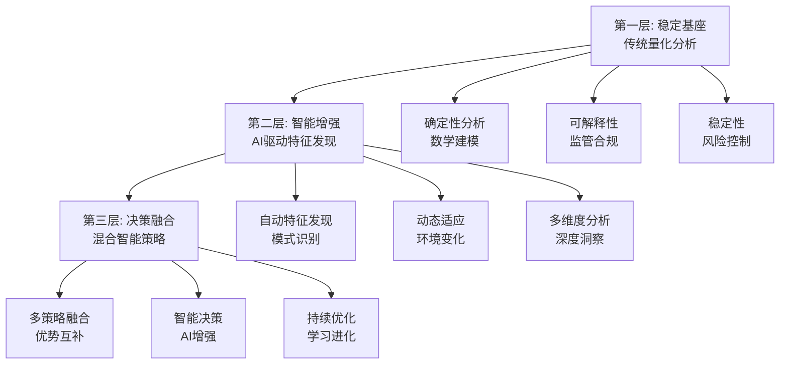

# A股分笔数据分析策略框架

## 框架概述

本文档基于深度头脑风暴的结果，提供了一个完整的A股盘后分笔数据分析策略框架。该框架融合了传统量化分析、机器学习和大语言模型的创新优势，旨在构建一个自适应、智能化的投资分析系统。

---

## 1. 核心设计理念

### 1.1 三层递进架构



### 1.2 四大核心目标

1. **理解市场**: 发现分笔数据中的有意义的模式
2. **管理风险**: 识别和控制投资风险
3. **提高胜率**: 构建概率性优势
4. **持续学习**: 与市场共同进化

---

## 2. 详细技术架构

### 2.1 数据层架构

```python
class DataLayer:
    """数据管理层的核心组件"""

    def __init__(self):
        self.raw_data_source = TickDataSource()
        self.preprocessor = AdaptivePreprocessor()
        self.quality_controller = DataQualityController()
        self.cache_manager = IntelligentCache()

    def fetch_and_process(self, date, symbol):
        """获取并处理分笔数据"""
        # 1. 原始数据获取
        raw_data = self.raw_data_source.fetch(date, symbol)

        # 2. 数据质量评估
        quality_score = self.quality_controller.assess(raw_data)

        # 3. 自适应预处理
        if quality_score > 0.8:
            processed_data = self.preprocessor.standard_process(raw_data)
        else:
            processed_data = self.preprocessor.enhanced_process(raw_data)

        return processed_data
```

### 2.2 分析层架构

#### 传统量化分析器
```python
class TraditionalQuantAnalyzer:
    """传统量化分析的核心模块"""

    def __init__(self):
        self.volume_analyzer = VolumeDistributionAnalyzer()
        self.temporal_analyzer = TemporalPatternAnalyzer()
        self.price_analyzer = PriceImpactAnalyzer()
        self.participant_analyzer = ParticipantBehaviorAnalyzer()

    def analyze(self, tick_data):
        """执行传统量化分析"""
        features = {
            'volume_features': self.volume_analyzer.extract_features(tick_data),
            'temporal_features': self.temporal_analyzer.extract_features(tick_data),
            'price_features': self.price_analyzer.extract_features(tick_data),
            'participant_features': self.participant_analyzer.extract_features(tick_data)
        }
        return features
```

#### AI增强分析器
```python
class AIEnhancedAnalyzer:
    """AI增强分析模块"""

    def __init__(self):
        self.llm_client = LLMClient()
        self.prompt_manager = PromptManager()
        self.insight_validator = InsightValidator()

    def generate_insights(self, tick_data, market_context):
        """生成AI驱动的洞察"""
        # 1. 构建上下文感知的prompt
        prompt = self.prompt_manager.create_context_aware_prompt(
            tick_data, market_context
        )

        # 2. AI生成初步洞察
        raw_insights = self.llm_client.generate_insights(prompt)

        # 3. 洞察验证和过滤
        validated_insights = self.insight_validator.validate_and_filter(
            raw_insights, tick_data
        )

        return validated_insights
```

### 2.3 决策层架构

```python
class HybridStrategyGenerator:
    """混合策略生成器"""

    def __init__(self):
        self.signal_fusion_engine = SignalFusionEngine()
        self.risk_adjuster = RiskAdjuster()
        self.strategy_optimizer = StrategyOptimizer()

    def generate_strategy(self, traditional_signals, ai_insights, risk_constraints):
        """生成最优交易策略"""
        # 1. 信号融合
        fused_signals = self.signal_fusion_engine.fuse(
            traditional_signals, ai_insights
        )

        # 2. 风险调整
        adjusted_signals = self.risk_adjuster.adjust_for_risk(
            fused_signals, risk_constraints
        )

        # 3. 策略优化
        optimal_strategy = self.strategy_optimizer.optimize(adjusted_signals)

        return optimal_strategy
```

---

## 3. 核心分析模块详解

### 3.1 成交量分布分析

#### 成交量分布特征提取
```python
class VolumeDistributionAnalyzer:
    """成交量分布深度分析"""

    def extract_profile_features(self, tick_data):
        """提取成交量分布特征"""
        volumes = tick_data['volume']
        prices = tick_data['price']

        # 基础统计特征
        vwap = np.sum(prices * volumes) / np.sum(volumes)
        volume_skewness = self.calculate_skewness(volumes)
        volume_concentration = self.calculate_gini_coefficient(volumes)

        # 分布形态特征
        price_volume_density = self.calculate_price_volume_density(prices, volumes)
        support_resistance_levels = self.identify_volume_clusters(prices, volumes)

        return {
            'vwap': vwap,
            'volume_skewness': volume_skewness,
            'volume_concentration': volume_concentration,
            'price_volume_density': price_volume_density,
            'support_resistance': support_resistance_levels
        }

    def identify_volume_clusters(self, prices, volumes):
        """识别成交密集区域"""
        # 基于密度的聚类算法
        # 返回支撑位和阻力位
        pass
```

#### 时间模式分析
```python
class TemporalPatternAnalyzer:
    """时间序列模式分析"""

    def extract_temporal_features(self, tick_data):
        """提取时间相关特征"""
        timestamps = tick_data['timestamp']

        # 时段特征
        intraday_pattern = self.analyze_intraday_pattern(timestamps)
        periodicity_score = self.detect_periodicity(timestamps)

        # 交易活跃度
        activity_score = self.calculate_activity_score(tick_data)

        return {
            'intraday_pattern': intraday_pattern,
            'periodicity': periodicity_score,
            'activity_score': activity_score
        }
```

### 3.2 参与者行为推断

```python
class ParticipantBehaviorAnalyzer:
    """参与者行为分析"""

    def infer_participant_types(self, tick_data):
        """推断参与者类型分布"""
        volumes = tick_data['volume']

        # 基于成交大小分类
        small_orders = volumes[volumes < 100]  # 散户
        medium_orders = volumes[(volumes >= 100) & (volumes < 500)]  # 大户
        large_orders = volumes[volumes >= 500]  # 机构

        return {
            'retail_ratio': len(small_orders) / len(volumes),
            'institutional_ratio': len(large_orders) / len(volumes),
            'large_order_impact': self.calculate_large_order_impact(large_orders)
        }

    def detect_strategic_behavior(self, tick_data):
        """检测策略性行为模式"""
        # 吸筹模式检测
        accumulation_score = self.detect_accumulation_pattern(tick_data)

        # 派发模式检测
        distribution_score = self.detect_distribution_pattern(tick_data)

        return {
            'accumulation_signal': accumulation_score,
            'distribution_signal': distribution_score
        }
```

---

## 4. AI增强策略

### 4.1 特征工程增强

```python
class AIEnhancedFeatureEngineer:
    """AI增强的特征工程"""

    def __init__(self):
        self.llm_client = LLMClient()
        self.feature_validator = FeatureValidator()

    def discover_new_features(self, tick_data, existing_features):
        """AI发现新特征"""
        prompt = f"""
        作为顶级量化分析师，基于以下数据发现创新特征：

        分笔数据特征：{self.summarize_data(tick_data)}
        现有特征：{existing_features}

        请生成5个具有预测价值的新特征：
        1. 特征名称和经济学含义
        2. 具体计算方法
        3. 预期预测能力
        4. 适用市场环境
        """

        feature_suggestions = self.llm_client.generate(prompt)

        # 验证和实现最有价值的特征
        validated_features = []
        for suggestion in feature_suggestions:
            if self.feature_validator.validate(suggestion, tick_data):
                validated_features.append(suggestion)

        return validated_features
```

### 4.2 策略生成增强

```python
class AIEnhancedStrategyGenerator:
    """AI增强的策略生成"""

    def generate_contextual_strategy(self, market_analysis, risk_profile):
        """生成上下文相关策略"""
        prompt = f"""
        基于市场分析结果生成最优投资策略：

        市场分析：{market_analysis}
        风险偏好：{risk_profile}

        请提供：
        1. 核心投资逻辑和理论依据
        2. 具体的入场和出场条件
        3. 仓位大小和资金管理规则
        4. 风险控制和止损机制
        5. 预期表现评估和监控指标
        """

        strategy = self.llm_client.generate_strategy(prompt)
        return strategy
```

---

## 5. 风险管理框架

### 5.1 多层风险识别

```python
class ComprehensiveRiskManager:
    """综合风险管理系统"""

    def __init__(self):
        self.micro_risk_detector = MicroRiskDetector()
        self.macro_risk_detector = MacroRiskDetector()
        self.real_time_monitor = RealTimeRiskMonitor()

    def assess_portfolio_risk(self, positions, market_conditions):
        """评估投资组合风险"""
        # 微观风险
        liquidity_risk = self.micro_risk_detector.assess_liquidity_risk(positions)
        market_impact_risk = self.micro_risk_detector.assess_impact_risk(positions)

        # 宏观风险
        systemic_risk = self.macro_risk_detector.assess_systemic_risk(market_conditions)
        regime_risk = self.macro_risk_detector.assess_regime_risk(market_conditions)

        return {
            'liquidity_risk': liquidity_risk,
            'market_impact_risk': market_impact_risk,
            'systemic_risk': systemic_risk,
            'regime_risk': regime_risk,
            'overall_risk_score': self.calculate_overall_risk([
                liquidity_risk, market_impact_risk, systemic_risk, regime_risk
            ])
        }
```

### 5.2 动态风险控制

```python
class DynamicRiskController:
    """动态风险控制"""

    def adjust_positions(self, current_positions, risk_assessment):
        """基于风险评估调整仓位"""
        if risk_assessment['overall_risk_score'] > 0.8:
            # 高风险：减仓
            return self.reduce_positions(current_positions, reduction_ratio=0.3)
        elif risk_assessment['overall_risk_score'] > 0.6:
            # 中等风险：调整结构
            return self.rebalance_positions(current_positions, risk_assessment)
        else:
            # 低风险：保持或适度增加
            return current_positions
```

---

## 6. 持续学习机制

### 6.1 自适应学习系统

```python
class AdaptiveLearningSystem:
    """自适应学习系统"""

    def __init__(self):
        self.performance_tracker = PerformanceTracker()
        self.model_updater = ModelUpdater()
        self.strategy_evaluator = StrategyEvaluator()

    def continuous_learning_cycle(self, strategies, market_outcomes):
        """持续学习循环"""
        # 1. 性能评估
        performance_metrics = self.performance_tracker.evaluate(strategies, market_outcomes)

        # 2. 模型更新
        if performance_metrics['accuracy'] < 0.6:
            self.model_updater.update_models(performance_metrics)

        # 3. 策略优化
        new_strategies = self.strategy_evaluator.optimize_strategies(
            strategies, performance_metrics
        )

        return new_strategies
```

### 6.2 进化学习机制

```python
class EvolutionaryLearning:
    """进化学习机制"""

    def evolve_strategies(self, current_strategies, fitness_scores):
        """策略进化"""
        # 选择
        selected_strategies = self.selection(current_strategies, fitness_scores)

        # 交叉
        crossover_strategies = self.crossover(selected_strategies)

        # 变异
        mutated_strategies = self.mutation(crossover_strategies)

        return mutated_strategies
```

---

## 7. 实施路线图

### 7.1 阶段1：基础建设 (1-2周)

**目标**: 建立稳定的基础分析框架

**任务清单**:
- [ ] 实现数据获取和预处理模块
- [ ] 开发核心特征工程函数
- [ ] 构建传统量化分析器
- [ ] 建立回测引擎
- [ ] 实现基础性能监控

### 7.2 阶段2：AI集成 (2-3周)

**目标**: 集成AI增强分析能力

**任务清单**:
- [ ] 集成大语言模型API
- [ ] 开发prompt管理系统
- [ ] 实现AI特征工程增强
- [ ] 构建混合策略生成器
- [ ] 建立模型验证框架

### 7.3 阶段3：优化迭代 (持续)

**目标**: 持续优化和扩展系统能力

**任务清单**:
- [ ] 建立反馈学习机制
- [ ] 优化prompt工程效果
- [ ] 扩展AI能力边界
- [ ] 增强风险控制能力
- [ ] 提升系统性能

---

## 8. 关键成功因素

### 8.1 技术因素

1. **数据质量**: 确保分笔数据的准确性和完整性
2. **计算效率**: 优化算法性能，适应盘后分析的时间约束
3. **模型稳定性**: 保证AI模型的可靠性和一致性
4. **系统鲁棒性**: 增强系统的容错和恢复能力

### 8.2 业务因素

1. **市场理解**: 深刻理解A股市场的特殊性和制度约束
2. **风险控制**: 始终将风险管理置于核心位置
3. **合规要求**: 确保所有分析和决策符合监管要求
4. **实用导向**: 关注实际应用效果，而非技术复杂度

### 8.3 组织因素

1. **跨学科协作**: 量化、AI、风险管理专家的紧密合作
2. **持续学习**: 保持对新技术和新方法的开放态度
3. **迭代改进**: 基于实际反馈持续优化系统
4. **知识沉淀**: 建立完善的知识管理和传承机制

---

## 9. 风险与挑战

### 9.1 技术风险

1. **模型过拟合**: 历史数据表现优异但实战效果差
2. **AI幻觉**: 大模型生成不准确或误导性的分析
3. **计算复杂度**: 系统过于复杂导致维护困难
4. **数据依赖**: 对数据质量要求过高，实际难以满足

### 9.2 市场风险

1. **市场结构变化**: 市场基本规则或参与者行为发生根本变化
2. **黑天鹅事件**: 无法预测的极端市场事件
3. **流动性风险**: 市场流动性突然枯竭
4. **监管变化**: 政策或监管规则的调整

### 9.3 实施风险

1. **人才缺口**: 缺乏具备复合技能的专业人才
2. **技术债务**: 快速开发导致代码质量下降
3. **期望管理**: 对AI效果的期望过高
4. **成本控制**: 开发和运营成本超出预期

---

## 10. 总结与展望

### 10.1 核心价值

本策略框架的核心价值在于：

1. **系统性**: 提供了完整的分析架构和实施路径
2. **实用性**: 基于实际约束条件设计，具有可操作性
3. **创新性**: 融合了传统量化和AI技术的优势
4. **适应性**: 具备持续学习和进化的能力

### 10.2 发展展望

未来发展方向：

1. **技术深化**: 进一步探索AI技术在量化分析中的应用
2. **应用拓展**: 从个股分析扩展到行业和市场层面
3. **产品化**: 开发面向不同用户的标准化产品
4. **生态构建**: 建立包含数据、分析、执行的完整生态

### 10.3 长期愿景

最终目标是构建一个：

- **智能化**: 具备深度理解和推理能力
- **自适应**: 能够与市场共同进化
- **可靠**: 稳定、可解释、符合监管
- **高效**: 在约束条件下实现最优分析效果

的投资分析系统，为A股市场的投资者提供科学、可靠的决策支持。

---

**框架版本**: v1.0
**更新日期**: 2025-11-04
**适用范围**: A股盘后分笔数据分析
**技术栈**: Python + 传统量化 + 机器学习 + 大语言模型