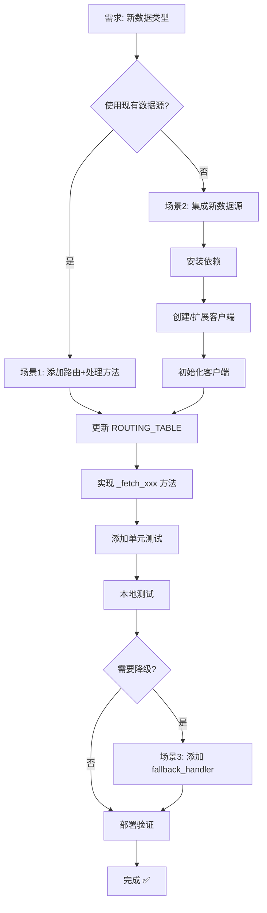

# mootdx-source 数据扩展指南

## 概述

当前架构使用**路由表策略模式**，使得扩展新数据类型或数据源变得简单直接。本指南提供三种常见扩展场景的详细步骤。

---

## 📋 扩展场景索引

1. [场景 1: 添加新的数据类型（使用现有数据源）](#场景1)
2. [场景 2: 添加全新的数据源](#场景2)
3. [场景 3: 为现有数据类型添加降级策略](#场景3)

---

## <a id="场景1"></a>场景 1: 添加新的数据类型（使用现有数据源）

**示例**: 添加"龙虎榜数据"（使用 akshare API）

### 步骤 1: 定义 gRPC DataType（可选）

如果需要新的 `DataType`，首先在 proto 文件中定义：

```protobuf
// libs/common/datasource/v1/data_source.proto
enum DataType {
    // ... 现有类型
    DATA_TYPE_DRAGON_TIGER = 10;  // 新增
}
```

重新生成 Python 代码：
```bash
cd libs/common
python -m grpc_tools.protoc -I. --python_out=. --grpc_python_out=. datasource/v1/data_source.proto
```

### 步骤 2: 在路由表中添加配置

编辑 `service.py`:

```python
class MooTDXService(data_source_pb2_grpc.DataSourceServiceServicer):
    ROUTING_TABLE = {
        # ... 现有路由
        
        # 新增龙虎榜路由
        data_source_pb2.DATA_TYPE_DRAGON_TIGER: RouteConfig(
            handler="_fetch_dragon_tiger_akshare",
            source_name=DataSource.AKSHARE_API
        ),
    }
```

### 步骤 3: 实现数据获取方法

在 `service.py` 的云端 API 方法区域添加：

```python
# === 云端 API 方法 ===

async def _fetch_dragon_tiger_akshare(
    self,
    codes: List[str],
    params: Dict[str, Any]
) -> pd.DataFrame:
    """
    akshare: 龙虎榜数据
    
    Args:
        codes: 股票代码列表（可选）
        params: 查询参数
            - date: 日期 (YYYY-MM-DD)
            - market: 市场类型 ("沪深", "上海", "深圳")
    
    Returns:
        DataFrame 包含龙虎榜数据
    """
    date = params.get("date", datetime.now().strftime("%Y-%m-%d"))
    market = params.get("market", "沪深")
    
    endpoint = f"/api/v1/dragon_tiger"
    query_params = {"date": date, "market": market}
    
    return await self.cloud_client.fetch_akshare(endpoint, query_params)
```

### 步骤 4: （可选）添加配置常量

如果有默认参数，在 `config.py` 添加：

```python
@dataclass(frozen=True)
class DragonTigerDefaults:
    """龙虎榜默认参数"""
    MARKET: str = "沪深"
```

### 步骤 5: 更新单元测试

在 `tests/test_service.py` 添加：

```python
@pytest.mark.asyncio
async def test_fetch_dragon_tiger(self, service):
    """测试龙虎榜数据获取"""
    mock_df = pd.DataFrame({'code': ['000001'], 'buy_amount': [1000000]})
    
    with patch.object(service, '_fetch_dragon_tiger_akshare', return_value=mock_df):
        request = data_source_pb2.DataRequest(
            type=data_source_pb2.DATA_TYPE_DRAGON_TIGER,
            params={'date': '2025-12-18'}
        )
        response = await service.FetchData(request, None)
        assert response.success is True
```

**完成！** ✅ 新数据类型已集成，无需修改路由逻辑。

---

## <a id="场景2"></a>场景 2: 添加全新的数据源

**示例**: 集成 `tushare` API

### 步骤 1: 更新依赖

编辑 `requirements.txt`:
```text
# 添加新依赖
tushare>=1.2.0
```

### 步骤 2: 扩展 DataSource 枚举

编辑 `config.py`:

```python
class DataSource(str, Enum):
    # ... 现有数据源
    TUSHARE_API = "tushare-api"  # 新增
```

### 步骤 3: 扩展 CloudAPIClient 或创建专用客户端

**选项 A: 扩展现有 `cloud_client.py`**（如果是 HTTP API）:

```python
class CloudAPIClient:
    def __init__(self):
        # ... 现有配置
        self.tushare_url = os.getenv("TUSHARE_API_URL", "http://api.tushare.pro")
        self.tushare_token = os.getenv("TUSHARE_TOKEN", "")
    
    async def fetch_tushare(
        self, 
        api_name: str,
        params: Optional[Dict[str, Any]] = None
    ) -> pd.DataFrame:
        """调用 Tushare Pro API"""
        url = f"{self.tushare_url}/api"
        payload = {
            "api_name": api_name,
            "token": self.tushare_token,
            "params": params or {},
            "fields": ""
        }
        
        async with self.session.post(url, json=payload, proxy=self.proxy) as response:
            response.raise_for_status()
            data = await response.json()
            return pd.DataFrame(data.get("data", {}).get("items", []))
```

**选项 B: 创建专用客户端** `src/tushare_client.py`:

```python
import tushare as ts

class TushareClient:
    def __init__(self, token: str):
        ts.set_token(token)
        self.pro = ts.pro_api()
    
    async def fetch_stock_basic(self) -> pd.DataFrame:
        loop = asyncio.get_event_loop()
        return await loop.run_in_executor(
            None,
            lambda: self.pro.stock_basic(exchange='', list_status='L')
        )
```

### 步骤 4: 初始化新客户端

编辑 `service.py`:

```python
class MooTDXService:
    def __init__(self):
        # ... 现有客户端
        self.tushare_client: Optional[TushareClient] = None
    
    async def initialize(self) -> None:
        try:
            # ... 现有初始化
            
            # 4. 初始化 Tushare 客户端
            token = os.getenv("TUSHARE_TOKEN", "")
            if token:
                self.tushare_client = TushareClient(token)
                logger.info("✓ Tushare client initialized")
            else:
                logger.warning("⚠ Tushare token not provided, skipping")
        except Exception as e:
            logger.error(f"Failed to initialize service: {e}")
            raise
```

### 步骤 5: 添加路由和处理方法

```python
ROUTING_TABLE = {
    # ... 现有路由
    
    data_source_pb2.DATA_TYPE_COMPANY_INFO: RouteConfig(
        handler="_fetch_company_info_tushare",
        source_name=DataSource.TUSHARE_API
    ),
}

# 云端 API 方法
async def _fetch_company_info_tushare(
    self,
    codes: List[str],
    params: Dict[str, Any]
) -> pd.DataFrame:
    """tushare: 公司基本信息"""
    if not self.tushare_client:
        raise RuntimeError("Tushare client not initialized")
    
    ts_code = codes[0] if codes else None
    return await self.tushare_client.fetch_stock_basic()
```

### 步骤 6: 配置环境变量

编辑 `docker-compose.microservices.yml`:

```yaml
mootdx-source:
  environment:
    - TUSHARE_TOKEN=your_token_here
    - TUSHARE_API_URL=http://api.tushare.pro
```

**完成！** ✅ 新数据源已集成。

---

## <a id="场景3"></a>场景 3: 为现有数据类型添加降级策略

**示例**: 财务数据从 akshare 降级到 tushare

### 步骤 1: 实现降级处理器

```python
async def _fetch_finance_tushare(
    self,
    codes: List[str],
    params: Dict[str, Any]
) -> pd.DataFrame:
    """tushare: 财务数据（降级用）"""
    if not codes:
        raise ValueError("No code specified for FINANCE")
    
    code = codes[0]
    # Tushare 逻辑
    ...
```

### 步骤 2: 更新路由配置

```python
ROUTING_TABLE = {
    data_source_pb2.DATA_TYPE_FINANCE: RouteConfig(
        handler="_fetch_finance_akshare",
        source_name=DataSource.AKSHARE_API,
        fallback_handler="_fetch_finance_tushare"  # 添加降级
    ),
}
```

### 步骤 3: 测试降级逻辑

```python
@pytest.mark.asyncio
async def test_finance_fallback(self, service):
    """测试财务数据降级"""
    # Mock akshare 返回空
    service.cloud_client.fetch_akshare = AsyncMock(return_value=pd.DataFrame())
    
    # Mock tushare 返回数据
    mock_df = pd.DataFrame({'revenue': [100000000]})
    with patch.object(service, '_fetch_finance_tushare', return_value=mock_df):
        request = data_source_pb2.DataRequest(
            type=data_source_pb2.DATA_TYPE_FINANCE,
            codes=['600519']
        )
        response = await service.FetchData(request, None)
        assert response.success is True
        assert 'fallback' in response.source_name or len(response.json_data) > 2
```

**完成！** ✅ 降级策略已配置。

---

## 🔄 完整扩展流程图



---

## 📝 最佳实践

### 1. 遵循命名约定
```python
# 处理器命名: _fetch_{data_type}_{source}
_fetch_quotes_mootdx()          # ✓ 好
_fetch_ranking_akshare()        # ✓ 好
_get_data()                     # ✗ 差
```

### 2. 使用配置常量
```python
# ✓ 好
params.get("market", DragonTigerDefaults.MARKET)

# ✗ 差
params.get("market", "沪深")  # 魔法字符串
```

### 3. 完善错误处理
```python
async def _fetch_new_data(self, codes, params):
    if not codes:
        raise ValueError("No code specified")  # 参数验证
    
    try:
        return await self.cloud_client.fetch(...)
    except aiohttp.ClientError as e:
        logger.error(f"API error: {e}")
        return pd.DataFrame()  # 返回空而非崩溃
```

### 4. 编写测试
每添加一个新数据类型，至少包含：
- ✅ 成功场景测试
- ✅ 失败场景测试
- ✅ 降级场景测试（如有）

### 5. 更新文档
在 `docs/development/mootdx-source.md` 记录：
- 支持的数据类型列表
- 各数据源的限流策略
- 环境变量清单

---

## 🛠️ 快速参考命令

```bash
# 1. 安装新依赖
docker compose -f docker-compose.microservices.yml exec mootdx-source pip install new-package

# 2. 重新构建容器
docker compose -f docker-compose.microservices.yml build mootdx-source

# 3. 运行测试
docker compose -f docker-compose.microservices.yml run --rm mootdx-source pytest tests/ -v

# 4. 查看日志
docker logs microservice-stock-mootdx-source --tail 100 -f

# 5. 健康检查
docker inspect microservice-stock-mootdx-source --format='{{.State.Health.Status}}'
```

---

## 📊 扩展复杂度评估

| 场景 | 工作量 | 影响范围 | 风险 |
|------|--------|----------|------|
| 场景1: 新数据类型（现有源） | 30分钟 | 低 | 低 |
| 场景2: 新数据源 | 2-4小时 | 中 | 中 |
| 场景3: 添加降级 | 1小时 | 低 | 低 |

---

## 🎯 总结

当前架构的扩展性优势：

✅ **零侵入式**: 添加新数据类型无需修改核心路由逻辑  
✅ **配置驱动**: 路由表集中管理，易于维护  
✅ **自动降级**: 只需添加 `fallback_handler` 即可启用  
✅ **类型安全**: 完整的类型提示支持 IDE 智能提示  
✅ **可测试**: 清晰的方法边界便于 mock 和单元测试  

**建议**: 保持这个模式，每次扩展后更新单元测试和文档！
