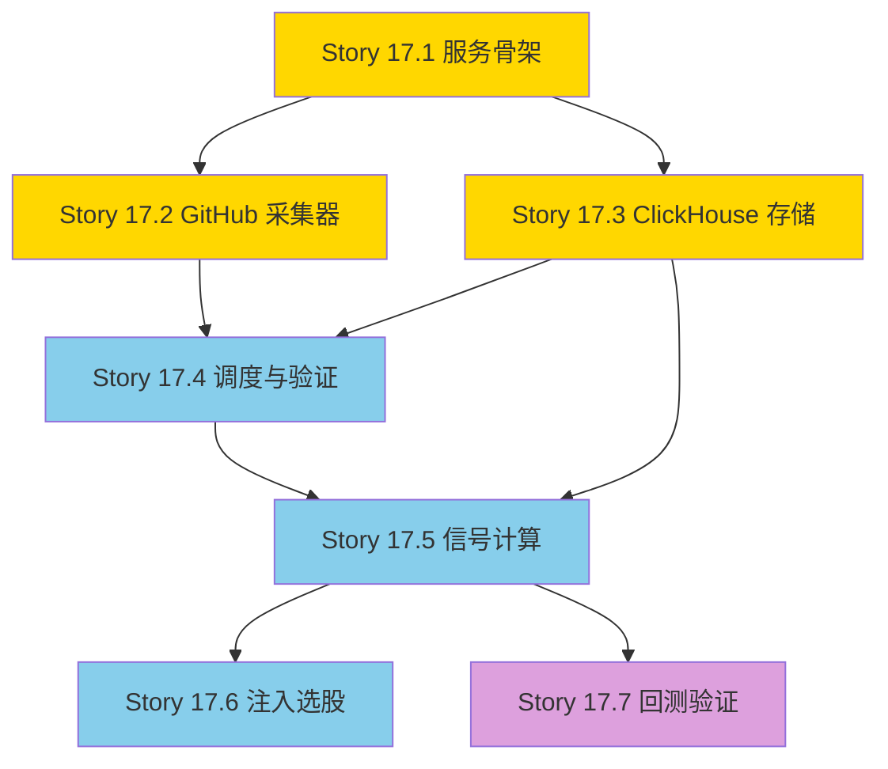

# EPIC-017: AI 产业链另类数据策略

## Epic 概述

| 字段 | 值 |
|------|-----|
| **Epic ID** | EPIC-017 |
| **标题** | AI 产业链另类数据策略 (Alternative Data Strategy) |
| **优先级** | P2 |
| **状态** | ✅ 已开发完成 (17.7 取消) |
| **创建日期** | 2026-02-28 |
| **预计工期** | 10-15 天 |
| **来源** | [设计文档](../design/alternative_data_strategy.md) |

---

## 1. 问题陈述

### 核心命题
现有量化策略完全依赖行情数据（K 线、Tick、快照），缺乏产业链基本面变化的前瞻性信号。当 AI/GPU 产业链底层发生技术突破或需求扩张时，系统无法在市场共识形成之前感知到。

### 解决思路
通过采集开源社区（GitHub/Gitee）的活跃度指标，作为 AI 产业链景气度的领先指标，将生态信号注入现有选股流程，增强策略的信息维度。

---

## 2. 目标与成功指标

| 目标 | 指标 | 目标值 |
|------|------|--------|
| 数据采集可用 | GitHub 采集成功率 | ≥ 95% |
| 信号生成 | 每日盘后输出信号 | 是 |
| 系统可降级 | 数据源故障时不影响现有策略 | 是 |
| 回测验证 | 信号与板块涨跌的统计相关性 | 有结论（正/负/无） |

---

## 3. 架构设计

```
                              ┌──────────────────────┐
                              │   task-orchestrator   │
                              │   (定时触发采集)       │
                              └──────────┬───────────┘
                                         │
              ┌──────────────────────────┼──────────────────────────┐
              ▼                          ▼                          ▼
┌─────────────────────┐   ┌─────────────────────┐   ┌─────────────────────┐
│  altdata-source     │   │  mootdx-source      │   │  quant-strategy     │
│  (新增)              │   │  (已有)              │   │  (扩展)              │
│                     │   │                     │   │                     │
│  GitHub/Gitee 采集   │   │  概念板块成分股查询   │   │  信号计算            │
│  → ClickHouse 写入   │   │  (复用现有通道)       │   │  → 注入选股流程       │
└─────────┬───────────┘   └──────────────────────┘   └──────────┬──────────┘
          │                                                      │
          ▼                                                      ▼
┌──────────────────────────────────────────────────────────────────────────┐
│  ClickHouse  (altdata.github_repo_metrics / altdata.ecosystem_signals)  │
└──────────────────────────────────────────────────────────────────────────┘
```

---

## 4. 用户故事

### Story 17.1: altdata-source 服务骨架
**优先级**: P0 | **工时**: 1d

创建 `altdata-source` 微服务基础结构（FastAPI + Docker + Nacos 注册）。

**验收标准**:
- [ ] 服务目录结构创建完成 (`services/altdata-source/`)
- [ ] FastAPI 应用可启动，健康检查端点可用
- [ ] Dockerfile 和 docker-compose 配置完成
- [ ] 环境变量配置 (`GITHUB_TOKENS`, `CLICKHOUSE_HOST` 等)

---

### Story 17.2: GitHub 数据采集器
**优先级**: P0 | **工时**: 2d

实现 GitHub REST API v3 的异步数据采集器，支持 Token 轮换和 Rate Limit 控制。

**验收标准**:
- [ ] 实现 `GitHubCollector` 类 (asyncio + httpx)
- [ ] 支持多 Token 轮换 (`X-RateLimit-Remaining` 检测)
- [ ] 采集 6 项指标：`pr_merged_count`, `pr_merged_acceleration`, `issue_close_median_hours`, `star_delta_7d`, `commit_count_7d`, `contributor_count_30d`
- [ ] 目标仓库 YAML 配置化
- [ ] 单仓库采集失败不阻塞整体
- [ ] 单元测试覆盖采集逻辑

---

### Story 17.3: ClickHouse 存储层
**优先级**: P0 | **工时**: 0.5d

创建 ClickHouse 表结构，实现采集数据写入。

**验收标准**:
- [ ] 创建 `altdata.github_repo_metrics` 表
- [ ] 创建 `altdata.ecosystem_signals` 表
- [ ] 实现异步写入接口
- [ ] 数据写入后可查询验证

---

### Story 17.4: 采集调度与端到端验证
**优先级**: P1 | **工时**: 1d

实现定时采集调度，验证全链路（API → 采集 → 存储）可用。

**验收标准**:
- [ ] 实现采集任务入口（手动触发 + 定时 Cron）
- [ ] 完成一次全量采集（所有配置仓库）
- [ ] ClickHouse 中能查到完整数据
- [ ] 采集日志记录成功/失败/Rate Limit 状态

---

### Story 17.5: 生态信号计算引擎
**优先级**: P1 | **工时**: 2d

在 `quant-strategy` 中实现复合特征计算和 Z-score 信号生成。

**验收标准**:
- [x] 实现 `AltDataDAO`（读取 ClickHouse altdata 表）
- [x] 实现 `EcoSignalStrategy` 类
- [x] 计算 3 个复合特征：`eco_momentum`, `eco_responsiveness`, `eco_growth`
- [x] 滚动窗口 Z-score 计算
- [x] 4 级信号输出：NEUTRAL / WARM / HOT / EXTREME
- [x] 信号写入 `altdata.ecosystem_signals` 表
- [x] 单元测试覆盖信号计算逻辑

---

### Story 17.6: 信号注入选股流程
**优先级**: P1 | **工时**: 1.5d

将生态信号与概念板块关联，注入现有 `CandidatePoolService` 选股流程。

**验收标准**:
- [x] 实现 `label → 概念板块名` 映射配置
- [x] 通过现有 `IndustryDAO.get_stock_concepts()` 获取板块成分股
- [x] 在候选池评分中加入生态信号权重（WARM +5% / HOT +10% / EXTREME +15%）
- [x] 另类数据源故障时自动降级，不影响现有选股
- [x] 选股报告中展示生态评分来源

---

### Story 17.7: 回测验证与文档 (❌ 已取消)
**状态**: 需求阶段被用户取消

**原因**: 受限于 GitHub 官方 API 对历史海量 Issue/PR 溯源的严苛频控率限制，要在短时间内抓取真实过去半年的全量记录并转储至 ClickHouse 进行回放是不现实的。用户明确拒绝采用“模拟假数据填充”的方式进行回测，因此该环节取消。本策略直接以上线后累计的前向真实数据去观测。

---

## 5. 依赖关系



| 颜色 | 阶段 |
|------|------|
| 🟡 黄色 | PoC + MVP（Story 17.1~17.4） |
| 🔵 蓝色 | 集成（Story 17.5~17.6） |
| 🟣 紫色 | 回测验证（Story 17.7） |

---

## 6. 外部依赖

| 依赖项 | 状态 | 备注 |
|--------|------|------|
| GitHub Personal Access Token | ⚠️ 待准备 | 用户需提供，建议重新生成（原 token 已泄露于对话） |
| ClickHouse 集群 | ✅ 已就绪 | 复用现有集群，新建 `altdata` 数据库 |
| Nacos 服务发现 | ✅ 已就绪 | 复用现有基础设施 |
| 同花顺概念板块数据 | ✅ 已就绪 | `mootdx-source` 已支持 `DATA_TYPE_THS_CONCEPTS` |
| `CandidatePoolService` | ✅ 已就绪 | EPIC-005 已完成 |

---

## 7. 风险与缓解

| 风险 | 概率 | 影响 | 缓解措施 |
|------|------|------|----------|
| GitHub Token 被封禁 | 低 | 中 | 严守 Rate Limit + 多 Token 轮换 |
| 信号与股价无统计相关性 | 中 | 高 | Story 17.7 回测不通过则止损，不投入集成 |
| 目标仓库被删/重命名 | 低 | 低 | 采集前检查仓库状态，异常告警 |
| 概念板块映射不准 | 中 | 中 | 手动维护映射表，定期审核 |

---

## 8. 实施计划

| 阶段 | Story | 时间 | 里程碑 |
|------|-------|------|--------|
| Week 1 前半 | 17.1, 17.3 | 1.5d | 服务骨架 + 表结构就绪 |
| Week 1 后半 | 17.2 | 2d | GitHub 采集器可用 |
| Week 2 前半 | 17.4 | 1d | 端到端采集验证通过 |
| Week 2 后半 | 17.5 | 2d | 信号计算引擎完成 |
| Week 3 前半 | 17.6 | 1.5d | 选股流程集成完成 |
| Week 3 后半 | 17.7 | 2-3d | 回测结论输出 |

---

## 9. 关联文档

| 文档 | 用途 |
|------|------|
| [alternative_data_strategy.md](../design/alternative_data_strategy.md) | 设计方案 |
| [DEVELOPMENT_ROADMAP.md](../../services/quant-strategy/docs/plans/DEVELOPMENT_ROADMAP.md) | 开发路线图 |
| [epic_gsf_master.md](../../services/quant-strategy/docs/plans/epic_gsf_master.md) | GSF 框架（复用 DAO/Analyzer 模式） |

---

*文档版本: 1.0*  
*最后更新: 2026-02-28*
