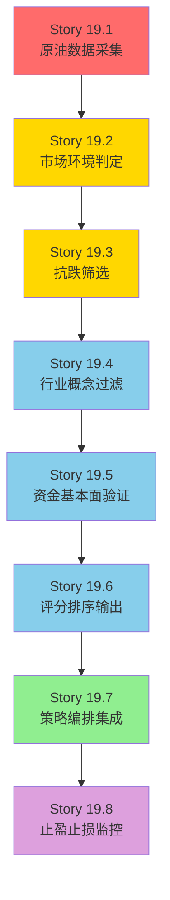

# EPIC-019: 地缘冲突防御型选股策略

## Epic 概述

| 字段 | 值 |
|------|-----|
| **Epic ID** | EPIC-019 |
| **标题** | 地缘冲突防御型选股策略 (Geopolitical Defense Strategy) |
| **优先级** | P1 |
| **状态** | 📋 待开发 |
| **创建日期** | 2026-03-05 |
| **预计工期** | 12-18 天 |
| **来源** | [设计文档](../design/IranWar_v2.md) |

---

## 1. 问题陈述

### 核心命题
2026-03-01 伊朗战争爆发，系统缺乏应对地缘冲突事件的专用选股能力。现有策略框架围绕分笔量化特征（OFI、Smart Money 等），无法在系统性风险事件中快速识别"抗跌 + 政策受益 + 资金认可"的防御型标的。

### 解决思路
构建事件驱动型防御策略：以沪深300跌幅和原油期货价格变化为双信号源，通过"抗跌筛选 → 行业过滤 → 资金/基本面验证"三层漏斗产出防御型股票池。根据战争持续时间设计三种情景（闪击战/中等冲突/持久战），实现动态情景切换。

---

## 2. 目标与成功指标

| 目标 | 指标 | 目标值 |
|------|------|--------|
| 原油数据可采集 | WTI/Brent 日K线采集成功率 | ≥ 98% |
| 抗跌筛选可用 | 暴跌环境下全市场扫描 < 5 秒 | 是 |
| 多情景可切换 | 支持 A/B/C 三种情景参数 | 是 |
| 输出候选池 | 按评分排序的 Top N 股票池 | 是 |
| 无侵入性 | 不影响现有策略框架运行 | 是 |

---

## 3. 架构设计

```
                                  ┌───────────────────────────┐
                                  │  人工触发 / tiandao 信号   │
                                  └─────────────┬─────────────┘
                                                │
                                                ▼
                              ┌──────────────────────────────────┐
                              │   geopolitical_defense_strategy  │
                              │   (quant-strategy 新增模块)       │
                              │                                  │
                              │  ┌────────┐ ┌────────┐ ┌──────┐ │
                              │  │情景判定 │→│三层漏斗│→│评分  │ │
                              │  │(A/B/C) │ │选股引擎│ │排序  │ │
                              │  └────────┘ └────────┘ └──────┘ │
                              └──────┬───────────┬───────────┬───┘
                                     │           │           │
                    ┌────────────────┘           │           └────────────────┐
                    ▼                            ▼                            ▼
      ┌──────────────────────┐    ┌──────────────────────┐    ┌──────────────────────┐
      │  futures_kline_daily │    │  stock_kline_daily    │    │  20张元数据表          │
      │  (新增: 原油期货)     │    │  stock_valuation      │    │  (行业/概念/北向/      │
      │                      │    │  (已有: A股行情/估值)  │    │   股东/龙虎榜等)       │
      └──────────────────────┘    └──────────────────────┘    └──────────────────────┘
               ▲                                                        ▲
               │                                                        │
      ┌────────┴────────┐                                     ┌─────────┴────────┐
      │  AkShare         │                                     │  MetadataSync    │
      │  (新增采集任务)   │                                     │  (已有)           │
      └─────────────────┘                                     └──────────────────┘
```

---

## 4. 用户故事

### Story 19.1: 原油期货数据采集
**优先级**: P0 | **工时**: 2d | **服务**: mootdx-source / altdata-source

新增 WTI/Brent 原油期货日K线数据采集能力，包括 ClickHouse 表创建和历史数据回填。

**验收标准**:
- [ ] ClickHouse 创建 `futures_kline_daily` 表（含分布式表）
- [ ] 通过 AkShare `futures_foreign_hist` 接口采集 WTI (`CL`) 和 Brent (`OIL`) 数据
- [ ] 回填最近 1 年历史数据
- [ ] 实现每日定时采集（A股收盘后 16:00）
- [ ] 采集日志正常，数据可查询验证

---

### Story 19.2: 市场环境判定模块
**优先级**: P0 | **工时**: 1.5d | **服务**: quant-strategy

实现大盘暴跌环境的量化判定，以及基于油价和指数跌幅的情景分级（A/B/C）。

**验收标准**:
- [ ] 实现 `MarketEnvironmentDetector` 类
- [ ] 从 ClickHouse 读取沪深300日K线，计算 N 日累计跌幅
- [ ] 从 ClickHouse 读取 WTI 原油日K线，计算相对基准日的涨幅
- [ ] 实现三种情景的触发条件判定（情景A: 3日跌≥3%；情景B: 5日跌≥5%或20日跌≥8%；情景C: 20日跌≥10%且60日跌≥15%）
- [ ] 实现情景升级/降级状态机逻辑
- [ ] 输出当前情景类型及其参数集
- [ ] 战争开始日期（T=0）可配置
- [ ] 单元测试覆盖各情景触发和切换逻辑

---

### Story 19.3: 个股抗跌能力筛选引擎
**优先级**: P0 | **工时**: 2d | **服务**: quant-strategy

在大盘暴跌窗口内，计算全市场个股的抗跌能力指标并进行初筛。

**验收标准**:
- [ ] 实现 `ResilienceScreener` 类
- [ ] 批量从 ClickHouse 读取全市场日K线
- [ ] 计算三项抗跌指标：超额收益、最大回撤比、缩量比
- [ ] 观察窗口长度根据情景动态调整（A: 3日, B: 10-20日, C: 30-60日）
- [ ] 全市场扫描耗时 < 5 秒（向量化计算）
- [ ] 输出通过筛选的股票列表及各项指标
- [ ] 单元测试覆盖指标计算逻辑

---

### Story 19.4: 行业与概念板块过滤器
**优先级**: P1 | **工时**: 1d | **服务**: quant-strategy

实现基于申万行业白名单和同花顺概念板块的过滤与加分逻辑。

**验收标准**:
- [ ] 行业白名单 YAML 配置化（地缘冲突场景 5 大类 16 个申万二级行业）
- [ ] 从 ClickHouse `stock_industry_sw` 读取个股行业分类
- [ ] 从 ClickHouse `stock_concept_detail` 读取概念板块
- [ ] 行业白名单根据情景可差异化配置（情景C 新增排除名单）
- [ ] 概念板块命中数作为加分项返回
- [ ] 单元测试覆盖过滤和加分逻辑

---

### Story 19.5: 资金结构与基本面验证层
**优先级**: P1 | **工时**: 2d | **服务**: quant-strategy

实现资金面验证（国家队/北向/大宗）和基本面风控，完成三层漏斗的最后一层。

**验收标准**:
- [ ] 实现"国家队"持仓检测（`stock_top_holders` 中匹配关键词：中央汇金、证金公司、社保基金等）
- [ ] 实现北向资金变化方向判定（`stock_north_funds_daily` 窗口内持仓变化）
- [ ] 实现大宗交易折价率分析（`stock_block_trade` 窗口内折价情况）
- [ ] 复用现有 `FundamentalFilter` 执行 6 项风控
- [ ] 从 `stock_valuation` 读取市值和 PE，执行估值约束
- [ ] 从 `stock_performance_forecast` 读取业绩预告作为加分项
- [ ] 从 `stock_analyst_rank` 读取分析师评级作为加分项
- [ ] 情景C 额外筛选：股息率 > 2%
- [ ] 单元测试覆盖各验证逻辑

---

### Story 19.6: 评分排序与候选池输出
**优先级**: P1 | **工时**: 1.5d | **服务**: quant-strategy

将三层漏斗的结果进行多维评分、加权排序，输出最终防御型股票池。

**验收标准**:
- [ ] 实现 7 维评分体系（抗跌/缩量/概念/国家队/北向/基本面/估值）
- [ ] 评分权重根据情景动态调整（A/B/C 三套权重配置）
- [ ] 按总分降序排列，取 Top N（A: 10, B: 20, C: 15）
- [ ] 输出 DataFrame 包含完整字段（代码/名称/行业/超额收益/回撤/市值/PE/评分等）
- [ ] 支持输出为 CSV/JSON 格式
- [ ] 单元测试覆盖评分和排序逻辑

---

### Story 19.7: 策略编排与端到端集成
**优先级**: P1 | **工时**: 2d | **服务**: quant-strategy

将上述各模块组装为完整的策略管线，实现一键运行，支持手动触发和定时触发。

**验收标准**:
- [ ] 实现 `GeopoliticalDefenseOrchestrator` 编排器
- [ ] 串联完整流程：情景判定 → 抗跌筛选 → 行业过滤 → 基本面验证 → 评分排序 → 输出
- [ ] 策略配置 YAML 化（战争开始日期、情景参数、行业白名单、评分权重等）
- [ ] 提供 API 端点手动触发（`POST /api/v1/strategies/geopolitical/run`）
- [ ] 提供 API 端点查询当前情景状态（`GET /api/v1/strategies/geopolitical/status`）
- [ ] 错误处理：任一模块异常不导致整体崩溃，降级输出部分结果
- [ ] 端到端集成测试（使用真实 ClickHouse 数据）

---

### Story 19.8: 止盈止损与情景切换监控
**优先级**: P2 | **工时**: 1.5d | **服务**: quant-strategy

实现已入选股票的止盈/止损监控，以及情景自动升级/降级时的持仓调整建议。

**验收标准**:
- [ ] 实现 `PositionMonitor` 类
- [ ] 根据当前情景应用对应的止盈/止损参数
- [ ] 情景A: 超额收益止盈 8% / 止损 -5%
- [ ] 情景B: 超额收益止盈 15% / 止损 -8%
- [ ] 情景C: 跟踪止盈（最高点回撤 10%）/ 止损 -15%
- [ ] 情景切换时输出持仓调整建议（需卖出/需新增的标的列表）
- [ ] 监控结果支持 Webhook 通知（可选）

---

## 5. 依赖关系



| 颜色 | 阶段 | Story |
|------|------|-------|
| 🔴 红色 | 数据基础设施 | 19.1 |
| 🟡 黄色 | 核心引擎 | 19.2, 19.3 |
| 🔵 蓝色 | 过滤与评分 | 19.4, 19.5, 19.6 |
| 🟢 绿色 | 集成 | 19.7 |
| 🟣 紫色 | 监控增强 | 19.8 |

---

## 6. 外部依赖

| 依赖项 | 状态 | 备注 |
|--------|------|------|
| ClickHouse 集群 | ✅ 已就绪 | 新建 `futures_kline_daily` 表 |
| AkShare `futures_foreign_hist` | ✅ 可用 | 数据源为新浪财经，无需额外 Token |
| 沪深300 日K线 | ✅ 已有 | `stock_kline_daily` 中 code=000300 |
| 20张元数据表 | ✅ 已有 | MetadataSyncService 已同步 |
| `FundamentalFilter` | ✅ 已有 | quant-strategy 已实现 |
| 伊朗战争开始日期 | ✅ 已确认 | 2026-03-01 |

---

## 7. 风险与缓解

| 风险 | 概率 | 影响 | 缓解措施 |
|------|------|------|----------|
| AkShare 原油接口不稳定 | 低 | 中 | 采用重试机制，降级使用前一日数据 |
| 元数据表数据滞后 | 中 | 中 | 北向/股东数据T+1延迟可接受，不影响选股逻辑 |
| 全市场扫描性能不足 | 低 | 高 | 使用 Pandas 向量化操作，ClickHouse 批量查询 |
| 情景判定误判 | 中 | 中 | 提供人工覆盖入口，运营可手动指定情景 |
| 战争突然结束导致策略信号失效 | 中 | 低 | 情景降级逻辑自动处理退出 |

---

## 8. 实施计划

| 阶段 | Story | 时间 | 里程碑 |
|------|-------|------|--------|
| Week 1 Day 1-2 | 19.1 | 2d | 原油数据采集就绪 + 历史回填 |
| Week 1 Day 3-4 | 19.2 | 1.5d | 市场环境判定可用 |
| Week 1 Day 4-5 + Week 2 Day 1 | 19.3 | 2d | 抗跌筛选引擎完成 |
| Week 2 Day 2 | 19.4 | 1d | 行业概念过滤器完成 |
| Week 2 Day 3-4 | 19.5 | 2d | 资金/基本面验证完成 |
| Week 2 Day 5 + Week 3 Day 1 | 19.6 | 1.5d | 评分排序输出完成 |
| Week 3 Day 2-3 | 19.7 | 2d | 端到端集成完成 |
| Week 3 Day 4-5 | 19.8 | 1.5d | 止盈止损监控完成 |

> **紧急度说明**：鉴于战争已于 2026-03-01 开始，Story 19.1 和 19.2 应立即启动。当前处于情景 A（闪击战）阶段，预计 2026-03-17 前后需判定是否升级到情景 B。

---

## 9. 关联文档

| 文档 | 用途 |
|------|------|
| [IranWar_v2.md](../design/IranWar_v2.md) | 策略设计方案（含三种情景详细参数） |
| [IranWar.md](../design/IranWar.md) | 原始需求文档 |
| [tiandao.md](../design/tiandao.md) | 上游宏观遥测系统（未来可对接） |
| [alternative_data_strategy.md](../design/alternative_data_strategy.md) | 另类数据策略（架构参考） |

---

*文档版本: 1.0*
*最后更新: 2026-03-05*
