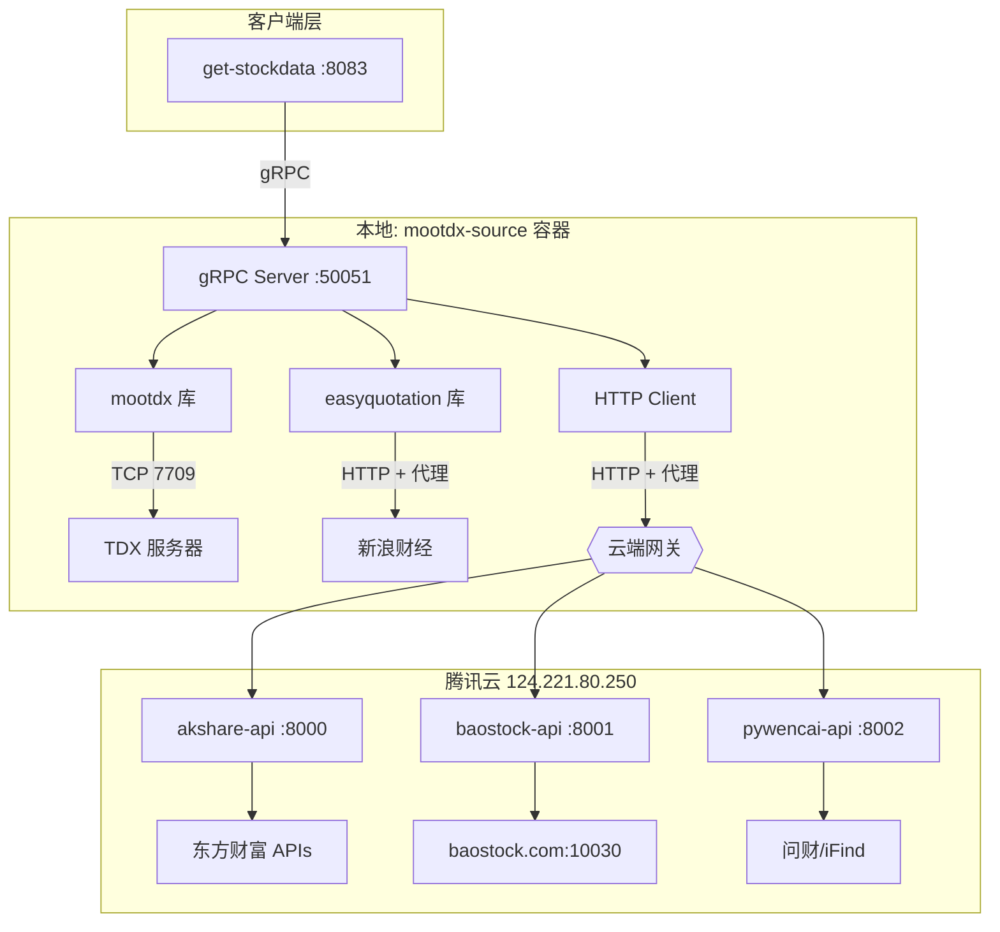

# ADR-002: 混合数据源架构

**状态**: 已接受  
**日期**: 2025-12-17  
**决策者**: 架构团队  
**相关文档**: [EPIC-008](./EPIC-008-混合架构实施.md)

---

## 背景和问题陈述

当前数据源架构面临网络连接挑战：

1. **本地网络限制**: 内网服务器无法直接访问外网
2. **复杂代理链**: 4层以上代理 (Gost → Squid → SSH → Privoxy → WARP) 导致不稳定
3. **协议冲突**: Squid 代理阻止非标准端口 (Baostock 10030 等)
4. **混合数据源类型**: 部分使用 TCP (mootdx, baostock)，部分使用 HTTP (akshare, pywencai)

**核心问题**: 应如何在本地和云端环境部署5个不同的数据源 (mootdx, easyquotation, akshare, baostock, pywencai)，以最大化稳定性和可维护性？

---

## 决策驱动因素

* **稳定性**: 最小化网络相关故障点
* **可维护性**: 减少本地需要管理的容器数量
* **性能**: 保持延迟敏感的实时数据在本地
* **成本**: 优化云资源使用
* **隔离性**: 防止数据源之间的级联故障

---

## 备选方案

### 方案 1: 全部云端（纯云优先）

**优点:**
- 单一管理位置
- 无网络访问限制
- 按数据源独立扩展

**缺点:**
- 实时行情延迟高 (增加 50-200ms)
- 核心交易功能依赖云端
- 本地→云端仍需代理
- 成本更高 (5个云服务)

### 方案 2: 全部本地（纯本地）

**优点:**
- 延迟最低
- 无云端依赖
- 无额外成本

**缺点:**
- 无法解决代理阻止问题 (Baostock 10030端口等)
- 复杂网络配置仍然存在
- 需管理多个本地容器

### 方案 3: 混合架构（已选择）

**优点:**
- **两全其美**: 实时数据本地，依赖代理的数据在云端
- **简化本地部署**: 1个容器代替5个
- **故障隔离**: 云端服务互相独立
- **性能优化**: 实时 <10ms，历史 <100ms

**缺点:**
- 需要管理两个位置（本地+云端）
- 云端API调用需要HTTP代理

---

## 决策结果

**选择方案**: **方案3 - 混合架构**

### 部署策略

| 数据源 | 位置 | 理由 | 协议 |
|--------|------|------|------|
| **mootdx** | 本地 | 实时行情，端口7709不走代理 | TCP 直连 |
| **easyquotation** | 本地 | 备用实时源，HTTP可通过代理 | HTTP + 代理 |
| **akshare** | 云端 API :8000 | 已部署，参考数据 | HTTP |
| **baostock** | 云端 API :8001 | 端口10030被Squid阻止 | HTTP 封装 |
| **pywencai** | 云端 API :8002 | 需要Node.js，云端更合适 | HTTP 封装 |

### 架构图



---

## 影响

### 正面影响

1. **简化本地管理**
   - 仅需构建/部署/监控 1个容器
   - 所有数据源统一的 gRPC 端点
   - 统一日志和健康检查

2. **解决网络问题**
   - mootdx 端口 7709 绕过透明代理 (不在 iptables 规则中)
   - 云端服务网络访问无限制
   - HTTP 代理对 easyquotation 和云端 API 调用可靠工作

3. **故障隔离**
   - 云端服务故障不影响本地实时数据
   - 云端宕机时本地容器可继续工作
   - 每个云端服务独立 (systemd/docker)

4. **性能优化**
   - 实时行情: <10ms (本地 TCP)
   - 历史K线: <500ms (云端 API + 网络)
   - 非延迟敏感数据的可接受折衷

### 负面影响

1. **双重管理**
   - 必须维护本地容器和云端服务
   - 部署复杂度略有增加

2. **网络依赖**
   - 本地→云端调用需要 HTTP 代理 (单点故障)
   - 缓解: 代理失败时本地 mootdx 继续工作

3. **成本**
   - 3个云端服务 24/7 运行
   - 缓解: 轻量级 FastAPI 应用，最小资源使用

---

## 实施要点

### 本地容器 (`mootdx-source`)

**关键特性:**
- `network_mode: host` - 绕过 Docker NAT 实现 TCP 直连
- 内嵌 HTTP 客户端支持代理
- gRPC 服务器暴露统一的 `DataSourceService`
- 根据 `DataType` 将请求路由到本地库或云端 API

**环境变量:**
```yaml
HTTP_PROXY: http://192.168.151.18:3128
AKSHARE_API_URL: http://124.221.80.250:8000
BAOSTOCK_API_URL: http://124.221.80.250:8001
PYWENCAI_API_URL: http://124.221.80.250:8002
```

### 云端服务

**部署方式**: **多容器部署** + Docker Compose 统一管理

每个服务使用独立的 Docker 容器：
- `akshare-api` 容器 (端口 8000)
- `baostock-api` 容器 (端口 8001)
- `pywencai-api` 容器 (端口 8002)

**容器配置:**
- 基础镜像: `python:3.12-alpine` (优化资源占用)
- 资源限制: 每容器 ~40MB 内存, <1% CPU (空闲)
- 重启策略: `restart: unless-stopped`

**共同特性:**
- FastAPI 框架
- 健康检查端点 (`/health`)
- 独立日志: `/var/log/<service>.log`
- 故障隔离: 单个服务崩溃不影响其他服务

---

## 合规性

此决策符合项目编码标准：

- ✅ **异步/并发**: 所有 I/O 操作使用 `asyncio`
- ✅ **资源管理**: 生命周期方法 (`initialize()`, `close()`)
- ✅ **错误处理**: HTTP 调用的熔断器和重试策略
- ✅ **时区**: 所有服务使用 `Asia/Shanghai`

---

## 参考文档

- [实施计划](./实施计划.md)
- [gRPC 架构指南](./gRPC架构指南.md)
- [网络验证报告](../../services/get-stockdata/docs/design/proxy-set/epic007_final_datasource_verification.md)
