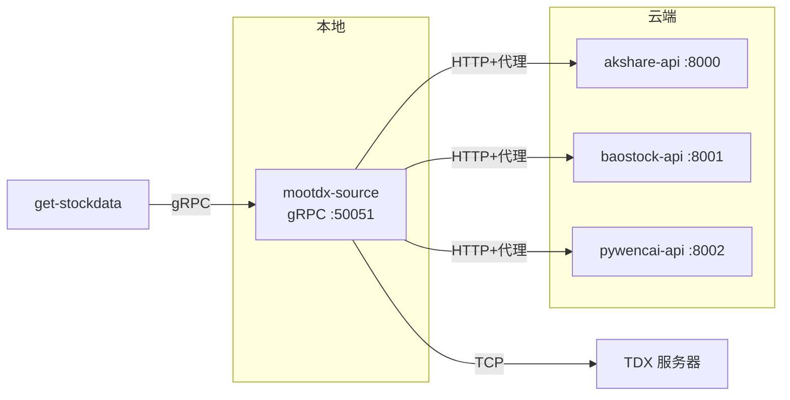

# EPIC-008: 混合数据源架构实施

**状态**: 规划中  
**优先级**: 高  
**负责人**: 架构团队  
**开始日期**: 2025-12-17  
**目标完成时间**: 2026-01-15 (4周)

---

## Epic 概述

实施混合部署架构，将本地资源整合到单个容器，同时利用云服务处理依赖代理的数据源。这将消除复杂的网络代理链并提高系统稳定性。

### 问题陈述

当前架构存在的问题：
- 5个独立的数据源容器需要单独管理
- 复杂的 4层代理链导致连接失败
- Squid 代理阻止非标准端口 (Baostock 的 10030端口)
- 网络配置脆弱

### 目标

1. **简化本地部署**: 从 5个容器减少到 1个
2. **提高稳定性**: 为 TCP 数据源消除代理链
3. **隔离故障**: 云端服务独立运行
4. **保持性能**: 实时 <10ms，历史 <500ms

---

## 架构总览

### 组件职责

| 组件 | 职责 | 关键技术 |
|------|------|----------|
| **mootdx-source** | 统一 gRPC 服务器，路由请求到本地/云端 | Python, gRPC, aiohttp |
| **akshare-api** | 参考数据（股票列表、交易日历） | FastAPI, akshare |
| **baostock-api** | 历史K线数据 (1990+) | FastAPI, baostock |
| **pywencai-api** | 自然语言选股 | FastAPI, pywencai, Node.js |

---

## 成功标准

### 技术指标

- [ ] 本地部署减少到 1个容器
- [ ] 所有 5个数据源通过单一 gRPC 端点访问
- [ ] 实时行情延迟 < 10ms (p95)
- [ ] 历史数据延迟 < 500ms (p95)
- [ ] 系统可用性 > 99.5% (7天内)

### 运营指标

- [ ] 本地构建时间 < 3分钟
- [ ] 云服务重启时间 < 10秒
- [ ] 零手动代理链管理

---

## Story 分解

### Story 8.1: 本地容器整合

**工作量**: 3天  
**优先级**: P0 (阻塞)

**目标:**
- 合并 mootdx + easyquotation 到单个容器
- 添加调用云端 API 的 HTTP 客户端
- 更新 gRPC 服务以路由请求

**验收标准:**
- 单个容器提供所有 5种数据源类型
- 环境变量配置云端 API URL
- 健康检查覆盖所有嵌入的数据源

---

### Story 8.2: 云服务 - Baostock API

**工作量**: 2天  
**优先级**: P0 (关键路径)

**目标:**
- 为 baostock 库创建 FastAPI 封装
- 实现会话超时的自动重连
- 使用 Docker 部署到腾讯云

**验收标准:**
- `/health` 端点返回 200
- 历史K线 API 返回 SH600519 的数据
- 服务崩溃时自动重启 (systemd)

---

### Story 8.3: 云服务 - Pywencai API

**工作量**: 2天  
**优先级**: P1 (高)

**目标:**
- 为 pywencai 库创建 FastAPI 封装
- 在云端安装 Node.js 依赖
- 使用 Docker Compose 部署

**验收标准:**
- 自然语言查询 "今日涨停" 返回结果
- 缓存将重复查询延迟减少 80%
- 优雅处理验证码错误

---

### Story 8.4: 集成和验证

**工作量**: 2天  
**优先级**: P0 (Epic 完成必需)

**目标:**
- 更新 get-stockdata gRPC 客户端配置
- 所有数据类型的端到端测试
- 性能基准测试

**验收标准:**
- 所有 `DataType` 枚举值返回有效数据
- 延迟满足 SLA (10ms/500ms)
- 文档更新为混合架构

---

## 依赖关系

### 外部依赖
- [ ] 腾讯云服务器访问权限 (124.221.80.250)
- [ ] 云端安装 Docker 和 Docker Compose
- [ ] HTTP 代理 (Squid) 保持运行

### 内部依赖
- [ ] Proto 定义稳定 (`data_source.proto`)
- [ ] Nacos 服务注册中心可用
- [ ] get-stockdata 服务准备好 gRPC 迁移

---

## 风险和缓解措施

| 风险 | 影响 | 概率 | 缓解措施 |
|------|------|------|----------|
| 云服务器宕机 | 高 | 低 | 本地 mootdx 继续提供实时数据 |
| HTTP 代理故障 | 中 | 低 | easyquotation 有直接 HTTPS 备用链路 |
| Baostock 会话超时 | 低 | 中 | 指数退避的自动重连 |
| Pywencai 验证码 | 中 | 高 | 实施 5分钟冷却期的重试 |

---

## 测试策略

### 单元测试
- 单独的库封装 (mootdx, easyquotation, HTTP client)
- gRPC 服务路由逻辑
- 云端 API 请求/响应解析

### 集成测试
- 本地容器 → 云端 API 通信
- gRPC 客户端 → mootdx-source 端到端
- 代理配置验证

### 性能测试
- 每个 `DataType` 的延迟基准
- 并发请求处理 (100 RPS)
- 内存泄漏检测 (24小时浸泡测试)

---

## 上线计划

### 阶段 1: 开发 (第1周)
- Story 8.1: 本地容器整合
- Story 8.2: Baostock API 开发

### 阶段 2: 云端部署 (第2周)
- 部署 baostock-api 到腾讯云
- Story 8.3: Pywencai API 开发和部署

### 阶段 3: 集成 (第3周)
- Story 8.4: 集成测试
- 负载测试和性能调优

### 阶段 4: 生产上线 (第4周)
- 蓝绿部署
- 监控 7天
- 下线旧容器

---

## 相关文档

- [ADR-002: 混合架构](./ADR-002-混合架构决策.md)
- [gRPC 架构指南](./gRPC架构指南.md)
- [实施计划](./实施计划.md)

---

## 变更记录

| 日期 | 变更 | 作者 |
|------|------|------|
| 2025-12-17 | Epic 创建 | 架构团队 |
