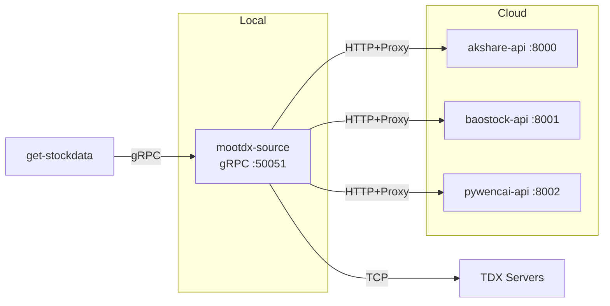

# EPIC-008: Hybrid Data Source Architecture Implementation

**Status**: Planning  
**Priority**: High  
**Owner**: Architecture Team  
**Start Date**: 2025-12-17  
**Target Completion**: 2026-01-15 (4 weeks)

---

## Epic Overview

Implement a hybrid deployment architecture for data sources, consolidating local resources into a single container while leveraging cloud services for proxy-dependent data sources. This eliminates complex network proxy chains and improves system stability.

### Problem Statement

Current architecture suffers from:
- 5 separate data source containers requiring individual management
- Complex 4-layer proxy chain causing connection failures
- Squid proxy blocking non-standard ports (Baost ock port 10030)
- Network configuration fragility

### Goals

1. **Simplify Local Deployment**: Reduce from 5 containers to 1
2. **Improve Stability**: Eliminate proxy chain for TCP data sources
3. **Isolate Failures**: Cloud services run independently
4. **Maintain Performance**: <10ms for real-time, <500ms for historical

---

## Architecture Overview

### Component Responsibilities

| Component | Responsibility | Key Technologies |
|-----------|----------------|------------------|
| **mootdx-source** | Unified gRPC server, route requests to local/cloud | Python, gRPC, aiohttp |
| **akshare-api** | Reference data (stock list, calendar) | FastAPI, akshare |
| **baostock-api** | Historical K-line data (1990+) | FastAPI, baostock |
| **pywencai-api** | Natural language screening | FastAPI, pywencai, Node.js |

---

## Success Criteria

### Technical Metrics

- [ ] Local deployment reduced to 1 container
- [ ] All 5 data sources accessible via single gRPC endpoint
- [ ] Real-time quote latency < 10ms (p95)
- [ ] Historical data latency < 500ms (p95)
- [ ] System availability > 99.5% over 7 days

### Operational Metrics

- [ ] Local build time < 3 minutes
- [ ] Cloud service restart time < 10 seconds
- [ ] Zero manual proxy chain management

---

## Story Breakdown

### Story 8.1: Local Container Consolidation

**Effort**: 3 days  
**Priority**: P0 (Blocker)

**Objectives:**
- Merge mootdx + easyquotation into single container
- Add HTTP client for cloud API calls
- Update gRPC service to route requests

**Acceptance Criteria:**
- Single container provides all 5 data source types
- Environment variables configure cloud API URLs
- Health check covers all embedded sources

---

### Story 8.2: Cloud Service - Baostock API

**Effort**: 2 days  
**Priority**: P0 (Critical Path)

**Objectives:**
- Create FastAPI wrapper for baostock library
- Implement auto-reconnect for session timeouts
- Deploy to Tencent Cloud with Docker

**Acceptance Criteria:**
- `/health` endpoint returns 200
- Historical K-line API returns data for SH600519
- Service auto-restarts on crash (systemd)

---

### Story 8.3: Cloud Service - Pywencai API

**Effort**: 2 days  
**Priority**: P1 (High)

**Objectives:**
- Create FastAPI wrapper for pywencai library
- Install Node.js dependencies on cloud
- Deploy with Docker Compose

**Acceptance Criteria:**
- Natural language query "今日涨停" returns results
- Caching reduces duplicate query latency by 80%
- Handles CAPTCHA errors gracefully

---

### Story 8.4: Integration and Verification

**Effort**: 2 days  
**Priority**: P0 (Required for Epic Completion)

**Objectives:**
- Update get-stockdata gRPC client configuration
- End-to-end testing across all data types
- Performance benchmarking

**Acceptance Criteria:**
- All `DataType` enum values return valid data
- Latency meets SLA (10ms/500ms)
- Documentation updated with hybrid architecture

---

## Dependencies

### External Dependencies
- [ ] Tencent Cloud server access (124.221.80.250)
- [ ] Docker and Docker Compose installed on cloud
- [ ] HTTP proxy (Squid) remains operational

### Internal Dependencies
- [ ] Proto definition stable (`data_source.proto`)
- [ ] Nacos service registry available
- [ ] get-stockdata service ready for gRPC migration

---

## Risks and Mitigation

| Risk | Impact | Probability | Mitigation |
|------|--------|-------------|------------|
| Cloud server downtime | High | Low | Local mootdx continues real-time data |
| HTTP proxy failure | Medium | Low | easyquotation has direct HTTPS fallback |
| Baostock session timeout | Low | Medium | Auto-reconnect with exponential backoff |
| Pywencai CAPTCHA | Medium | High | Implement retry with 5min cooldown |

---

## Testing Strategy

### Unit Tests
- Individual library wrappers (mootdx, easyquotation, HTTP client)
- gRPC service routing logic
- Cloud API request/response parsing

### Integration Tests
- Local container → Cloud API communication
- gRPC client → mootdx-source end-to-end
- Proxy configuration validation

### Performance Tests
- Latency benchmarks for each `DataType`
- Concurrent request handling (100 RPS)
- Memory leak detection (24-hour soak test)

---

## Rollout Plan

### Phase 1: Development (Week 1)
- Story 8.1: Local container consolidation
- Story 8.2: Baostock API development

### Phase 2: Cloud Deployment (Week 2)
- Deploy baostock-api to Tencent Cloud
- Story 8.3: Pywencai API development and deployment

### Phase 3: Integration (Week 3)
- Story 8.4: Integration testing
- Load testing and performance tuning

### Phase 4: Production Rollout (Week 4)
- Blue-green deployment
- Monitor for 7 days
- Decommission old containers

---

## Related Documents

- [ADR-002: Hybrid Architecture](../../architecture/hybrid-data-source/ADR-002-hybrid-architecture.md)
- [gRPC Architecture Guide](../../../.gemini/antigravity/brain/96cbf2a5-ec6d-41b6-ac4d-49ec8bc1e9c3/grpc_architecture_guide.md)
- [Implementation Plan](../../../.gemini/antigravity/brain/96cbf2a5-ec6d-41b6-ac4d-49ec8bc1e9c3/implementation_plan.md)

---

## Changelog

| Date | Change | Author |
|------|--------|--------|
| 2025-12-17 | Epic created | Architecture Team |
