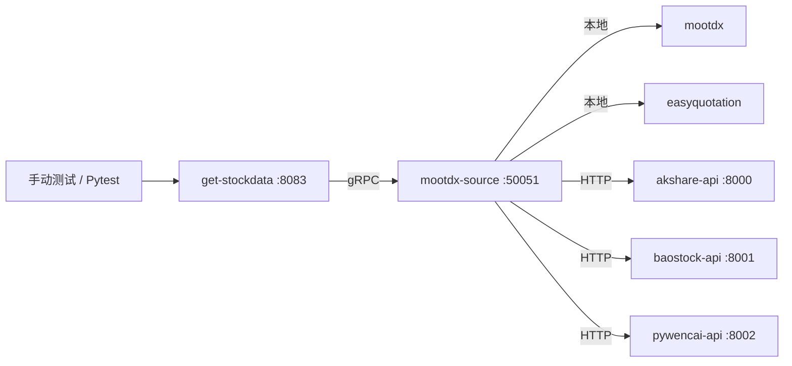

# Story 8.4: 集成和验证

**Epic**: [EPIC-008 混合数据源架构](./EPIC-008-混合架构实施.md)  
**状态**: 阻塞中 (等待 Stories 8.1-8.3)  
**优先级**: P0 (Epic 完成必需)  
**工作量**: 2天  
**负责人**: 待定

---

## Story 描述

**作为** 系统负责人  
**我想要** 验证整个混合架构端到端工作  
**以便** 有信心部署到生产环境

---

## 目标

1. 更新 `get-stockdata` gRPC 客户端以连接到整合的 `mootdx-source`
2. 跨所有 `DataType` 枚举执行端到端测试
3. 运行性能基准测试以验证 SLA 合规性
4. 更新文档以反映新架构

---

## 技术设计

### 集成点



### 测试覆盖矩阵

| DataType | 预期来源 | 测试方法 | SLA |
|----------|---------|---------|-----|
| DATA_TYPE_QUOTES | mootdx (本地) | 单元 + E2E | <10ms |
| DATA_TYPE_TICK | mootdx (本地) | 单元 + E2E | <20ms |
| DATA_TYPE_HISTORY | baostock-api (云端) | E2E | <500ms |
| DATA_TYPE_RANKING | akshare-api (云端) | E2E | <300ms |
| DATA_TYPE_SECTOR | pywencai-api (云端) | E2E | <3000ms |
| DATA_TYPE_FINANCE | akshare-api (云端) | E2E | <500ms |
| DATA_TYPE_VALUATION | akshare-api (云端) | E2E | <500ms |
| DATA_TYPE_INDEX | baostock-api (云端) | E2E | <500ms |
| DATA_TYPE_INDUSTRY | baostock-api (云端) | E2E | <500ms |

---

## 验收标准

### 功能性

- [ ] 所有 9种 `DataType` 枚举通过 gRPC 返回有效数据
- [ ] 错误处理测试: 云端 API 宕机、网络超时、无效代码
- [ ] 健康检查聚合所有数据源的状态
- [ ] 优雅降级: 如果云端失败，本地数据源仍然工作

### 非功能性

- [ ] 实时行情延迟 (p95) < 10ms
- [ ] 历史数据延迟 (p95) < 500ms
- [ ] 并发请求处理: 持续 5分钟 100 RPS
- [ ] 内存泄漏测试: 24小时浸泡后无显著增加

---

## 实施步骤

### 1. 更新 gRPC 客户端配置

**文件**: `services/get-stockdata/src/config.py`

```python
# 移除单独的服务 URL
# 添加单一 mootdx-source 端点
GRPC_DATA_SOURCE = {
    "host": os.getenv("DATA_SOURCE_HOST", "localhost"),
    "port": int(os.getenv("DATA_SOURCE_PORT", 50051))
}
```

### 2. 创建端到端测试套件

**文件**: `tests/integration/test_hybrid_e2e.py`

```python
import pytest
from datasource.v1 import data_source_pb2

@pytest.mark.asyncio
async def test_all_data_types():
    client = DataSourceClient("localhost", 50051)
    await client.connect()
    
    # 测试每个 DataType
    test_cases = [
        (DATA_TYPE_QUOTES, ["000001"], {}),
        (DATA_TYPE_HISTORY, ["600519"], {"start_date": "2024-01-01", "end_date": "2024-12-31"}),
        (DATA_TYPE_RANKING, [], {"ranking_type": "hot"}),
        # ... 更多测试用例
    ]
    
    for dtype, codes, params in test_cases:
        request = DataRequest(type=dtype, codes=codes, params=params)
        response = await client.fetch_data(request)
        
        assert response.success, f"Failed for {dtype}"
        assert len(response.json_data) > 0, f"Empty data for {dtype}"
```

---

## 测试策略

### 级别 1: 单元测试 (Stories 8.1-8.3)
- 单个组件测试

### 级别 2: 集成测试 (本 Story)
- gRPC 客户端 → mootdx-source → 本地/云端数据源

### 级别 3: 端到端测试
- HTTP API → get-stockdata → gRPC → mootdx-source → 数据

### 级别 4: 性能测试
- 延迟基准
- 并发负载测试
- 内存泄漏检测 (24小时浸泡)

---

## 依赖关系

### 被阻塞
- [ ] Story 8.1: 本地容器整合
- [ ] Story 8.2: Baostock API 已部署
- [ ] Story 8.3: Pywencai API 已部署

### 阻塞
- Epic 008 完成

---

## 风险

| 风险 | 缓解措施 |
|------|----------|
| 测试期间网络不稳定 | 运行测试 3次，允许 1次失败 |
| 性能因时段而异 | 在交易时段基准测试 (9:30-15:00 CST) |
| 云端 API 限流 | 将测试请求限制为 10 RPS |

---

## 完成定义

- [ ] 所有集成测试通过 (3次运行 100% 成功率)
- [ ] 性能基准满足 SLA
- [ ] 文档更新并审查
- [ ] 部署运维手册已创建
- [ ] Epic 008 获得利益相关者签字
