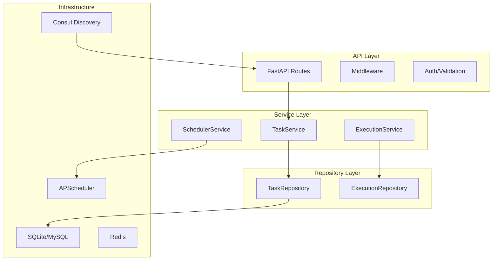
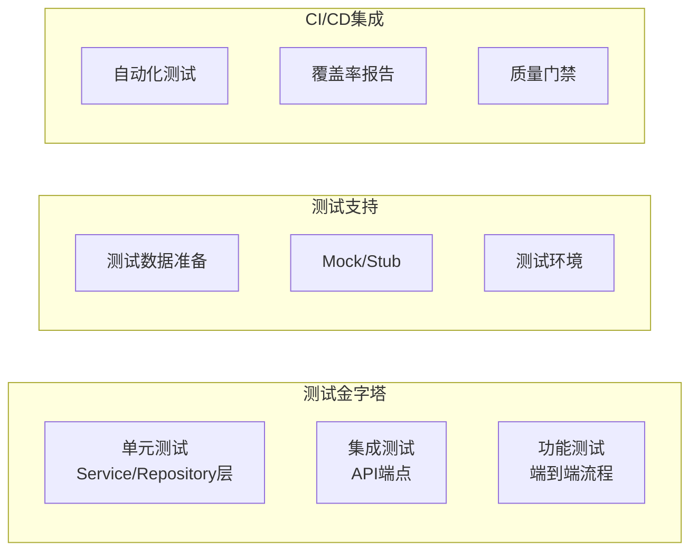

# TaskScheduler 微服务质量评估报告

**评估日期**: 2025-11-10
**评估人员**: Quinn - Test Architect & Quality Advisor
**微服务版本**: v2.0.0
**评估范围**: TaskScheduler 微服务完整架构和实现

---

## 📋 执行摘要

本次质量评估针对TaskScheduler微服务进行全面检查，涵盖架构设计、功能完整性、配置管理、非功能性需求等关键维度。评估结果显示该微服务在架构设计和功能实现方面表现良好，但在测试覆盖率和生产环境准备方面存在显著质量风险。

### 🎯 关键发现
- **优势**: 清晰的分层架构、完整的API设计、良好的配置管理
- **风险**: 测试覆盖率为0%、生产环境配置不完整
- **建议**: 优先建立测试体系，完善生产环境配置

### 📊 综合评级: **🟡 中等 (6.25/10)**

---

## 🏗️ 架构设计评估

### 设计原则符合性 ✅

**评估维度**:
- ✅ **关注点分离**: API层、Service层、Repository层职责明确
- ✅ **单一职责**: 每个组件职责边界清晰
- ✅ **依赖倒置**: 通过接口抽象降低耦合
- ✅ **开闭原则**: 插件系统支持功能扩展

### 架构模式分析



**架构优势**:
- 清晰的分层结构，易于维护和扩展
- 异步架构支持高并发场景
- 插件系统提供良好的可扩展性
- 服务注册发现支持微服务治理

**关注点**:
- 数据库层使用SQLite作为默认存储，生产环境需要升级
- 服务间依赖管理可以进一步优化
- 缺少断路器和熔断机制

---

## 🎯 功能完整性评估

### 核心功能矩阵

| 功能模块 | 需求覆盖 | 实现状态 | 质量评级 |
|----------|----------|----------|----------|
| 任务管理 | ✅ 完整 | ✅ 已实现 | 🟢 优秀 |
| 任务调度 | ✅ 完整 | ✅ 已实现 | 🟢 优秀 |
| 执行监控 | ✅ 完整 | ✅ 已实现 | 🟢 优秀 |
| 状态管理 | ✅ 完整 | ✅ 已实现 | 🟢 优秀 |
| 插件系统 | ✅ 完整 | ✅ 已实现 | 🟡 良好 |
| API接口 | ✅ 完整 | ✅ 已实现 | 🟢 优秀 |

### API设计评估

**RESTful设计符合性**:
- ✅ HTTP动词使用正确 (GET/POST/PUT/DELETE)
- ✅ 资源路径设计合理
- ✅ 状态码使用规范
- ✅ 响应格式统一

**API覆盖度**:
```yaml
任务管理:
  - POST /api/v1/tasks          # 创建任务 ✅
  - GET /api/v1/tasks           # 查询任务 ✅
  - GET /api/v1/tasks/{id}      # 任务详情 ✅
  - PUT /api/v1/tasks/{id}      # 更新任务 ✅
  - DELETE /api/v1/tasks/{id}   # 删除任务 ✅

任务控制:
  - POST /api/v1/tasks/{id}/trigger  # 手动触发 ✅
  - POST /api/v1/tasks/{id}/pause    # 暂停任务 ✅
  - POST /api/v1/tasks/{id}/resume   # 恢复任务 ✅
  - POST /api/v1/tasks/{id}/enable   # 启用任务 ✅
  - POST /api/v1/tasks/{id}/disable  # 禁用任务 ✅

统计分析:
  - GET /api/v1/tasks/{id}/statistics # 任务统计 ✅
  - GET /api/v1/health                 # 健康检查 ✅
```

---

## ⚙️ 配置管理评估

### 配置架构分析

**配置层次结构**:
```
├── 环境变量 (.env)
├── 应用配置 (settings.py)
├── 数据库配置
├── 安全配置
└── 调度器配置
```

### 配置完整性检查

| 配置类别 | 覆盖度 | 质量评级 | 备注 |
|----------|--------|----------|------|
| 服务配置 | ✅ 完整 | 🟢 优秀 | 端口、主机、工作进程 |
| 数据库配置 | ✅ 完整 | 🟢 优秀 | MySQL、Redis、ClickHouse |
| 安全配置 | ✅ 完整 | 🟡 良好 | JWT、密钥、Token |
| 调度器配置 | ✅ 完整 | 🟢 优秀 | 时区、线程池、作业参数 |
| 监控配置 | ✅ 完整 | 🟡 良好 | 指标、健康检查 |
| 代理配置 | ✅ 完整 | 🟢 优秀 | HTTP/HTTPS代理 |

### 配置管理最佳实践符合性

- ✅ **环境分离**: 开发/生产环境配置分离
- ✅ **敏感信息**: 通过环境变量管理
- ✅ **配置验证**: Pydantic模型验证
- ✅ **默认值**: 合理的默认配置
- ⚠️ **运行时验证**: 缺少配置运行时验证

---

## 🧪 测试基础设施评估

### 测试工具链完备性

| 工具类型 | 配置状态 | 用途 |
|----------|----------|------|
| 测试框架 | ✅ 已配置 | pytest, pytest-asyncio |
| API测试 | ✅ 已配置 | httpx |
| 代码质量 | ✅ 已配置 | black, mypy, flake8 |
| 覆盖率 | ✅ 已配置 | pytest-cov |

### 测试架构准备度



**当前状态**:
- ✅ 测试工具链已完备配置
- ✅ 测试目录结构已建立
- ❌ 实际测试用例缺失
- ❌ CI/CD集成待实现

**测试覆盖率**: 0% (需要开发团队实施)

---

## 🔒 非功能性需求评估

### 性能 (Performance) - 🟡 中等 (6/10)

**优势**:
- 异步架构支持高并发
- 调度器支持多工作线程
- Redis缓存减少数据库访问

**关注点**:
- SQLite作为默认存储，不适合高并发
- 缺少性能监控和基准测试
- 数据库连接池配置需要优化

### 安全性 (Security) - 🟡 中等 (6/10)

**安全措施**:
- JWT认证机制
- Pydantic输入验证
- HTTPS支持
- 敏感信息环境变量管理

**安全风险**:
- 权限控制粒度较粗
- 缺少API访问审计
- 密钥轮换机制不明确
- 输入验证可能存在绕过风险

### 可靠性 (Reliability) - 🟡 中等 (6/10)

**可靠性特征**:
- 健康检查端点
- 服务注册发现
- 异常处理机制
- 任务重试策略

**可靠性风险**:
- 内存存储丢失风险
- 缺少断路器机制
- 数据备份策略不明确
- 故障恢复时间较长

### 可维护性 (Maintainability) - 🟢 良好 (8/10)

**维护性优势**:
- 清晰的代码结构
- 完整的文档说明
- 良好的日志记录
- 模块化设计

**改进空间**:
- 代码注释可以更丰富
- API文档需要自动生成
- 错误码标准化

### 可扩展性 (Scalability) - 🟡 中等 (6/10)

**扩展性特征**:
- 插件系统支持功能扩展
- 微服务架构支持水平扩展
- 无状态服务设计

**扩展性限制**:
- 数据存储可能成为瓶颈
- 缺少分布式锁机制
- 调度器集群支持不完整

---

## 🚨 质量风险识别

### 🔴 高风险 (立即处理)

1. **测试覆盖率为0%**
   - 风险: 无法保证代码质量，重构风险高
   - 影响: 生产环境稳定性风险
   - 建议: 立即建立测试体系

2. **生产环境数据库配置**
   - 风险: SQLite不适合生产环境
   - 影响: 性能瓶颈，数据丢失风险
   - 建议: 配置MySQL/PostgreSQL

### 🟡 中风险 (近期处理)

3. **监控和可观测性**
   - 风险: 缺少运行时监控
   - 影响: 问题定位困难
   - 建议: 集成Prometheus + Grafana

4. **安全机制完善**
   - 风险: 权限控制不足
   - 影响: 潜在安全威胁
   - 建议: 完善RBAC和审计日志

### 🟢 低风险 (长期优化)

5. **性能优化**
   - 风险: 高并发场景性能问题
   - 影响: 用户体验下降
   - 建议: 性能测试和优化

---

## 💡 改进建议

### 🎯 立即行动项 (1-2周)

1. **建立测试体系**
   - [ ] 编写核心组件单元测试 (目标覆盖率: >70%)
   - [ ] 添加API集成测试
   - [ ] 配置CI/CD自动化测试
   - [ ] 建立代码质量门禁

2. **生产环境配置**
   - [ ] 配置生产级数据库 (MySQL/PostgreSQL)
   - [ ] 设置Redis集群配置
   - [ ] 实施数据备份策略
   - [ ] 配置环境变量管理

### 🚀 短期优化 (1个月)

3. **监控和可观测性**
   - [ ] 集成Prometheus指标收集
   - [ ] 配置Grafana仪表盘
   - [ ] 实现结构化日志 (JSON格式)
   - [ ] 添加分布式链路追踪

4. **安全性增强**
   - [ ] 完善JWT认证和权限控制
   - [ ] 实现API访问审计
   - [ ] 添加输入验证安全测试
   - [ ] 配置HTTPS和安全头

### 🎨 长期演进 (3个月)

5. **性能和架构优化**
   - [ ] 数据库连接池优化
   - [ ] 实施缓存策略
   - [ ] 添加断路器机制
   - [ ] 支持调度器集群

6. **运维自动化**
   - [ ] 容器化部署优化
   - [ ] 自动化扩缩容
   - [ ] 灾难恢复机制
   - [ ] 蓝绿部署支持

---

## 📊 质量门禁建议

### 发布前检查清单

#### 🚪 必须通过 (Must Have)
- [ ] 测试覆盖率 ≥ 70%
- [ ] 生产环境数据库配置
- [ ] 安全配置检查通过
- [ ] 基础监控就绪
- [ ] API文档完整

#### 🎯 建议通过 (Should Have)
- [ ] 性能基准测试
- [ ] 错误处理验证
- [ ] 日志结构化
- [ ] 健康检查完善

#### ✅ 可选通过 (Nice to Have)
- [ ] 负载测试通过
- [ ] 安全扫描通过
- [ ] 文档完整度 > 90%
- [ ] 代码质量评级 A级

---

## 📈 持续改进计划

### 阶段目标

| 阶段 | 时间目标 | 主要目标 | 成功指标 |
|------|----------|----------|----------|
| Phase 1 | 2周 | 测试基础设施 | 测试覆盖率 > 70% |
| Phase 2 | 4周 | 生产就绪 | 生产环境部署成功 |
| Phase 3 | 8周 | 监控完善 | 可观测性覆盖 > 80% |
| Phase 4 | 12周 | 性能优化 | 性能基准达标 |

### 质量指标跟踪

```yaml
代码质量:
  - 测试覆盖率: 目标 > 70%
  - 代码复杂度: 目标 < 10
  - 技术债务: 目标 < 1天

运维质量:
  - 可用性: 目标 > 99.9%
  - 响应时间: 目标 < 200ms
  - 错误率: 目标 < 0.1%

安全质量:
  - 漏洞扫描: 目标 0个高危
  - 权限控制: 目标 100%覆盖
  - 审计日志: 目标 100%记录
```

---

## 📋 结论与建议

### 总体评估结论

TaskScheduler微服务展现了**良好的架构设计和完整的功能实现**，具备了企业级微服务的基础特征。清晰的分层架构、规范的API设计、完整的配置管理为其在微服务架构中的应用奠定了坚实基础。

然而，**测试覆盖率的缺失**和**生产环境配置的不完整**构成了显著的质量风险，需要在生产部署前优先解决。

### 关键成功因素

1. **立即建立测试体系** - 这是质量保证的基础
2. **完善生产环境配置** - 确保稳定性和性能
3. **建立监控体系** - 提供运维可观测性
4. **持续质量改进** - 建立质量度量体系

### 最终建议

**推荐状态**: 🟡 **有条件通过** - 在完成测试体系建立和生产环境配置后，可以投入生产使用。

**下次评估时间**: 建议在4周后进行跟进评估，重点检查改进项的完成情况。

---

**评估完成时间**: 2025-11-10
**评估人员签名**: Quinn - Test Architect & Quality Advisor
**文档版本**: v1.0