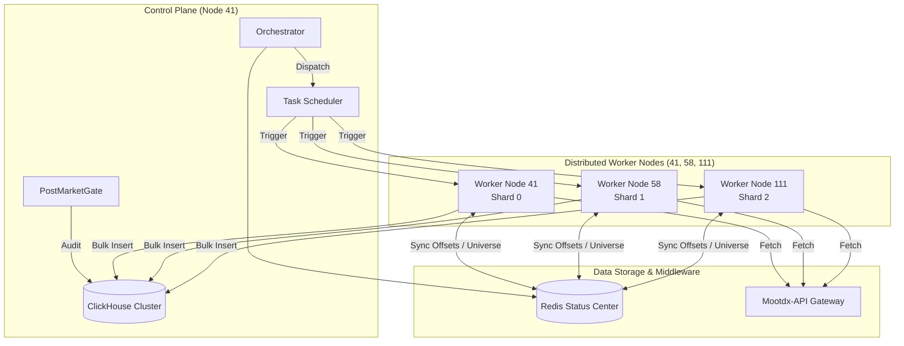
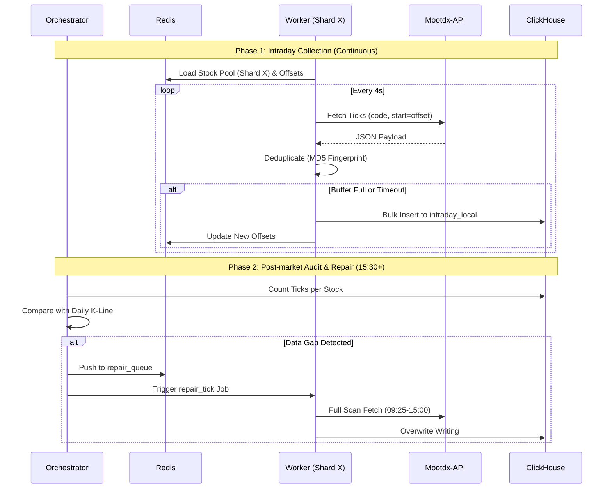

# 分笔数据分布式采集：架构与全流程技术方案

## 1. 架构总览 (Architecture Overview)

系统的核心设计理念是 **“分片采集、中心审计、按需补采”**。通过将全市场 5000+ 股票拆分为多个逻辑分片（Shards），分散在不同的物理节点执行，以解决数据源并发限制和单点性能瓶颈。

### 1.1 核心组件



### 1.2 物理链路图

---

## 2. 采集全流程 (Full Lifecycle)



---

### 阶段 1：盘中实时分片采集 (Intraday Real-time)
*   **执行主体**: `intraday-tick-collector`
*   **触发机制**: 交易时段持续运行。
*   **流程**:
    1.  **加载分片**: 根据环境变量 `SHARD_INDEX` 从 Redis 获取负责的股票池。
    2.  **断点恢复**: 从 Redis 读取各股今日已采集的 `offset`（偏移量）。
    3.  **增量轮询**: 调用 `/api/v1/tick/{code}?start={offset}` 获取新数据。
    4.  **指纹去重**: 使用 `TickDeduplicator` (MD5 签名) 过滤 API 翻页产生的重叠数据。
    5.  **量时双触发写入**: 积攒 3000+ 条记录或间隔 5 秒未写入时，自动触发一次性 Bulk Insert。
    6.  **更新偏移量**: 写入成功后回写偏移量到 Redis。

### 阶段 2：盘后全量同步 (Post-market Sync)
*   **执行主体**: `gsd-worker` (Job: `collect_tick_sharded`)
*   **触发机制**: 每日 15:15 (常规) 或 06:00 (针对前日异常补采)。
*   **流程**:
    1.  **名单获取**: 优先从当日 K 线表获取有成交的股票名单，确保不漏掉停复牌股。
    2.  **分片过滤**: 使用 `xxHash64(code) % total == index` 筛选本地负责的股票。
    3.  **深度采集**: 使用 `TickFetcher` 的 `HISTORICAL` 模式，通过线性全扫描确保 09:25 到 15:00 的数据无缝覆盖。

### 阶段 3：质量审计与关卡 (Audit & Quality Gate)
*   **执行主体**: `PostMarketGateService`
*   **触发机制**: 16:00 后启动。
*   **流程**:
    1.  **数量对比**: 统计 ClickHouse 中各股的分笔总数。
    2.  **连续性检测**: 检查首笔（<= 09:30）和末笔（>= 14:57）的时间戳，以及中间数据的空洞。
    3.  **状态标注**: 根据 `TickStandards` 标注结果为 **Green** (通过), **Yellow** (需补采), **Red** (严重故障)。

### 阶段 4：自动化修复 (Auto-Repair)
*   **执行主体**: `repair_tick`
*   **流程**:
    1.  **读取异常单**: 从审计任务中获取 `failed_codes`。
    2.  **冷启动补采**: 强制重新全量拉取异常股票的当日分笔，并覆盖写入 ClickHouse。

---

## 3. 分片算法逻辑 (Sharding Logic)

系统采用 **逻辑一致性哈希** 实现任务分配：

```python
# 核心分配逻辑 (gsd_shared.stock_universe)
def _shard_filter(self, stocks: List[str], shard_index: int, total: int) -> List[str]:
    import xxhash
    return [
        s for s in stocks 
        if xxhash.xxh64(s).intdigest() % total == shard_index
    ]
```

*   **稳定性**: 只要 `total` 不变，同一股票永远会被分配到同一个节点进行采集，极大方便了本地指纹缓存和状态管理。
*   **互斥性**: 各分片节点之间无需通信，天然实现了任务的互斥执行。

---

## 4. 关键保障机制

1.  **分布式写锁**: 避免同一时间多个 Job 同时操作同一只股票的 ClickHouse 分桶。
2.  **6:00 AM 规则**: Worker 启动时检测当前时间，0点-6点视为对前一交易日的延续，确保凌晨补采逻辑正确。
3.  **ReplacingMergeTree**: 利用数据库引擎在后台合并重复插入的数据，保证最终一致性。

---
**存档位置**: `docs/architecture/TICK_COLLECTION_FLOW_AND_ARCH.md`
**最后更新**: 2026-01-28
