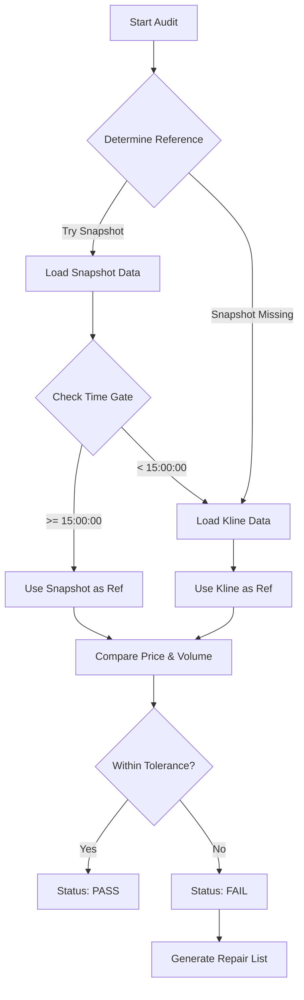

# 分笔数据精准审计设计文档 (Precise Audit Design)

> **版本**: v1.0
> **创建时间**: 2026-02-04
> **状态**: ✅ 已在生产环境验证 (V4.0)

## 1. 设计背景

在分笔数据（Tick Data）采集过程中，传统的基于 K 线成交量对比的方法存在以下局限性：
1.  **粒度不足**: K 线包含全天数据，无法精确审计特定时段（如早盘/午盘）的数据完整性。
2.  **精度误差**: K 线数据可能经过调整（如复权），而分笔数据是原始数据，两者在金额/量上可能存在微小差异。
3.  **时效性**: 必须等到收盘后 K 线生成才能审计。

为了解决上述问题，引入 **"Snapshot First" (快照优先)** 的精准审计策略。利用盘中高频采集的 Level-1 快照作为"黄金基准"，实现分钟级的精准对账。

## 2. 核心策略：Snapshot First

### 2.1 策略逻辑
系统优先使用离目标时间点最近的 **Level-1 快照 (Snapshot)** 作为对账基准。只有在快照缺失或不满足时间门禁时，才降级使用 **日 K 线 (Daily Kline)**。

### 2.2 时间门禁 (Time Gates)
为了确保快照数据的代表性，定义了严格的时间门禁：

| 审计 Session | 目标时段 | 快照最低时间要求 (`min_snap_time`) | 说明 |
| :--- | :--- | :--- | :--- |
| **Noon** (午间) | 09:30 - 11:30 | **11:30:00** | 必须包含上午收盘时刻的累积量 |
| **Close** (收盘) | 09:30 - 15:00 | **15:00:00** | 必须包含全天收盘时刻的累积量 |

### 2.3 误差容忍度 (Tolerances)
基于 `TICK_DATA_ACQUISITION_SPEC` 的高精度要求，定义了 `Precise` 级误差标准：

*   **价格误差 (Price)**: `Abs(Tick.last_price - Ref.close_price) <= 0.1`
*   **成交量误差 (Volume)**: `Abs(Tick.sum_vol - Ref.sum_vol) / Ref.sum_vol <= 0.5% (0.005)`

## 3. 系统架构

### 3.1 模块位置
*   **代码路径**: `services/gsd-worker/src/jobs/audit_tick_resilience.py`
*   **共享库**: `libs/gsd-shared/gsd_shared/validation/standards.py` (定义标准)

### 3.2 类设计
`AuditJob` 类负责编排整个审计流程：
1.  **Scope Resolution**: 确定审计范围（剔除北证/指数）。
2.  **Data Loading**: 并行加载 Tick 聚合数据、快照数据。
3.  **Verification**: 执行内存级的高速比对。
4.  **Reporting**: 生成 JSON 格式的审计报告。

### 3.3 流程图 (Mermaid)



## 4. 接口规范

### 4.1 输入参数 (CLI)
```bash
python -m jobs.audit_tick_resilience \
  --session close \       # 审计时段: noon / close
  --date 20260204 \       # 审计日期
  --stock-codes "..."     # (可选) 指定审计股票
```

### 4.2 输出格式 (JSON)
审计结果通过标准输出（Stdout）返回，被 Task Orchestrator 捕获：

```json
{
  "target_date": "20260204",
  "session": "close",
  "stats": {
    "total_expected": 5000,
    "valid": 4998,
    "missing": 1,
    "bad_quality": 1
  },
  "missing_list": ["600519", "000001"],  // 包含 missing 和 bad_quality
  "details": [
    {
      "code": "600519",
      "reasons": ["Price Mismatch: Tick=1500.0 vs Ref=1500.5"],
      "source": "snapshot"
    }
  ],
  "diagnosis": {
    "action": "AI_AUDIT",
    "reason": "Audit found 2 missing/bad stocks"
  }
}
```

## 5. 自愈联动 (Repair Workflow)

审计输出的 `missing_list` 将直接作为输入传递给修复任务：

1.  **Orchestrator 捕获**: 解析 `GSD_OUTPUT_JSON`。
2.  **判断 Action**:
    *   `AI_AUDIT` (数量 <= 200): 触发 `sync_tick.py --mode repair`。
    *   `FAILOVER` (数量 > 200): 触发全量重建或报警。
3.  **执行修复**:
    ```bash
    # 自动生成的修复命令
    jobs.sync_tick --mode repair --stock-codes "600519,000001"
    ```

## 6. 常见问题与排查

| 现象 | 可能原因 | 处理建议 |
| :--- | :--- | :--- |
| **Source = kline** | 即时快照未送达或时间未达标 | 检查 `get-stockdata` 服务的快照采集日志 |
| **Volume Mismatch > 0.5%** | 交易所盘后大宗交易或统计口径差异 | 确认为偶发还是系统性，必要时调整 `standards.py` |
| **Missing List > 1000** | 采集服务主要进程崩溃 | 检查 Redis 任务队列堆积情况 |

## 7. 维护指南

若需调整容忍度标准，请修改 `libs/gsd-shared/gsd_shared/validation/standards.py`：

```python
class Precise:
    PRICE_TOLERANCE = 0.1          # 调整价格误差
    VOLUME_TOLERANCE = 0.005       # 调整成交量误差 (0.5%)
```
