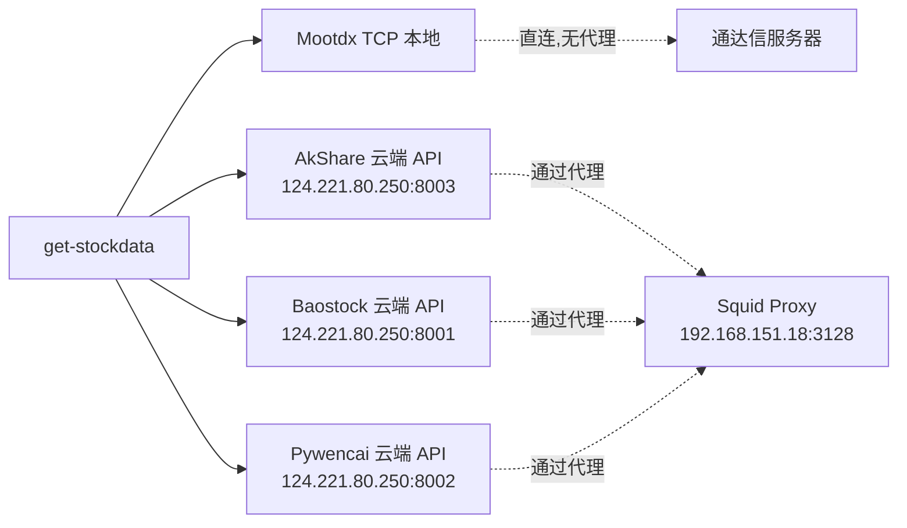

# Get-Stockdata 编程规范

> **版本**: 2.0 (2025-12-22)  
> **适用范围**: `get-stockdata` 微服务及所有数据采集相关代码

---

## 1. 网络与数据源架构 (ADR-002 强制要求)

### 1.1 代理使用规范

**禁止使用 8118 本地代理**

```python
# ❌ 错误 - 禁止使用 8118 端口
PROXY_URL = "http://127.0.0.1:8118"
HTTP_PROXY = "http://localhost:8118"

# ✅ 正确 - 使用腾讯云 Squid 代理
PROXY_URL = "http://192.168.151.18:3128"
```

**强制规则**:
- 所有云端 API 调用必须通过 `192.168.151.18:3128` 代理
- 配置文件中不得出现 `8118` 端口引用
- 测试代码中的代理配置必须使用生产代理地址

### 1.2 数据源调用规范

**禁止本地调用 akshare/baostock/pywencai**

```python
# ❌ 错误 - 禁止本地库调用
import akshare as ak
import baostock as bs
import pywencai

df = ak.stock_zh_a_spot_em()
bs.query_history_k_data_plus(code="sh.600519")
pywencai.get(query="涨停股票")

# ✅ 正确 - 使用云端 API
from data_sources.providers.akshare_provider import AkshareProvider
from data_sources.providers.baostock_provider import BaostockProvider

provider = AkshareProvider()  # 自动连接云端 API
result = await provider.fetch(DataType.QUOTES, symbol="600519")
```

**云端 API 地址** (强制使用):
```bash
AKSHARE_API_URL=http://124.221.80.250:8003
BAOSTOCK_API_URL=http://124.221.80.250:8001
PYWENCAI_API_URL=http://124.221.80.250:8002
STOCK_CODES_API_URL=http://124.221.80.250:8000
```

### 1.3 本地数据源规范

**仅允许本地调用 Mootdx (TCP 连接)**

```python
# ✅ 正确 - Mootdx 是唯一允许的本地数据源
from data_sources.providers.mootdx_provider import MootdxProvider

provider = MootdxProvider()
await provider.initialize()  # TCP 直连，不使用代理
quotes = await provider.fetch(DataType.QUOTES, codes=["600519"])
```

**Mootdx 使用场景**:
- 实时行情 (QUOTES)
- 分笔成交 (TICK)
- 历史K线 (HISTORY)

### 1.4 错误处理 - 禁止降级策略

**Fail-Fast 原则**

```python
# ❌ 错误 - 禁止 fallback 到本地库
async def get_data(code: str):
    try:
        # 尝试云端 API
        data = await cloud_api.fetch(code)
    except Exception:
        # ❌ 不允许降级到本地
        import akshare as ak
        data = ak.stock_financial_abstract(code)
    return data

# ✅ 正确 - 直接抛出错误
async def get_data(code: str):
    try:
        data = await cloud_api.fetch(code)
        return data
    except Exception as e:
        logger.error(f"Cloud API failed: {e}")
        raise  # 直接抛出，不降级
```

**错误处理要求**:
1. **不允许** fallback 到本地 akshare/baostock
2. **不允许** 返回 mock 数据
3. **必须** 记录完整错误日志
4. **必须** 向上层抛出异常，由调用方决定处理策略

---

## 2. Asyncio 并发规范

### 2.1 异步优先

```python
# ✅ 所有 I/O 操作必须使用 async/await
async def fetch_quotes(codes: List[str]) -> pd.DataFrame:
    async with aiohttp.ClientSession() as session:
        async with session.get(url) as resp:
            return await resp.json()
```

### 2.2 线程安全

```python
# ✅ 共享状态必须使用锁
class QuotesService:
    def __init__(self):
        self._lock = asyncio.Lock()
        self._cache = {}
    
    async def update_cache(self, key, value):
        async with self._lock:
            self._cache[key] = value
```

### 2.3 后台任务管理

```python
# ✅ 后台任务必须跟踪和优雅关闭
class DataService:
    def __init__(self):
        self._tasks: Set[asyncio.Task] = set()
    
    async def close(self):
        for task in self._tasks:
            task.cancel()
        await asyncio.gather(*self._tasks, return_exceptions=True)
```

---

## 3. 资源管理

### 3.1 生命周期管理

```python
# ✅ 所有服务类必须实现 initialize() 和 close()
class MyService:
    async def initialize(self) -> bool:
        # 初始化资源
        return True
    
    async def close(self) -> None:
        # 释放资源
        pass
```

### 3.2 异常安全

```python
# ✅ 使用 try...finally 确保资源释放
async def fetch_data(self):
    client = None
    try:
        client = await self.get_client()
        return await client.fetch()
    finally:
        if client:
            await client.close()
```

---

## 4. 时区与调度

### 4.1 统一时区

```python
# ✅ 所有时间操作必须使用 Asia/Shanghai
from zoneinfo import ZoneInfo

now = datetime.now(ZoneInfo("Asia/Shanghai"))
```

### 4.2 交易时段

```python
# A股交易时段
TRADING_HOURS = {
    "morning": ("09:30", "11:30"),
    "afternoon": ("13:00", "15:00")
}
```

---

## 5. 测试规范

### 5.1 测试环境

```bash
# ✅ 测试必须在 Docker 环境中运行
docker compose -f docker-compose.dev.yml run --rm get-stockdata pytest
```

### 5.2 并发测试

```python
# ✅ 共享资源的类必须有并发测试
@pytest.mark.asyncio
async def test_quotes_service_concurrency():
    service = QuotesService()
    await service.initialize()
    
    tasks = [service.get_realtime_quotes(["600519"]) for _ in range(10)]
    results = await asyncio.gather(*tasks)
    
    assert len(results) == 10
```

---

## 6. 日志规范

### 6.1 日志级别

```python
# ✅ 使用标准日志级别
logger.error("Cloud API connection failed")  # 严重错误
logger.warning("Cache miss, fetching from API")  # 警告
logger.info("Service initialized successfully")  # 重要信息
logger.debug("Fetching data for code: 600519")  # 调试信息
```

### 6.2 错误日志

```python
# ✅ 错误日志必须包含上下文
logger.error(
    f"Failed to fetch quotes: {e}",
    extra={
        "codes": codes,
        "provider": "akshare_cloud",
        "error_type": type(e).__name__
    },
    exc_info=True
)
```

---

## 7. 文档规范

### 7.1 ADR 更新

每次架构变更后，必须更新：
- `docs/epics/epic008-hybrid-architecture/ADR-002-混合架构决策.md`

### 7.2 进度报告

完成 Epic 或 Story 后，更新：
- `docs/reports/PROGRESS_REPORT_YYYYMMDD.md`

---

## 8. Git 提交规范

```bash
# ✅ 使用 Conventional Commits
feat: add cloud API support for financial service
fix: remove local akshare fallback in industry service
docs: update ADR-002 with fail-fast policy
test: add concurrency tests for quotes service
refactor: remove baostock_client wrapper
```

---

## 禁止事项清单

| 禁止项 | 说明 |
|--------|------|
| ❌ 使用 8118 代理 | 必须使用 `192.168.151.18:3128` |
| ❌ 本地 `import akshare` | 必须使用云端 AkshareProvider |
| ❌ 本地 `import baostock` | 必须使用云端 BaostockProvider |
| ❌ 本地 `import pywencai` | 必须使用云端 API (待实现) |
| ❌ Fallback 到本地库 | 云端 API 失败必须直接报错 |
| ❌ 返回 Mock 数据 | 数据不可用时必须返回错误 |
| ❌ 全局可变状态 (无锁) | 必须使用 `asyncio.Lock` 保护 |
| ❌ 阻塞式 I/O | 必须使用 `async/await` |

---

## 架构原则 (ADR-002)



**核心原则**:
1. Mootdx = 本地 TCP 直连 (低延迟实时行情)
2. 其他数据源 = 云端 API + Squid 代理
3. 失败 = 报错，不降级

---

**版本历史**:
- v2.0 (2025-12-22): 添加网络架构强制规范 (ADR-002)
- v1.0 (2025-12-01): 初始版本
