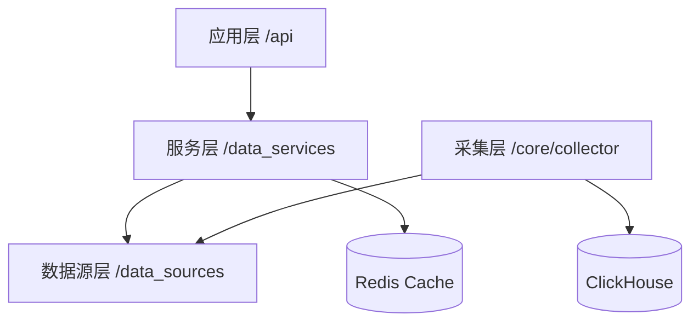

# Get-StockData 数据获取架构概览 (Overview)

**版本**: 3.0 (Path-based Refactored)  
**更新日期**: 2026-01-24  
**描述**: 本文档为 `get-stockdata` 服务的核心架构索引。为了保持逻辑清晰，详细实现已根据代码路径切分为独立文档。

---

## 📐 逻辑架构图

---

## 🚀 运行模式 (Dual Operation Modes)

`get-stockdata` 同时支持以下两种运行模式：

### 1. 被动响应模式 (Passive Mode)
- **定位**: 响应外部实时请求。
- **路径**: `src/api/` & `src/data_services/`
- **详细描述**: [API 与响应层架构](./03_API_ROUTE_LAYER.md)

### 2. 主动采集模式 (Active Mode)
- **定位**: 后台定时全量抓取与持久化。
- **路径**: `src/core/collector/`
- **详细描述**: [采集器与持久化架构](./04_COLLECTOR_LAYER.md)

---

## 📂 分层架构索引 (Path-based Documentation)

根据代码实现路径，点击以下链接查看详细设计：

### [01. 数据源提供者层 (Provider Layer)](./01_DATA_PROVIDER_LAYER.md)
*   **路径**: `src/data_sources/`
*   **要点**: `DataProvider` 抽象、TCP/HTTP 协议适配、双网络代理策略。

### [02. 数据服务逻辑层 (Service Layer)](./02_DATA_SERVICE_LAYER.md)
*   **路径**: `src/data_services/`
*   **要点**: 业务聚合逻辑、多源故障降级 (Failover)、基于 Redis 的缓存策略。

### [03. API 接口路由层 (API Layer)](./03_API_ROUTE_LAYER.md)
*   **路径**: `src/api/`
*   **要点**: FastAPI 异步路由、Pydantic 参数校验、RESTful 响应标准。

### [04. 实时采集器层 (Collector Layer)](./04_COLLECTOR_LAYER.md)
*   **路径**: `src/core/collector/`
*   **要点**: 增量数据轮询、分布式分片 (Sharding)、ClickHouse 写入优化。

---

## ✅ 开发与维护规范
- **编码规范**: 参考 [CODING_STANDARDS.md](../CODING_STANDARDS.md)
- **数据规范**: 参考 [TICK_DATA_ACQUISITION_SPEC.md](../../docs/分笔数据/TICK_DATA_ACQUISITION_SPEC.md)

---
*由 AI 开发助手维护 - 最后更新: 2026-01-24*
