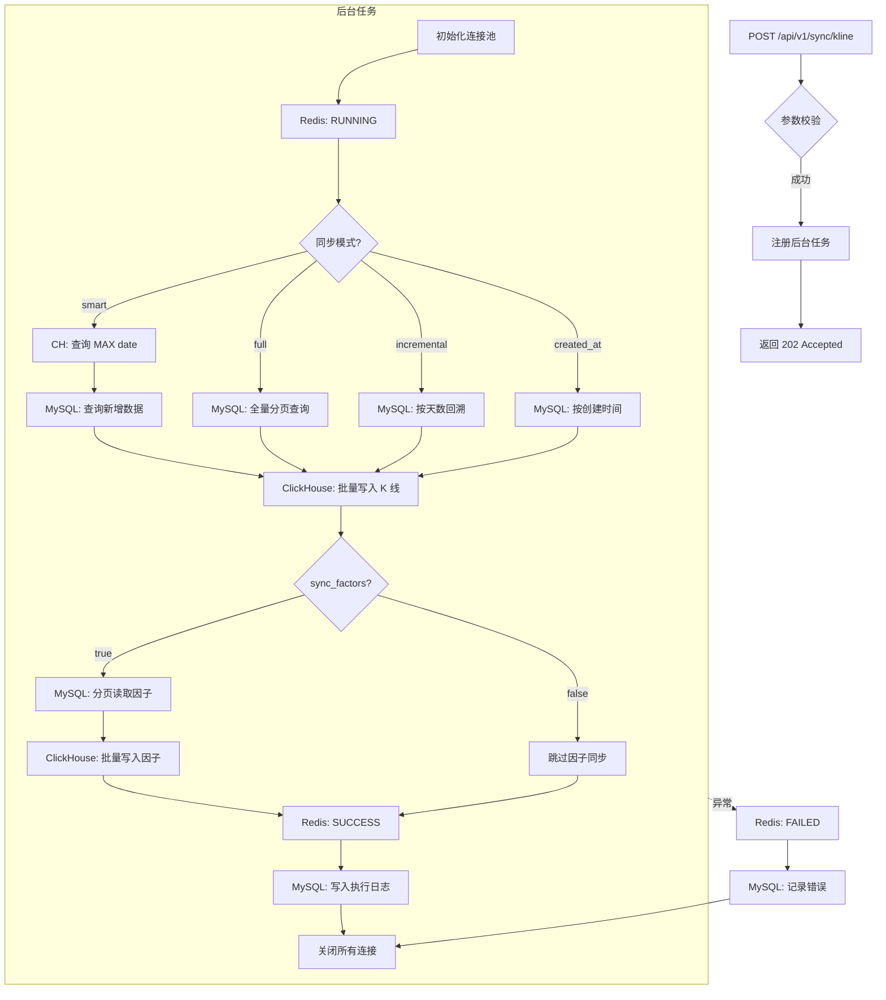

# K-Line 同步任务详细技术文档

## 概述
本文档详细描述 `/api/v1/sync/kline` 同步任务的完整执行流程，包括同步数据类型、字段映射、任务风险与缓解措施。

---

## 1. 数据类型与字段映射

### 1.1 K 线日频数据 (stock_kline_daily)

**数据来源**: MySQL (腾讯云) → ClickHouse (本地)

| MySQL 字段 | ClickHouse 字段 | 数据类型 | 说明 |
|:----------|:---------------|:--------|:-----|
| `code` | `stock_code` | String | 股票代码 (如 sh.600519) |
| `trade_date` | `trade_date` | Date | 交易日期 |
| `open` | `open_price` | Float64 | 开盘价 |
| `high` | `high_price` | Float64 | 最高价 |
| `low` | `low_price` | Float64 | 最低价 |
| `close` | `close_price` | Float64 | 收盘价 |
| `volume` | `volume` | UInt64 | 成交量 (股) |
| `amount` | `amount` | Float64 | 成交额 (元) |
| `turnover` | `turnover_rate` | Float32 (Nullable) | 换手率 (%) |
| `pct_chg` | `change_pct` | Float32 (Nullable) | 涨跌幅 (%) |

**数据规模估算**:
- 单只股票日均 1 条记录
- A 股约 5000+ 股票
- 历史数据约 20+ 年
- 预计总量: **3000 万 ~ 5000 万条**

---

### 1.2 复权因子数据 (stock_adjust_factor)

**数据来源**: MySQL (腾讯云) → ClickHouse (本地)

| MySQL 字段 | ClickHouse 字段 | 数据类型 | 说明 |
|:----------|:---------------|:--------|:-----|
| `code` | `stock_code` | String | 股票代码 |
| `adjust_date` | `ex_date` | Date | 除权除息日 |
| `fore_adjust_factor` | `fore_factor` | Float64 | 前复权因子 |
| `back_adjust_factor` | `back_factor` | Float64 | 后复权因子 |

**数据规模估算**:
- 每年约 2-3 次分红/送转
- 历史 20 年 × 5000 股票
- 预计总量: **20 万 ~ 50 万条**

---

## 2. 同步模式详解

### 2.1 Smart 模式 (默认，推荐)

```
ClickHouse: SELECT MAX(trade_date) → 水位线
MySQL: SELECT * WHERE trade_date > 水位线
ClickHouse: INSERT 新增数据
```

**特点**:
- ✅ 自动探测增量，无需手动指定日期
- ✅ 幂等性强，重复执行不产生重复数据
- ⚠️ 依赖 ClickHouse 数据完整性（如果 CH 被误删，会丢失增量）

### 2.2 Full 模式

```
MySQL: SELECT * FROM stock_kline_daily (分批)
ClickHouse: 覆盖写入全量数据
```

**特点**:
- ✅ 可用于初始化或数据修复
- ⚠️ 耗时极长（3000 万条约需 30-60 分钟）
- ⚠️ 占用大量网络和数据库资源

### 2.3 Incremental 模式

```
MySQL: SELECT * WHERE trade_date >= (今天 - N天)
```

**特点**:
- ✅ 指定回溯天数
- ⚠️ 可能产生重复数据（ClickHouse 使用 ReplacingMergeTree 去重）

### 2.4 Created_at 模式

```
MySQL: SELECT * WHERE created_at >= (指定时间点)
```

**特点**:
- ✅ 基于记录创建时间同步
- ✅ 使用游标分页，性能优化
- ⚠️ 依赖 MySQL 表有 `created_at` 字段

---

## 3. 任务风险分析

### 3.1 ⚠️ 数据一致性风险

| 风险 | 描述 | 影响级别 | 缓解措施 |
|:----|:----|:-------|:--------|
| **MySQL 数据不完整** | 源数据缺失或延迟入库 | **高** | 定期验证数据完整性，设置告警 |
| **网络中断** | GOST 隧道或数据库连接断开 | **中** | 重试机制 + 断点续传（smart 模式） |
| **时区不一致** | MySQL/ClickHouse 时区设置不同 | **低** | 统一使用 UTC+8 (Asia/Shanghai) |

### 3.2 ⚠️ 性能风险

| 风险 | 描述 | 影响级别 | 缓解措施 |
|:----|:----|:-------|:--------|
| **OOM (内存溢出)** | 一次性加载过多数据 | **高** | 分批处理 (batch_size=5000~10000) |
| **连接池耗尽** | 长时间占用数据库连接 | **中** | 使用连接池 + finally 确保释放 |
| **ClickHouse 写入压力** | 大量 INSERT 导致暂停 | **中** | 限制 `max_partitions_per_insert_block` |

### 3.3 ⚠️ 任务调度风险

| 风险 | 描述 | 影响级别 | 缓解措施 |
|:----|:----|:-------|:--------|
| **重复触发** | 同一时间多次触发同步 | **中** | 可添加 Redis 分布式锁（当前未实现） |
| **长时间无响应** | 任务卡住未结束 | **中** | 设置超时 (timeout=300s) + 监控告警 |
| **静默失败** | 异常未被捕获或记录 | **低** | try/finally 确保记录日志 |

### 3.4 ⚠️ 数据覆盖风险

| 风险 | 描述 | 影响级别 | 缓解措施 |
|:----|:----|:-------|:--------|
| **错误数据覆盖** | MySQL 中存入错误数据被同步 | **高** | 数据入库前校验 + 定期对账 |
| **ClickHouse 去重延迟** | ReplacingMergeTree 异步合并 | **低** | 查询时使用 FINAL 关键字 |

---

## 4. 执行流程图



---

## 5. 监控与告警建议

### 5.1 实时状态查询
```bash
GET /api/v1/sync/kline/status
```

返回 Redis 中的实时进度：
```json
{
  "status": "running",
  "message": "同步中: 1,500,000/3,000,000",
  "progress": "50.0"
}
```

### 5.2 历史执行日志
```bash
GET /api/v1/sync/kline/history?limit=10
```

返回 MySQL `sync_execution_logs` 表中的记录：
```json
[
  {
    "task_name": "kline_daily_sync",
    "execution_time": "2025-12-31 10:00:00",
    "status": "SUCCESS",
    "records_processed": 15000,
    "duration_seconds": 45.2
  }
]
```

### 5.3 建议告警规则

| 指标 | 阈值 | 动作 |
|:----|:----|:----|
| 任务执行时间 | > 300 秒 | 发送告警 |
| 连续失败次数 | >= 3 次 | 暂停任务 + 通知 |
| 增量数据为 0 | 连续 3 天 | 检查数据源 |

---

## 6. 代码引用

- **API 路由**: `services/get-stockdata/src/api/sync_routes.py`
- **同步服务**: `services/get-stockdata/src/core/sync_service.py`
- **ClickHouse 表结构**: `stock_kline_daily`, `stock_adjust_factor`
- **MySQL 表结构**: `stock_kline_daily`, `stock_adjust_factor`, `sync_execution_logs`

---

**文档版本**: v2.0  
**更新日期**: 2025-12-31
