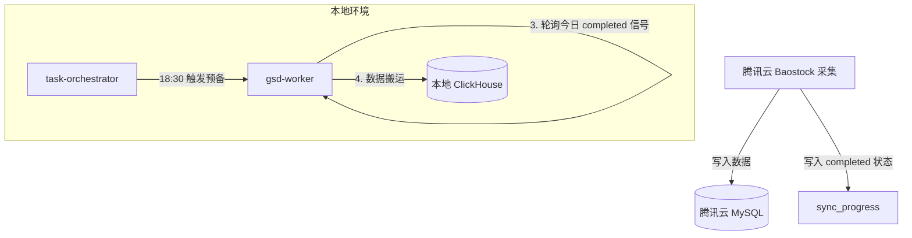

# 任务调度系统 - 总体概述

## 背景

项目中存在大量定时任务需要科学管理，包括：
- K线数据同步
- 数据质量检测
- 策略扫描
- 连接池预热/冷却

## 核心决策

### 决策 1：中心化调度

**选择**：统一由 task-orchestrator 调度，业务服务暴露 HTTP 端点

**原因**：
- 全局视野，统一管理
- 避免任务分散难以追踪
- 支持任务依赖编排

### 决策 2：服务拆分方式

**选择**：同镜像不同模式 (MODE=api/worker)

**原因**：
- 改动最小，只需修改 main.py
- 运维简单，同一个镜像
- 灵活切换，开发阶段用 MODE=all

### 决策 3：交易日历感知

**选择**：在调度层集成 CalendarService

**原因**：
- 避免非交易日执行无效任务
- 减少 API 配额浪费

### 决策 4：自动化边界

| 缺失规模 | 处理方式 |
|:---------|:---------|
| < 50 只 | 自动修复 |
| 50-200 只 | 告警+人工确认 |
| > 200 只 | 终止+紧急告警 |

### 决策 5：自适应触发逻辑 (针对 K线同步)

**选择**：基于前一日云端完成时间预测 + 实时信号量轮询。

**原因**：
- 云端 Baostock 采集时间不固定（通常在 18:30 以后）。
- 避免盲目等待导致的资源浪费。
- 确保本地同步的数据完整性。

## 服务职责

| 维度 | 内容 |
|:---------|:---------|
| **数据来源 (Source)** | 腾讯云 MySQL (`alwaysup.stock_kline_daily`) |
| **数据去向 (Target)** | 本地 ClickHouse (`stock_data.stock_kline_daily`) |
| **触发信号** | 腾讯云 MySQL `sync_progress` (task_name = 'full_market_sync') |
| **启动基准** | 18:30（进入自适应检查阶段） |
