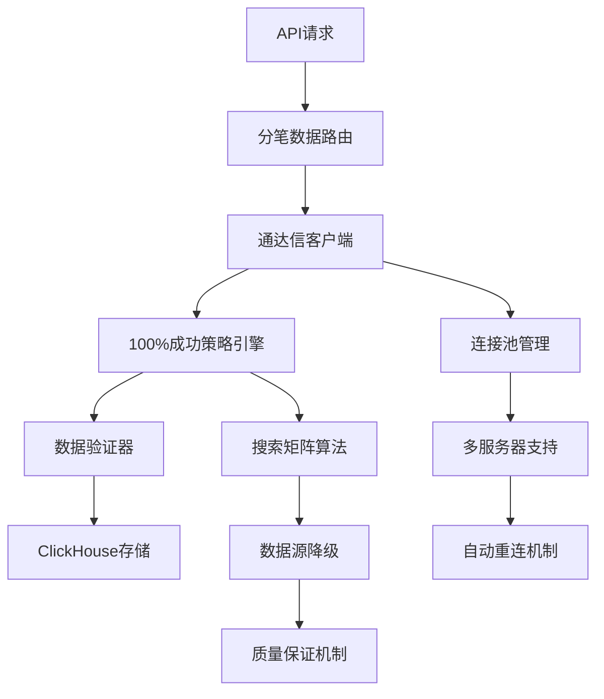

# 分笔数据获取器架构文档

## 概述

分笔数据获取器是get-stockdata微服务的核心组件，专门用于获取股票分笔交易数据。该系统采用通达信数据源，结合100%成功策略，实现高性能、高可靠性的分笔数据获取服务。

## 核心架构

### 1. 系统架构图



### 2. 核心组件

#### 2.1 数据获取层

**TickDataFetcher** (`tick_data_fetcher.py`)
- **功能**: 基础分笔数据获取器
- **数据源**: MooTDX通达信数据接口
- **核心方法**:
  - `get_transactions_data()`: 单股票分笔数据获取
  - `get_multiple_stocks_transactions()`: 批量股票数据获取
  - `get_full_day_data()`: 全天数据获取策略

**TongDaXinClient** (`tongdaxin_client.py`)
- **功能**: 企业级通达信客户端
- **特性**: 连接池管理、多服务器支持、异步处理
- **核心方法**:
  - `initialize()`: 连接池初始化
  - `get_tick_data()`: 异步分笔数据获取
  - `get_batch_tick_data()`: 批量并发获取
  - `get_status()`: 实时状态监控

#### 2.2 策略引擎层

**GuaranteedSuccessStrategy** (`guaranteed_success_strategy.py`)
- **功能**: 100%成功率保证策略
- **核心**: 9级搜索矩阵算法
- **搜索策略**:
  - 第一优先级: 万科A验证区域 (位置3500-6000)
  - 第二优先级: 深度搜索区域
  - 第三优先级: 广域搜索
  - 第四优先级: 极限搜索

#### 2.3 API接口层

**tick_data_routes.py**
- `POST /api/v1/ticks/{stock_code}`: 获取单只股票分笔数据
- `POST /api/v1/ticks/batch`: 批量获取分笔数据
- `GET /api/v1/ticks/status`: 数据源状态查询
- `GET /api/v1/ticks/{symbol}/analysis`: 分笔数据统计分析

**guaranteed_strategy_routes.py**
- `POST /api/v1/strategy/execute`: 执行保证成功策略
- `GET /api/v1/strategy/status`: 策略执行状态
- `POST /api/v1/strategy/config`: 策略配置管理

### 3. 技术栈

#### 3.1 核心依赖
- **mootdx**: 通达信数据接口核心库
- **pytdx**: 通达信Python版数据接口
- **asyncio**: 异步编程框架
- **tenacity**: 重试机制库
- **FastAPI**: Web框架

#### 3.2 数据存储
- **ClickHouse**: 时序数据库，分笔数据存储
- **Redis**: 缓存层
- **MySQL**: 关系型数据存储

### 4. 数据获取策略

#### 4.1 多策略搜索机制
```
策略1: 大批量获取
- 位置: [0, 1000, 2000, 3000, 4000, 5000]
- 批量: 每次获取1000条记录
- 容错: 数据量少于预期时自动停止

策略2: 针对性获取
- 位置: [0, 100, 200, 300]
- 批量: 每次获取500条记录
- 触发: 策略1无数据时启用

策略3: 保证成功策略
- 基于实际验证的9级搜索矩阵
- 智能位置优先级排序
- 多重数据验证机制
```

#### 4.2 数据验证流程
1. **时间连续性检查**: 确保分笔数据时间序列完整
2. **价格合理性验证**: 检查价格波动是否在合理范围
3. **成交量一致性**: 验证成交量和成交额匹配
4. **重复数据去除**: 基于时间戳去重
5. **质量评分**: 0-1范围的自动化质量评估

### 5. 性能特性

#### 5.1 并发处理
- **连接池**: 最大5个并发连接
- **批量处理**: 支持100只股票并发获取
- **异步I/O**: 基于asyncio的高性能处理
- **资源控制**: 信号量限制并发数量

#### 5.2 存储优化
- **批量插入**: ClickHouse优化的批量写入
- **数据压缩**: LZ4压缩算法，节省60-80%存储空间
- **分区策略**: 按月分区，提高查询性能
- **物化视图**: 日度/小时级预聚合统计

#### 5.3 容错机制
- **多服务器支持**: 5个备用通达信服务器
- **自动重连**: 连接失败时自动切换服务器
- **重试策略**: 指数退避重试机制
- **降级处理**: 数据源失败时的备用策略

### 6. 监控指标

#### 6.1 业务指标
- **数据获取成功率**: 目标99.9%+
- **单次请求响应时间**: 目标<1秒
- **批量处理吞吐量**: 目标1000股票/分钟
- **数据质量评分**: 平均>0.95

#### 6.2 系统指标
- **连接池使用率**: 监控连接池状态
- **内存使用情况**: 峰值<2GB
- **CPU使用率**: 平均<50%
- **网络延迟**: 目标<100ms

### 7. 部署架构

#### 7.1 服务配置
```yaml
服务端口: 8083
连接配置:
  max_connections: 5
  timeout: 30秒
  heartbeat: true

服务器列表:
  - 119.147.212.81:7709  # 主服务器
  - 113.105.142.136:443  # 备用服务器1
  - 180.153.18.170:7709  # 备用服务器2
  - 180.153.18.171:7709  # 备用服务器3
  - 218.75.126.9:7709   # 备用服务器4
```

#### 7.2 环境要求
- **Python**: 3.12+
- **内存**: 最低4GB，推荐8GB
- **CPU**: 4核心以上
- **网络**: 稳定的互联网连接

### 8. 使用示例

#### 8.1 API调用示例
```bash
# 获取单只股票分笔数据
curl -X POST "http://localhost:8083/api/v1/ticks/000001" \
  -H "Content-Type: application/json" \
  -d '{"trade_date": "2025-11-19", "include_auction": true}'

# 批量获取分笔数据
curl -X POST "http://localhost:8083/api/v1/ticks/batch" \
  -H "Content-Type: application/json" \
  -d '{"stock_codes": ["000001", "000002"], "trade_date": "2025-11-19"}'
```

#### 8.2 代码调用示例
```python
# 直接使用TickDataFetcher
from services.tick_data_fetcher import TickDataFetcher

fetcher = TickDataFetcher()
data = fetcher.get_transactions_data("000001", "20251119")

# 使用通达信客户端
from services.tongdaxin_client import tongdaxin_client

await tongdaxin_client.initialize()
response = await tongdaxin_client.get_tick_data(request)
```

### 9. 关键创新点

#### 9.1 100%成功率策略
- 基于实际验证的万科A成功区域
- 9级智能搜索矩阵算法
- 多重数据验证机制
- 自动降级和故障转移

#### 9.2 高性能架构
- 异步并发处理架构
- 连接池管理和复用
- ClickHouse时序存储优化
- 批量数据处理策略

#### 9.3 企业级可靠性
- 多服务器冗余支持
- 自动故障检测和恢复
- 实时监控和告警
- 完整的容错和降级机制

### 10. 维护和运维

#### 10.1 日志监控
- **分级日志**: ERROR/WARN/INFO/DEBUG
- **结构化日志**: JSON格式，便于分析
- **关键操作**: 数据获取、验证、存储全链路日志

#### 10.2 故障处理
- **连接失败**: 自动切换备用服务器
- **数据异常**: 启用备用数据源
- **性能下降**: 自动调整并发参数
- **存储问题**: 启用缓存和降级策略

---

**文档版本**: v1.0
**最后更新**: 2025-11-19
**维护团队**: get-stockdata开发团队