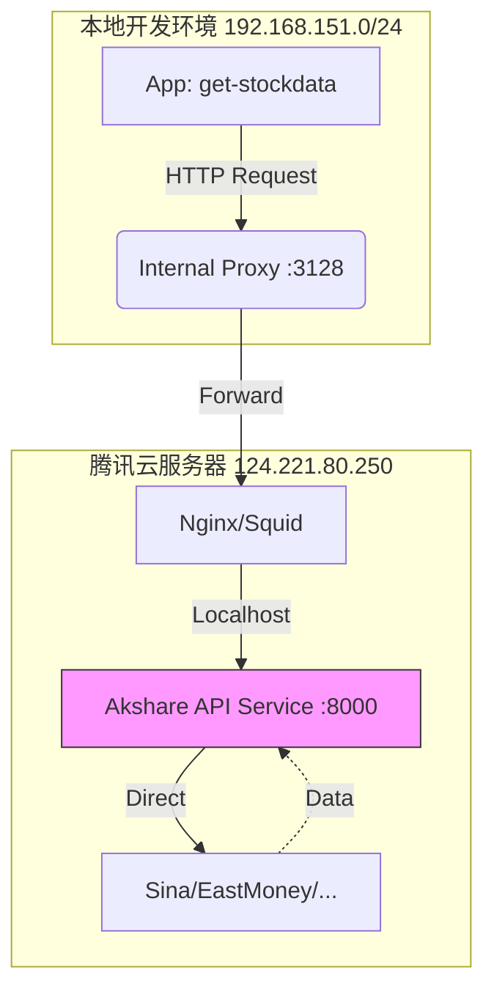

# 代理架构概览 (Remote API Version)

## 1. 核心设计

为了解决本地开发环境 (内网) 访问 Akshare 数据源 (如新浪、东方财富) 不稳定及被反爬虫拦截的问题，我们采用 **远程 API 服务 + HTTP 代理** 的混合架构。

### 架构图



### 关键组件

1.  **Local App (`get-stockdata`)**:
    *   通过 `AkshareProvider` (Remote Version) 发起标准 HTTP 请求。
    *   配置 `HTTP_PROXY=http://192.168.151.18:3128` 以穿透内网。

2.  **Internal Proxy (`192.168.151.18`)**:
    *   标准 Squid 代理，负责将请求转发到公网。

3.  **Remote Akshare API (`124.221.80.250:8000`)**:
    *   **核心组件**: 基于 FastAPI 开发的 Python 微服务。
    *   **职责**:
        *   接收来自内网的标准化 API 请求 (如 `/api/v1/rank/hot`)。
        *   在云端执行 `akshare` 库函数获取数据 (云端 IP 质量高，不易被封)。
        *   处理数据清洗 (如 NaN 值处理/日期序列化)。
        *   返回标准 JSON 响应。

## 2. 优势

*   **高可用性**: 云端服务器网络稳定，比本地 SSH 隧道更可靠。
*   **抗反爬虫**: 利用云服务器 IP 访问数据源，且服务可随时更换 IP 或增加代理池。
*   **解耦**: 本地服务只需关注标准 REST API，无需维护复杂的 `akshare` 依赖和反爬策略。
*   **数据清洗**: 服务端统一处理了 `NaN`、日期格式等脏数据问题，减轻了客户端负担。

## 3. 配置说明

在 `docker-compose.yml` 中配置：

```yaml
services:
  get-stockdata:
    environment:
      - HTTP_PROXY=http://192.168.151.18:3128
      - HTTPS_PROXY=http://192.168.151.18:3128
      - AKSHARE_API_URL=http://124.221.80.250:8000
```

相关代码位于 `src/data_sources/providers/akshare_provider.py`。
