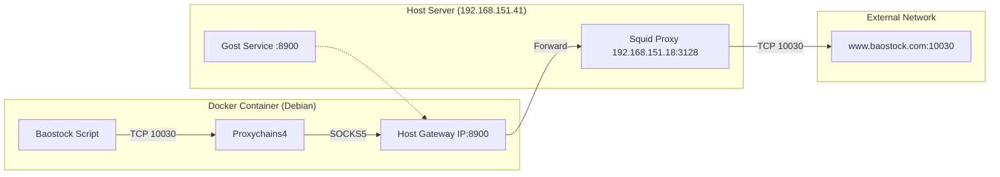

# Baostock Network Structure & Configuration Guide

This document details the network architecture implemented to resolve Baostock connectivity issues (Error `10002007`) in Docker containers.

## 1. Problem Overview
*   **Application:** Baostock (Python financial data library).
*   **Requirement:** Connects to `www.baostock.com` on custom TCP port **10030**.
*   **Blocker:** The default host proxy (`Privoxy` @ `127.0.0.1:8118`) blocks HTTP `CONNECT` methods to non-standard ports (ports other than 443/80).

## 2. Solution Architecture
We implemented a bypass using a secondary proxy path that tunnels traffic to a more permissive upstream proxy (Squid).

### Network Data Flow


### Components
1.  **Proxychains4 (Container):** Intercepts TCP calls from Python/Baostock and forces them through a SOCKS5 proxy.
2.  **Gost Bridge (Host :8900):** A lightweight proxy that listens on the host's public IP (`0.0.0.0:8900`) and forwards traffic to the upstream Squid proxy.
3.  **Squid Proxy (Upstream):** The actual gateway that allows traffic to port 10030.

## 3. Configuration Steps

### A. Host Side (One-time Setup)
Run a `gost` instance to bridge the container to the upstream proxy.
```bash
# Run in background (temporary)
nohup /usr/local/bin/gost -L :8900 -F http://192.168.151.18:3128 > /dev/null 2>&1 &
```
*To make this permanent, create a systemd service (e.g., `gost-baostock.service`).*

### B. Container Side (Per Container)
1.  **Install Proxychains:**
    ```bash
    apt-get update && apt-get install -y proxychains4
    ```
2.  **Configure `/etc/proxychains4.conf`:**
    Modify the `[ProxyList]` section to point to the host's bridge IP:
    ```ini
    [ProxyList]
    socks5 192.168.151.41 8900
    ```
3.  **Run Application:**
    Prefix your command with `proxychains4`:
    ```bash
    proxychains4 python your_script.py
    ```

## 4. Why this works
*   **Bypasses Privoxy:** We avoid port 8118 entirely.
*   **SOCKS Support:** `gost` provides a SOCKS5 interface that Proxychains needs.
*   **Permissive Upstream:** `192.168.151.18` (Squid) allows traffic to port 10030, unlike the local restricted setup.
