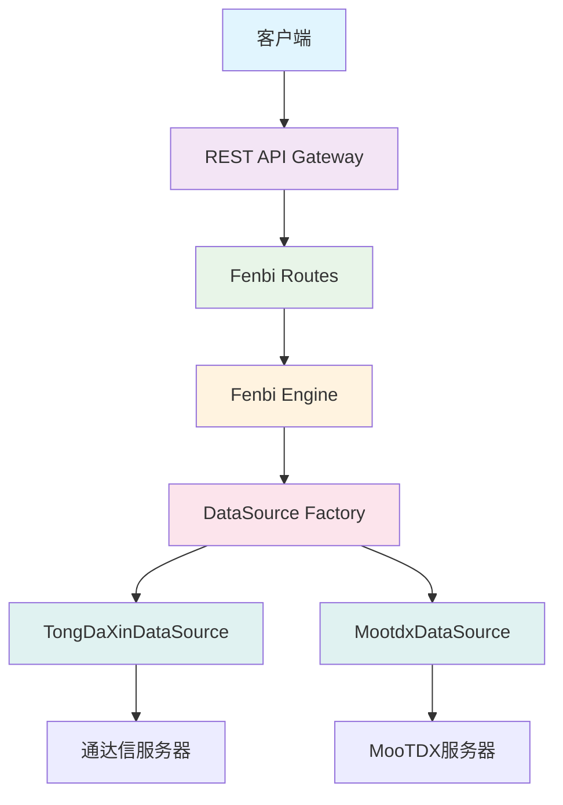

# Get Stock Data 微服务文档

## 概述

Get Stock Data 是一个专门用于获取股票数据的微服务，提供实时和历史股票数据获取功能。

## 文档结构

### 📋 快速开始
- [API 参考文档](api_reference.md) - 完整的API接口说明
- [架构设计文档](unified_tick_data_architecture.md) - 系统架构和设计原理
- [迁移指南](migration_guide.md) - 从旧版本迁移到新架构

### 🔧 技术文档
- **数据源层**
  - 数据源抽象接口
  - 通达信数据源 (TongDaXinDataSource)
  - MooTDX数据源 (MootdxDataSource)
  - 数据源工厂 (DataSourceFactory)

- **引擎层**
  - Fenbi引擎核心逻辑
  - 时间处理和排序
  - 数据去重机制
  - 统计分析功能

- **接口层**
  - REST API接口
  - 命令行接口 (CLI)
  - 内部管理接口

### 📊 功能特性

#### 核心功能
- **统一分笔数据获取** - 单一入口支持多种数据源
- **自动故障转移** - 数据源失败时自动切换到备用源
- **数据质量保证** - 完整性分析和去重处理
- **批量数据处理** - 高效的多股票数据获取

#### 支持的数据源
1. **通达信 (TongDaXin)** - 默认数据源，稳定性高
2. **MooTDX** - 开源通达信协议实现
3. **其他数据源** - 易于扩展支持更多数据源

#### API接口
- **RESTful API** - 标准的HTTP接口
- **实时数据获取** - 支持实时和历史数据
- **多种输出格式** - JSON、CSV、Excel等
- **错误处理** - 完善的错误处理和重试机制

## 快速开始

### 1. 启动服务

```bash
# 构建Docker镜像
docker build -t get-stockdata:latest .

# 启动服务
docker run -d --name get-stockdata -p 8088:8083 get-stockdata:latest
```

### 2. 健康检查

```bash
# 检查服务状态
curl http://localhost:8088/api/v1/health
```

### 3. 获取股票数据

```bash
# 获取单个股票分笔数据
curl "http://localhost:8088/api/v1/fenbi/000001/date/20251120"

# 获取数据摘要
curl "http://localhost:8088/api/v1/fenbi/000001/date/20251120/summary"

# 查看引擎状态
curl "http://localhost:8088/api/v1/fenbi/engine/stats"
```

### 4. 命令行使用

```bash
# 使用CLI获取数据
python -m services.fenbi_cli --symbol 000001 --date 20251120 --format both

# 调试模式
python -m services.fenbi_cli --symbol 000001 --date 20251120 --debug
```

## 架构概览



## 系统要求

### 运行环境
- Python 3.8+
- Docker 20.0+
- 内存: 最低512MB，推荐1GB
- 磁盘: 最低1GB可用空间

### 依赖服务
- 通达信数据源连接 (可选)
- MooTDX数据源 (可选)
- Redis缓存服务 (推荐)

## 配置说明

### 环境变量

```bash
# 服务配置
PORT=8083
LOG_LEVEL=info
DEBUG=false

# 数据源配置
DEFAULT_DATA_SOURCE=tongdaxin
TONGDAXIN_TIMEOUT=30
MOOTDX_TIMEOUT=60

# 缓存配置
REDIS_HOST=localhost
REDIS_PORT=6379
REDIS_PASSWORD=your_password
```

### 数据源优先级

1. **TongDaXin** (默认) - 稳定可靠的商业数据源
2. **MooTDX** (备用) - 开源实现，作为备用选择
3. **其他数据源** (扩展) - 可通过配置添加

## 性能特性

### 处理能力
- **并发处理**: 支持多用户并发访问
- **批量操作**: 高效的批量数据获取
- **缓存机制**: 减少重复请求响应时间
- **流式处理**: 大数据量的内存优化

### 可靠性
- **自动重试**: 网络错误自动重试机制
- **故障转移**: 数据源失败自动切换
- **优雅降级**: 部分功能失败时仍提供服务
- **监控告警**: 完善的健康检查和监控

## 开发指南

### 添加新数据源

1. **实现数据源接口**
```python
class NewDataSource(DataSourceBase):
    async def connect(self) -> bool:
        # 实现连接逻辑
        pass

    async def get_tick_data(self, request: TickDataRequest) -> List[TickData]:
        # 实现数据获取逻辑
        pass
```

2. **注册到工厂**
```python
DATA_SOURCE_CONFIG["new_source"] = {
    "class": NewDataSource,
    "default": False,
    # 配置参数
}
```

3. **添加测试**
```python
def test_new_data_source():
    # 编写测试用例
    pass
```

### API扩展

1. **添加新路由**
```python
@router.get("/custom-endpoint")
async def custom_endpoint():
    return {"message": "自定义接口"}
```

2. **修改响应格式**
```python
def customize_response(data):
    # 自定义响应处理
    return custom_data
```

## 监控和运维

### 健康检查

- **服务健康**: `/api/v1/health`
- **数据源状态**: `/api/v1/fenbi/engine/stats`
- **内部检查**: `/internal/fenbi/health`

### 日志级别

```python
# 配置日志级别
logging.basicConfig(level=logging.INFO)

# 关键日志信息
logger.info("数据获取开始")
logger.warning("数据源连接失败")
logger.error("处理异常")
```

### 性能指标

- **响应时间**: API接口响应时间
- **成功率**: 数据获取成功率
- **数据质量**: 数据完整性和准确性
- **资源使用**: CPU、内存、网络使用情况

## 故障排除

### 常见问题

1. **数据源连接失败**
   - 检查网络连接
   - 验证数据源配置
   - 查看错误日志

2. **API响应慢**
   - 检查数据源负载
   - 优化请求参数
   - 考虑使用缓存

3. **数据不完整**
   - 验证股票代码和日期
   - 检查数据源状态
   - 查看数据质量报告

### 调试模式

```bash
# 启用详细日志
export LOG_LEVEL=debug

# CLI调试
python -m services.fenbi_cli --symbol 000001 --date 20251120 --debug

# 查看容器日志
docker logs get-stockdata -f
```

## 版本历史

### v2.2.0 (2025-11-25)
- ✨ 统一分笔数据架构
- 🔧 集成通达信数据源
- 🚀 自动故障转移机制
- 📊 增强数据质量报告

### v2.1.0
- 🔍 批量数据获取优化
- 📈 性能监控和报告
- 🛡️ 安全性增强

### v2.0.0
- 🏗️ 微服务架构重构
- 🔄 数据源抽象化
- 📝 REST API标准化

### v1.0.0
- 🎯 基础数据获取功能
- 📋 初步API接口

## 社区和支持

### 贡献指南

1. Fork 项目仓库
2. 创建功能分支
3. 提交代码更改
4. 创建Pull Request
5. 代码审查和合并

### 问题反馈

- **GitHub Issues**: https://github.com/example/issues
- **技术讨论**: https://github.com/example/discussions
- **文档问题**: https://github.com/example/docs/issues

### 联系方式

- **技术团队**: tech-team@example.com
- **产品支持**: support@example.com
- **商务合作**: business@example.com

---

**开始使用 Get Stock Data 微服务，体验高效、稳定的股票数据获取服务！** 🚀