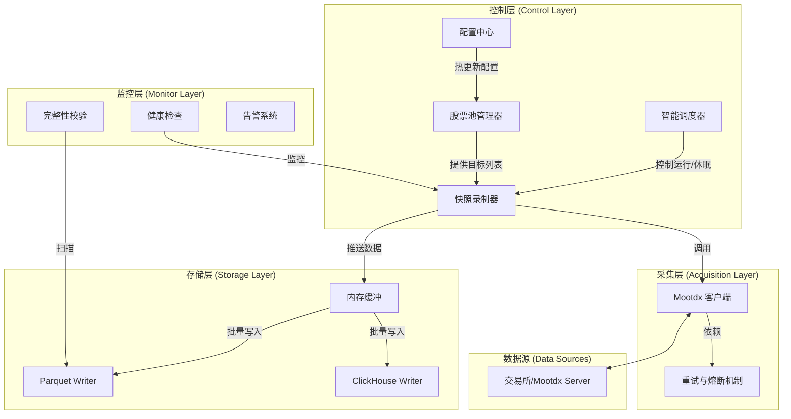

# 数据采集系统整体架构与实施路线图

**版本**: v1.0
**日期**: 2025-11-28
**状态**: 规划中

---

## 1. 系统愿景

构建一个**高保真、高可用、可扩展**的分笔数据采集系统，能够稳定地对全市场核心资产进行毫秒级（伪）快照录制，为量化分析提供坚实的数据基础。

---

## 2. 整体架构设计 (System Architecture)

系统采用**模块化分层架构**，确保各组件职责单一，易于维护和扩展。

### 核心组件说明

1.  **智能调度器 (Smart Scheduler)**:
    *   **职责**: 系统的“大脑”。负责判断当前是否为交易日、交易时段。
    *   **逻辑**: 非交易时间让系统休眠，避免无效请求和封IP风险。

2.  **股票池管理器 (Stock Pool Manager)**:
    *   **职责**: 维护 L1/L2/L3 股票列表。
    *   **特性**: 支持从配置文件或外部 API 动态更新股票池，无需重启服务。

3.  **快照录制器 (Snapshot Recorder)**:
    *   **职责**: 系统的“心脏”。执行高频轮询任务。
    *   **特性**: 内置连接池管理、自动重连、异常捕获。

4.  **存储引擎 (Storage Engine)**:
    *   **职责**: 数据持久化。
    *   **策略**: 双写模式（Parquet 归档 + ClickHouse 热查），支持按日/小时分片。

---

## 3. 实施路线图 (Implementation Roadmap)

我们将实施过程分为四个阶段，目前处于**阶段一完成，准备进入阶段二**的状态。

### ✅ 阶段一：核心原型 (Core Prototype)
*目标：跑通流程，验证可行性。*
- [x] **Mootdx 接口验证**: 确认支持五档盘口快照。
- [x] **基础录制器**: 实现 `SnapshotRecorder`，支持批量轮询。
- [x] **静态股票池**: 实现 `StockPoolManager`，支持加载沪深300。
- [x] **Parquet 存储**: 实现 `ParquetWriter`，支持基础文件写入。
- [x] **端到端测试**: 验证从采集到存储的全流程。

### 🚀 阶段二：生产级加固 (Production Hardening)
*目标：让系统能长期无人值守运行，具备自我恢复能力。*
- [ ] **智能调度集成**:
    - 集成交易日历库（如 `chinesecalendar` 或 `akshare`）。
    - 实现 `Scheduler` 组件，控制录制器的 Start/Stop/Pause。
- [ ] **弹性连接机制**:
    - 实现 Mootdx 客户端的指数退避重连（Exponential Backoff）。
    - 处理网络超时、服务器断开等常见异常。
- [ ] **配置热更新**:
    - 监听配置文件变化，动态调整采集频率或股票池，无需重启。
- [ ] **日志系统规范化**:
    - 结构化日志输出（JSON格式），便于后续分析。

### 🛠️ 阶段三：质量与监控 (Quality & Observability)
*目标：确保采下来的数据是“对的”和“全的”。*
- [ ] **数据完整性校验**:
    - 每日收盘后自动运行报告：应采多少轮 vs 实采多少轮。
    - 缺失数据段检测。
- [ ] **数据质量探针**:
    - 实时监控异常值（如价格为0、成交量为负）。
- [ ] **运行指标监控**:
    - 采集 QPS、平均响应时间、成功率。
    - 连续失败告警（邮件/钉钉/飞书）。

### 🔮 阶段四：规模化扩展 (Scalability)
*目标：覆盖全市场，支持更复杂的存储。*
- [ ] **ClickHouse 集成**:
    - 部署 ClickHouse 服务。
    - 实现 `ClickHouseWriter`，支持实时写入。
- [ ] **多级股票池支持**:
    - 实现 L2（中证500）和 L3（全市场）的分频采集逻辑。
- [ ] **分布式部署准备**:
    - 如果单机性能达到瓶颈，支持多容器分片采集。

---

## 4. 近期行动计划 (Next Steps)

根据上述路线图，接下来的工作重点是**阶段二**。

**优先级 P0**:
1.  **交易日历与时段控制**: 避免非交易时间空跑。
2.  **异常重连机制**: 确保网络波动后能自动恢复。

**优先级 P1**:
1.  **日志规范化**: 方便排查问题。
2.  **配置热加载**: 方便盘中调整。

---

**总结**:
本架构旨在从当前的“脚本级”工具进化为“工程级”服务。通过引入调度、监控和容错机制，确保数据资产的安全积累。
